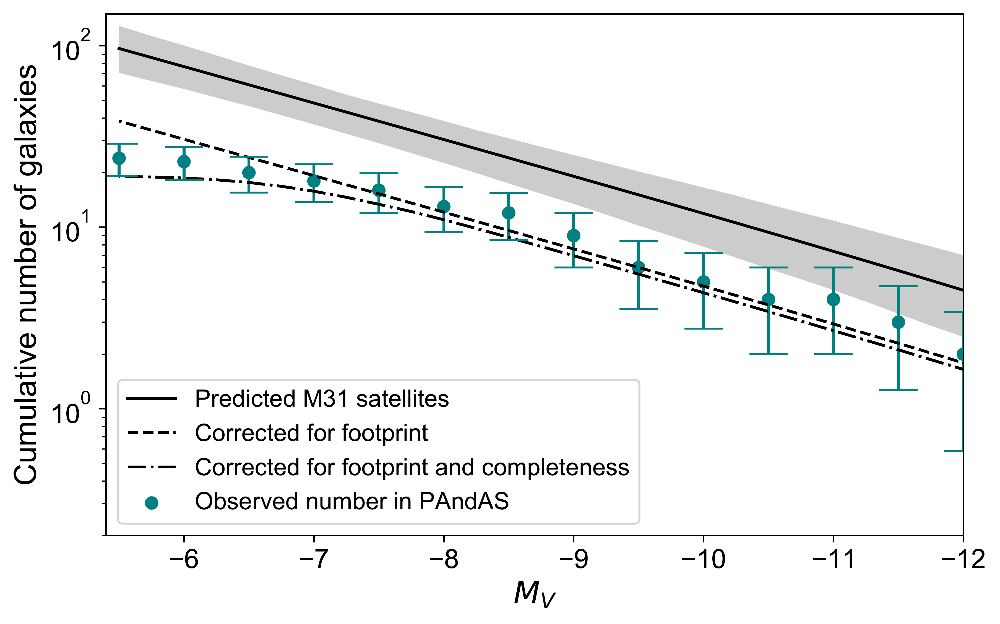
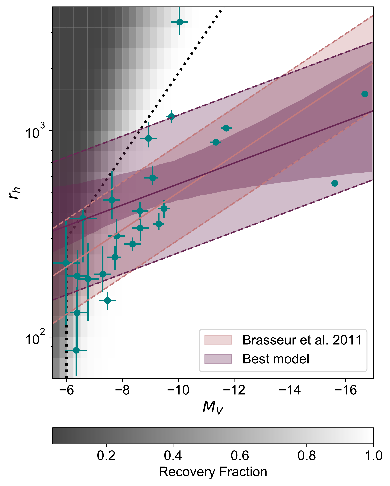
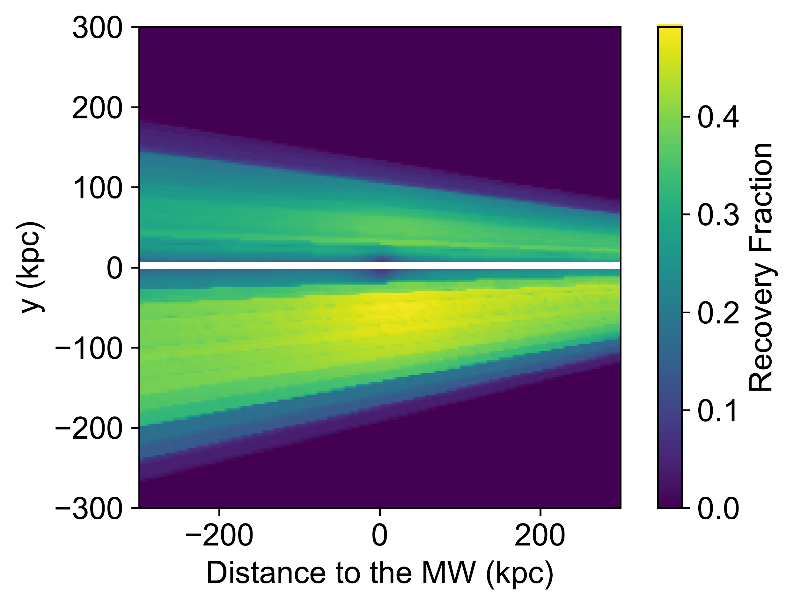
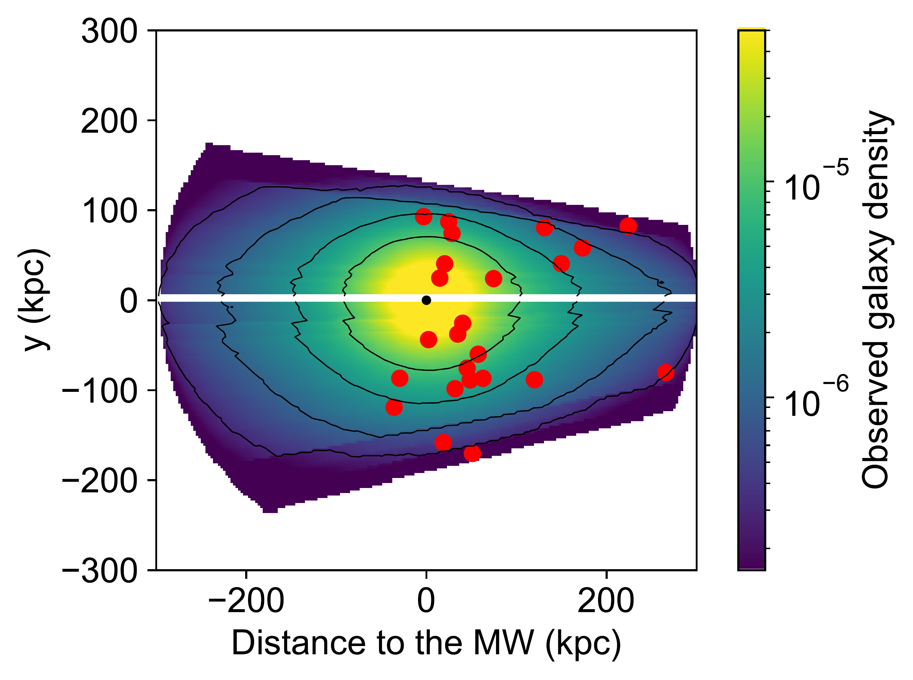

$\newcommand{\ensuremath}{}$
$\newcommand{\xspace}{}$
$\newcommand{\object}[1]{\texttt{#1}}$
$\newcommand{\farcs}{{.}''}$
$\newcommand{\farcm}{{.}'}$
$\newcommand{\arcsec}{''}$
$\newcommand{\arcmin}{'}$
$\newcommand{\ion}[2]{#1#2}$
$\newcommand{\textsc}[1]{\textrm{#1}}$
$\newcommand{\hl}[1]{\textrm{#1}}$
$\newcommand{\fmmm}[1]{\mbox{#1}}$
$\newcommand{\scnd}{\mbox{\fmmm{"}\hskip-0.3em .}}$
$\newcommand{\scnp}{\mbox{\fmmm{"}}}$
$\newcommand{\mcnd}{\mbox{\fmmm{'}\hskip-0.3em .}}$
$\newcommand{\ud}{\mathrm{d}}$
$\newcommand{\ltsima}{\; \buildrel < \over \sim \;}$
$\newcommand{\simlt}{\lower.5ex\hbox{\ltsima}}$
$\newcommand{\gtsima}{\; \buildrel > \over \sim \;}$
$\newcommand{\simgt}{\lower.5ex\hbox{\gtsima}}$
$\newcommand{\erf}{\mathop{\rm erf}\nolimits}$
$\newcommand{\sech}{ \mathop{\rm sech}\nolimits}$
$\newcommand{\csch}{ \mathop{\rm csch}\nolimits}$
$\newcommand{\arcsinh}{\mathop{\rm arcsinh}\nolimits}$
$\newcommand{\arccosh}{\mathop{\rm arccosh}\nolimits}$
$\newcommand{\arctanh}{\mathop{\rm arctanh}\nolimits}$
$\newcommand{\arccoth}{\mathop{\rm arccoth}\nolimits}$
$\newcommand{\arcsech}{\mathop{\rm arcsech}\nolimits}$
$\newcommand{\arccsch}{\mathop{\rm arccsch}\nolimits}$
$\newcommand{\arccot}{\mathop{\rm arccot}\nolimits}$
$\newcommand{\arcsec}{\mathop{\rm arcsec}\nolimits}$
$\newcommand{\arccsc}{\mathop{\rm arccsc}\nolimits}$
$\newcommand{\ylm}{\mathop{\rm Y}_l^m\nolimits}$
$\newcommand{\ylmp}{\mathop{\rm Y}_{l'}^{m'}\nolimits}$
$\newcommand{\real}{\Re e}$
$\newcommand{\imag}{\Im m}$
$\newcommand{\km}{{\rm km}}$
$\newcommand{\kms}{{\rm km s^{-1}}}$
$\newcommand{\kmsdeg}{{\rm km s^{-1} deg^{-1}}}$
$\newcommand{\kmskpc}{{\rm km s^{-1} kpc^{-1}}}$
$\newcommand{\mas}{{\rm mas}}$
$\newcommand{\masyr}{{\rm mas/yr}}$
$\newcommand{\kpc}{{\rm kpc}}$
$\newcommand{\kpcdeg}{{\rm kpc deg^{-1}}}$
$\newcommand{\mpc}{{\rm Mpc}}$
$\newcommand{\msun}{{\rm M_\odot}}$
$\newcommand{\lsun}{{\rm L_\odot}}$
$\newcommand{\rsun}{{\rm R_\odot}}$
$\newcommand{\pc}{{\rm pc}}$
$\newcommand{\cm}{{\rm cm}}$
$\newcommand{\yr}{{\rm yr}}$
$\newcommand{\au}{{\rm AU}}$
$\newcommand{\g}{{\rm g}}$
$\newcommand{\om}{\Omega_0}$
$\newcommand{\}{ca}$
$\newcommand{\}{r}$
$\newcommand{\}{magnitude}$
$\newcommand{\kr}{{\cal K}_r}$
$\newcommand{\kz}{{\cal K}_z}$
$\newcommand{\kzz}{{\cal K}_z(z)}$
$\newcommand{\mss}{{\rm M}_\odot \rm pc^{-2}}$
$\newcommand{\msss}{{\rm M}_\odot \rm pc^{-3}}$
$\newcommand{\Aa}{\; \buildrel \circ \over{\rm A}}$
$\newcommand{Å}{\; \buildrel \circ \over{\rm A}}$
$\newcommand{\yr}{{\rm yr}}$
$\newcommand{\CompactFigs}{0}$
$\newcommand{\UseFigs}{1}$
$\newcommand{\deg}{^\circ}$
$\newcommand{\degg}{\hbox{\null^\circ\hskip-3pt .}}$
$\newcommand{\sec}{\hbox{"\hskip-3pt .}}$
$\newcommand{\half}{{\scriptstyle{1\over2}}}$
$\newcommand{\s}{\ifmmode \widetilde \else \~\fi}$
$\newcommand{\=}{\overline}$
$\newcommand{\scre}{{\cal E}}$
$\newcommand{\}{spose}$
$\newcommand{\larrow}{\leftarrow}$
$\newcommand{\rarrow}{\rightarrow}$
$\newcommand{\llangle}{\langle\langle}$
$\newcommand{\rrangle}{\rangle\rangle}$
$\newcommand{\etal}{{\it et al. }}$
$\newcommand{\cf}{{\it cf. }}$
$\newcommand{\eg}{{e.g., }}$
$\newcommand{\ie}{{ i.e., }}$
$\newcommand{\lta}{\mathrel{\spose{\lower 3pt\hbox{\mathchar"218}}$
$     \raise 2.0pt\hbox{\mathchar"13C}}}$
$\newcommand{\gta}{\mathrel{\spose{\lower 3pt\hbox{\mathchar"218}}$
$     \raise 2.0pt\hbox{\mathchar"13E}}}$
$\newcommand{\Dt}{\spose{\raise 1.5ex\hbox{\hskip3pt\mathchar"201}}}$
$\newcommand{\dt}{\spose{\raise 1.0ex\hbox{\hskip2pt\mathchar"201}}}$
$\newcommand{\del}{\nabla}$
$\newcommand{\delv}{\bb\nabla}$
$\newcommand{\r}{{\rm r^{1/4}}}$
$\newcommand{\jla}{J_{\lambda}}$
$\newcommand{\jmu}{J_{\mu}}$
$\newcommand{\jnu}{J_{\nu}}$
$\newcommand{\pomega}{\varpi}$
$\newcommand{\sigla}{\sigma_{\lambda}}$
$\newcommand{\sigmu}{\sigma_{\mu}}$
$\newcommand{\signu}{\sigma_{\nu}}$
$\newcommand{\dotsfill}{\leaders\hbox to 1em{\hss.\hss}\hfill}$
$\newcommand{\sun}{\odot}$
$\newcommand{\earth}{\oplus}$
$\newcommand{\Gyr}{{\rm Gyr}}$
$\newcommand{\FeH}{{\rm[Fe/H]}}$
$\newcommand{\kmsd}{{\rm km/s/degree}}$
$\newcommand{\magg}{{\rm g}}$
$\newcommand{\magi}{{\rm i}}$
$\newcommand{\age}{{\rm age}}$
$\newcommand{\}{NFM}$
$\newcommand{\}{ADD}$

$\newcommand{\ensuremath}{}$
$\newcommand{\xspace}{}$
$\newcommand{\object}[1]{\texttt{#1}}$
$\newcommand{\farcs}{{.}''}$
$\newcommand{\farcm}{{.}'}$
$\newcommand{\arcsec}{''}$
$\newcommand{\arcmin}{'}$
$\newcommand{\ion}[2]{#1#2}$
$\newcommand{\textsc}[1]{\textrm{#1}}$
$\newcommand{\hl}[1]{\textrm{#1}}$
$\newcommand{\fmmm}[1]{\mbox{#1}}$
$\newcommand{\scnd}{\mbox{\fmmm{"}\hskip-0.3em .}}$
$\newcommand{\scnp}{\mbox{\fmmm{"}}}$
$\newcommand{\mcnd}{\mbox{\fmmm{'}\hskip-0.3em .}}$
$\newcommand{\ud}{\mathrm{d}}$
$\newcommand{\ltsima}{\; \buildrel < \over \sim \;}$
$\newcommand{\simlt}{\lower.5ex\hbox{\ltsima}}$
$\newcommand{\gtsima}{\; \buildrel > \over \sim \;}$
$\newcommand{\simgt}{\lower.5ex\hbox{\gtsima}}$
$\newcommand{\erf}{\mathop{\rm erf}\nolimits}$
$\newcommand{\sech}{ \mathop{\rm sech}\nolimits}$
$\newcommand{\csch}{ \mathop{\rm csch}\nolimits}$
$\newcommand{\arcsinh}{\mathop{\rm arcsinh}\nolimits}$
$\newcommand{\arccosh}{\mathop{\rm arccosh}\nolimits}$
$\newcommand{\arctanh}{\mathop{\rm arctanh}\nolimits}$
$\newcommand{\arccoth}{\mathop{\rm arccoth}\nolimits}$
$\newcommand{\arcsech}{\mathop{\rm arcsech}\nolimits}$
$\newcommand{\arccsch}{\mathop{\rm arccsch}\nolimits}$
$\newcommand{\arccot}{\mathop{\rm arccot}\nolimits}$
$\newcommand{\arcsec}{\mathop{\rm arcsec}\nolimits}$
$\newcommand{\arccsc}{\mathop{\rm arccsc}\nolimits}$
$\newcommand{\ylm}{\mathop{\rm Y}_l^m\nolimits}$
$\newcommand{\ylmp}{\mathop{\rm Y}_{l'}^{m'}\nolimits}$
$\newcommand{\real}{\Re e}$
$\newcommand{\imag}{\Im m}$
$\newcommand{\km}{{\rm km}}$
$\newcommand{\kms}{{\rm km s^{-1}}}$
$\newcommand{\kmsdeg}{{\rm km s^{-1} deg^{-1}}}$
$\newcommand{\kmskpc}{{\rm km s^{-1} kpc^{-1}}}$
$\newcommand{\mas}{{\rm mas}}$
$\newcommand{\masyr}{{\rm mas/yr}}$
$\newcommand{\kpc}{{\rm kpc}}$
$\newcommand{\kpcdeg}{{\rm kpc deg^{-1}}}$
$\newcommand{\mpc}{{\rm Mpc}}$
$\newcommand{\msun}{{\rm M_\odot}}$
$\newcommand{\lsun}{{\rm L_\odot}}$
$\newcommand{\rsun}{{\rm R_\odot}}$
$\newcommand{\pc}{{\rm pc}}$
$\newcommand{\cm}{{\rm cm}}$
$\newcommand{\yr}{{\rm yr}}$
$\newcommand{\au}{{\rm AU}}$
$\newcommand{\g}{{\rm g}}$
$\newcommand{\om}{\Omega_0}$
$\newcommand{\}{ca}$
$\newcommand{\}{r}$
$\newcommand{\}{magnitude}$
$\newcommand{\kr}{{\cal K}_r}$
$\newcommand{\kz}{{\cal K}_z}$
$\newcommand{\kzz}{{\cal K}_z(z)}$
$\newcommand{\mss}{{\rm M}_\odot \rm pc^{-2}}$
$\newcommand{\msss}{{\rm M}_\odot \rm pc^{-3}}$
$\newcommand{\Aa}{\; \buildrel \circ \over{\rm A}}$
$\newcommand{Å}{\; \buildrel \circ \over{\rm A}}$
$\newcommand{\yr}{{\rm yr}}$
$\newcommand{\CompactFigs}{0}$
$\newcommand{\UseFigs}{1}$
$\newcommand{\deg}{^\circ}$
$\newcommand{\degg}{\hbox{\null^\circ\hskip-3pt .}}$
$\newcommand{\sec}{\hbox{"\hskip-3pt .}}$
$\newcommand{\half}{{\scriptstyle{1\over2}}}$
$\newcommand{\s}{\ifmmode \widetilde \else \~\fi}$
$\newcommand{\=}{\overline}$
$\newcommand{\scre}{{\cal E}}$
$\newcommand{\}{spose}$
$\newcommand{\larrow}{\leftarrow}$
$\newcommand{\rarrow}{\rightarrow}$
$\newcommand{\llangle}{\langle\langle}$
$\newcommand{\rrangle}{\rangle\rangle}$
$\newcommand{\etal}{{\it et al. }}$
$\newcommand{\cf}{{\it cf. }}$
$\newcommand{\eg}{{e.g., }}$
$\newcommand{\ie}{{ i.e., }}$
$\newcommand{\lta}{\mathrel{\spose{\lower 3pt\hbox{\mathchar"218}}$
$     \raise 2.0pt\hbox{\mathchar"13C}}}$
$\newcommand{\gta}{\mathrel{\spose{\lower 3pt\hbox{\mathchar"218}}$
$     \raise 2.0pt\hbox{\mathchar"13E}}}$
$\newcommand{\Dt}{\spose{\raise 1.5ex\hbox{\hskip3pt\mathchar"201}}}$
$\newcommand{\dt}{\spose{\raise 1.0ex\hbox{\hskip2pt\mathchar"201}}}$
$\newcommand{\del}{\nabla}$
$\newcommand{\delv}{\bb\nabla}$
$\newcommand{\r}{{\rm r^{1/4}}}$
$\newcommand{\jla}{J_{\lambda}}$
$\newcommand{\jmu}{J_{\mu}}$
$\newcommand{\jnu}{J_{\nu}}$
$\newcommand{\pomega}{\varpi}$
$\newcommand{\sigla}{\sigma_{\lambda}}$
$\newcommand{\sigmu}{\sigma_{\mu}}$
$\newcommand{\signu}{\sigma_{\nu}}$
$\newcommand{\dotsfill}{\leaders\hbox to 1em{\hss.\hss}\hfill}$
$\newcommand{\sun}{\odot}$
$\newcommand{\earth}{\oplus}$
$\newcommand{\Gyr}{{\rm Gyr}}$
$\newcommand{\FeH}{{\rm[Fe/H]}}$
$\newcommand{\kmsd}{{\rm km/s/degree}}$
$\newcommand{\magg}{{\rm g}}$
$\newcommand{\magi}{{\rm i}}$
$\newcommand{\age}{{\rm age}}$
$\newcommand{\}{NFM}$
$\newcommand{\}{ADD}$

# The PAndAS View of the Andromeda Satellite System. IV Global properties

<mark>Appeared on: 2023-03-02</mark> - _Submitted to ApJ - 12 pages, 6 figures, 2 tables_

Amandine Doliva-Dolinsky, et al. -- incl., <mark><mark>Geraint F. Lewis</mark></mark>

**Abstract:** We build a statistical framework to infer the global properties of the satellite system of the Andromeda galaxy (M31) from the properties of individual dwarf galaxies located in the Pan-Andromeda Archaelogical Survey (PAndAS) and the previously determined completeness of the survey. Using forward modeling, we infer the slope of the luminosity function of the satellite system, the slope of its spatial density distribution, and the size-luminosity relation followed by the dwarf galaxies. We find that the slope of the luminosity function is $\beta=-1.5\pm0.1$ . Combined with the spatial density profile, it implies that, when accounting for survey incompleteness, M31 hosts $92_{-26}^{+19}$ dwarf galaxies with $M_\textrm{V}<-5.5$ and a sky-projected distance from M31 between 30 and 300 \kpc . We conclude that many faint or distant dwarf galaxies remain to be discovered around Andromeda, especially outside the PAndAS footprint. Finally, we use our model to test if the higher number of satellites situated in the hemisphere facing the Milky Way could be explained simply by the detection limits of dwarf galaxy searches. We rule this out at $>99.9\%$ confidence and conclude that this anisotropy is an intrinsic feature of the M31 satellite system. The statistical framework we present here is a powerful tool to robustly constrain the properties of a satellite system and compare those across hosts, especially considering the upcoming start of the Euclid or Rubin large photometric surveys that are expected to uncover a large number of dwarf galaxies in the Local Volume.

**Figure 2. -**  Cumulative number of dwarf galaxies as a function of their magnitude. The inferred model is represented by the black line and gray band. The dashed line shows the inference for the PAndAS footprint and the dot-dashed line the favored model once the average detection limits are applied. This line is directly comparable to, and shows good agreement with, the cumulative distribution known dwarf galaxies (teal points). (*luminosity_function_3D*)

**Figure 1. -**  Relation between the size and the luminosity of M31's dwarf galaxies as infer through our modeling. The best relation and corresponding width are represented by the purple full line and dashed lines, with the uncertainties on the mean model shown as the high opacity purple band. The best model derived by  ([Brasseur, et. al (2011)](https://ui.adsabs.harvard.edu/abs/2011ApJ...743..179B))  is represented by the orange lines, and the binary completeness limits they used by the dotted black line. The average detection limits folded in our analysis are represented by the grey background scale (100\% recovery in white and 0\% recovery in dark gray). Given those, the inferred model compensates for the undiscovered large and faint dwarf galaxies and therefore is slightly shifted from what we would naïvely expect from the cloud of known dwarf galaxies (teal dots). (*mv_rh_3D*)

**Figure 6. -** _Right panel_: Map of the completeness in the y-z plane with z being the distance to the MW. The contamination due to MW and M31 stars lead to the variation of the completeness along the y-axis, while the impact of the distance is visible along the z-axis. _Left panel_: Map of the observed galaxy density in the y-z plane. The red dots represent the known dwarf galaxies. The density is slightly asymmetric as it is somewhat higher on the positive end of the z-axis but this impact might be compensated by the increase of the observed space on the negative end. (*fig:anisotropy*)

