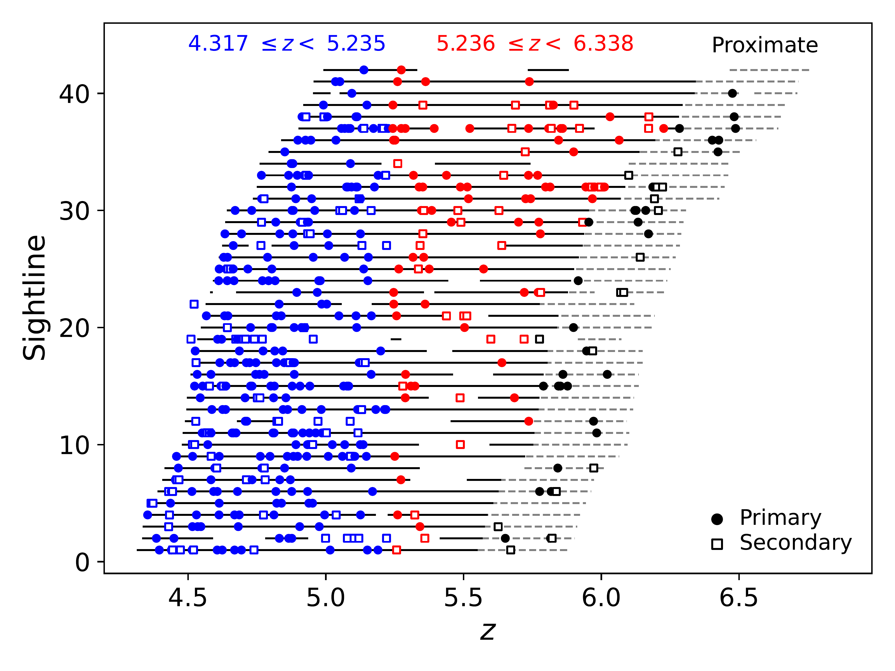
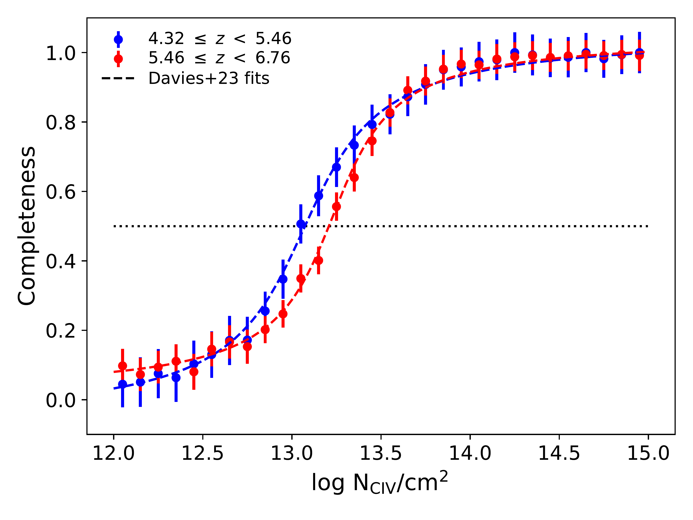
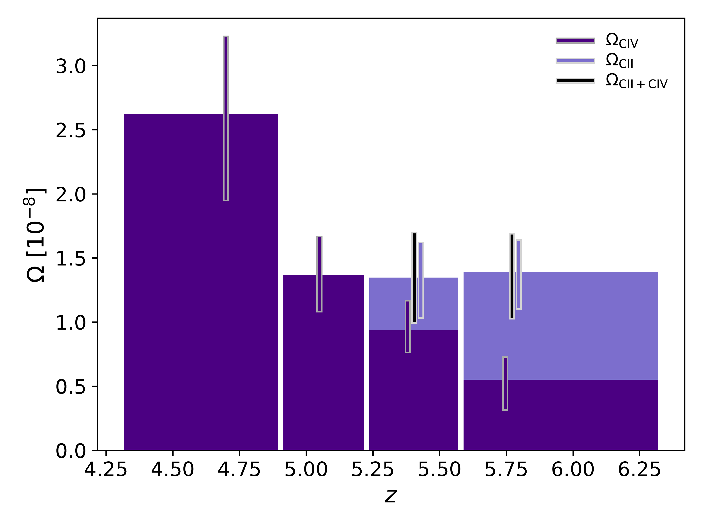
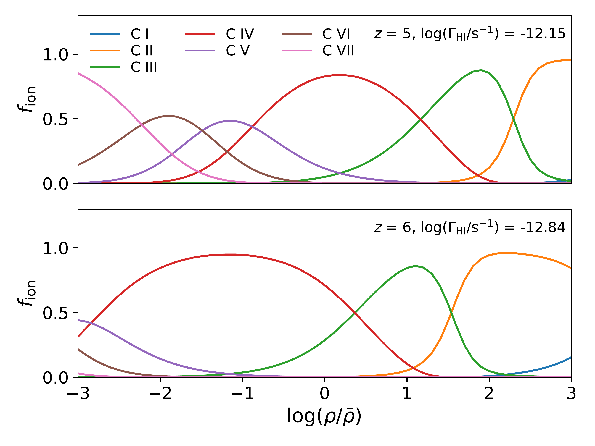

$\newcommand{\ensuremath}{}$
$\newcommand{\xspace}{}$
$\newcommand{\object}[1]{\texttt{#1}}$
$\newcommand{\farcs}{{.}''}$
$\newcommand{\farcm}{{.}'}$
$\newcommand{\arcsec}{''}$
$\newcommand{\arcmin}{'}$
$\newcommand{\ion}[2]{#1#2}$
$\newcommand{\textsc}[1]{\textrm{#1}}$
$\newcommand{\hl}[1]{\textrm{#1}}$
$\newcommand{\OmCIV}{\mbox{\Omega_{\rm C   \textsc{iv}}}}$
$\newcommand{\OmCII}{\mbox{\Omega_{\rm C   \textsc{ii}}}}$
$\newcommand{\HII}{\mbox{H \textsc{ii}}}$
$\newcommand{\CI}{\mbox{C \textsc{i}}}$
$\newcommand{\CII}{\mbox{C \textsc{ii}}}$
$\newcommand{\CIII}{\mbox{C \textsc{iii}}}$
$\newcommand{\CIV}{\mbox{C \textsc{iv}}}$
$\newcommand{\CV}{\mbox{C \textsc{v}}}$
$\newcommand{\SiII}{\mbox{Si \textsc{ii}}}$
$\newcommand{\SiIV}{\mbox{Si \textsc{iv}}}$
$\newcommand{\NV}{\mbox{N \textsc{v}}}$
$\newcommand{\HeII}{\mbox{He \textsc{ii}}}$
$\newcommand{\FeII}{\mbox{Fe \textsc{ii}}}$
$\newcommand{\MgII}{\mbox{Mg \textsc{ii}}}$
$\newcommand{\OI}{\mbox{O \textsc{i}}}$
$\newcommand{\Lya}{Ly\alpha}$
$\newcommand{\kms}{ km s^{-1}}$
$\newcommand{\dndx}{dn/dX}$
$\newcommand{\bibtex}{\textsc{Bib}\!\TeX}$
$\newcommand{\appropto}{\mathrel{\vcenter{$
$  \offinterlineskip\halign{\hfil##\cr$
$    \propto\cr\noalign{\kern2pt}\sim\cr\noalign{\kern-2pt}}}}}$

$\newcommand{\ensuremath}{}$
$\newcommand{\xspace}{}$
$\newcommand{\object}[1]{\texttt{#1}}$
$\newcommand{\farcs}{{.}''}$
$\newcommand{\farcm}{{.}'}$
$\newcommand{\arcsec}{''}$
$\newcommand{\arcmin}{'}$
$\newcommand{\ion}[2]{#1#2}$
$\newcommand{\textsc}[1]{\textrm{#1}}$
$\newcommand{\hl}[1]{\textrm{#1}}$
$\newcommand{\OmCIV}{\mbox{\Omega_{\rm C   \textsc{iv}}}}$
$\newcommand{\OmCII}{\mbox{\Omega_{\rm C   \textsc{ii}}}}$
$\newcommand{\HII}{\mbox{H \textsc{ii}}}$
$\newcommand{\CI}{\mbox{C \textsc{i}}}$
$\newcommand{\CII}{\mbox{C \textsc{ii}}}$
$\newcommand{\CIII}{\mbox{C \textsc{iii}}}$
$\newcommand{\CIV}{\mbox{C \textsc{iv}}}$
$\newcommand{\CV}{\mbox{C \textsc{v}}}$
$\newcommand{\SiII}{\mbox{Si \textsc{ii}}}$
$\newcommand{\SiIV}{\mbox{Si \textsc{iv}}}$
$\newcommand{\NV}{\mbox{N \textsc{v}}}$
$\newcommand{\HeII}{\mbox{He \textsc{ii}}}$
$\newcommand{\FeII}{\mbox{Fe \textsc{ii}}}$
$\newcommand{\MgII}{\mbox{Mg \textsc{ii}}}$
$\newcommand{\OI}{\mbox{O \textsc{i}}}$
$\newcommand{\Lya}{Ly\alpha}$
$\newcommand{\kms}{ km s^{-1}}$
$\newcommand{\dndx}{dn/dX}$
$\newcommand{\bibtex}{\textsc{Bib}\!\TeX}$
$\newcommand{\appropto}{\mathrel{\vcenter{$
$  \offinterlineskip\halign{\hfil##\cr$
$    \propto\cr\noalign{\kern2pt}\sim\cr\noalign{\kern-2pt}}}}}$

# Examining the Decline in the C IV Content of the Universe over $4.3 $\lesssim z \lesssim$ 6.3$ using the E-XQR-30 Sample

<mark>Appeared on: 2023-03-07</mark> - _20 pages, 8 figures, 4 tables. Published in MNRAS_

<mark><mark>Rebecca L. Davies</mark></mark>, et al. -- incl., <mark><mark>Sarah E. I. Bosman</mark></mark>, <mark><mark>Romain A. Meyer</mark></mark>, <mark><mark>Frederick B. Davies</mark></mark>

**Abstract:** Intervening \CIV absorbers are key tracers of metal-enriched gas in galaxy halos over cosmic time. Previous studies suggest that the \CIV cosmic mass density ( \OmCIV ) decreases slowly over $1.5 $\lesssim z\lesssim$ 5$ before declining rapidly at $$z\gtrsim$ 5$ , but the cause of this downturn is poorly understood. We characterize the \OmCIV evolution over $4.3 $\lesssim z\lesssim$ 6.3$ using 260 absorbers found in 42 XSHOOTER spectra of $z\sim$ 6 quasars, of which 30 come from the ESO Large Program XQR-30. The large sample enables us to robustly constrain the rate and timing of the downturn. We find that \OmCIV decreases by a factor of 4.8 $\pm$ 2.0 over the $$\sim$ 300 Myr$ interval between $z\sim$ 4.7 and $z\sim$ 5.8. The slope of the column density ( $\log N$ ) distribution function does not change, suggesting that \CIV absorption is suppressed approximately uniformly across $13.2 $\leq\log N$/cm$^{-2$$ $<$ 15.0} . Assuming that the carbon content of galaxy halos evolves as the integral of the cosmic star formation rate density (with some delay due to stellar lifetimes and outflow travel times), we show that chemical evolution alone could plausibly explain the fast decline in \OmCIV over $4.3 $\lesssim z\lesssim$ 6.3$ . However, the \CIV / \CII ratio decreases at the highest redshifts, so the accelerated decline in \OmCIV at $z\gtrsim$ 5 may be more naturally explained by rapid changes in the gas ionization state driven by evolution of the UV background towards the end of hydrogen reionization.

**Figure 4. -** Left: Illustration of the $\CI$V absorber sample. Horizontal lines show the redshift intervals over which the search for $\CI$V absorbers was conducted for each of the 42 quasar sightlines. Grey dashed regions highlight proximity zones within 10,000 $\kms$ of the quasar redshift. Longer gaps trace redshift intervals where the $\CI$V lines fall within BAL features or regions that were masked due to strong skyline or telluric contamination. The markers show all $\CI$V absorbers in the catalog, where solid circles indicate primary absorbers (those that were automatically identified, pass the visual inspection check, and do not fall in masked wavelength regions or BAL regions) and open squares indicate secondary absorbers (all others). Proximate absorbers are shown in black. The intervening absorbers are split into two redshift bins (indicated by the marker color), divided at the path-length-weighted mean redshift of our survey. Right: Completeness as a function of column density for $\CI$V absorbers in the two redshift intervals considered in \citetalias{Davies22Survey}. The dashed lines show the best-fit arctan functions published in that work. (*fig:completeness*)

**Figure 2. -** Bar graph illustrating the contribution of $\CI$V and $\CI$I to the cosmic mass density of carbon in each redshift bin. Vertical lines illustrate the measurement errors and are centered on the path-length-weighted mean redshift of each bin with small offsets added for clarity. We are unable to measure $\OmCII$ in the two lowest redshift bins due to the saturation of the $\Lya$ forest. The evolving balance between $\OmCII$ and $\OmCIV$ across the two highest redshift bins suggests that changes in the UV background driven by hydrogen reionization may contribute to the decline in $\OmCIV$. (*fig:carbon_ion_fractions*)

**Figure 3. -** Illustration of the possible ranges of gas densities probed by different ionization states of carbon at $z$ = 5 and $z$ = 6. The curves are the outputs of cloudy photoionization models. We fix the gas temperature to 10$^4$ K and adopt the 2011 update of the \citet{FaucherGiguere09} ionizing spectrum with a density-dependent correction for gas self-shielding as described in \citet{Keating16}. The ionizing spectrum is re-scaled at each redshift to match the H i photoionization rates measured by \citet{Calverley11}. (*fig:cloudy_modelling*)

