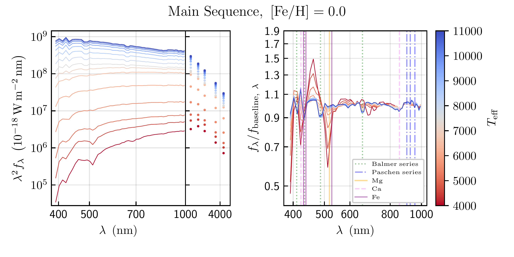
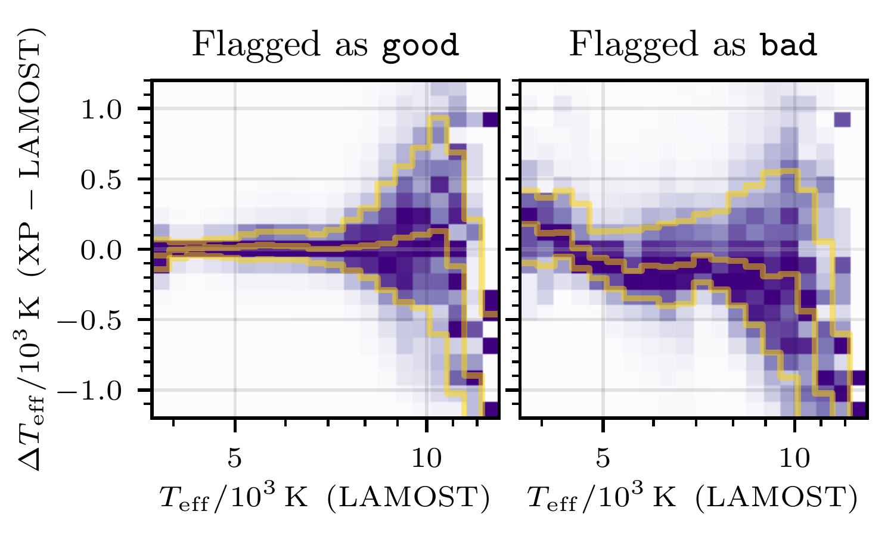
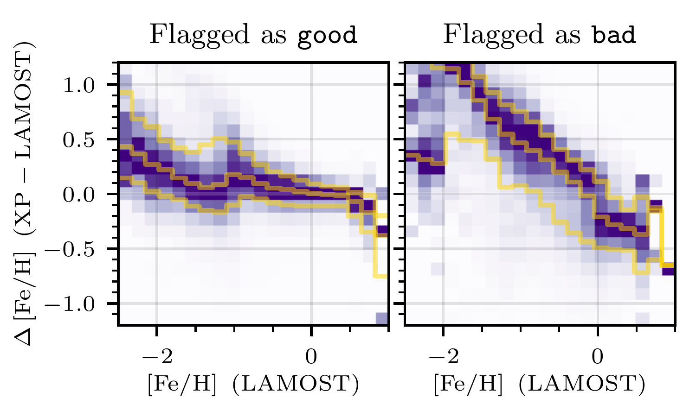
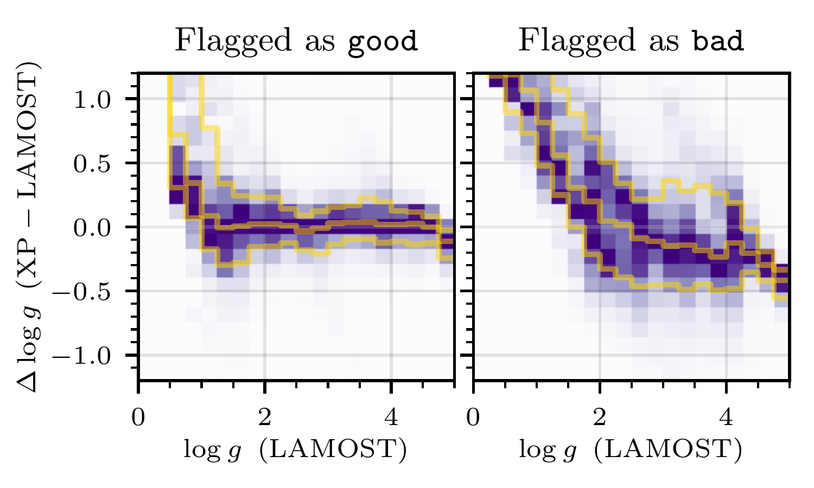

$\newcommand{\ensuremath}{}$
$\newcommand{\xspace}{}$
$\newcommand{\object}[1]{\texttt{#1}}$
$\newcommand{\farcs}{{.}''}$
$\newcommand{\farcm}{{.}'}$
$\newcommand{\arcsec}{''}$
$\newcommand{\arcmin}{'}$
$\newcommand{\ion}[2]{#1#2}$
$\newcommand{\textsc}[1]{\textrm{#1}}$
$\newcommand{\hl}[1]{\textrm{#1}}$
$\newcommand{\footnote}[1]{}$
$\newcommand{\mysubnumber}{\refstepcounter{mysubequations}\themysubequations}$
$\newcommand{\feh}{\mathrm{[Fe/H]}}$
$\newcommand{\teff}{T_{\rm eff}}$
$\newcommand{\logg}{\log{g}}$
$\newcommand{\type}{\vec{\Theta}}$
$\newcommand{\dm}{\mu}$
$\newcommand{\ebv}{\ensuremath{\mathrm{E}\left(B \! - \! V \right)}\xspace}$
$\newcommand{\Gaia}{\textit{Gaia}\xspace}$
$    \tolerance=1$
$    \emergencystretch=\maxdimen$
$    \hyphenpenalty=10000$
$    \hbadness=10000$
$\newcommand{\Gaia}{\textit{Gaia}\xspace}$
$\newcommand{\themysubequations}{(\roman{mysubequations})}$
$\newcommand{\thebibliography}{\DeclareRobustCommand{\VAN}[3]{##3}\VANthebibliography}$

# Parameters of 220 million stars from Gaia BP/RP spectra

<mark>Appeared on: 2023-03-06</mark> - _27 pages, 22 figures, submitted to MNRAS, Data available at DOI: https://doi.org/10.5281/zenodo.7692680_

<mark><mark>Xiangyu Zhang</mark></mark>, <mark><mark>Gregory M. Green</mark></mark>, <mark><mark>Hans-Walter Rix</mark></mark>

**Abstract:** We develop, validate and apply a forward model to estimate stellar atmospheric parameters ( $\teff$ , $\logg$ and $\feh$ ), revised distances and extinctions for 220 million stars with XP spectra from $\Gaia$ DR3. Instead of using _ab initio_ stellar models, we develop a data-driven model of $\Gaia$ XP spectra as a function of the stellar parameters, with a few straightforward built-in physical assumptions.We train our model on stellar atmospheric parameters from the LAMOST survey, which provides broad coverage of different spectral types.We model the $\Gaia$ XP spectra with all of their covariances, augmented by 2MASS and WISE photometry that greatly reduces degeneracies between stellar parameters, yielding more precise determinations of temperature and dust reddening.Taken together, our approach overcomes a number of important limitations that the astrophysical parameters released in $\Gaia$ DR3 faced, and exploits the full information content of the data. We provide the resulting catalog of stellar atmospheric parameters, revised parallaxes and extinction estimates, with all their uncertainties. The modeling procedure also produces an estimate of the optical extinction curve at the spectral resolution of the XP spectra ( $R \sim 20-100$ ), which agrees reasonably well with the ${R(V) = 3.1}$ CCM model. Remaining limitations that will be addressed in future work are that the model assumes a universal extinction law, ignores binary stars and does not cover all parts of the Hertzsprung-Russell Diagram ( $_e.g._$ , white dwarfs).

**Figure 15. -** Model-predicted, zero-extinction fluxes (at 1 kpc) for the XP spectra and the NIR photometry (left panel), illustrated here for Solar-metallicity main sequence stars as a function of effective temperature. We set $\logg$ as a function of $\teff$(see Eq. \ref{eqn:logg-ms}). The right panel shows continuum-normalized XP model spectra to highlight the spectral line features. Balmer and Paschen series are shown as dotted and dash-dotted lines. We also show the position of Ca lines and Mg $\rm b_1$ line. As effective temperature increases, the flux increases, and Balmer lines become stronger. We also show the position of the Paschen series, and find that there is a weak trend of strengthening with the increase of $\teff$. It is clear that Ca lines around $\sim430$ nm and the Mg line attenuate as $\teff$ increase, but the trend for other metal lines are unclear, due to saturation and the low resolution of the XP spectra. Our full model, along with example code to evaluate it for arbitrary stellar types, extinctions and distances, is available at \url{https://doi.org/10.5281/zenodo.7692680}. (*fig:modelfluxvsdwarfs*)

**Figure 2. -** Residuals (model -- LAMOST) in $\teff$(top panels), $\feh$(middle panels) and $\logg$ for sources flagged as reliable (\texttt{good}, left panels) vs. unreliable (\texttt{bad}, right panels), as a function of the LAMOST atmospheric parameter estimates. The densities are normalized by the maximum value at each parameter value (_i.e._, in each pixel column). The yellow lines mark the positions of the $15^{\mathrm{th}}$, $50^{\mathrm{th}}$ and $84^{\mathrm{th}}$ percentiles of the residuals. The reliability classifiers are unaware of the LAMOST estimate, working instead with features that are available for all sources (including those without LAMOST observations). For each parameter, there is a stark difference between stars flagged as \texttt{good} and \texttt{bad}. There is a nearly flat trend in the median $\feh$ residuals of stars labeled \texttt{good} over a wide range of metallicities. $\logg$ estimates agree well for $1 \lesssim $\logg$ \lesssim 5$, but agreement degrades for $\logg \lesssim 1$, where there is little LAMOST training data. $\teff$ residuals are approximately flat for $\teff \lesssim 11,000 \mathrm{K}$, though the the scatter in the residuals increases dramatically for $\teff \gtrsim 7,500 \mathrm{K}$. (*fig:validation-flags-lamost*)

**Figure 18. -** Sky maps of differential extinction in four distance ranges. We construct adaptive-resolution HEALPix maps of inverse-variance-weighted mean stellar extinction (using our inferred $E$ and $\sigma_E$) in each distance range, and subtract off the result for the previous distance range. We omit stars with poor fit quality ($\chi^2/\mathrm{DOF}>5$) or uncertain inferred parallaxes (defined as $\sigma_{\varpi}/\varpi>0.1$). We also require that $E<10$, $\sigma_E<0.04$, to remove outliers in extinction. This simple method of determining differential extinction is only intended to display the information present in our stellar reddening and distance inferences, and is not meant to replace (or reproduce) more sophisticated three-dimensional dust mapping methods. However, even this naive dust-mapping method recovers rich information on the three-dimensional structure of the interstellar medium, demonstrating the power of XP spectra to map dust in three dimensions. We recover the now-familiar structure of local dust clouds, several of which are labeled above. (*fig:dust-distance-slices*)

