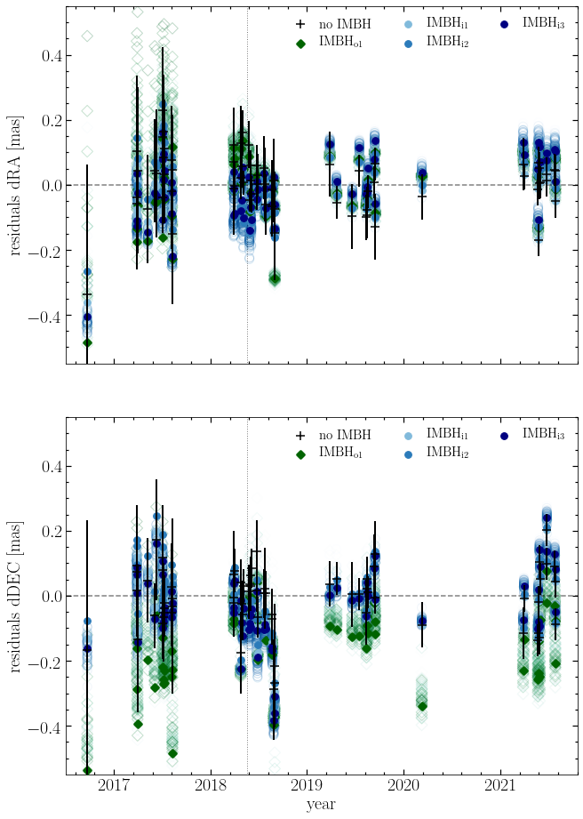
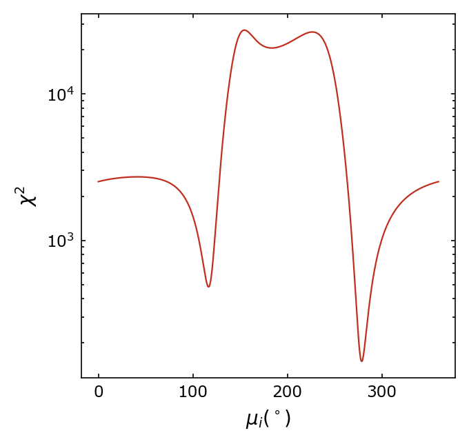

$\newcommand{\ensuremath}{}$
$\newcommand{\xspace}{}$
$\newcommand{\object}[1]{\texttt{#1}}$
$\newcommand{\farcs}{{.}''}$
$\newcommand{\farcm}{{.}'}$
$\newcommand{\arcsec}{''}$
$\newcommand{\arcmin}{'}$
$\newcommand{\ion}[2]{#1#2}$
$\newcommand{\textsc}[1]{\textrm{#1}}$
$\newcommand{\hl}[1]{\textrm{#1}}$
$\newcommand{\footnote}[1]{}$
$\newcommand{\g}[1]{\textcolor{teal}{\textbf{#1}}}$
$\newcommand{\sgr}{Sgr~A^{*}~}$
$\newcommand{\Msol}{M_{\odot} }$
$\newcommand{\rev}[1]{\textbf{#1}}$

$\newcommand{\ensuremath}{}$
$\newcommand{\xspace}{}$
$\newcommand{\object}[1]{\texttt{#1}}$
$\newcommand{\farcs}{{.}''}$
$\newcommand{\farcm}{{.}'}$
$\newcommand{\arcsec}{''}$
$\newcommand{\arcmin}{'}$
$\newcommand{\ion}[2]{#1#2}$
$\newcommand{\textsc}[1]{\textrm{#1}}$
$\newcommand{\hl}[1]{\textrm{#1}}$
$\newcommand{\footnote}[1]{}$
$\newcommand{\g}[1]{\textcolor{teal}{\textbf{#1}}}$
$\newcommand{\sgr}{Sgr~A^{*}~}$
$\newcommand{\Msol}{M_{\odot} }$
$\newcommand{\rev}[1]{\textbf{#1}}$

# Where intermediate-mass black holes could hide $\in the Galactic Centre$

 _11 pages, 6 figures, accepted in A $\&$ A_

GRAVITY Collaboration, et al. -- incl., <mark><mark>R. Davies</mark></mark>, <mark><mark>N.M. Förster Schreiber</mark></mark>, <mark><mark>S. Scheithauer</mark></mark>, <mark><mark>J. Stadler</mark></mark>

**Abstract:** In the Milky Way the central massive black hole, $\sgr$ , coexists with a compact nuclear star cluster that contains a sub-parsec concentration of fast-moving young stars called S-stars. Their location and age are not easily explained by current star formation models, and in several scenarios the presence of an intermediate-mass black hole (IMBH) has been invoked. We use GRAVITY astrometric and SINFONI, KECK, and GNIRS spectroscopic data of S2, the best known S-star, to investigate whether a second massive object could be present deep in the Galactic Centre (GC) in the form of an IMBH binary companion to $\sgr$ . To solve the three-body problem, we used a post-Newtonian framework and consider two types of settings: (i) a hierarchical set-up where the star S2 orbits the $\sgr$ -- IMBH binary and (ii) a non-hierarchical set-up where the IMBH trajectory lies outside the S2 orbit. In both cases we explore the full 20-dimensional parameter space by employing a Bayesian dynamic nested sampling method. For the hierarchical case we find the strongest constraints: IMBH masses > 2000 $\Msol$ on orbits with smaller semi-major axes than S2 are largely excluded. For the non-hierarchical case, the chaotic nature of the problem becomes significant: the parameter space contains several pockets of valid IMBH solutions. However, a closer analysis of their impact on the resident stars reveals that IMBHs on semi-major axes larger than S2 tend to disrupt the S-star cluster in less than a million years. This makes the existence of an IMBH among the S-stars highly unlikely. The current S2 data do not formally require the presence of an IMBH. If an IMBH hides in the GC, it has to be either a low-mass IMBH inside the S2 orbit that moves on a short and significantly inclined trajectory or an IMBH with a semi-major axis $> 1"$ . We provide the parameter maps of valid IMBH solutions in the GC and discuss the general structure of our results and how future observations can help to put even stronger constraints on the properties of IMBHs in the GC.

**Figure 3. -** Residuals of the S2 orbit. The best-fitting Schwarzschild model (i.e. without the presence of an IMBH) is marked in black. The blue open circles denote the 60 solutions where the IMBH orbit lies inside the S2 orbit, $0.01" < a_{\rm i} < 0.1"$, and the green open diamonds are   the 60 outer IMBH solutions with $0.1" < a_{\rm i} < 1"$. The filled symbols highlight solutions shown in Table \ref{tab:imbh_param}. The fine vertical line indicates the time of pericentre passage. Upper panel: Data--model difference for the right ascension (dRA). Bottom panel: Data--model difference for the declination (dDEC). (*fig:residuals*)

**Figure 4. -** Example orbits of allowed IMBHs in the Galactic Centre. The left panel shows the on-sky orbits of S2 and three IMBH solutions around $\sgr$(indicated by the cross). The right panels show the time evolution of the RA, DEC, and radial velocity. The solid grey and dashed black curves show the orbit of S2 with and without an IMBH, respectively. The IMBHs are shown in blue and correspond to the parameters given in Table \ref{tab:imbh_param}. The data points show the last 30 years of observations of S2. The black points correspond to adaptive optics measurements with NACO and early speckle imagery with SHARP. The red points correspond to GRAVITY interferometric measurements. The black and red radial velocity observations correspond, respectively, to SINFONI -- KECK and GNIRS spectral measurements of the line-of-sight velocity. (*fig:valid_imbh*)

**Figure 1. -** $\chi^2$ vs. the initial mean anomaly of the IMBH. All other IMBH parameters are fixed to the values shown in Table \ref{tab:imbh_param} and used in Fig. \ref{fig:valid_imbh}.  (*fig:Lmu*)

