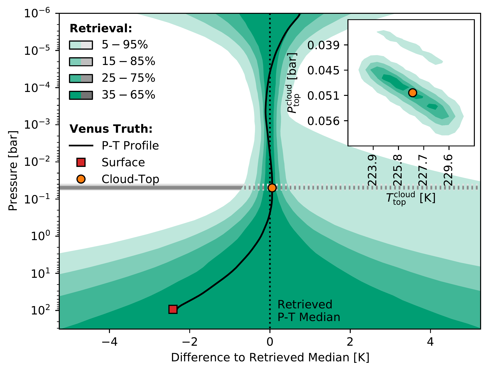
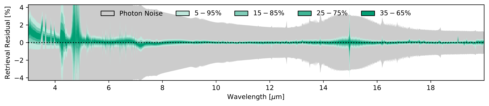
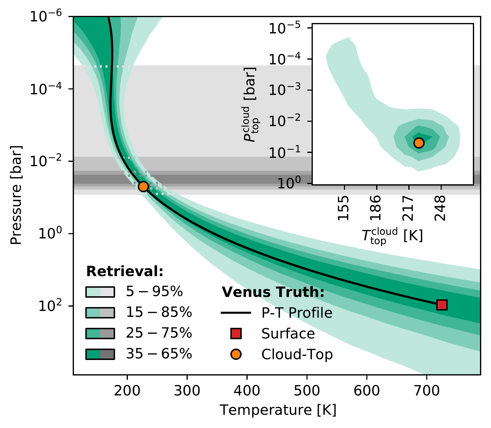
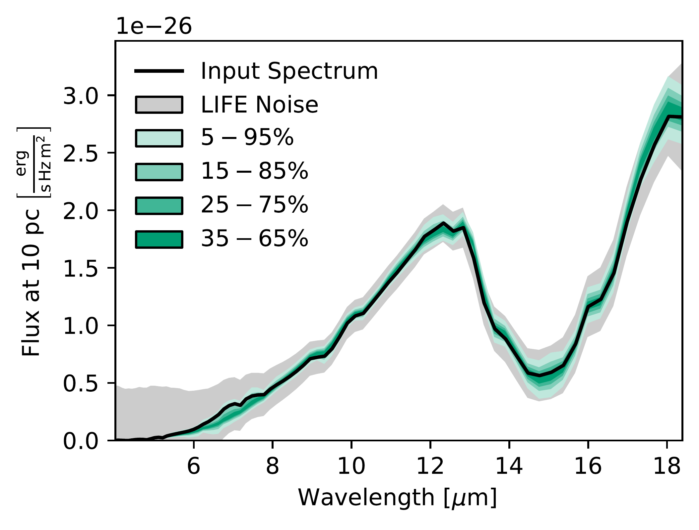
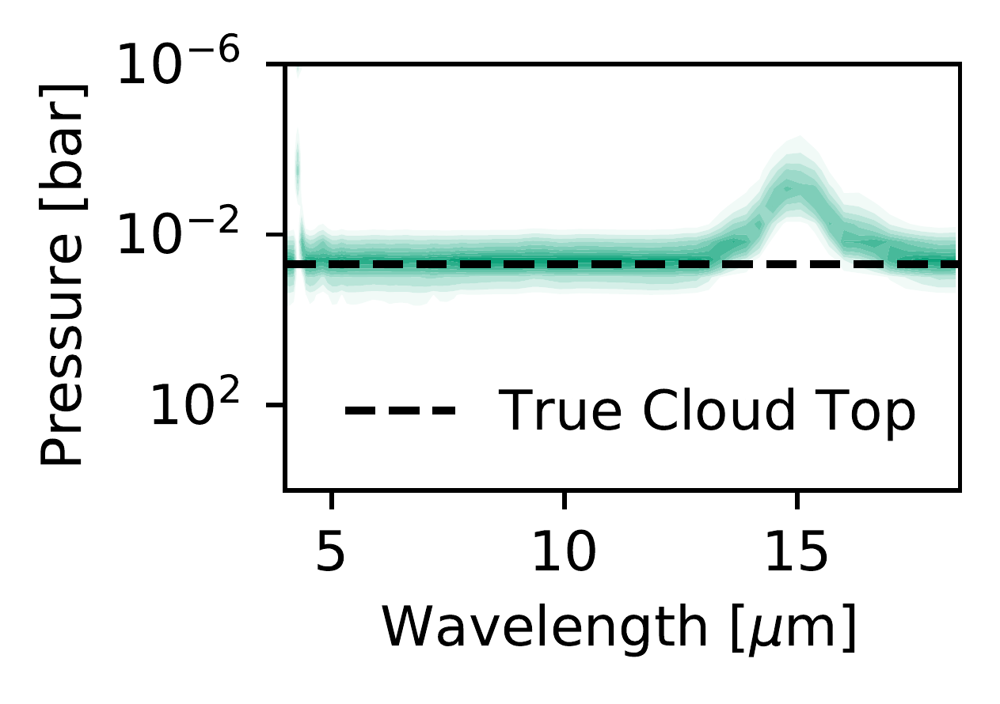
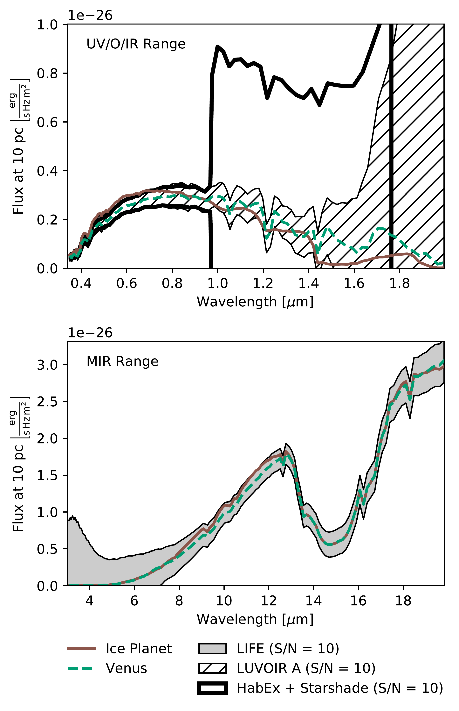

$\newcommand{\ensuremath}{}$
$\newcommand{\xspace}{}$
$\newcommand{\object}[1]{\texttt{#1}}$
$\newcommand{\farcs}{{.}''}$
$\newcommand{\farcm}{{.}'}$
$\newcommand{\arcsec}{''}$
$\newcommand{\arcmin}{'}$
$\newcommand{\ion}[2]{#1#2}$
$\newcommand{\textsc}[1]{\textrm{#1}}$
$\newcommand{\hl}[1]{\textrm{#1}}$
$\newcommand{\footnote}[1]{}$
$\newcommand{\R}[0]{\ensuremath{R}}$
$\newcommand{\Rv}[1]{\ensuremath{R = #1}}$
$\newcommand{\SN}[0]{\ensuremath{S/N}}$
$\newcommand{\SNv}[1]{\ensuremath{S/N = #1}}$
$\newcommand{\mic}[1]{\ensuremath{#1}~\textmu m}$
$\newcommand{\pt}[0]{\textit{P}-\textit{T}}$
$\newcommand{\Rpl}[0]{\ensuremath{R_{\text{pl}}}}$
$\newcommand{\Mpl}[0]{\ensuremath{M_{\text{pl}}}}$
$\newcommand{\Pct}[0]{\ensuremath{P\mathrm{^{cloud}_{top}}}}$
$\newcommand{\Tct}[0]{\ensuremath{T\mathrm{^{cloud}_{top}}}}$
$\newcommand{\Teq}[0]{\ensuremath{T_\mathrm{eq}}}$
$\newcommand{\Pcs}[0]{\ensuremath{P\mathrm{^{cloud}_{span}}}}$
$\newcommand{\Rcm}[0]{\ensuremath{\bar{R}\mathrm{^{cloud}}}}$
$\newcommand{\Sc}[0]{\ensuremath{\sigma\mathrm{^{cloud}}}}$
$\newcommand{\Ab}[0]{\ensuremath{A_\mathrm{B}}}$
$\newcommand{\Ps}[0]{\ensuremath{P_0}}$
$\newcommand{\Ts}[0]{\ensuremath{T_0}}$
$\newcommand{\MSaOp}[0]{\ensuremath{\mathcal{M}^{\ce{H2SO4}}_{\mathrm{Op.}}}}$
$\newcommand{\MSaTr}[0]{\ensuremath{\mathcal{M}^{\ce{H2SO4}}_{\mathrm{Tr.}}}}$
$\newcommand{\MWaOp}[0]{\ensuremath{\mathcal{M}^{\ce{H2O}}_{\mathrm{Op.}}}}$
$\newcommand{\MCf}[0]{\ensuremath{\mathcal{M}^\mathrm{CF}}}$
$\newcommand{\lgrt}[1]{\ensuremath{\log_{10}(#1)}}$
$\newcommand{\lgrtdaj}[1]{\ensuremath{\log_{10}\left(#1\right)}}$
$\newcommand{\life}[0]{LIFE}$
$\newcommand{\lifesim}[0]{LIFE\textsc{sim}}$
$\newcommand{\pI}[0]{Paper~I}$
$\newcommand{\pII}[0]{Paper~II}$
$\newcommand{\pIII}[0]{Paper~III}$
$\newcommand{\pV}[0]{Paper~V}$
$\newcommand{\pIIIaV}[0]{Papers~III and~V}$
$\newcommandinecolor{tab:OpH2SO4}{RGB}{0, 158, 115}$
$\newcommandinecolor{tab:OpH2SO4t}{RGB}{191, 230, 219}$
$\newcommandinecolor{tab:TrH2SO4}{RGB}{0, 114, 178}$
$\newcommandinecolor{tab:TrH2SO4t}{RGB}{191, 219, 235}$
$\newcommandinecolor{tab:OpH2O}{RGB}{213, 94, 0}$
$\newcommandinecolor{tab:OpH2Ot}{RGB}{244, 214, 191}$
$\newcommandinecolor{tab:CF}{RGB}{230, 159, 0}$
$\newcommandinecolor{tab:CFt}{RGB}{248, 230, 191}$
$   \title{Large Interferometer For Exoplanets (LIFE):}$
$   \subtitle{X. Assessing the Impact of Clouds on Atmospheric Retrievals at Mid-Infrared Wavelengths with a Venus-Twin Exoplanet}$
$   \titlerunning{LIFE: X. Assessing the Impact of Clouds on Atmospheric Retrievals with a Venus-Twin Exoplanet}$
$   \authorrunning{Konrad et al.}$
$   \author{$
$    B.S. Konrad \inst{1,2}$
$    \and$
$    E. Alei \inst{1,2}$
$    \and$
$    S.P. Quanz \inst{1,2,3}$
$    \and$
$    P. Mollière \inst{4}$
$    \and$
$    D. Angerhausen \inst{1,2}$
$    \and$
$    J.J. Fortney \inst{5}$
$    \and$
$    K. Hakim \inst{2,6}$
$    \and$
$    S. Jordan \inst{7}$
$    \and$
$    D. Kitzmann \inst{2,6}$
$    \and$
$    S. Rugheimer \inst{8}$
$    \and$
$    O. Shorttle \inst{7,9}$
$    \and$
$    R. Wordsworth \inst{10}$
$   \and$
$   the \textit{LIFE} Collaboration\thanks{Webpage: \url{www.life-space-mission.com}}$
$   }$
$  \institute{$
$    ETH Zurich, Institute for Particle Physics \& Astrophysics, Wolfgang-Pauli-Str. 27, 8093 Zurich, Switzerland\e-mail:\texttt{konradb@ethz.ch}; \texttt{sascha.quanz@phys.ethz.ch}$
$    \and$
$    National Center of Competence in Research PlanetS (www.nccr-planets.ch)$
$    \and$
$    ETH Centre for Origin and Prevalence of Life, Wolfgang-Pauli-Str. 27, 8093 Zurich, Switzerland$
$    \and$
$    Max-Planck-Institut für Astronomie, Königstuhl 17, 69117 Heidelberg, Germany$
$    \and$
$    Department of Astronomy and Astrophysics, University of California, Santa Cruz, CA, USA 95064$
$    \and$
$    University of Bern, Center for Space and Habitability, Gesellschaftsstrasse 6, 3012 Bern, Switzerland$
$    \and$
$    Institute of Astronomy, University of Cambridge, CB3 0HA, UK$
$    \and$
$    Department of Physics and Astronomy, York University, 4700 Keele Street, North York, Ontario 3MJ 1P3, Canada$
$    \and$
$    Department of Earth Sciences, University of Cambridge, CB2 3EQ, UK$
$    \and$
$    School of Engineering and Applied Sciences, Harvard University, Cambridge, MA 02138, USA$
$}$
$   \date{Received -; accepted -}$
$  \abstract{Terrestrial exoplanets in the habitable zone are likely a common occurrence. The long-term goal is to characterize the atmospheres of dozens of such objects. The Large Interferometer For Exoplanets (\life ) initiative aims to develop a spacebased mid-infrared (MIR) nulling interferometer to measure the thermal emission spectra of such exoplanets.}{We investigate how well \life  could characterize a cloudy Venus-twin exoplanet. This allows us to: (1) test our atmospheric retrieval routine on a realistic non-Earth-like MIR emission spectrum of a known planet, (2) investigate how clouds impact retrievals, (3) further refine the \life  requirements derived in previous Earth-centered studies.}{We run Bayesian atmospheric retrievals for simulated \life  observations of a Venus-twin exoplanet. Our exoplanet orbits a Sun-like star located 10~pc from the observer. The \lifesim  noise model accounts for all major astrophysical noise sources. We run retrievals using different models (cloudy and cloud-free) and analyze the performance as a function of the quality of the \life  observation. This allows us to determine how well atmosphere and clouds are characterizable depending on the quality of the spectrum.}{At the current minimal resolution (\Rv{50}) and signal-to-noise (\SNv{10} at \mic{11.2}) requirements for \life , all tested models suggest a \ce{CO2}-rich atmosphere (\geq30\% in mass fraction). Further, we successfully constrain the atmospheric pressure-temperature (\pt ) structure above the cloud deck (\pt  uncertainty \leq\pm15~K). However, we struggle to infer the main cloud properties. Further, the retrieved planetary radius (\Rpl ), equilibrium temperature (\Teq ), and Bond albedo (\Ab ) depend on the model. Generally, a cloud-free model performs best at the current minimal quality and accurately estimates \Rpl , \Teq , and \Ab . If we consider higher quality spectra (especially \SNv{20}), we can infer the presence of clouds and pose first constraints on their structure.}{Our study shows that the minimal \R  and \SN  requirements for \life  suffice to characterize the structure and composition of a Venus-like atmosphere above the cloud deck if an adequate model is chosen. Crucially, the cloud-free model is preferred by the retreival for low spectral qualities. We thus find no direct evidence for clouds at the minimal \R  and \SN  requirements and cannot infer the thickness of the atmosphere. Clouds are only constrainable in MIR retrievals of spectra with \SN \geq20. The model dependence of our retrieval results emphasizes the importance of developing a community-wide best-practice for atmospheric retrieval studies.$
$  }$
$   \keywords{   Methods: statistical --$
$                Planets and satellites: terrestrial planets --$
$                Planets and satellites: atmospheres$
$                }$
$   \maketitle$
$\n\end{document}}$
$\newcommand{\life}[0]{LIFE}$
$\newcommand{\lifesim}[0]{LIFE\textsc{sim}}$
$\newcommand{\pI}[0]{Paper~I}$
$\newcommand{\pII}[0]{Paper~II}$
$\newcommand{\pIII}[0]{Paper~III}$
$\newcommand{\pV}[0]{Paper~V}$
$\newcommand{\pIIIaV}[0]{Papers~III and~V}$

$\newcommand{\ensuremath}{}$
$\newcommand{\xspace}{}$
$\newcommand{\object}[1]{\texttt{#1}}$
$\newcommand{\farcs}{{.}''}$
$\newcommand{\farcm}{{.}'}$
$\newcommand{\arcsec}{''}$
$\newcommand{\arcmin}{'}$
$\newcommand{\ion}[2]{#1#2}$
$\newcommand{\textsc}[1]{\textrm{#1}}$
$\newcommand{\hl}[1]{\textrm{#1}}$
$\newcommand{\footnote}[1]{}$
$\newcommand{\R}[0]{\ensuremath{R}}$
$\newcommand{\Rv}[1]{\ensuremath{R = #1}}$
$\newcommand{\SN}[0]{\ensuremath{S/N}}$
$\newcommand{\SNv}[1]{\ensuremath{S/N = #1}}$
$\newcommand{\mic}[1]{\ensuremath{#1}~\textmu m}$
$\newcommand{\pt}[0]{\textit{P}-\textit{T}}$
$\newcommand{\Rpl}[0]{\ensuremath{R_{\text{pl}}}}$
$\newcommand{\Mpl}[0]{\ensuremath{M_{\text{pl}}}}$
$\newcommand{\Pct}[0]{\ensuremath{P\mathrm{^{cloud}_{top}}}}$
$\newcommand{\Tct}[0]{\ensuremath{T\mathrm{^{cloud}_{top}}}}$
$\newcommand{\Teq}[0]{\ensuremath{T_\mathrm{eq}}}$
$\newcommand{\Pcs}[0]{\ensuremath{P\mathrm{^{cloud}_{span}}}}$
$\newcommand{\Rcm}[0]{\ensuremath{\bar{R}\mathrm{^{cloud}}}}$
$\newcommand{\Sc}[0]{\ensuremath{\sigma\mathrm{^{cloud}}}}$
$\newcommand{\Ab}[0]{\ensuremath{A_\mathrm{B}}}$
$\newcommand{\Ps}[0]{\ensuremath{P_0}}$
$\newcommand{\Ts}[0]{\ensuremath{T_0}}$
$\newcommand{\MSaOp}[0]{\ensuremath{\mathcal{M}^{\ce{H2SO4}}_{\mathrm{Op.}}}}$
$\newcommand{\MSaTr}[0]{\ensuremath{\mathcal{M}^{\ce{H2SO4}}_{\mathrm{Tr.}}}}$
$\newcommand{\MWaOp}[0]{\ensuremath{\mathcal{M}^{\ce{H2O}}_{\mathrm{Op.}}}}$
$\newcommand{\MCf}[0]{\ensuremath{\mathcal{M}^\mathrm{CF}}}$
$\newcommand{\lgrt}[1]{\ensuremath{\log_{10}(#1)}}$
$\newcommand{\lgrtdaj}[1]{\ensuremath{\log_{10}\left(#1\right)}}$
$\newcommand{\life}[0]{LIFE}$
$\newcommand{\lifesim}[0]{LIFE\textsc{sim}}$
$\newcommand{\pI}[0]{Paper~I}$
$\newcommand{\pII}[0]{Paper~II}$
$\newcommand{\pIII}[0]{Paper~III}$
$\newcommand{\pV}[0]{Paper~V}$
$\newcommand{\pIIIaV}[0]{Papers~III and~V}$
$\newcommandinecolor{tab:OpH2SO4}{RGB}{0, 158, 115}$
$\newcommandinecolor{tab:OpH2SO4t}{RGB}{191, 230, 219}$
$\newcommandinecolor{tab:TrH2SO4}{RGB}{0, 114, 178}$
$\newcommandinecolor{tab:TrH2SO4t}{RGB}{191, 219, 235}$
$\newcommandinecolor{tab:OpH2O}{RGB}{213, 94, 0}$
$\newcommandinecolor{tab:OpH2Ot}{RGB}{244, 214, 191}$
$\newcommandinecolor{tab:CF}{RGB}{230, 159, 0}$
$\newcommandinecolor{tab:CFt}{RGB}{248, 230, 191}$
$   \title{Large Interferometer For Exoplanets (LIFE):}$
$   \subtitle{X. Assessing the Impact of Clouds on Atmospheric Retrievals at Mid-Infrared Wavelengths with a Venus-Twin Exoplanet}$
$   \titlerunning{LIFE: X. Assessing the Impact of Clouds on Atmospheric Retrievals with a Venus-Twin Exoplanet}$
$   \authorrunning{Konrad et al.}$
$   \author{$
$    B.S. Konrad \inst{1,2}$
$    \and$
$    E. Alei \inst{1,2}$
$    \and$
$    S.P. Quanz \inst{1,2,3}$
$    \and$
$    P. Mollière \inst{4}$
$    \and$
$    D. Angerhausen \inst{1,2}$
$    \and$
$    J.J. Fortney \inst{5}$
$    \and$
$    K. Hakim \inst{2,6}$
$    \and$
$    S. Jordan \inst{7}$
$    \and$
$    D. Kitzmann \inst{2,6}$
$    \and$
$    S. Rugheimer \inst{8}$
$    \and$
$    O. Shorttle \inst{7,9}$
$    \and$
$    R. Wordsworth \inst{10}$
$   \and$
$   the \textit{LIFE} Collaboration\thanks{Webpage: \url{www.life-space-mission.com}}$
$   }$
$  \institute{$
$    ETH Zurich, Institute for Particle Physics \& Astrophysics, Wolfgang-Pauli-Str. 27, 8093 Zurich, Switzerland\e-mail:\texttt{konradb@ethz.ch}; \texttt{sascha.quanz@phys.ethz.ch}$
$    \and$
$    National Center of Competence in Research PlanetS (www.nccr-planets.ch)$
$    \and$
$    ETH Centre for Origin and Prevalence of Life, Wolfgang-Pauli-Str. 27, 8093 Zurich, Switzerland$
$    \and$
$    Max-Planck-Institut für Astronomie, Königstuhl 17, 69117 Heidelberg, Germany$
$    \and$
$    Department of Astronomy and Astrophysics, University of California, Santa Cruz, CA, USA 95064$
$    \and$
$    University of Bern, Center for Space and Habitability, Gesellschaftsstrasse 6, 3012 Bern, Switzerland$
$    \and$
$    Institute of Astronomy, University of Cambridge, CB3 0HA, UK$
$    \and$
$    Department of Physics and Astronomy, York University, 4700 Keele Street, North York, Ontario 3MJ 1P3, Canada$
$    \and$
$    Department of Earth Sciences, University of Cambridge, CB2 3EQ, UK$
$    \and$
$    School of Engineering and Applied Sciences, Harvard University, Cambridge, MA 02138, USA$
$}$
$   \date{Received -; accepted -}$
$  \abstract{Terrestrial exoplanets in the habitable zone are likely a common occurrence. The long-term goal is to characterize the atmospheres of dozens of such objects. The Large Interferometer For Exoplanets (\life ) initiative aims to develop a spacebased mid-infrared (MIR) nulling interferometer to measure the thermal emission spectra of such exoplanets.}{We investigate how well \life  could characterize a cloudy Venus-twin exoplanet. This allows us to: (1) test our atmospheric retrieval routine on a realistic non-Earth-like MIR emission spectrum of a known planet, (2) investigate how clouds impact retrievals, (3) further refine the \life  requirements derived in previous Earth-centered studies.}{We run Bayesian atmospheric retrievals for simulated \life  observations of a Venus-twin exoplanet. Our exoplanet orbits a Sun-like star located 10~pc from the observer. The \lifesim  noise model accounts for all major astrophysical noise sources. We run retrievals using different models (cloudy and cloud-free) and analyze the performance as a function of the quality of the \life  observation. This allows us to determine how well atmosphere and clouds are characterizable depending on the quality of the spectrum.}{At the current minimal resolution (\Rv{50}) and signal-to-noise (\SNv{10} at \mic{11.2}) requirements for \life , all tested models suggest a \ce{CO2}-rich atmosphere (\geq30\% in mass fraction). Further, we successfully constrain the atmospheric pressure-temperature (\pt ) structure above the cloud deck (\pt  uncertainty \leq\pm15~K). However, we struggle to infer the main cloud properties. Further, the retrieved planetary radius (\Rpl ), equilibrium temperature (\Teq ), and Bond albedo (\Ab ) depend on the model. Generally, a cloud-free model performs best at the current minimal quality and accurately estimates \Rpl , \Teq , and \Ab . If we consider higher quality spectra (especially \SNv{20}), we can infer the presence of clouds and pose first constraints on their structure.}{Our study shows that the minimal \R  and \SN  requirements for \life  suffice to characterize the structure and composition of a Venus-like atmosphere above the cloud deck if an adequate model is chosen. Crucially, the cloud-free model is preferred by the retreival for low spectral qualities. We thus find no direct evidence for clouds at the minimal \R  and \SN  requirements and cannot infer the thickness of the atmosphere. Clouds are only constrainable in MIR retrievals of spectra with \SN \geq20. The model dependence of our retrieval results emphasizes the importance of developing a community-wide best-practice for atmospheric retrieval studies.$
$  }$
$   \keywords{   Methods: statistical --$
$                Planets and satellites: terrestrial planets --$
$                Planets and satellites: atmospheres$
$                }$
$   \maketitle$
$\n\end{document}}$
$\newcommand{\life}[0]{LIFE}$
$\newcommand{\lifesim}[0]{LIFE\textsc{sim}}$
$\newcommand{\pI}[0]{Paper~I}$
$\newcommand{\pII}[0]{Paper~II}$
$\newcommand{\pIII}[0]{Paper~III}$
$\newcommand{\pV}[0]{Paper~V}$
$\newcommand{\pIIIaV}[0]{Papers~III and~V}$

# Large Interferometer For Exoplanets (LIFE):

<mark>Appeared on: 2023-03-09</mark> - _Re-submitted to A&A after a first iteration with referee; 15 pages (main text incl. 8 figures and 6 tables) + appendix; comments are welcome. This paper is part of a series on the LIFE telescope. Related series papers: arXiv:2101.07500, arXiv:2203.00471, arXiv:2112.02054, arXiv:2204.10041_

B. S. Konrad, et al. -- incl., <mark><mark>P. Mollière</mark></mark>

**Abstract:** Terrestrial exoplanets in the habitable zone are likely a common occurrence. The long-term goal is to characterize the atmospheres of dozens of such objects. The Large Interferometer For Exoplanets ( $\life$ ) initiative aims to develop a spacebased mid-infrared (MIR) nulling interferometer to measure the thermal emission spectra of such exoplanets. We investigate how well $\life$ could characterize a cloudy Venus-twin exoplanet. This allows us to: (1) test our atmospheric retrieval routine on a realistic non-Earth-like MIR emission spectrum of a known planet, (2) investigate how clouds impact retrievals, (3) further refine the $\life$ requirements derived in previous Earth-centered studies. We run Bayesian atmospheric retrievals for simulated $\life$ observations of a Venus-twin exoplanet. Our exoplanet orbits a Sun-like star located $10$ pc from the observer. The $\lifesim$ noise model accounts for all major astrophysical noise sources. We run retrievals using different models (cloudy and cloud-free) and analyze the performance as a function of the quality of the $\life$ observation. This allows us to determine how well atmosphere and clouds are characterizable depending on the quality of the spectrum. At the current minimal resolution ( $\Rv{50}$ ) and signal-to-noise ( $\SNv{10}$ at $\mic{11.2}$ ) requirements for $\life$ , all tested models suggest a $\ce{CO2}$ -rich atmosphere ( $\geq30\%$ in mass fraction). Further, we successfully constrain the atmospheric pressure-temperature ( $\pt$ ) structure above the cloud deck ( $\pt$ uncertainty $\leq\pm15$ K). However, we struggle to infer the main cloud properties. Further, the retrieved planetary radius ( $\Rpl$ ), equilibrium temperature ( $\Teq$ ), and Bond albedo ( $\Ab$ ) depend on the model. Generally, a cloud-free model performs best at the current minimal quality and accurately estimates $\Rpl$ , $\Teq$ , and $\Ab$ . If we consider higher quality spectra (especially $\SNv{20}$ ), we can infer the presence of clouds and pose first constraints on their structure. Our study shows that the minimal $\R$ and $\SN$ requirements for $\life$ suffice to characterize the structure and composition of a Venus-like atmosphere above the cloud deck if an adequate model is chosen. Crucially, the cloud-free model is preferred by the retreival for low spectral qualities. We thus find no direct evidence for clouds at the minimal $\R$ and $\SN$ requirements and cannot infer the thickness of the atmosphere. Clouds are only constrainable in MIR retrievals of spectra with $\SN \geq20$ . The model dependence of our retrieval results emphasizes the importance of developing a community-wide best-practice for atmospheric retrieval studies.

**Figure 8. -** {Results from the validation retrieval on the $\mic${3-20}, $\R$v{1000}, and photon noise $\SN$v{50} Venus-twin spectrum (opaque \ce{H2SO4} clouds) using the opaque \ce{H2SO4} cloud forward model. *Top left*: Corner plot of the posterior distribution of the forward model parameters. Here, $L(\cdot)$ stands for $\lgrt${\cdot}. We derived the equilibrium temperature $\Teq$  and the Bond albedo $\Ab$  from the other posteriors (see Appendix \ref{sec:albedo_calc}). The dotted black lines indicate the true values. In the 1D posteriors, we show the 16th, 50th, and 84th percentiles as black dashed lines. *Top right*: $\pt$  profile residuals relative to the retrieved median $\pt$  profile. Color-shaded regions indicate percentiles of the retrieved $\pt$  profiles. The gray shaded regions indicate percentiles of the retrieved cloud-top pressure. The solid black line, the orange circular marker, and the red square marker represent the true Venus-twin $\pt$  profile relative to the median retrieved $\pt$  profile. In the inset figure, we plot the 2D $\Ps$ -$\Ts$  posterior. *Bottom*: Residuals of the spectra corresponding to the retrieved posteriors relative to the Venus-twin input. Color-shaded areas represent different quantiles of the residuals. The gray area marks the 1$\sigma$ photon noise-level.} (*fig:valid*)

**Figure 10. -** Results from the retrieval on the $\mic${4-18.5}, $\R$v{50}, and $\life$sim  noise $\SN$v{10} Venus-twin spectrum (opaque \ce{H2SO4} clouds) using the opaque \ce{H2SO4} cloud forward model (see Sect. \ref{sec:LIFEsim_papIII_ret_res}). *Lower left half*: Corner plot of the posterior distribution of the forward model parameters. Here, $L(\cdot)$ stands for $\lgrt${\cdot}. We derived the equilibrium temperature $\Teq$  and the Bond albedo $\Ab$  from the other posteriors (see Appendix \ref{sec:albedo_calc}). The dotted black lines indicate the true values. In the 1D posteriors, we show the 16th, 50th, and 84th percentiles as black dashed lines. *Top center*: $\pt$  profiles corresponding to the retrieved $\pt$  parameters. Color-shaded regions indicate percentiles of the retrieved $\pt$  profiles. The gray shaded regions indicate percentiles of the retrieved cloud-top pressure. The solid black line, the orange circular marker, and the red square marker represent the true Venus-twin $\pt$  profile. In the inset figure, we plot the 2D $\Ps$ -$\Ts$  posterior (if retrieved; otherwise $\Pct$ -$\Tct$). *Top right*: A table summarizing the true values of the forward model parameters and the 16th, 50th, and 84th percentiles of the parameter posteriors. *Center right*: Spectra corresponding to the retrieved posteriors in comparison to the Venus-twin input. Color-shaded areas represent different quantiles of the retrieved spectra. The solid black line represents the Venus-twin input spectrum. The gray area marks the 1$\sigma$\lifesim  noise-level. Below the spectrum plot, we show the mean wavelength-dependent contribution of the atmospheric layers to the emission spectrum corresponding to the retrieved parameter posteriors. Darker colors indicate higher contributions. The dashed black line indicates the position of the cloud-deck assumed to simulate the input spectrum (opaque \ce{H2SO4} clouds). (*fig:corner_O_H2SO4*)

**Figure 1. -** Flux of a cloudy Venus-twin exoplanet (opaque \ce{H2SO4} clouds; dashed green line) compared to an icy world with a thin \ce{CO2}-dominated atmosphere (solid brown line). In the top panel, we plot the UV/O/IR wavelength range. The hatched area represents the expected wavelength-dependent $\SN$v{10} noise for the LUVOIR A mission concept \citep{2017AAS...22940504P}. The thick, solid black line represents the expected $\SN$v{10} noise for the HabEx + Starshade mission concept \citep{2020arXiv200106683G}. In the bottom panel, we plot the MIR wavelength range. The gray shaded region indicates the 1$\sigma$\lifesim  noise level at $\SN$v{10}. (*fig:Clouds_VS_Ice_absolute*)

