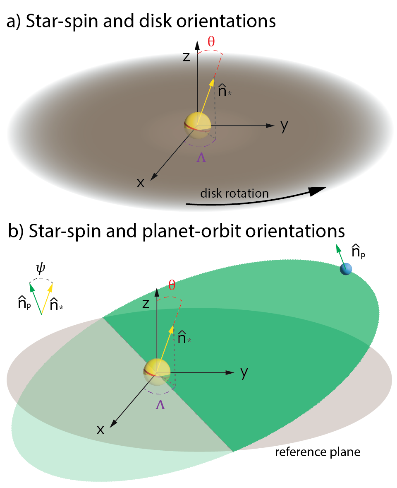
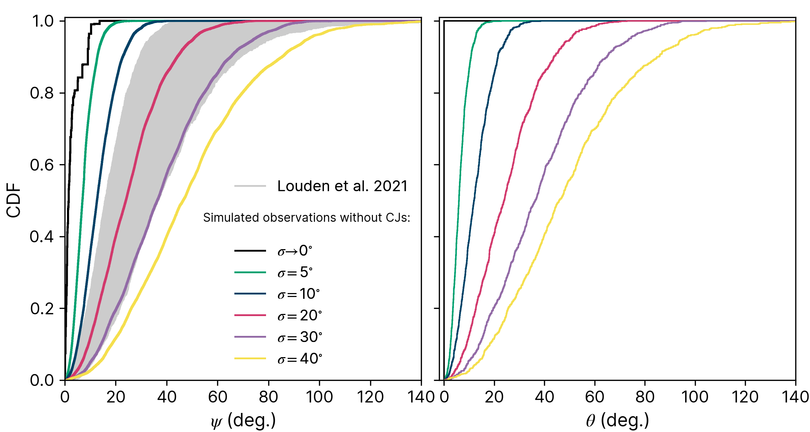
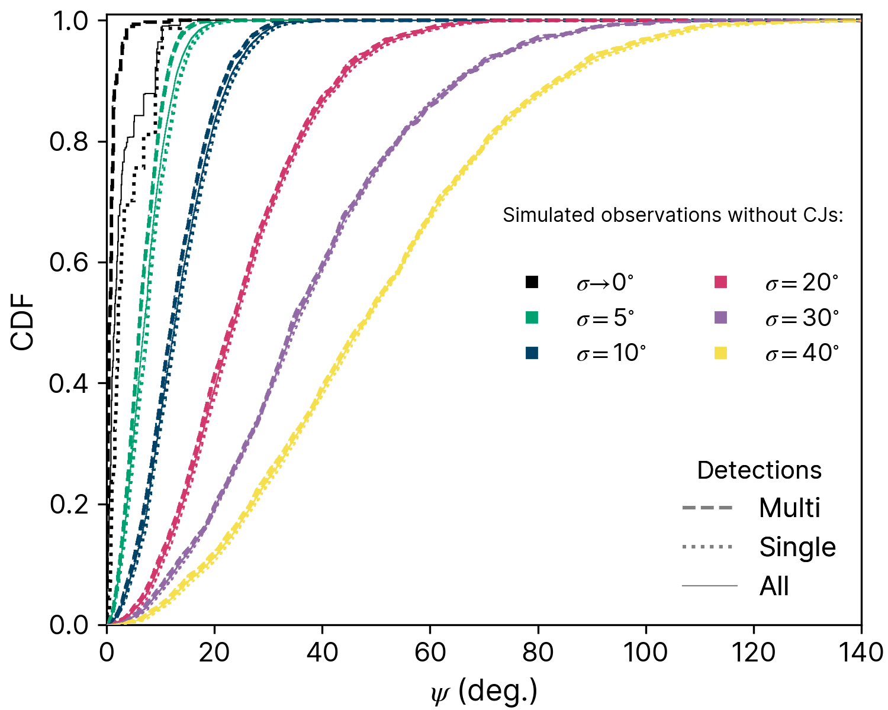

$\newcommand{\ensuremath}{}$
$\newcommand{\xspace}{}$
$\newcommand{\object}[1]{\texttt{#1}}$
$\newcommand{\farcs}{{.}''}$
$\newcommand{\farcm}{{.}'}$
$\newcommand{\arcsec}{''}$
$\newcommand{\arcmin}{'}$
$\newcommand{\ion}[2]{#1#2}$
$\newcommand{\textsc}[1]{\textrm{#1}}$
$\newcommand{\hl}[1]{\textrm{#1}}$
$\newcommand{\footnote}[1]{}$

$\newcommand{\ensuremath}{}$
$\newcommand{\xspace}{}$
$\newcommand{\object}[1]{\texttt{#1}}$
$\newcommand{\farcs}{{.}''}$
$\newcommand{\farcm}{{.}'}$
$\newcommand{\arcsec}{''}$
$\newcommand{\arcmin}{'}$
$\newcommand{\ion}[2]{#1#2}$
$\newcommand{\textsc}[1]{\textrm{#1}}$
$\newcommand{\hl}[1]{\textrm{#1}}$
$\newcommand{\footnote}[1]{}$

# Assessing the spin-orbit obliquity of low-mass planets in the breaking the chain formation model: A story of misalignment

<mark>Appeared on: 2023-03-13</mark> - _11 pages, 9 figures, 2 tables. Accepted for publication in MNRAS_

Leandro Esteves, et al. -- incl., <mark><mark>Bertram Bitsch</mark></mark>

**Abstract:** The spin-orbit obliquity of a planetary system constraints its formation history. A large obliquity may either indicate a primordial misalignment between the star and its gaseous disk or reflect  the effect of different mechanisms tilting  planetary systems after formation. Observations and statistical analysis suggest that system of planets with sizes between 1 and 4 R $_{\oplus}$ have a wide range of obliquities ( $\sim0-30^{\circ}$ ), and that  single- and multi-planet transiting have statistically indistinguishable obliquity distributions. Here, we revisit the "breaking the chains" formation model with focus in understanding  the origin of spin-orbit obliquities. This model suggests that super-Earths and mini-Neptunes migrate close to their host stars via planet-disk gravitational interactions, forming chain of planets locked in mean-motion resonances. After gas-disk dispersal, about  90-99 \% of these planetary systems experience dynamical instabilities, which spread the systems out.  Using synthetic transit observations, we show that if planets are born in disks where the disk angular momentum is virtually aligned with  the star's rotation spin, their final obliquity distributions peak at  about $\sim$ 5 degrees or less, and the obliquity distributions of single and multi-planet transiting systems are statistically distinct. By treating the star-disk alignment as a free-parameter, we show that the obliquity distributions of single and multi-planet transiting systems only become statistically indistinguishable if planets are assumed to form in primordially misaligned natal disks with a  "tilt" distribution peaking at $\gtrsim$ 10-20 deg. We discuss the origin of these misalignments in the context of star formation and potential implications of this scenario for formation models.

**Figure 1. -** **a)** Schematic of star-disk orientations. The star is shown as a yellow sphere at the center of the coordinate system. $\hat{n}_{\textrm{*}}$ is the norm  of the star spin vector. $\theta$ is  the angle  between $\hat{n}_{\textrm{*}}$ and the z-axis. $\Lambda$ is the azimuthal angle defined by the projection of $\hat{n}_{\textrm{*}}$ onto the x-y plane and the x-axis. The protoplanetary disk angular momentum is parallel to the z-axis. The gas disk mid-plane is shown in dark-grey.
    **b)** Star-planet orientations. The orbital plane of the planet is shown in green, which is this case, for illustration purposes do not coincides with the original disk mid-planet. The planet's angular momentum is represented by the vector $\hat{n}_{\textrm{p}}$. The spin-orbit obliquity is given by $\psi$, which is defined as the angle between $\hat{n}_{\textrm{*}}$ and $\hat{n}_{\textrm{p}}$, see inset on top left of (b). We show a single planet for simplicity. In the case, of multiple planets, the obliquity is defined using the total orbital angular momentum of all transiting planets. (*fig:obliquity_scheme*)

**Figure 7. -** **Left panel** Cumulative distributions of obliquity ($\psi$)  of  simulated planetary systems (with no cold gas giants) and  real observations. Grey lines  show the cumulative distributions of Kepler exoplanets as inferred by  ([Louden, et. al (2021)](https://ui.adsabs.harvard.edu/abs/2021AJ....161...68L)) . In black and in colourful lines, we show the obliquity distributions of our simulated planetary systems for different values of $\sigma$. ** Right panel:** Cumulative distribution functions of $\theta$ for different values of $\sigma$.  (*fig:compare*)

**Figure 4. -** Cumulative distributions of obliquity ($\psi$) of simulated planetary systems divided in single and multi-planet transiting systems. Dashed lines show distributions of multi-planet transiting systems. Dotted lines represent single-transit systems. Solid lines contains all systems. Lines are colour-coded as indicated by the parameter $\sigma$. These simulations do not contain cold gas giants. (*fig:obl_dist*)

