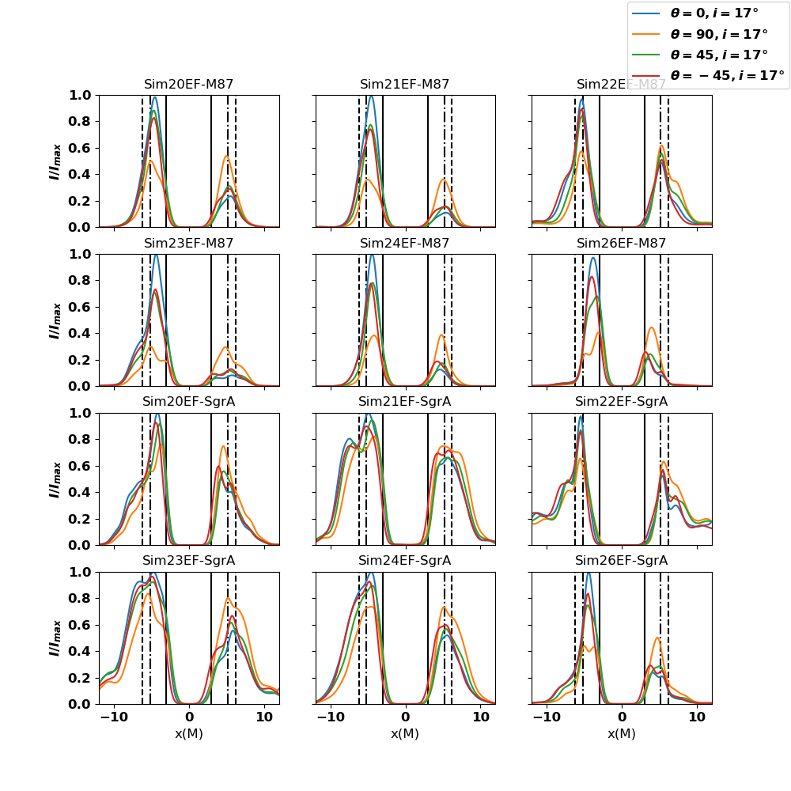

$\newcommand{\ensuremath}{}$
$\newcommand{\xspace}{}$
$\newcommand{\object}[1]{\texttt{#1}}$
$\newcommand{\farcs}{{.}''}$
$\newcommand{\farcm}{{.}'}$
$\newcommand{\arcsec}{''}$
$\newcommand{\arcmin}{'}$
$\newcommand{\ion}[2]{#1#2}$
$\newcommand{\textsc}[1]{\textrm{#1}}$
$\newcommand{\hl}[1]{\textrm{#1}}$
$\newcommand{\footnote}[1]{}$
$\newcommand{\thebibliography}{\DeclareRobustCommand{\VAN}[3]{##3}\VANthebibliography}$

$\newcommand{\ensuremath}{}$
$\newcommand{\xspace}{}$
$\newcommand{\object}[1]{\texttt{#1}}$
$\newcommand{\farcs}{{.}''}$
$\newcommand{\farcm}{{.}'}$
$\newcommand{\arcsec}{''}$
$\newcommand{\arcmin}{'}$
$\newcommand{\ion}[2]{#1#2}$
$\newcommand{\textsc}[1]{\textrm{#1}}$
$\newcommand{\hl}[1]{\textrm{#1}}$
$\newcommand{\footnote}[1]{}$
$\newcommand{\thebibliography}{\DeclareRobustCommand{\VAN}[3]{##3}\VANthebibliography}$

# Signatures of winds and jets in the environment of supermassive black holes

<mark>Appeared on: 2023-03-14</mark> - _12 pages, 5 figures, Submitted to MNRAS_

Bidisha Bandyopadhyay, et al. -- incl., <mark><mark>Christian Fendt</mark></mark>

**Abstract:** The Event Horizon Telescope Collaboration (EHTC) has presented first - dynamic-range limited - images of the black hole shadows in M87 and Sgr A*. The next generation Event Horizon Telescope (ngEHT) will provide higher  sensitivity and higher dynamic range images (and movies) of these two sources plus image at least a dozen others at $\leq$ 100 gravitational radii resolution. We here perform an exploratory study of the appearance of winds and jets in such future observations. To do this we use  M87 and Sgr A* as reference systems: we do not aim to exactly reproduce them, but rather to determine how their observed images will depend on specific physical assumptions. Even in the case of similar or the same dynamics, the images depend significantly on global parameters such as the black hole mass and the mass accretion rate. Our results provide guidance in the interpretation of future high-resolution images, particularly if a wind or jet is detected.

**Figure 1. -** Emission maps and radial emission profiles (along diameters with angles$=0◦, 90◦, 45◦ \& -45◦ $ respectively) for M87 (upper 6 in each panel) and SgrA* (lower 6 in each panel) like systems for inclination angles of $17◦$ at 230 GHz for EHT-$20 \mu$arcsec (upper), Geo-VLBI-$5 \mu$arcsec (middle) and L1-VLBI-$0.16 \mu$arcsec (lower) like resolutions). The intensity profiles in addition also mark the positions of the unlensed photon ring (black solid line) and the theoretical values of the inner (dot dashed line) and outer (dashed line) boundaries of the lensed photon ring. (*fig:M87SgrAL1VLBI*)

**Figure 2. -** Flux normalized emission maps (upper) and intensity profiles (lower) (along diameters with angles$=0◦, 90◦, 45◦ \& -45◦ $ respectively) for all our simulations for M87 (upper 6 in each of the panels) and and SgrA* (lower 6 in each of the panels) like systems with inclination angle $17◦$ for 345 GHz (left) and 700 GHz (right) respectively. The intensity profiles in addition also mark the positions of the unlensed photon ring (black solid line) and the theoretical values of the inner (dot dashed line) and outer (dashed line) boundaries of the lensed photon ring. (*fig:M87SgrAang345n700*)

