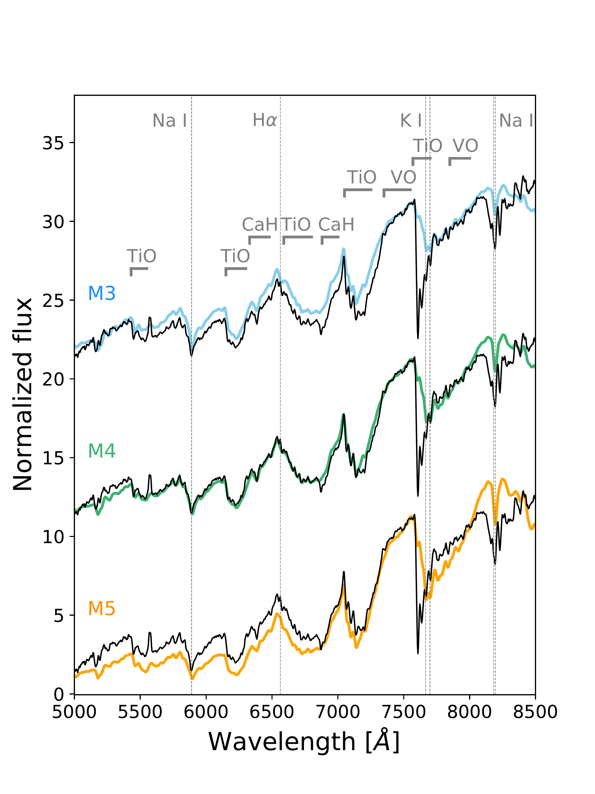
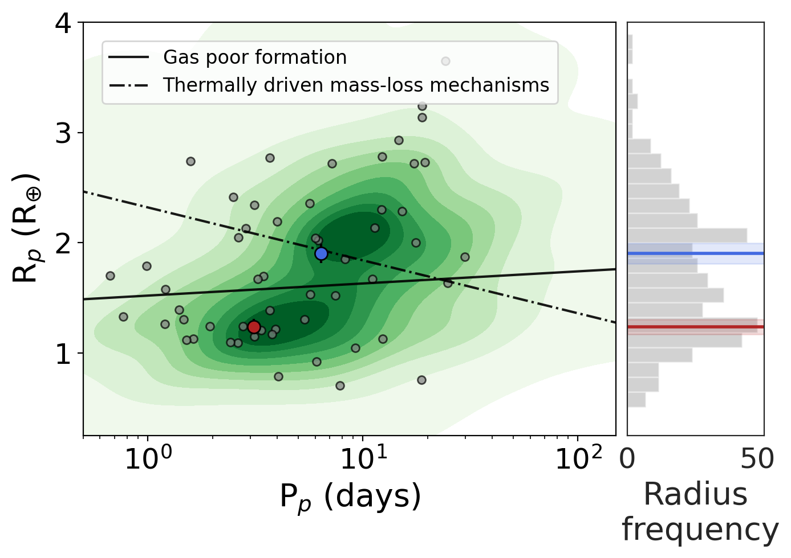
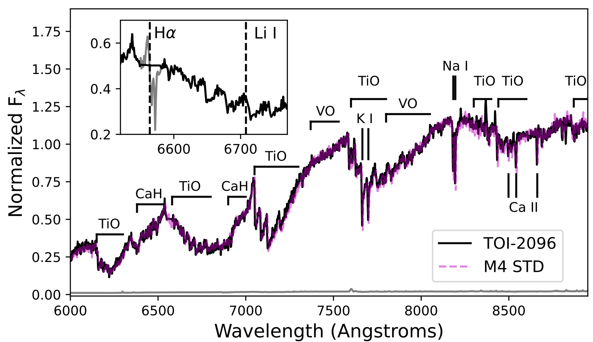

$\newcommand{\ensuremath}{}$
$\newcommand{\xspace}{}$
$\newcommand{\object}[1]{\texttt{#1}}$
$\newcommand{\farcs}{{.}''}$
$\newcommand{\farcm}{{.}'}$
$\newcommand{\arcsec}{''}$
$\newcommand{\arcmin}{'}$
$\newcommand{\ion}[2]{#1#2}$
$\newcommand{\textsc}[1]{\textrm{#1}}$
$\newcommand{\hl}[1]{\textrm{#1}}$
$\newcommand{\footnote}[1]{}$
$\newcommand{\tls}{{\fontfamily{pcr}\selectfont tls} }$
$\newcommand{\ellc}{{\fontfamily{pcr}\selectfont ellc} }$
$\newcommand{\emcee}{{\fontfamily{pcr}\selectfont emcee} }$
$\newcommand{\dynesty}{{\fontfamily{pcr}\selectfont dynesty} }$
$\newcommand{\allesfitter}{{\fontfamily{pcr}\selectfont allesfitter} }$
$\newcommand{\sherlock}{{\fontfamily{pcr}\selectfont SHERLOCK} }$
$\newcommand{\matrixtk}{{\fontfamily{pcr}\selectfont MATRIX} }$
$\newcommand{\wotan}{{\fontfamily{pcr}\selectfont wotan} }$
$\newcommand{\forecaster}{{\fontfamily{pcr}\selectfont forecaster} }$
$\newcommand{\lightkurve}{{\fontfamily{pcr}\selectfont lightkurve} }$
$\newcommand{\celerite}{{\fontfamily{pcr}\selectfont celerite} }$
$\newcommand{\triceratops}{{\fontfamily{pcr}\selectfont TRICERATOPS} }$
$\newcommand{\orcidauthorA}{0000-0003-1572-7707}$
$\newcommand{\orcidauthorB}{0000-0002-3164-9086}$
$\newcommand{\orcidauthorC}{0000-0003-1462-7739}$
$\newcommand{\orcidauthorD}{0000-0002-8219-9505}$
$\newcommand{\orcidauthorE}{0000-0002-4715-9460}$
$\newcommand{\orcidauthorF}{0000-0002-5370-7494}$
$\newcommand{\orcidauthorG}{0000-0001-8504-5862}$
$\newcommand{\orcidauthorH}{0000-0002-7008-6888}$
$\newcommand{\orcidauthorI}{0000-0002-6523-9536}$
$\newcommand{\orcidauthorJ}{0000-0002-3627-1676}$
$\newcommand{\orcidauthorK}{0000-0002-3481-9052}$
$\newcommand{\orcidauthorL}{0000-0003-2144-4316}$
$\newcommand{\orcidauthorM}{0000-0003-2094-9128}$
$\newcommand{\orcidauthorN}{0000-0002-2532-2853}$
$\newcommand{\orcidauthorO}{0000-0002-8052-3893}$
$\newcommand{\orcidauthorP}{0000-0002-2214-9258}$
$\newcommand{\orcidauthorQ}{0000-0003-1464-9276}$
$\newcommand{\orcidauthorR}{0000-0001-9892-2406}$
$\newcommand{\orcidauthorS}{0000-0002-9355-5165}$
$\newcommand{\orcidauthorT}{0000-0002-3937-630X}$
$\newcommand{\orcidauthorU}{0000-0002-9113-7162}$
$\newcommand{\orcidauthorV}{0000-0001-9800-6248}$
$\newcommand{\orcidauthorW}{0000-0002-4296-2246}$
$\newcommand{\orcidauthorY}{0000-0002-7486-6726}$
$\newcommand{\orcidauthorX}{0000-0002-3938-4211}$
$\newcommand{\orcidauthorZ}{0000-0002-3164-9086}$
$\newcommand{\orcidauthora}{0000-0001-8923-488X}$
$\newcommand{\orcidauthorb}{0000-0001-6108-4808}$
$\newcommand{\orcidauthorc}{0000-0001-9911-7388}$
$\newcommand{\orcidauthord}{0000-0002-3012-0316}$
$\newcommand{\orcidauthore}{0000-0003-0242-0044}$
$\newcommand{\orcidauthorf}{0000-0002-9807-5435}$
$\newcommand{\orcidauthorg}{0000-0002-5510-8751}$
$\newcommand{\orcidauthorh}{0000-0002-8039-194X}$
$\newcommand{\orcidauthori}{0000-0003-0030-332X}$
$\newcommand{\orcidauthorj}{0000-0002-7084-0529}$
$\newcommand{\orcidauthork}{0000-0002-8388-6040}$
$\newcommand{\orcidauthorl}{0000-0001-5559-7850}$
$\newcommand{\orcidauthorm}{0000-0003-3649-8384}$
$\newcommand{\orcidauthorn}{0000-0003-3101-917X}$
$\newcommand{\orcidauthoro}{0000-0002-3321-4924}$
$\newcommand{\orcidauthorp}{0000-0001-9291-5555}$
$\newcommand{\orcidauthorr}{0000-0003-3714-5855}$
$\newcommand{\orcidauthors}{0000-0002-9350-830X}$
$\newcommand{\orcidauthort}{0000-0003-2007-6144}$
$\newcommand{\orcidauthoru}{0000-0002-4671-2957}$
$\newcommand{\orcidauthorv}{0000-0002-5494-3237}$
$\newcommand{\orcidauthorw}{0000-0002-7240-8473}$
$\newcommand{\orcidauthorx}{0000-0003-3767-7085}$
$\newcommand{\arraystretch}{1.15}$
$\newcommand{\arraystretch}{1.15}$
$\newcommand{\arraystretch}{1.0}$
$\newcommand{\arraystretch}{1.15}$

$\newcommand{\ensuremath}{}$
$\newcommand{\xspace}{}$
$\newcommand{\object}[1]{\texttt{#1}}$
$\newcommand{\farcs}{{.}''}$
$\newcommand{\farcm}{{.}'}$
$\newcommand{\arcsec}{''}$
$\newcommand{\arcmin}{'}$
$\newcommand{\ion}[2]{#1#2}$
$\newcommand{\textsc}[1]{\textrm{#1}}$
$\newcommand{\hl}[1]{\textrm{#1}}$
$\newcommand{\footnote}[1]{}$
$\newcommand{\tls}{{\fontfamily{pcr}\selectfont tls} }$
$\newcommand{\ellc}{{\fontfamily{pcr}\selectfont ellc} }$
$\newcommand{\emcee}{{\fontfamily{pcr}\selectfont emcee} }$
$\newcommand{\dynesty}{{\fontfamily{pcr}\selectfont dynesty} }$
$\newcommand{\allesfitter}{{\fontfamily{pcr}\selectfont allesfitter} }$
$\newcommand{\sherlock}{{\fontfamily{pcr}\selectfont SHERLOCK} }$
$\newcommand{\matrixtk}{{\fontfamily{pcr}\selectfont MATRIX} }$
$\newcommand{\wotan}{{\fontfamily{pcr}\selectfont wotan} }$
$\newcommand{\forecaster}{{\fontfamily{pcr}\selectfont forecaster} }$
$\newcommand{\lightkurve}{{\fontfamily{pcr}\selectfont lightkurve} }$
$\newcommand{\celerite}{{\fontfamily{pcr}\selectfont celerite} }$
$\newcommand{\triceratops}{{\fontfamily{pcr}\selectfont TRICERATOPS} }$
$\newcommand{\orcidauthorA}{0000-0003-1572-7707}$
$\newcommand{\orcidauthorB}{0000-0002-3164-9086}$
$\newcommand{\orcidauthorC}{0000-0003-1462-7739}$
$\newcommand{\orcidauthorD}{0000-0002-8219-9505}$
$\newcommand{\orcidauthorE}{0000-0002-4715-9460}$
$\newcommand{\orcidauthorF}{0000-0002-5370-7494}$
$\newcommand{\orcidauthorG}{0000-0001-8504-5862}$
$\newcommand{\orcidauthorH}{0000-0002-7008-6888}$
$\newcommand{\orcidauthorI}{0000-0002-6523-9536}$
$\newcommand{\orcidauthorJ}{0000-0002-3627-1676}$
$\newcommand{\orcidauthorK}{0000-0002-3481-9052}$
$\newcommand{\orcidauthorL}{0000-0003-2144-4316}$
$\newcommand{\orcidauthorM}{0000-0003-2094-9128}$
$\newcommand{\orcidauthorN}{0000-0002-2532-2853}$
$\newcommand{\orcidauthorO}{0000-0002-8052-3893}$
$\newcommand{\orcidauthorP}{0000-0002-2214-9258}$
$\newcommand{\orcidauthorQ}{0000-0003-1464-9276}$
$\newcommand{\orcidauthorR}{0000-0001-9892-2406}$
$\newcommand{\orcidauthorS}{0000-0002-9355-5165}$
$\newcommand{\orcidauthorT}{0000-0002-3937-630X}$
$\newcommand{\orcidauthorU}{0000-0002-9113-7162}$
$\newcommand{\orcidauthorV}{0000-0001-9800-6248}$
$\newcommand{\orcidauthorW}{0000-0002-4296-2246}$
$\newcommand{\orcidauthorY}{0000-0002-7486-6726}$
$\newcommand{\orcidauthorX}{0000-0002-3938-4211}$
$\newcommand{\orcidauthorZ}{0000-0002-3164-9086}$
$\newcommand{\orcidauthora}{0000-0001-8923-488X}$
$\newcommand{\orcidauthorb}{0000-0001-6108-4808}$
$\newcommand{\orcidauthorc}{0000-0001-9911-7388}$
$\newcommand{\orcidauthord}{0000-0002-3012-0316}$
$\newcommand{\orcidauthore}{0000-0003-0242-0044}$
$\newcommand{\orcidauthorf}{0000-0002-9807-5435}$
$\newcommand{\orcidauthorg}{0000-0002-5510-8751}$
$\newcommand{\orcidauthorh}{0000-0002-8039-194X}$
$\newcommand{\orcidauthori}{0000-0003-0030-332X}$
$\newcommand{\orcidauthorj}{0000-0002-7084-0529}$
$\newcommand{\orcidauthork}{0000-0002-8388-6040}$
$\newcommand{\orcidauthorl}{0000-0001-5559-7850}$
$\newcommand{\orcidauthorm}{0000-0003-3649-8384}$
$\newcommand{\orcidauthorn}{0000-0003-3101-917X}$
$\newcommand{\orcidauthoro}{0000-0002-3321-4924}$
$\newcommand{\orcidauthorp}{0000-0001-9291-5555}$
$\newcommand{\orcidauthorr}{0000-0003-3714-5855}$
$\newcommand{\orcidauthors}{0000-0002-9350-830X}$
$\newcommand{\orcidauthort}{0000-0003-2007-6144}$
$\newcommand{\orcidauthoru}{0000-0002-4671-2957}$
$\newcommand{\orcidauthorv}{0000-0002-5494-3237}$
$\newcommand{\orcidauthorw}{0000-0002-7240-8473}$
$\newcommand{\orcidauthorx}{0000-0003-3767-7085}$
$\newcommand{\arraystretch}{1.15}$
$\newcommand{\arraystretch}{1.15}$
$\newcommand{\arraystretch}{1.0}$
$\newcommand{\arraystretch}{1.15}$

# A super-Earth and a mini-Neptune near the 2:1 MMR straddling the radius valley around the nearby mid-M dwarf TOI-2096

<mark>Appeared on: 2023-03-16</mark> - _25 pages, 21 figures. Aceptted for publication in Astronomy & Astrophysics_

F. J. Pozuelos, et al. -- incl., <mark><mark>R. D. Wells</mark></mark>, <mark><mark>G. Torres</mark></mark>

**Abstract:** Several planetary formation models have been proposed to explain the observed abundance and variety of compositions of super-Earths and mini-Neptunes. In this context, multitransiting systems orbiting low-mass stars whose planets are close to the radius valley are benchmark systems, which help to elucidate which formation model dominates. We report the discovery, validation, and initial characterization of one such system, TOI-2096 (TIC 142748283), a two-planet system composed of a super-Earth and a mini-Neptune hosted by a mid-type M dwarf located 48 pc away. We characterized the host star by combining optical spectra, analyzing its broadband spectral energy distribution, and using evolutionary models for low-mass stars. Then, we derived the planetary properties by modeling the photometric data from TESS and ground-based facilities. In addition, we used archival data, high-resolution imaging, and statistical validation to support our planetary interpretation. We found that the stellar properties of TOI-2096 correspond to a dwarf star of spectral type M4 $\pm$ 0.5. It harbors a super-Earth (R=1.24 $\pm{0.07}$ R $_{\oplus}$ ) and a mini-Neptune (R=1.90 $\pm{0.09}$ R $_{\oplus}$ ) in likely slightly eccentric orbits with orbital periods of 3.12 d and 6.39 d, respectively. These orbital periods are close to the first-order 2:1 mean-motion resonance (MMR), a configuration that may lead to measurable transit timing variations (TTVs). We computed the expected TTVs amplitude for each planet and found that they might be measurable with high-precision photometry delivering mid-transit times with accuracies of $\lesssim$ 2 min. Moreover, we conclude that measuring the planetary masses via radial velocities (RVs) could also be possible. Lastly, we found that these planets are among the best in their class to conduct atmospheric studies using the NIRSpec/Prism onboard the James Webb Space Telescope (JWST). The properties of this system make it a suitable candidate for further studies, particularly for mass determination using RVs and/or TTVs, decreasing the scarcity of systems that can be used to test planetary formation models around low-mass stars.

**Figure 1. -** NOT/ALFOSC optical spectrum of TOI-2096 (black) compared to SDSS M3, M4, and M5 templates \citet{Bochanski2007} and \citet{kesseli:2017:16}(colored). The SDSS spectra were convolved using a Gaussian function to match the ALFOSC spectrum resolution. The spectra were normalized at $\sim$7500 Å  and shifted by a constant. Some remarkable absorption bands and lines are labeled in gray. (*fig:ALFOSCspT*)

**Figure 11. -** The left panel depicts the planet radius--orbital period plane, containing all the transiting planets with sizes <4 R$_{\oplus}$ orbiting low-mass stars (stellar mass < 0.70 M$_{\odot}$). The green contours represent the density distribution of all of these planets. The gray dots are planets with density estimations better than 30$\%$. The dashed line refers to the prediction using thermally driven mass-loss mechanisms, such as photoevaporation and core-powered mass-loss. On the other hand, the solid line represents the prediction from the gas-poor formation model.
Planets inside the region limited by these two lines are referred to as `keystone' planets. The red and the blue dots refer to the planets TOI-2096 b and c, respectively. The right panel displays the radius frequency, showing the radius valley and the location of planets b (red band) and c (blue band) encompassing it. (*fig:radiusvalley*)

**Figure 2. -** 
        Shane/Kast red optical spectrum of TOI-2096 (black), compared to an M4 template \citep[magenta]{kesseli:2017:16}. Spectra are normalized in the 7400--7500 {Å} region, and major absorption features are labeled, including resolved lines.
        The inset box shows a close-up of the region hosting H$\alpha$ and Li i features. The former is obscured by an unfortunate cosmic ray strike (unmasked spectral data in grey); the latter is not detected.
     (*fig:kast*)

