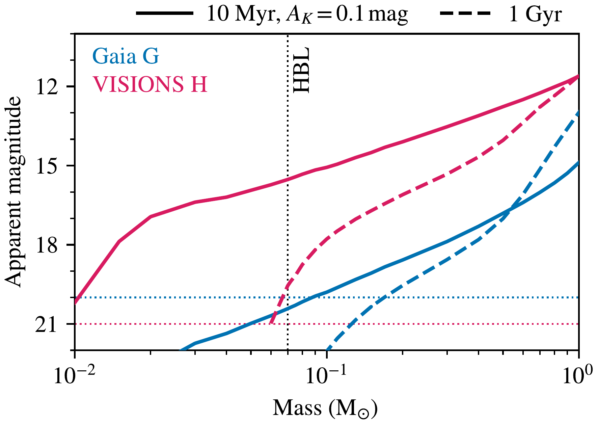
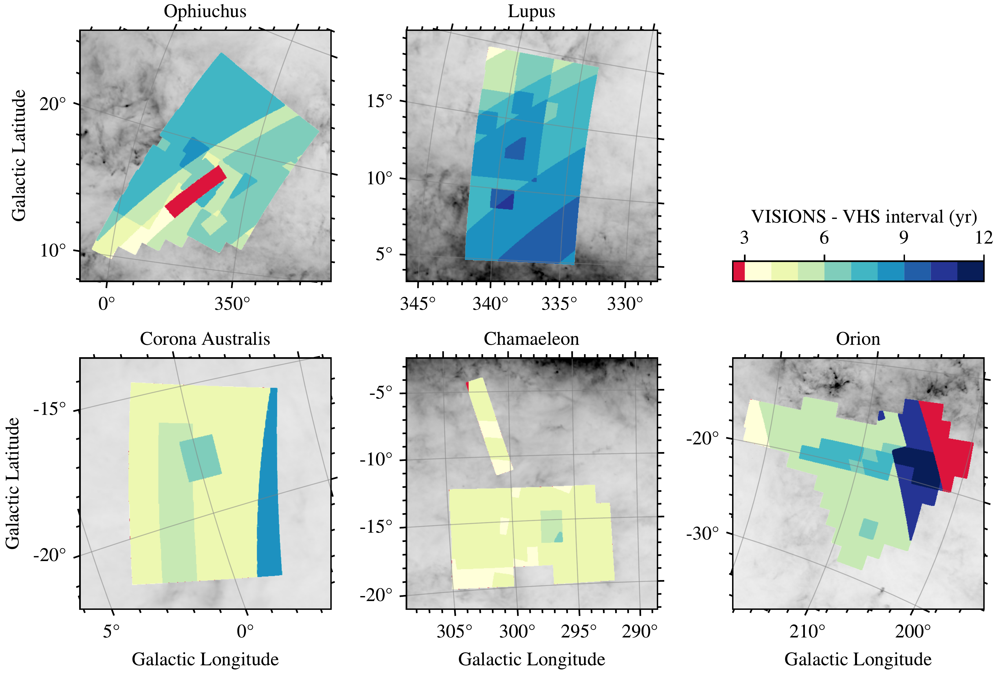
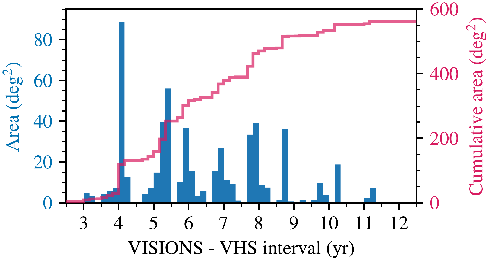

$\newcommand{\ensuremath}{}$
$\newcommand{\xspace}{}$
$\newcommand{\object}[1]{\texttt{#1}}$
$\newcommand{\farcs}{{.}''}$
$\newcommand{\farcm}{{.}'}$
$\newcommand{\arcsec}{''}$
$\newcommand{\arcmin}{'}$
$\newcommand{\ion}[2]{#1#2}$
$\newcommand{\textsc}[1]{\textrm{#1}}$
$\newcommand{\hl}[1]{\textrm{#1}}$
$\newcommand{\footnote}[1]{}$
$\newcommand{\cmark}{\ding{51}}$
$\newcommand{\xmark}{\ding{55}}$

$\newcommand{\ensuremath}{}$
$\newcommand{\xspace}{}$
$\newcommand{\object}[1]{\texttt{#1}}$
$\newcommand{\farcs}{{.}''}$
$\newcommand{\farcm}{{.}'}$
$\newcommand{\arcsec}{''}$
$\newcommand{\arcmin}{'}$
$\newcommand{\ion}[2]{#1#2}$
$\newcommand{\textsc}[1]{\textrm{#1}}$
$\newcommand{\hl}[1]{\textrm{#1}}$
$\newcommand{\footnote}[1]{}$
$\newcommand{\cmark}{\ding{51}}$
$\newcommand{\xmark}{\ding{55}}$

# VISIONS: The VISTA Star Formation Atlas

<mark>Appeared on: 2023-03-17</mark> - _Accepted for publication in Astronomy & Astrophysics on 19 January 2023_

Stefan Meingast, et al. -- incl., <mark><mark>Verena Fürnkranz</mark></mark>, <mark><mark>Anthony G.A. Brown</mark></mark>, <mark><mark>Eleonora Zari</mark></mark>

**Abstract:** VISIONS is an ESO public survey of five nearby ( $d < 500 \si{pc}$ ) star-forming molecular cloud complexes that are canonically associated with the constellations of Chamaeleon, Corona Australis, Lupus, Ophiuchus, and Orion. The survey was carried out with the Visible and Infrared Survey Telescope for Astronomy (VISTA), using the VISTA Infrared Camera (VIRCAM), and collected data in the near-infrared passbands $J$ ( $\SI{1.25}{\micro\metre}$ ), $H$ ( $\SI{1.65}{\micro\metre}$ ), and $K_S$ ( $\SI{2.15}{\micro\metre}$ ). With a total on-sky exposure time of $\SI{49.4}{\hour}$ VISIONS covers an area of $\SI{650}{◦ee\squared}$ , it is designed to build an infrared legacy archive with a structure and content similar to the Two Micron All Sky Survey (2MASS) for the screened star-forming regions. Taking place between April 2017 and March 2022, the observations yielded approximately 1.15 million images, which comprise $\SI{19}{TB}$ of raw data. The observations undertaken within the survey are grouped into three different subsurveys. First, the wide subsurvey comprises shallow, large-scale observations and it has revisited the star-forming complexes six times over the course of its execution. Second, the deep subsurvey of dedicated high-sensitivity observations has collected data on areas with the largest amounts of dust extinction. Third, the control subsurvey includes observations of areas of low-to-negligible dust extinction. Using this strategy, the VISIONS observation program offers multi-epoch position measurements, with the ability to access deeply embedded objects, and it provides a baseline for statistical comparisons and sample completeness -- all at the same time. In particular, VISIONS is designed to measure the proper motions of point sources, with a precision of $\SI{1}{\mas\per\year}$ or better, when complemented with data from the VISTA Hemisphere Survey (VHS). In this way, VISIONS can provide proper motions of complete ensembles of embedded and low-mass objects, including sources inaccessible to the optical ESA $_Gaia_$ mission. VISIONS will enable the community to address a variety of research topics from a more informed perspective, including the 3D distribution and motion of embedded stars and the nearby interstellar medium, the identification and characterization of young stellar objects, the formation and evolution of embedded stellar clusters and their initial mass function, as well as the characteristics of interstellar dust and the reddening law.

**Figure 3. -** Apparent magnitudes in the _Gaia_$G$(blue) and VISIONS $H$(red) passbands as a function of mass for objects at a distance of \SI{400}{pc}. Solid lines represent a case of young stars with an age of \SI{10}{Myr} located in a region with $A_K=0.1 \si{mag}$ foreground extinction. The dashed lines represent field stars at an age of \SI{1}{Gyr} without any foreground extinction. The dotted vertical and horizontal lines mark the hydrogen burning limit (HBL) and the surveys' sensitivity limits, respectively. (*img:bd*)

**Figure 9. -** Maximum available time baseline between VISIONS and VHS observations. Each panel shows a close-up view of the star-forming complexes, as imaged in the wide subsurvey, on top of a _Planck_\SI{857}{\giga\hertz} map. The colorscale shows the time difference between the first VHS observations and the last VISIONS wide field, mapped onto a healpix grid with a pixel size of \SI{47}{arcmin^2}. Time intervals of less than \SI{3}{yr} are indicated in red. A distinct pattern becomes visible, depicting the complex observation strategy of both surveys. (*img:vhs_baseline_sky*)

**Figure 1. -** Distribution of the maximum available time interval between VHS and VISIONS observations, constructed from the healpix grid in Fig. \ref{img:vhs_baseline_sky}. The blue histogram shows the captured area as a function of the available time difference between the surveys. The red line displays the same statistic in cumulative form. As a consequence of the broad, multi-modal range of available time baselines, the accuracy of derived proper motions will vary accordingly. (*img:vhs_baseline_hist*)

