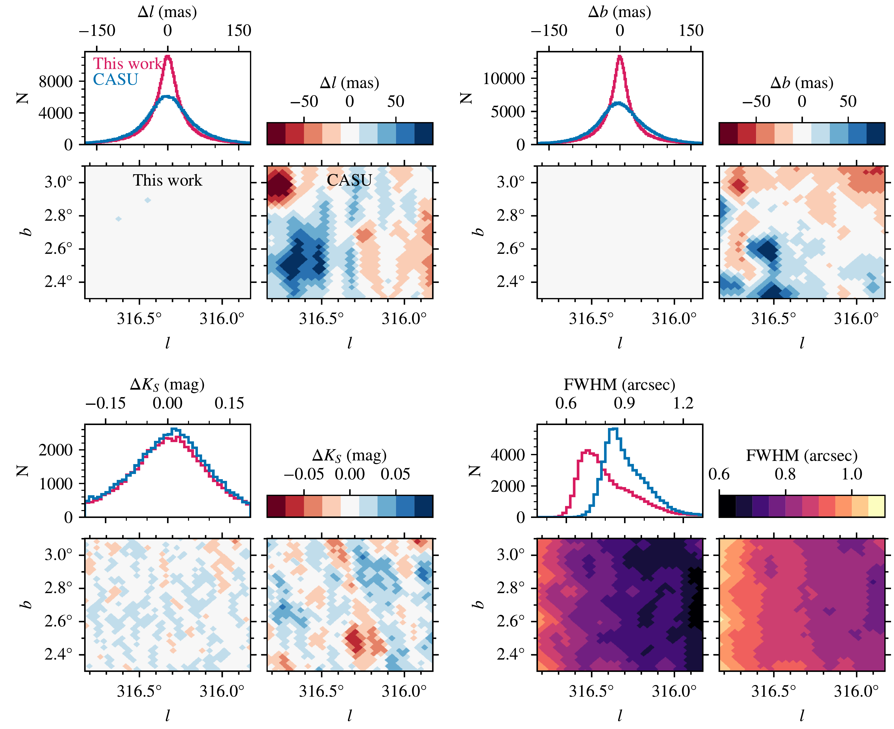
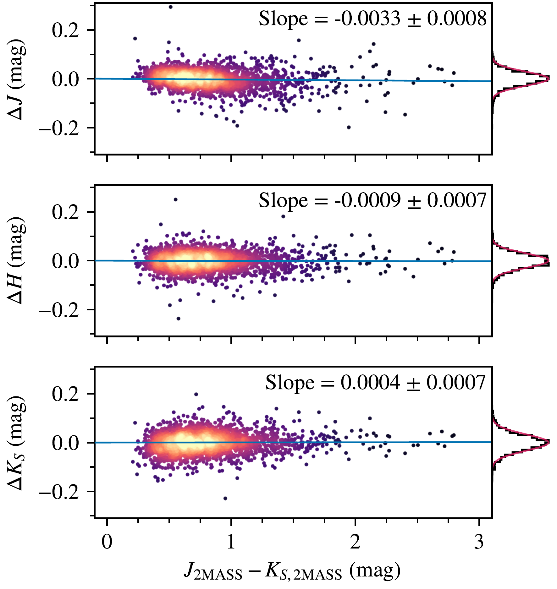
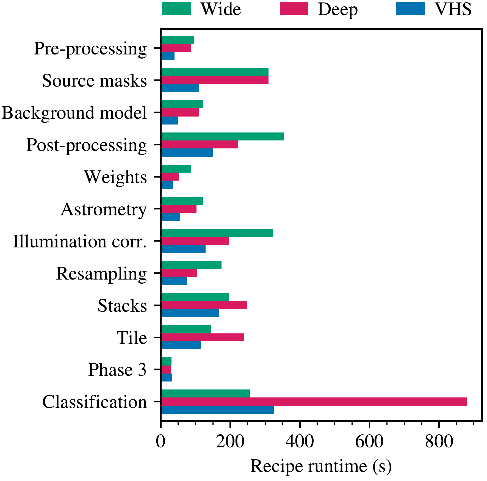

$\newcommand{\ensuremath}{}$
$\newcommand{\xspace}{}$
$\newcommand{\object}[1]{\texttt{#1}}$
$\newcommand{\farcs}{{.}''}$
$\newcommand{\farcm}{{.}'}$
$\newcommand{\arcsec}{''}$
$\newcommand{\arcmin}{'}$
$\newcommand{\ion}[2]{#1#2}$
$\newcommand{\textsc}[1]{\textrm{#1}}$
$\newcommand{\hl}[1]{\textrm{#1}}$
$\newcommand{\footnote}[1]{}$

$\newcommand{\ensuremath}{}$
$\newcommand{\xspace}{}$
$\newcommand{\object}[1]{\texttt{#1}}$
$\newcommand{\farcs}{{.}''}$
$\newcommand{\farcm}{{.}'}$
$\newcommand{\arcsec}{''}$
$\newcommand{\arcmin}{'}$
$\newcommand{\ion}[2]{#1#2}$
$\newcommand{\textsc}[1]{\textrm{#1}}$
$\newcommand{\hl}[1]{\textrm{#1}}$
$\newcommand{\footnote}[1]{}$

# VISIONS: The VISTA Star Formation Atlas

<mark>Appeared on: 2023-03-17</mark> - _Accepted for publication in Astronomy & Astrophysics on 28 February 2023_

Stefan Meingast, et al. -- incl., <mark>Verena Fürnkranz</mark>

**Abstract:** The VISIONS public survey provides large-scale, multi-epoch imaging of five nearby star-forming regions at sub-arcsecond resolution in the near-infrared. All data collected within the program and provided by the European Southern Observatory (ESO) science archive are processed with a custom end-to-end pipeline infrastructure to provide science-ready images and source catalogs. The data reduction environment has been specifically developed for the purpose of mitigating several shortcomings of the bona fide data products processed with software provided by the Cambridge Astronomical Survey Unit (CASU), such as spatially variable astrometric and photometric biases of up to $\SI{100}{mas}$ and $\SI{0.1}{mag}$ , respectively. At the same time, the resolution of co-added images is up to $\SI{20}{\percent}$ higher compared to the same products from the CASU processing environment. Most pipeline modules are written in Python and make extensive use of C extension libraries for numeric computations, thereby simultaneously providing accessibility, robustness, and high performance. The astrometric calibration is performed relative to the $_Gaia_$ reference frame, and fluxes are calibrated with respect to the source magnitudes provided in the Two Micron All Sky Survey (2MASS). For bright sources, absolute astrometric errors are typically on the order of 10 to $\SI{15}{mas}$ and fluxes are determined with sub-percent precision. Moreover, the calibration with respect to 2MASS photometry is largely free of color terms. The pipeline produces data that are compliant with the ESO Phase 3 regulations and furthermore provides curated source catalogs that are structured similarly to those provided by the 2MASS survey.

**Figure 6. -** Performance comparison between the VISIONS pipeline and the CASU infrastructure for a randomly selected tile in the VVV survey. The four distinct groups show histograms and spatial variability in the Galactic frame of coordinates relative to _Gaia_(top panel groups), $K_S$-band photometry compared to 2MASS (bottom left), and the reported image quality parametrized by the stellar FWHM (bottom right). The red and blue histograms show the respective measurement distributions for the VISIONS and CASU pipelines. Concerning the spatial distributions, the panels on the bottom left and right-hand side show the properties derived by the VISIONS and CASU workflows. (*img:vcp_vs_casu*)

**Figure 3. -** Evaluation of residual color terms in the VISIONS photometry. The panels show the difference between VISIONS and 2MASS source magnitudes as a function of their $J-K_S$ color for the $J$(top), $H$(center), and $K_S$(bottom) bands. The blue line indicates a linear fit, with the slope reported in the top right of each panel. The data are projected into a histogram (black) on the right-hand side. The red line on top of the histograms shows a Gaussian determined by the mean measurement errors in the source catalogs. (*img:color_transformation*)

**Figure 5. -** Pipeline performance benchmark for three typical observation blocks in the VISIONS program. The horizontal bars show the recipe runtimes for a set of wide data in green, deep data in red, and a VHS sequence in blue. The processing time depends on the number of observed pawprints and the number of extracted sources. (*img:benchmark*)

