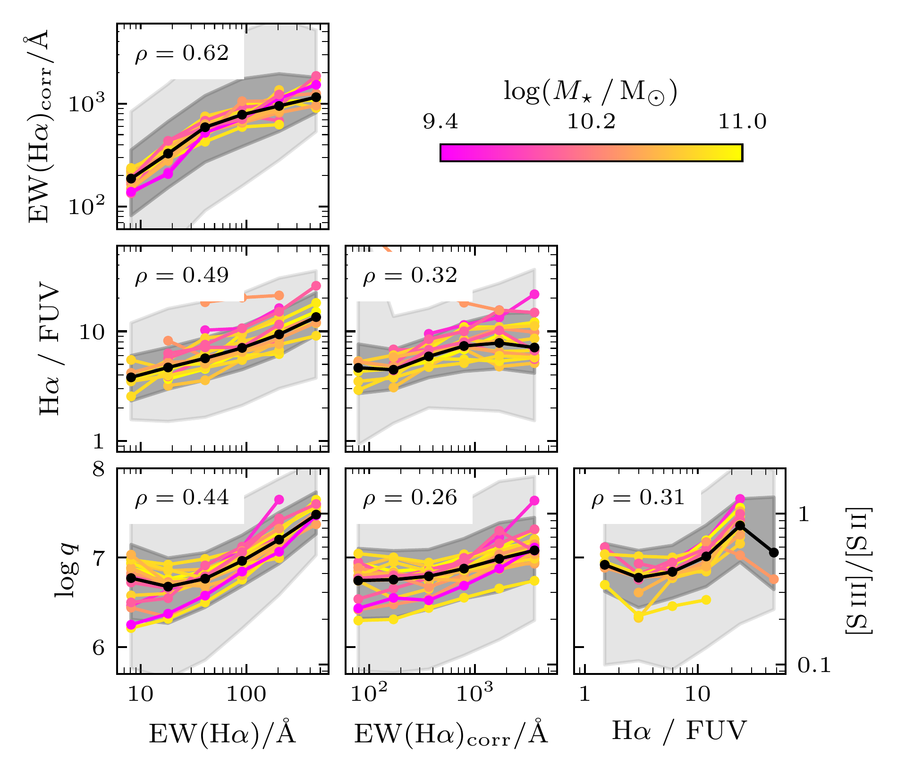
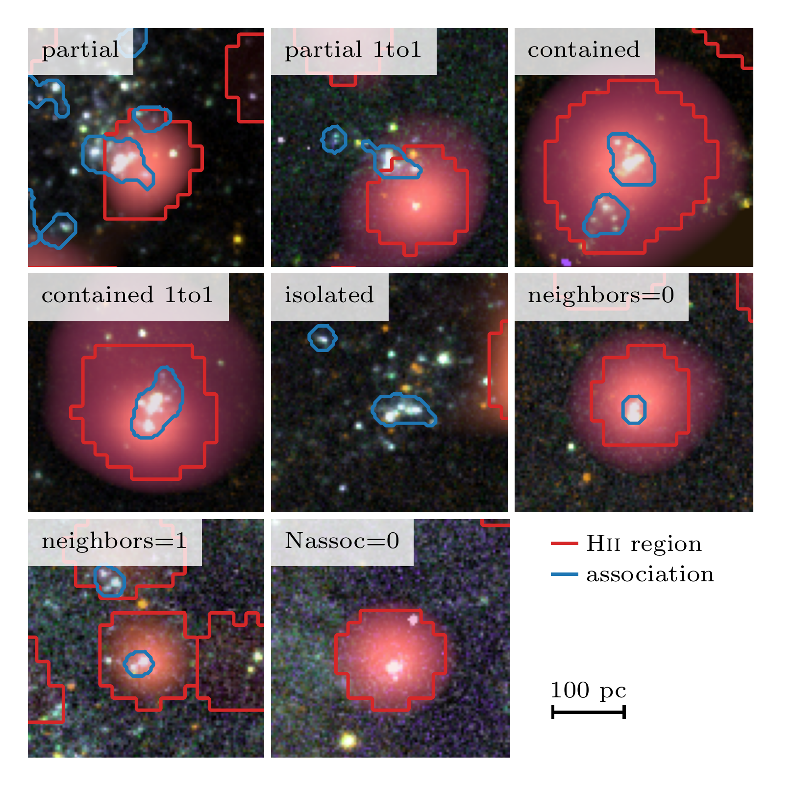
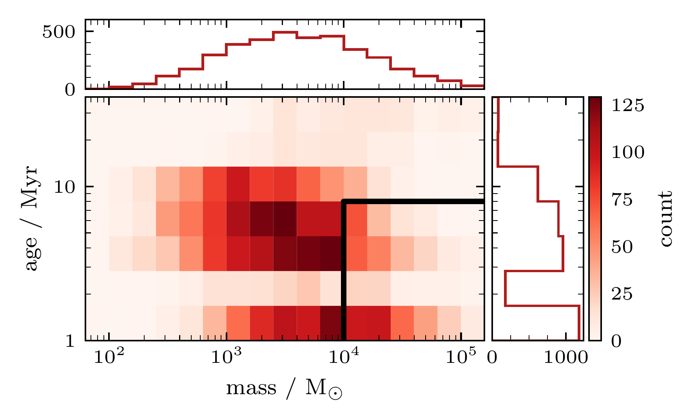

$\newcommand{\ensuremath}{}$
$\newcommand{\xspace}{}$
$\newcommand{\object}[1]{\texttt{#1}}$
$\newcommand{\farcs}{{.}''}$
$\newcommand{\farcm}{{.}'}$
$\newcommand{\arcsec}{''}$
$\newcommand{\arcmin}{'}$
$\newcommand{\ion}[2]{#1#2}$
$\newcommand{\textsc}[1]{\textrm{#1}}$
$\newcommand{\hl}[1]{\textrm{#1}}$
$\newcommand{\footnote}[1]{}$
$\newcommand{\uncertainty}[3]{#1^{+#2}_{-#3}}$
$\newcommand{\StoN}{\mathrm{S}/\mathrm{N}}$
$\newcommand$
$\newcommand$
$\newcommand$
$\newcommand$
$\newcommand$
$\newcommand$
$\newcommand$
$\newcommand$
$\newcommand$
$\newcommand$
$\newcommand$
$\newcommand$
$\newcommand$
$\newcommand$
$\newcommand$
$\newcommand$
$\newcommand$
$\newcommand$
$\newcommand$
$\newcommand$
$\newcommand{\change}[1]{{\color{orange}#1}}$
$\newcommand{\thebibliography}{\DeclareRobustCommand{\VAN}[3]{##3}\VANthebibliography}$

$\newcommand{\ensuremath}{}$
$\newcommand{\xspace}{}$
$\newcommand{\object}[1]{\texttt{#1}}$
$\newcommand{\farcs}{{.}''}$
$\newcommand{\farcm}{{.}'}$
$\newcommand{\arcsec}{''}$
$\newcommand{\arcmin}{'}$
$\newcommand{\ion}[2]{#1#2}$
$\newcommand{\textsc}[1]{\textrm{#1}}$
$\newcommand{\hl}[1]{\textrm{#1}}$
$\newcommand{\footnote}[1]{}$
$\newcommand{\uncertainty}[3]{#1^{+#2}_{-#3}}$
$\newcommand{\StoN}{\mathrm{S}/\mathrm{N}}$
$\newcommand$
$\newcommand$
$\newcommand$
$\newcommand$
$\newcommand$
$\newcommand$
$\newcommand$
$\newcommand$
$\newcommand$
$\newcommand$
$\newcommand$
$\newcommand$
$\newcommand$
$\newcommand$
$\newcommand$
$\newcommand$
$\newcommand$
$\newcommand$
$\newcommand$
$\newcommand$
$\newcommand{\change}[1]{{\color{orange}#1}}$
$\newcommand{\thebibliography}{\DeclareRobustCommand{\VAN}[3]{##3}\VANthebibliography}$

# Stellar associations powering $\HII$ regions -- I. Defining an evolutionary sequence

<mark>Appeared on: 2023-03-23</mark> - _15 pages, 12 figures. Accepted for publication in MNRAS_

F. Scheuermann, et al.

**Abstract:** Connecting the gas in $\HII$ regions to the underlying source of the ionizing radiation can help us constrain the physical processes of stellar feedback and how $\HII$ regions evolve over time.With PHANGS--MUSE we detect nearly $\num{24000}$ $\HII$ regions across 19 galaxies and measure the physical properties of the ionized gas (e.g. metallicity, ionization parameter, density).We use catalogues of multi-scale stellar associations from PHANGS-- $_HST_$ to obtain constraints on the age of the ionizing sources.We construct a matched catalogue of $\num{4177}$ $\HII$ regions that are clearly linked to a single ionizing association.A weak anti-correlation is observed between the association ages and the $\HA$ equivalent width $\EW$ , the $\HA/\FUV$ flux ratio and the ionization parameter, $\log q$ .As all three are expected to decrease as the stellar population ages, this could indicate that we observe an evolutionary sequence.This interpretation is further supported by correlations between all three properties.Interpreting these as evolutionary tracers, we find younger nebulae to be more attenuated by dust and closer to giant molecular clouds, in line with recent models of feedback-regulated star formation.We also observe strong correlations with the local metallicity variations and all three proposed age tracers, suggestive of star formation preferentially occurring in locations of locally enhanced metallicity.Overall, $\EW$ and $\log q$ show the most consistent trends and appear to be most reliable tracers for the age of an $\HII$ region.

**Figure 6. -** Comparison between the proposed age tracers for the full \HII region catalogue. The nebulae are grouped by their host galaxy, sorted by stellar mass $M_{\star}$, with the median of the entire sample indicated by a black line. The 68 and 98 percentile ranges are shaded in grey. (*fig:age_tracers_corner*)

**Figure 1. -** Examples for the overlap between the \HII regions and stellar associations in \galaxyname{NGC}{1365}. The cutouts show a three colour composite images, based on the 5 available _HST_ bands, overlaid with the $\HA$ line emission of MUSE in red. The boundaries of the \HII regions are shown in red and the stellar associations in blue. Flags that characterise the overlap between the two catalogues are showcased in this figure. (*fig:overlap*)

**Figure 2. -** Distribution of masses and ages of the stellar associations in the matched catalogue (the \texttt{one-to-one} sample). The black lines mark the cuts that we apply to the sample to ensure a fully sampled IMF (more massive than $>\SI{e4}{\Msun}$) and to only include young clusters that should be associated with ionized gas (younger than $\leq\SI{8}{\mega\year}$). The mass cut leaves us with a sample of \num{1014} objects and the age cut with \num{3531}. Applying both cuts results in a sample of \num{756} objects. (*fig:catalogue_properties_2D_hist_v2*)

