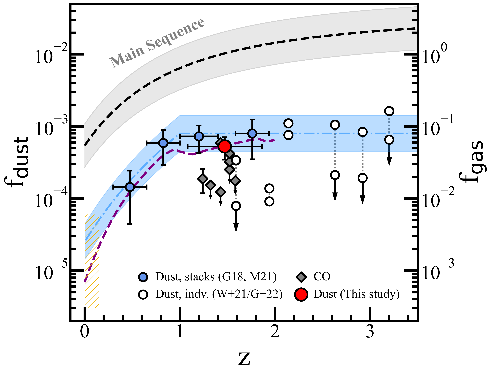
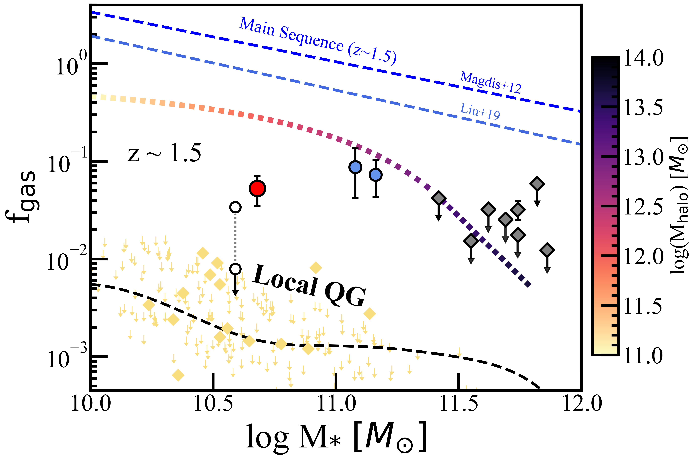
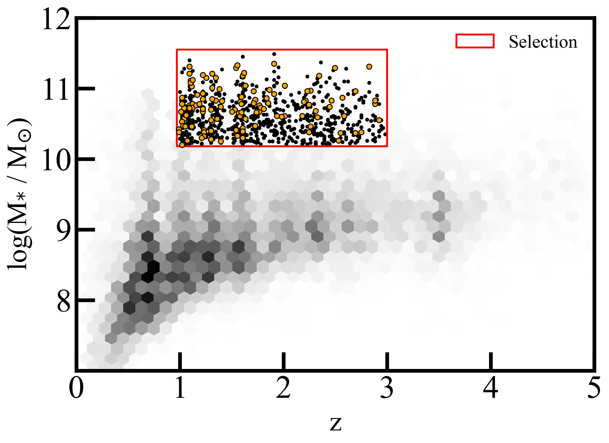
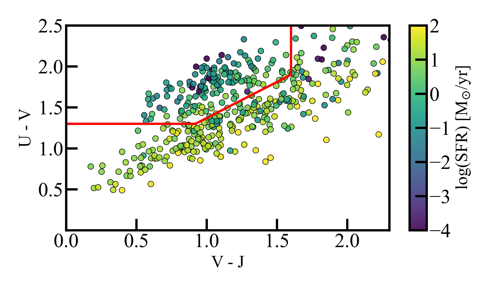

$\newcommand{\ensuremath}{}$
$\newcommand{\xspace}{}$
$\newcommand{\object}[1]{\texttt{#1}}$
$\newcommand{\farcs}{{.}''}$
$\newcommand{\farcm}{{.}'}$
$\newcommand{\arcsec}{''}$
$\newcommand{\arcmin}{'}$
$\newcommand{\ion}[2]{#1#2}$
$\newcommand{\textsc}[1]{\textrm{#1}}$
$\newcommand{\hl}[1]{\textrm{#1}}$
$\newcommand{\footnote}[1]{}$
$\newcommand{\Mgas}{M_{\rm gas}}$
$\newcommand{\Mdust}{M_{\rm dust}}$
$\newcommand{\Mstar}{M_{\rm \ast}}$
$\newcommand{\Msol}{\rm M_{\rm \odot}}$
$\newcommand{\fgas}{f_{\rm gas}}$
$\newcommand{\fdust}{f_{\rm dust}}$
$\newcommand{\Gobat}{{\color{blue} G18}}$
$\newcommand{\Magdis}{{\color{blue} M21}}$

$\newcommand{\ensuremath}{}$
$\newcommand{\xspace}{}$
$\newcommand{\object}[1]{\texttt{#1}}$
$\newcommand{\farcs}{{.}''}$
$\newcommand{\farcm}{{.}'}$
$\newcommand{\arcsec}{''}$
$\newcommand{\arcmin}{'}$
$\newcommand{\ion}[2]{#1#2}$
$\newcommand{\textsc}[1]{\textrm{#1}}$
$\newcommand{\hl}[1]{\textrm{#1}}$
$\newcommand{\footnote}[1]{}$
$\newcommand{\Mgas}{M_{\rm gas}}$
$\newcommand{\Mdust}{M_{\rm dust}}$
$\newcommand{\Mstar}{M_{\rm \ast}}$
$\newcommand{\Msol}{\rm M_{\rm \odot}}$
$\newcommand{\fgas}{f_{\rm gas}}$
$\newcommand{\fdust}{f_{\rm dust}}$
$\newcommand{\Gobat}{{\color{blue} G18}}$
$\newcommand{\Magdis}{{\color{blue} M21}}$

# The gas mass reservoir of quiescent galaxies at cosmic noon

<mark>Appeared on: 2023-03-23</mark> - _Accepted to A&A on the 16/03/2023_

D. Blánquez-Sesé, et al. -- incl., <mark>E. Schinnerer</mark>

**Abstract:** We present a 1.1mm stacking analysis of moderately massive (log( $\Mstar$ / $\Msol$ ) = 10.7 $\pm$ 0.2) quiescent galaxies (QGs) at $\langle z\rangle \sim1.5$ , searching for cold dust continuum emission, an excellent tracer of dust and gas mass. Using both the recent GOODS-ALMA survey as well as the full suite of ALMA Band-6 ancillary data in the GOODS-S field, we report the tentative detection of dust continuum equivalent of   dust mass log( $\Mdust$ / $\Msol$ ) = 7.47 $\pm$ 0.13 and gas mass log( $\Mgas$ / $\Msol$ ) = 9.42 $\pm$ 0.14. The emerging gas fraction is $\fgas$ = 5.3 $\pm$ 1.8 \% , consistent with the results of previous stacking analyses based on lower resolution sub(mm) observations. Our results support the scenario where high $-z$ QGs have an order of magnitude larger $\fgas$ compared to their local counterparts and have experienced quenching with a non negligible gas reservoir in their interstellar medium - i.e. with gas retention. Subsequent analysis yields an anti-correlation between the $\fgas$ and the stellar mass of QGs, especially in the high mass end where galaxies reside in the most massive haloes. The $\fgas$ - $\Mstar$ anti-correlation promotes the selection bias as a possible solution to the tension between the stacking results pointing towards gas retention in high $-z$ QGs of moderate $\Mstar$ and the studies of individual targets that favour a fully depleted ISM in massive (log( $\Mstar$ / $\Msol$ ) > 11.2) high $-z$ QGs.

**Figure 6. -** **Gas and dust fractions of QGs**_Top_: Selection of $\fdust$ and $\fgas$ measurements as a function of  redshift for QGs. Circles correspond to dust derived gas fractions: this work and  previous stacks studies ($\Gobat$ and $\Magdis$) are shown in red and blue, respectively. The white circles show two different estimates (connected by a grey dotted line) for a sample of individually observed lensed galaxies. The lower values correspond to those presented in  ([Whitaker, Williams and Mowla (2021)]())  and the upper values show the new estimates provided in  ([Gobat and Liu (2022)]()) . The grey diamonds represent CO derived $\fgas$ estimates  ([Sargent, Daddi and Bournaud 2015](), [Bezanson, Spilker and Williams 2019](), [Williams, Spilker and Whitaker 2021]()) . The red dashed area embeds $\fgas$ measurements of local QGs obtained for the ATLAS3D sample  ([Young, Bureau and Davis 2011](), [Cappellari, McDermid and Alatalo 2013](), [Davis, Young and Crocker 2014]()) . The blue shaded area and the purple dashed line represent the best fit to the $\Magdis$ data and the  ([Gobat, Magdis and Valentino (2020)]())  model respectively. For reference, we add the $\fgas$ evolution of main sequence galaxies according to  ([Liu, Lang and Magnelli (2019)]()) . _Bottom_: Dust and gas fraction as a function of stellar mass for measurements at $z \sim 1.5$. The symbols are the same as in the top panel. The dotted line shows the $\fgas$ prediction according to the  ([Davé, Finlator and Oppenheimer (2012)]())  galaxy evolution models, color coded as a function of $M_{\mathrm{halo}}$. For reference, we add the $\fgas$ - $\Mstar$ trend measured by  ([Magdis, Daddi and Béthermin (2012)](), [Liu, Lang and Magnelli (2019)]()) . The light yellow scattered diamonds and arrows mark the $\fgas$ detections and upper limits for local QGs with the corresponding best fit plotted as a black dashed line. (*fig:f_gas_plot*)

**Figure 1. -** **Galaxy selection.** Density plot of the used ZFOURGE catalogue in the redshift vs stellar mass plane, consisting of a total 13299 galaxies. The red shaded area represents the region covered by our redshift and stellar mass selection criteria ($1 < z < 3$ and 10.20 $<$ log($\Mstar$/$\Msol$) $<$ 11.50) embedding 852 sources. The orange circles correspond to the QGs that constitute our final selection.  (*fig:galaxy_selection*)

**Figure 2. -** **UVJ colour diagram.** Distribution of the parent sample of 435 galaxies that meet our selection criteria in the $U-V$, $V-J$ colour-colour space, colour coded by their log(SFR). The red box represents the quiescent region limits defined in  ([Schreiber, Pannella and Elbaz (2015)]()) , which enclose the 140 QGs from which we draw our final sample. (*fig:UVJ_diagram*)

