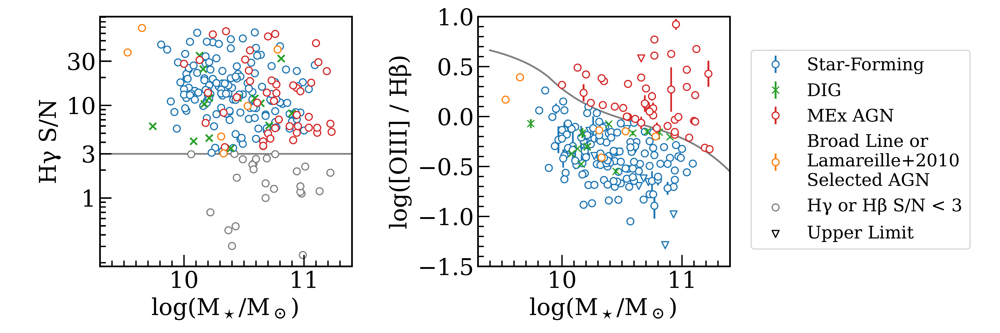
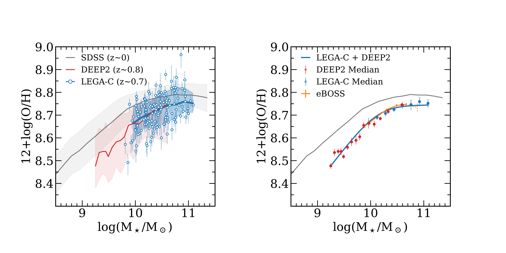
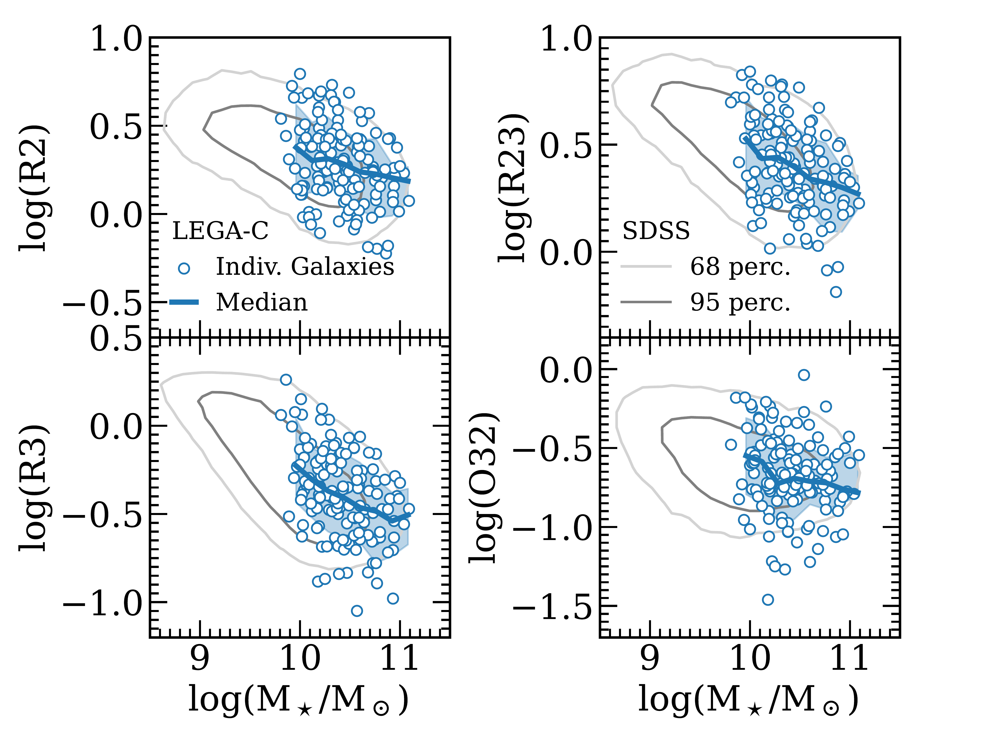

$\newcommand{\ensuremath}{}$
$\newcommand{\xspace}{}$
$\newcommand{\object}[1]{\texttt{#1}}$
$\newcommand{\farcs}{{.}''}$
$\newcommand{\farcm}{{.}'}$
$\newcommand{\arcsec}{''}$
$\newcommand{\arcmin}{'}$
$\newcommand{\ion}[2]{#1#2}$
$\newcommand{\textsc}[1]{\textrm{#1}}$
$\newcommand{\hl}[1]{\textrm{#1}}$
$\newcommand{\footnote}[1]{}$
$\newcommand{\todo}[1]{\color{red}#1\color{black}}$
$\newcommand{\drafttext}[1]{\color{gray}#1\color{black}}$
$\newcommand{\bha}[1]{\color{blue}#1\color{black}}$
$\newcommand{\oii}{[O \textsc{ii}]\lambda3727}$
$\newcommand{\neiii}{[Ne III]\lambda3869}$
$\newcommand{\oiii}{[O \textsc{iii}]\lambda5007}$
$\newcommand{\nii}{[N \textsc{ii}]\lambda6583}$
$\newcommand{\hb}{H\beta}$
$\newcommand{\hg}{H\gamma}$
$\newcommand{\ha}{H\alpha}$
$\newcommand{\mstar}{M_\star}$
$\newcommand{\msun}{M_\odot}$
$\newcommand{\numgal}{145 }$
$\newcommand{\oiiialt}{\ensuremath{{\text{[O \textsc{iii}]}\lambda5007}}\xspace}$

# The Gas-Phase Mass--Metallicity Relation for Massive Galaxies at $z\sim0.7$ with the LEGA-C Survey

<mark>Appeared on: 2023-04-26</mark> -  _10 pages, 4 figures, 1 table_

<mark>Z. J. Lewis</mark>, et al.

**Abstract:** The massive end of the gas-phase mass--metallicity relation (MZR) is a sensitive probe of active galactic nuclei (AGN) feedback that is a crucial but highly uncertain component of galaxy evolution models. In this paper, we extend the $z\sim0.7$ MZR by $\sim$ 0.5 dex up to log $(M_\star/\textrm{M}_\odot)\sim11.1$ . We use extremely deep VLT VIMOS spectra from the Large Early Galaxy Astrophysics Census (LEGA-C) survey to measure metallicities for $\numgal$ galaxies. The LEGA-C MZR matches the normalization of the $z\sim0.8$ DEEP2 MZR where they overlap, so we combine the two to create an MZR spanning from 9.3 to 11.1 log $(M_\star/\textrm{M}_\odot)$ . The LEGA-C+DEEP2 MZR at $z\sim0.7$ is offset to slightly lower metallicities (0.05--0.13 dex) than the $z\sim0$ MZR, but it otherwise mirrors the established power law rise at low/intermediate stellar masses and asymptotic flattening at high stellar masses. We compare the LEGA-C+DEEP2 MZR to the MZR from two cosmological simulations (IllustrisTNG and SIMBA), which predict qualitatively different metallicity trends for high-mass galaxies. This comparison highlights that our extended MZR provides a crucial observational constraint for galaxy evolution models in a mass regime where the MZR is very sensitive to choices about the implementation of AGN feedback.

**Figure 3. -** Left panel: $\hg$ S/N for non-quiescent LEGA-C objects as a function of stellar mass. Gray points are those with S/N $<$ 3, which are excluded from the sample. The remaining points follow the same color scheme as the right panel, described below. We do not find a trend of $\hg$ S/N with stellar mass. Only a small fraction of these objects have $\hg$ S/N $<$ 3, which is required for dereddening. Right panel: The same sample on the mass--excitation (MEx) plot of \citet{juneau2011}, which plots R3 against stellar mass and separates star-forming galaxies and AGN based on their line ratios. The red points show objects that are determined to be MEx AGN by the cut of \citet{juneau2011}. Orange points show objects determined to be other forms of AGN, such as broad-line, radio, IR, and through the "blue diagram" of \citet{lamareille2009}. Green crosses show objects with line fluxes dominated by DIG, and blue points show star-forming objects with line fluxes dominated by HII regions. (*fig:selection*)

**Figure 4. -** Left: The LEGA-C mass--metallicity relation with individual measurements shown as blue circles with error bars indicating the inner 68 percentile highest probability density interval; the median and the 16--84th percentile range are shown as a blue line and band, respectively. The $z\sim0$ SDSS MZR \citep{curti20} is shown in gray for comparison. The LEGA-C MZR shows a $-$0.05 dex offset from the SDSS MZR at the high mass end, and a $-$0.07 dex offset at the low mass end. The $z\sim0.8$ DEEP2 MZR \citep{zahid2011}(red line with red error band showing the 16--84th percentile region) agrees well with the LEGA-C MZR where they overlap in mass. Right: the LEGA-C and DEEP2 running median MZRs are shown as blue and red circles with error bars indicating the uncertainty on the median. The combined LEGA-C+DEEP2 MZR is shown as a blue line. The \citet{huang2019} MZR from stacks of eBOSS galaxies (orange) at $z\sim0.7$ is shown in orange with the most massive stellar mass bin indicated with a dotted line due to its low S/N (as noted by \citealt{huang2019}).  Overall, the eBOSS MZR agrees well with the LEGA-C+DEEP2 MZR where they overlap. (*fig:mzr*)

**Figure 1. -** R2, R3, R23, and O32 versus stellar mass for the LEGA-C sample (blue circles with the running median and 16--84th percentiles as blue lines and bands, respectively) and SDSS (gray contours) samples. There is a slight offset in the LEGA-C data to higher line ratios for R2, R3, and R23, but not for O32.  We note that the median line ratio uncertainties are smaller than the symbol size if reddening uncertainties are not included. Note the smooth trend in line ratios and the lack of sharp features at log($M_\star/\textrm{M}_\odot) > 10.5$ that would be expected if AGN feedback dramatically alters the gas-phase metallicity at high mass. (*fig:line_ratios*)

