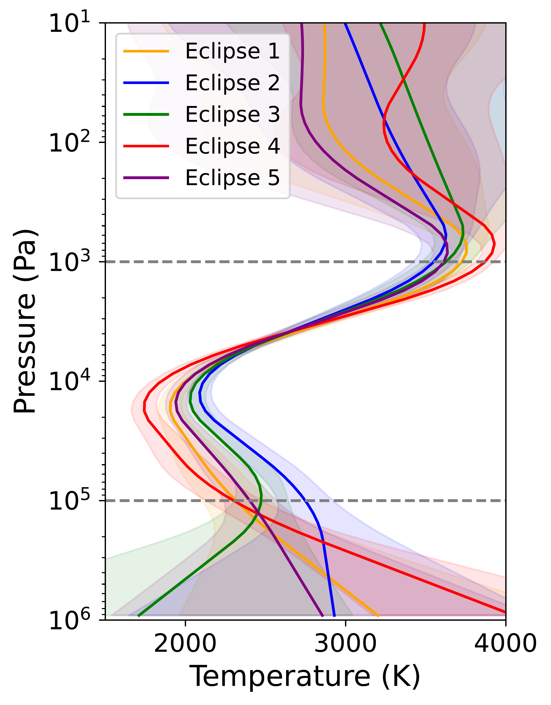
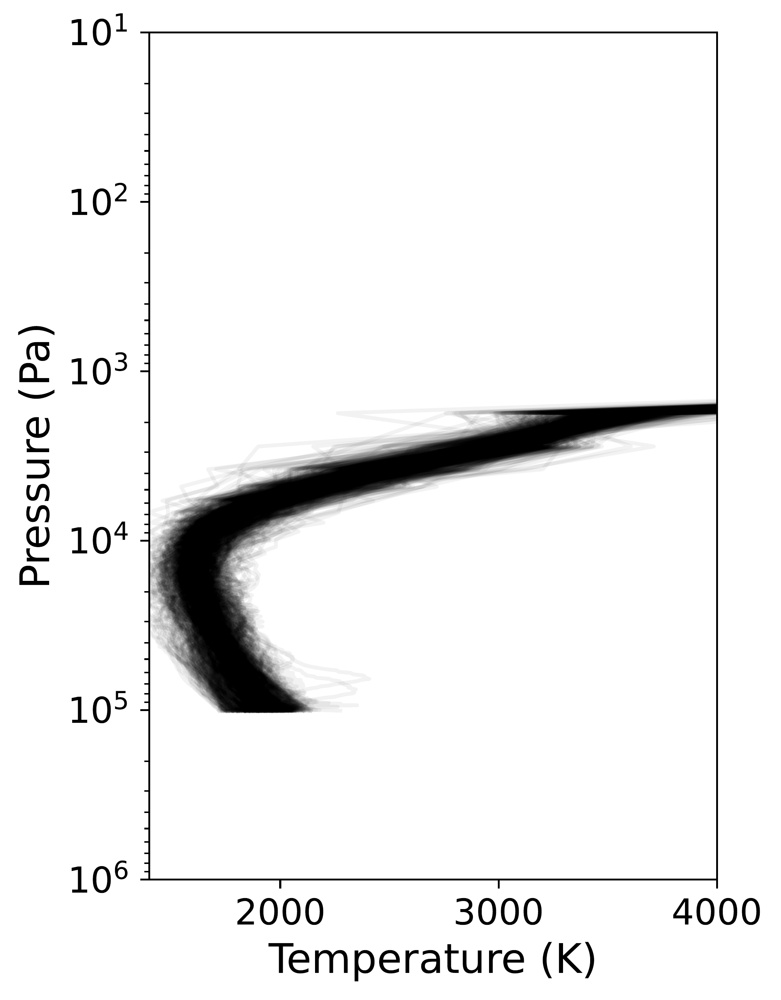
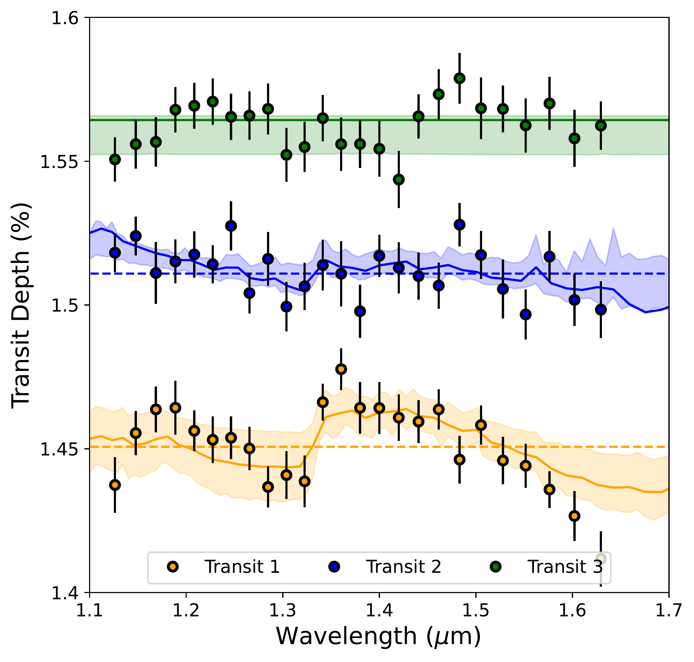
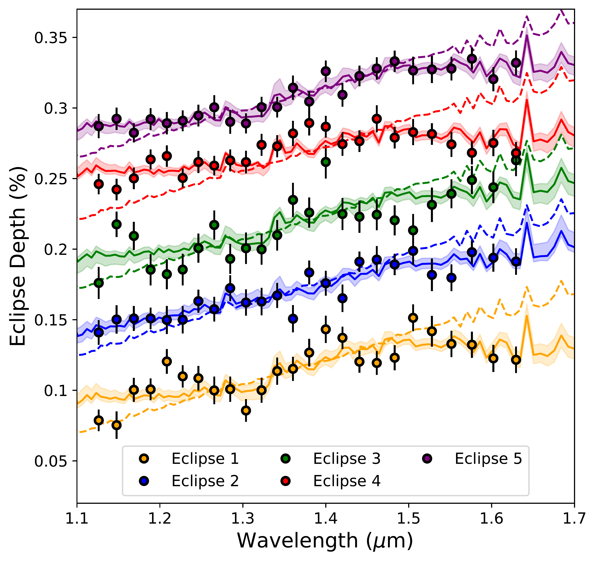

$\newcommand{\ensuremath}{}$
$\newcommand{\xspace}{}$
$\newcommand{\object}[1]{\texttt{#1}}$
$\newcommand{\farcs}{{.}''}$
$\newcommand{\farcm}{{.}'}$
$\newcommand{\arcsec}{''}$
$\newcommand{\arcmin}{'}$
$\newcommand{\ion}[2]{#1#2}$
$\newcommand{\textsc}[1]{\textrm{#1}}$
$\newcommand{\hl}[1]{\textrm{#1}}$
$\newcommand{\footnote}[1]{}$
$\newcommand{\ipwtodo}{\todo[author=IPW,inline,size=\footnotesize,color=blue!30!white]}$
$\newcommand{\gttodo}{\todo[author=GT,inline,size=\footnotesize,color=green!30!white]}$
$\newcommand{\betodo}{\todo[author=BE,inline,size=\footnotesize,color=yellow!30!white]}$
$\newcommand{\qctodo}{\todo[author=QC,inline,size=\footnotesize,color=red!30!white]}$
$\newcommand{\hi}[1]{\textcolor{cyan}{#1}}$
$\newcommand{\rem}[1]{\textcolor{red}{[#1]}}$
$\newcommand{\remQ}[1]{\textcolor{purple}{[#1]}}$
$\newcommand{\thefootnote}{\fnsymbol{footnote}}$
$\newcommand{\thefootnote}{\arabic{footnote}}$
$\newcommand$
$\newcommand$
$\newcommand{\thefigure}{A\arabic{figure}}$
$\newcommand{\theHfigure}{A\arabic{figure}}$
$\newcommand{\floatpagefraction}{.99}$
$\newcommand{\thefigure}{B\arabic{figure}}$
$\newcommand{\theHfigure}{B\arabic{figure}}$
$\newcommand{\thefigure}{D\arabic{figure}}$
$\newcommand{\theHfigure}{D\arabic{figure}}$
$\newcommand{\thefigure}{E\arabic{figure}}$
$\newcommand{\theHfigure}{E\arabic{figure}}$

# Is the atmosphere of the ultra-hot Jupiter WASP-121 b variable?

<mark>Appeared on: 2024-01-04</mark> -  _Accepted for publication in ApJS. 43 pages, 31 figures, 2 animations (available online at the journal)_

Q. C. $^\dagger$, et al. -- incl., <mark>T. Mikal-Evans</mark>

**Abstract:** We present a comprehensive analysis of the Hubble Space Telescopeobservations of the atmosphere of WASP-121 b, a ultra-hot Jupiter.After reducing the transit, eclipse, and phase-curve observationswith a uniform methodology and addressing the biases frominstrument systematics, sophisticated atmospheric retrievals areused to extract robust constraints on the thermal structure,chemistry, and cloud properties of the atmosphere.Our analysis shows that the observations are consistent with astrong thermal inversion beginning at $\sim10^4$ Pa on thedayside, solar to subsolar metallicity $Z$ (i.e., $-0.77 < \log(Z) < 0.05$ ), and super-solar C/O ratio(i.e., $0.59 < \textrm{C/O} < 0.87$ ).More importantly, utilizing the high signal-to-noise ratio andrepeated observations of the planet, we identify the followingunambiguous time-varying signals in the data: $_ i_$ ) a shift ofthe putative $_ hotspot_$ offset between the two phase-curves and $_ ii_$ ) varying spectral signatures in the transits and eclipses.By simulating the global dynamics of WASP-121 batmosphere at high-resolution, we show that the identified signalsare consistent with quasi-periodic weather patterns, henceatmospheric variability, with signatures at the level probed bythe observations ( $\sim$ 5 \% to $\sim$ 10 \% ) that change on atimescale of $\sim$ 5 planet days; in the simulations, theweather patterns arise from the formation and movement of stormsand fronts, causing hot (as well as cold) patches of atmosphereto deform, separate, and mix in time.

**Figure 16. -** Recovered temperature--pressure ($T$--$p$) profiles
    (left) and best-fit spectra (right) for the phases from 0.05
    (blue) to 0.5 (red), obtained from the phase-curve
    atmospheric retrieval.
    In the $T$--$p$ plot, the shaded regions correspond to one
    and three sigma confidence regions (dark to light,
    respectively).
    The  radiative contribution function is also shown in
    dashed line, colored for each region: hotspot (red),
    dayside (orange), and nightside (blue).
    These retrievals show good agreement with the observed data
    and demonstrate a strong dayside thermal inversion, with
    the presence of a hotter region (e.g. hotspot).
    The best-fit $T-p$ profiles (solid lines, left) are used
    to thermally force the atmospheric dynamics simulations.
    This figure is accompanied by a 15 s video, available online at the journal, showing the evolution of WASP-121 b emission (from blue to red) and the corresponding thermal structure as a function of phase. As the planet moves from transit to eclipse, absorption features in the data are replaced by emission features. These spectral variations enable the characterization of the thermal structure and chemistry across WASP-121 b's atmosphere. (*fig:spectra_tp_retrieval*)

**Figure 19. -** One-dimensional (1D) thermal structure recovered by
    our retrieval analysis of the five eclipse observations with
    one sigma confidence region (left), and $T$--$p$ profiles
    from multiple times ($t \in[40, 185]$ days) at the substellar
    point from a three-dimensional (3D) atmospheric dynamics
    simulation (right).
    The magnitude of variability in $p \in[10^5, 10^3]$ Pa is
    $\sim$300 K, which is consistent with the variation predicted
    by the 3D simulation.
    Dashed gray lines show the vertical extent of the atmosphere
    modeled by the simulations in this study.
    Note, while these profiles are not like-for-like comparable
    because the retrieved thermal structure is global and
    substellar temperature predictions are local.  (*fig:tp1d*)

**Figure 10. -** 
    Transit (left) and eclipse (right) spectra of WASP-121 b analyzed
    in this work. Different observations are offset in the $y$-axis.
    Best-fit models from the 1D retrievals are shown in solid lines.
    Dashed lines show featureless models for visual comparison. (*fig:spectra_ec_tr*)

