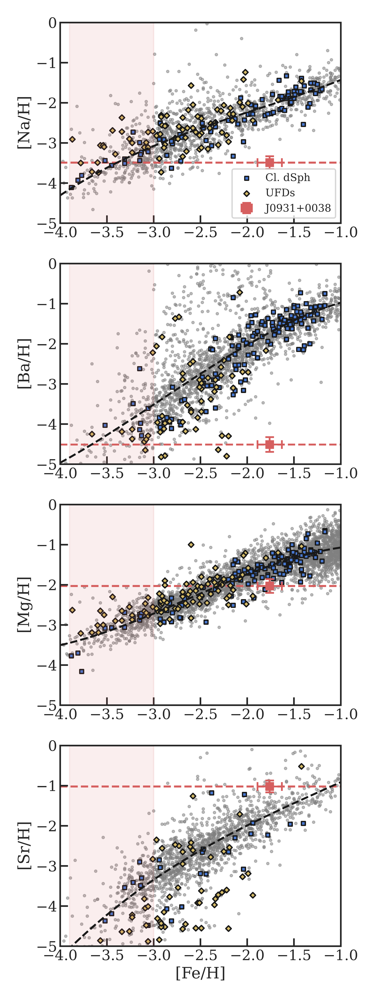
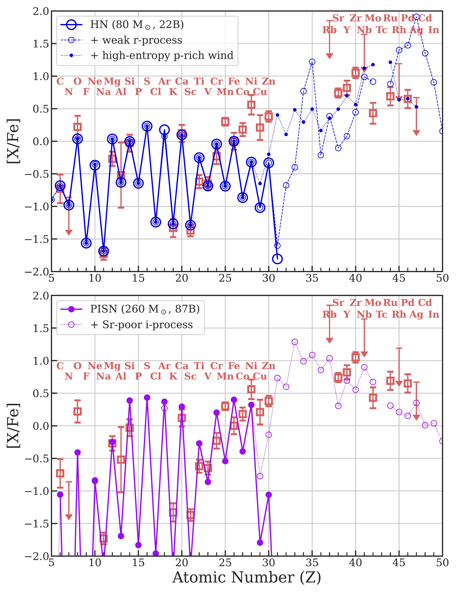

$\newcommand{\ensuremath}{}$
$\newcommand{\xspace}{}$
$\newcommand{\object}[1]{\texttt{#1}}$
$\newcommand{\farcs}{{.}''}$
$\newcommand{\farcm}{{.}'}$
$\newcommand{\arcsec}{''}$
$\newcommand{\arcmin}{'}$
$\newcommand{\ion}[2]{#1#2}$
$\newcommand{\textsc}[1]{\textrm{#1}}$
$\newcommand{\hl}[1]{\textrm{#1}}$
$\newcommand{\footnote}[1]{}$
$\newcommand{\url}[1]{\href{#1}{#1}}$
$\newcommand{\dodoi}[1]{doi:~\href{http://doi.org/#1}{\nolinkurl{#1}}}$
$\newcommand{\doeprint}[1]{\href{http://ascl.net/#1}{\nolinkurl{http://ascl.net/#1}}}$
$\newcommand{\doarXiv}[1]{\href{https://arxiv.org/abs/#1}{\nolinkurl{https://arxiv.org/abs/#1}}}$
$\newcommand{\vdag}{(v)^\dagger}$
$\newcommand$
$\newcommand$
$\newcommand{\TheStar}{J0931+0038\xspace}$
$\newcommand{\GaiaID}{\gaia DR3 3841101888330639872}$
$\newcommand{\code}[1]{\texttt{#1}\xspace}$
$\newcommand{\APJ}[1]{\textcolor{orange}{[AJ: #1]}}$
$\newcommand{\gaia}{\textit{Gaia}\xspace}$
$\newcommand{\Gaia}{\gaia}$
$\newcommand{\unit}[1]{\ensuremath{\mathrm{ #1}}\xspace}$
$\newcommand{\feh}{\unit{[Fe/H]}}$
$\newcommand{\teff}{\ensuremath{T_\mathrm{eff}}\xspace}$
$\newcommand{\logg}{\ensuremath{\log g}\xspace}$
$\newcommand{\alphafe}{\unit{[\alpha/Fe]}}$
$\newcommand{\vhel}{\mbox{v_{\mathrm{hel}}}}$
$\newcommand{\sigmav}{\mbox{{\sigma_v}}}$
$\newcommand{\sigmafeh}{\mbox{\sigma_{\mathrm{[Fe/H]}}}}$
$\newcommand{\kms}{\unit{km s^{-1}}}$
$\newcommand{\masyr}{\unit{mas yr^{-1}}}$
$\newcommand{\msun}{\unit{M_\odot}}$
$\newcommand{\lsun}{\unit{L_\odot}}$
$\newcommand{\sanj}[1]{\textsf{\color{cyan}{#1}}}$
$\newcommand{\mb}[1]{\textsf{\color{brown}{#1}}}$
$\newcommand{\minesweeper}{\texttt{MINESweeper}\xspace}$
$\newcommand{\cmark}{\ding{51}}$
$\newcommand{\xmark}{\ding{55}}$
$\newcommand{\cxmark}{\textsf{\textcolor{red}{\xmark}}\xspace}$
$\newcommand{çmark}{\textsf{\textcolor{OliveGreen}{\cmark}}\xspace}$
$\newcommand{\cxmarkq}{\textsf{\textcolor{Dandelion}{\xmark?}}\xspace}$
$\newcommand{çmarkq}{\textsf{\textcolor{YellowGreen}{\cmark?}}\xspace}$
$\newcommand{\}{natexlab}$

# Spectacular nucleosynthesis from early massive stars

<mark>Appeared on: 2024-01-08</mark> -  _11 pages + 22 page appendix, accepted to ApJL_

Alexander~P.~Ji, et al.

**Abstract:** Stars formed with initial mass over 50 $M_\odot$ are very rare today, but they are thought to be more common in the early universe.The fates of those early, metal-poor, massive stars are highly uncertain. Most are expected to directly collapse to black holes, while some may explode as a result of rotationally powered engines or the pair-creation instability.We present the chemical abundances of J0931+0038, a nearby low-mass star identified in early followup of SDSS-V Milky Way Mapper, which preserves the signature of unusual nucleosynthesis from a massive star in the early universe.J0931+0038 has relatively high metallicity ( [ Fe/H ] $= -1.76 \pm 0.13$ ) but an extreme odd--even abundance pattern, with some of the lowest known abundance ratios of [ N/Fe ] , [ Na/Fe ] , [ K/Fe ] , [ Sc/Fe ] , and [ Ba/Fe ] .The implication is that a majority of its metals originated in a single extremely metal-poor nucleosynthetic source.An extensive search through nucleosynthesis predictions finds a clear preference for progenitors with initial mass $> 50 M_\odot$ , making J0931+0038 one of the first observational constraints on nucleosynthesis in this mass range. However the full abundance pattern is not matched by any models in the literature.J0931+0038 thus presents a challenge for the next generation of nucleosynthesis models and motivates study of high-mass progenitor stars impacted by convection, rotation, jets, and/or binary companions.Though rare, more examples of unusual early nucleosynthesis in metal-poor stars should be found in upcoming large spectroscopic surveys.

**Figure 13. -** 
    Initial mass vs maximum [Fe/H], [C/O], [Na/Mg], [Mg/Fe], and [Zn/Fe]
    for zero-metallicity supernovae from five yield grids:
    CCSN from \citealt{Heger10}(HW10, fiducial mixing, $E = 0.3-2.4$B in steps of 2x); HN from \citealt{Grimmett2018MNRAS}(G18, no mixing, $E=5,10,50,100$B); PISN from \citealt{Heger2002ApJ}(HW02); all types of SN from \citealt{Nomoto2013}(NKT13), and CCSN from \citealt{Ebinger2020ApJ}(E20).
    Point sizes are proportional to log explosion energy (0.3-100B).
    The horizontal red lines and shaded regions show the abundance of $\TheStar$.
    Top row: maximum [Fe/H] strongly prefers higher mass progenitor stars with $M > 50 $\msun$$. Larger explosion energies tend to synthesize more Fe but dilute into more H, with the balance indicated by vertical trends in point sizes.
    Second row: [C/O] rules out low-mass CCSN ($M \lesssim 20 $\msun$$).
    Third and fourth row: [Na/Mg] and [Mg/Fe] disfavor intermediate-mass CCSN ($20-80 $\msun$$).
    Higher energy HN match the abundances better and allow progenitors down to $40 $\msun$$, but these all strongly violate the [Fe/H] constraint.
    E20 is removed from the [Na/Mg] plot as the Na yields are not predicted.
    Fifth row: PISNe ($M > 140 $\msun$$) are unable to produce significant Zn.
    Bottom row: estimated stellar fate given initial mass for a single, metal-poor, non-rotating star \citep{Heger2003}.
     (*fig:abund_Mini*)

**Figure 1. -** 
    Composition of $\TheStar$(red square) for Na, Ba, Mg, and Sr compared to the SAGA database (grey points), higher mass classical dwarf galaxies (blue squares), and lower mass ultra-faint dwarf galaxies (yellow diamonds).
    The dashed black line is an outlier-clipped 3rd order polynomial fit to the SAGA data.
    The horizontal red line is the [X/H] of $\TheStar$.
    From the top two panels, the red shaded region indicates $\mbox{[Fe/H]} < -3$, the ISM metallicity range that alone would contribute all of the Na, Ba, and other under-abundant elements like N, K, and Sc observed in $\TheStar$.
    The bottom two panels, Mg and Sr, show that explaining the low N, Na, K, Sc, and Ba by simply adding Fe (e.g. with a Type Ia supernova) would require extremely high abundances of other elements.
     (*fig:fehxh*)

**Figure 2. -** 
    Representative best matching nucleosynthesis models.
    Abundances of $\TheStar$ are given as red squares with error bars.
    In the top panel, the large open blue circles connected by a solid line indicate the best-fit HN model \citep{Grimmett2018MNRAS}
    The dotted blue line with small points and dashed blue line with small open circles indicate adding the HN to a high-entropy proton-rich wind pattern \citep{Bliss2018ApJ} and weak r-process pattern \citep{Holmbeck2023}, respectively.
    In the bottom panel, the solid purple circles with solid line indicate the best-fit PISN model \citep{Heger2002ApJ}.
    The dotted purple line with small open circles indicates the same model with a modified i-process (calculated using the framework in \citealt{Roederer2022}, see Appendix \ref{app:nuc} for details).
    The HN is the best fit to the lighter elements and has leeway to fit the heavier elements, but the high energy underpredicts [Fe/H].
    The PISN easily matches the high [Fe/H], and we speculate that a full calculation of a metal-enriched PISN progenitor and explosion with i-process could remedy the disadvantages seen here.
     (*fig:nucl_best*)

