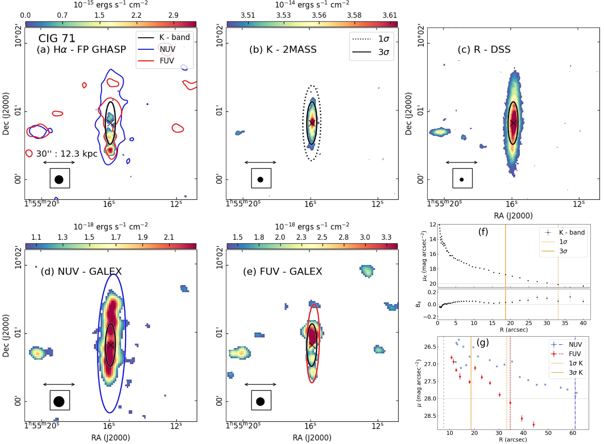
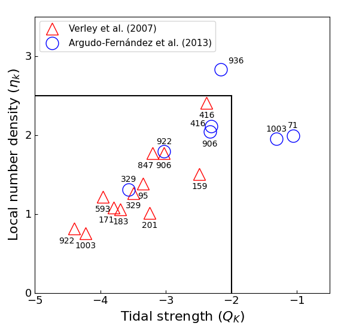
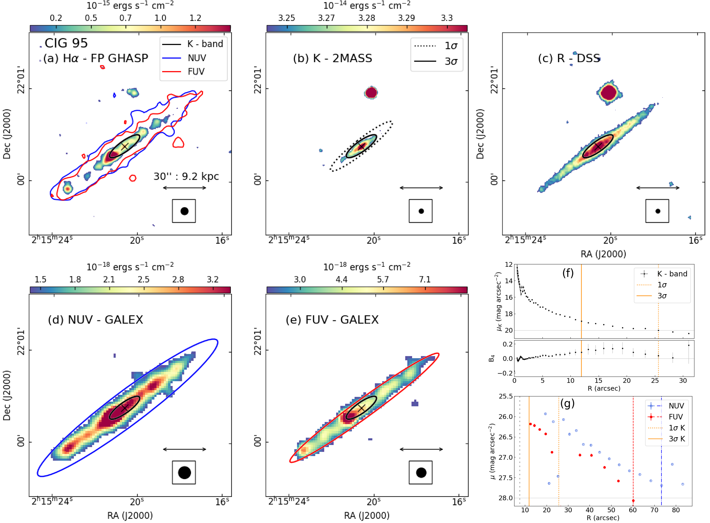

$\newcommand{\ensuremath}{}$
$\newcommand{\xspace}{}$
$\newcommand{\object}[1]{\texttt{#1}}$
$\newcommand{\farcs}{{.}''}$
$\newcommand{\farcm}{{.}'}$
$\newcommand{\arcsec}{''}$
$\newcommand{\arcmin}{'}$
$\newcommand{\ion}[2]{#1#2}$
$\newcommand{\textsc}[1]{\textrm{#1}}$
$\newcommand{\hl}[1]{\textrm{#1}}$
$\newcommand{\footnote}[1]{}$
$\newcommand{\thebibliography}{\DeclareRobustCommand{\VAN}[3]{##3}\VANthebibliography}$

# Extraplanar emission in isolated edge-on late-type galaxies. $\I.The H$$\alpha$ distribution versus to the old and youngstellar discs.$\thanks{Based on observations obtained at the Observatoire deHaute Provence (OHP, France), operated by the French CNRS.}$

<mark>Appeared on: 2024-01-08</mark> -  _Accepted for its publication in MNRAS. Manuscript ID: MN-23-2536-MJ.R1_

M. M. Sardaneta, et al. -- incl., <mark>S. Ghosh</mark>

**Abstract:** Isolated galaxies are the ideal reference sample to study the galaxy structure minimising potential environmental effects. We selected a complete sample of 14 nearby, late-type, highly inclined ( $i\geq80^{\circ}$ ), isolated galaxies from the Catalogue of Isolated Galaxies (CIG) which offers a vertical view of their disc structure.We aim to study extraplanar Diffuse Ionized Gas (eDIG) by comparing the old and young disc components traced by near-infrared ( _NIR_ ) and Ultraviolet ( _UV_ )  imaging with the H $\alpha$ emission structure.We obtained H $\alpha$ monochromatic maps from the Fabry-Perot (FP) interferometry, while the old and young discs structures are obtained from the photometric analysis of the 2MASS _K$_{s_$} -band, and GALEX _NUV_ and _FUV_ images, thereby identifying the stellar disc and whether the eDIG is present.The H $\alpha$ morphology is peculiar in CIG 71, CIG 183, CIG 593 showing clear asymmetries.In general, geometric parameters (isophotal position angle, peak light distribution, inclination) measured from H $\alpha$ , _UV_ and _NIR_ show minimal differences (e.g. $\Delta i\leq\pm$ 10 $^{\circ}$ ), suggesting that interaction does not play a significant role in shaping the morphology, as expected in isolated galaxies.From H $\alpha$ maps, the eDIG was detected vertically in 11 out of 14 galaxies.Although the fraction of eDIG is high, the comparison between our sample and a generic sample of inclined spirals suggests that the phenomenon is uncorrelated to the galaxy environment. As suggested by the extraplanar _UV_ emission found in 13 out of 14  galaxies the star formation extends well beyond the disc defined by the H $\alpha$ map.

**Figure 19. -** 
Example of the layout of the graphs and maps of each galaxy. CIG 71 (UGC 1301).
Multiwavelength maps of the galaxy: (a) the H$\alpha$ 	monochromatic map from FP-GHASP data; (b) the 2MASS _K$_{s_$}-band image; (c) the  DSS _R_-band image; (d) and (e) the GALEX _NUV_ and _FUV_ images, respectively.
In panels (f) and (g) the surface brightness profile of the _K$_{s_$}-band and _NUV/FUV_ emissions are plotted, respectively.
In both panels, yellow vertical lines mark the surface brightness level at 1$\sigma$(dotted line) and 3$\sigma$(solid line) of the _K$_{s_$}-band image.
In panel (g), vertical lines indicate the radii corresponding to the isophotes at a surface brightness level at $\mu_{_NUV_,_FUV_}=$ 28 mag arcsec$^{-2}$ for the _NUV_(blue dot-dashed line) and _FUV_(red dashed line) maps, respectively. Additionally, the vertical black loosely-dashed line at $\sim$5 arcsec shows the approximate FWHM of the GALEX point spread function \citep[see e.g.][]{marino-2010}.
The ellipses fitted to these isophotes are superimposed on the corresponding map with their associated colour.
The common elements in in panels (a), (b), (d) and (e) are:
a colour-bar indicating the flux in units of $\mathrm{erg sec^{-1} cm^{-2}}$,
the arrow tracing a scale of  30 arcsec,
a black circle embedded in a box indicating the spatial resolution of the image,
a black ellipse representing the surface brightness level at 3$\sigma$ on the background of the _K$_{s_$}-band image
and, a black cross ($\times$) pointing the location of the _NIR_ band peak light distribution.
At the bottom of panel (f) we show the relationship between the coefficient $B_{4}$ and the radius  using the _K$_{s_$}-band map to determine if the isophotes tend to have `disc-like’ ($B_4 < 0$) or `boxy’ ($B_4>0$) shape (see Section \ref{Sec:stellarDisc}).
Finally, in panel (a), on the H$\alpha$ monochromatic map were overlaid the 1$\sigma$ isophotes on the background of the _NUV_ and _FUV_ images.
 (*Fig:maps-example*)

**Figure 1. -** Comparison between the local number density ($\eta_{k}$)  and tidal strength ($Q_{k}$) parameters for the CIG galaxies in our sample.  These parameters were obtained first, based on digitized photographic plates from POSS-1 and POSS-2 \citep[][]{verley-2007, verley-2007-i}(red triangles) and later, on available  photometric and spectroscopic  data from SDSS-DR9  ([ and Argudo-Fernández 2013](https://ui.adsabs.harvard.edu/abs/2013A&A...560A...9A)) (blue circles). The CIG catalogue numbers are indicated on top the circles and below the triangles.
According to [ and Verley (2007)](http://adsabs.harvard.edu/abs/2007A%26A...472..121V), the horizontal ($\eta_{k}=2.4$)  and vertical ($Q_{k}=-2$) lines enclose the _ region of bona fide_ isolated galaxies in the AMIGA sample.
 (*Fig:isolation*)

**Figure 4. -** CIG 95 (UGC 1733). Same as Figure \ref{Fig:maps-example}. (*Fig:maps-c95*)

