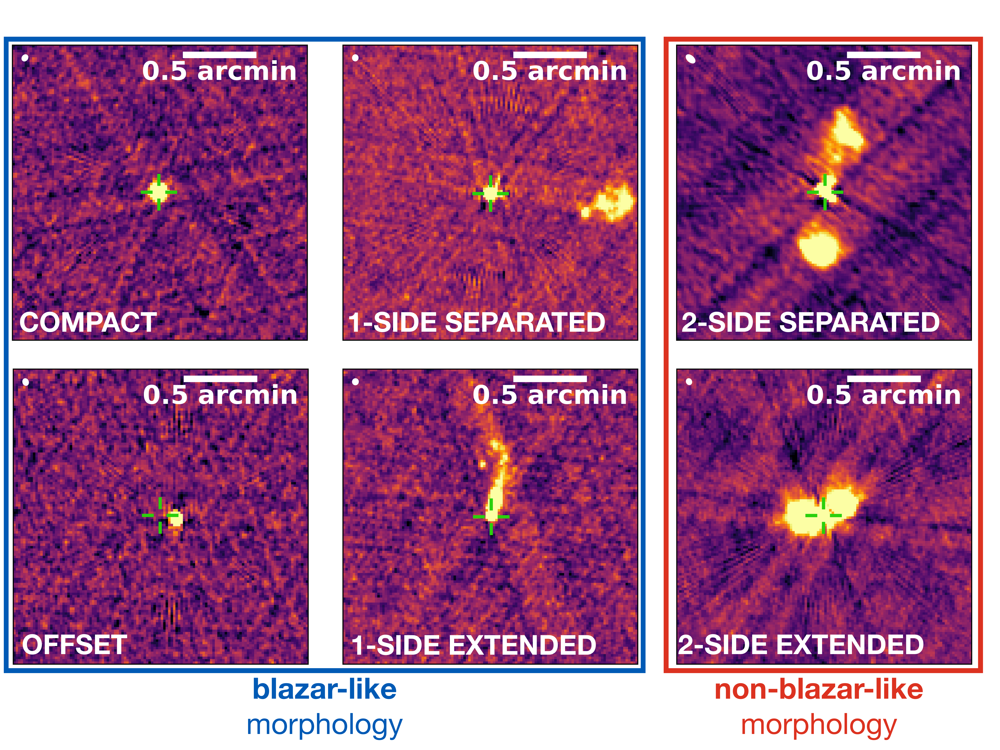
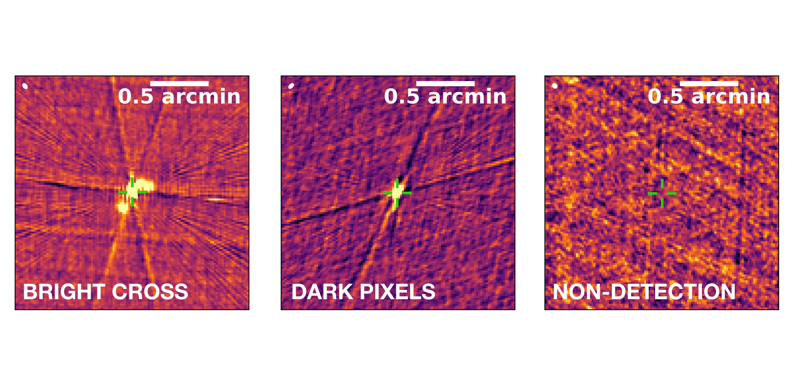
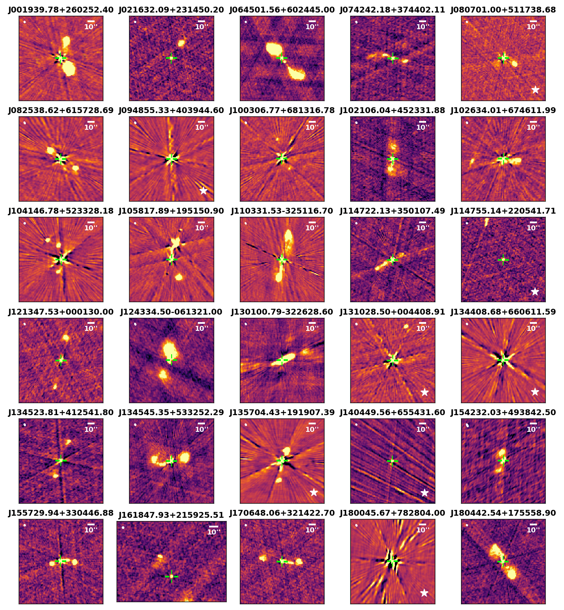

$\newcommand{\ensuremath}{}$
$\newcommand{\xspace}{}$
$\newcommand{\object}[1]{\texttt{#1}}$
$\newcommand{\farcs}{{.}''}$
$\newcommand{\farcm}{{.}'}$
$\newcommand{\arcsec}{''}$
$\newcommand{\arcmin}{'}$
$\newcommand{\ion}[2]{#1#2}$
$\newcommand{\textsc}[1]{\textrm{#1}}$
$\newcommand{\hl}[1]{\textrm{#1}}$
$\newcommand{\footnote}[1]{}$
$\newcommand{\vdag}{(v)^\dagger}$
$\newcommand$
$\newcommand$
$\newcommand{\angstrom}{\text{\normalfontÅ}}$
$\newcommand{\arraystretch}{0.8}$
$\newcommand{\arraystretch}{0.8}$
$\newcommand{\arraystretch}{0.8}$
$\newcommand{\arraystretch}{0.8}$

# Recognizing Blazars Using Radio Morphology from the VLA Sky Survey

<mark>Appeared on: 2024-01-09</mark> -  _21 pages, 11 figures, accepted for publication in The Astrophysical Journal_

Z.-L. X. (谢彰亮), et al. -- incl., <mark>E. Bañados</mark>, <mark>S. Belladitta</mark>, <mark>F. Davies</mark>

**Abstract:** Blazars are radio-loud Active Galactic Nuclei (AGN) whose jets have a very small angle to our line of sight. Observationally, the radio emission are mostly compact or a compact-core with a 1-sided jet. With 2.5 $^{\prime\prime}$ resolution at 3 GHz, the Very Large Array Sky Survey (VLASS) enables us to resolve the structure of some blazar candidates in the sky north of Decl. $-40$ deg. We introduce an algorithm to classify radio sources as either blazar-like or non-blazar-like based on their morphology in the VLASS images. We apply our algorithm to three existing catalogs, including one of known blazars (Roma-BzCAT) and two of blazar candidates identified by WISE colors and radio emission (WIBRaLS, KDEBLLACS). We show that in all three catalogs, there are objects with morphology inconsistent with being blazars. Considering all the catalogs, more than 12 \% of the candidates are unlikely to be blazars, based on this analysis. Notably, we show that 3 \% of the Roma-BzCAT "confirmed” blazars could be a misclassification based on their VLASS morphology. The resulting table with all sources and their radio morphological classification is available online.

**Figure 2. -** Morphological classification of VLASS images using our automated algorithm. The images are categorized into six distinct morphological classes, grouped into two sets. Blazar-like morphologies include _COMPACT_, _OFFSET_, _1-SIDE EXTENDED_, and _1-SIDE SEPARATED_; while non-blazar-like morphologies comprise _2-SIDE EXTENDED_ and _2-SIDE SEPARATED_. In each morphological class, their corresponding 1D signals are shown in two directions, indicated by blue lines. Automatically identified peaks are marked by pink crosses, with morphological classification determined by the properties of peaks, including number, width and distance to the center position. Descriptions of each morphological class and their characteristics can be found in Sec. \ref{subsec:class}. (*fig:all_signal*)

**Figure 3. -** An illustration of two artifact types and a _NON-DETECTION_ source in VLASS images. The algorithm identifies cross pattern and dark pixel artifacts, assigning appropriate quality flag values (1 for cross pattern presence, 2 for dark pixel presence, and 3 for both artifacts in the image). Sources with low signal-to-noise ratios that are difficult to discern by visual inspection are classified as _NON-DETECTION_ sources. (*fig:artifacts*)

**Figure 5. -** All _2-SIDE SEPARATED_ sources with their VLASS2 image in Roma-BzCAT. Each source has undergone visual inspection, and any discrepancies found during this process are indicated by a visual flag in the resulting table. For each of these sources, our revised visual classification is provided. These revised sources are marked with a white star on their image. (*fig:2ss_1*)

