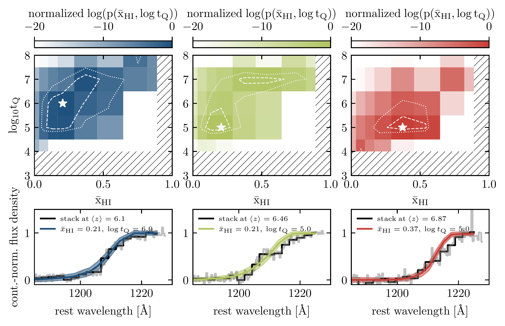
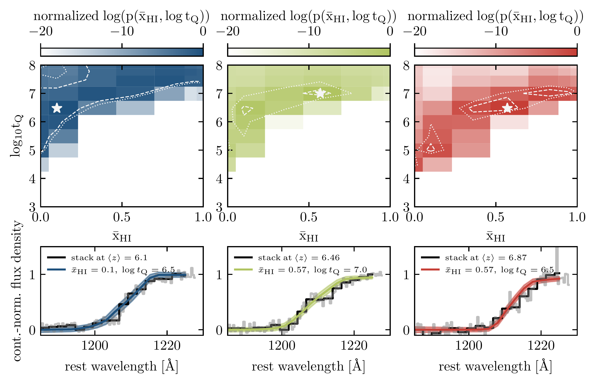
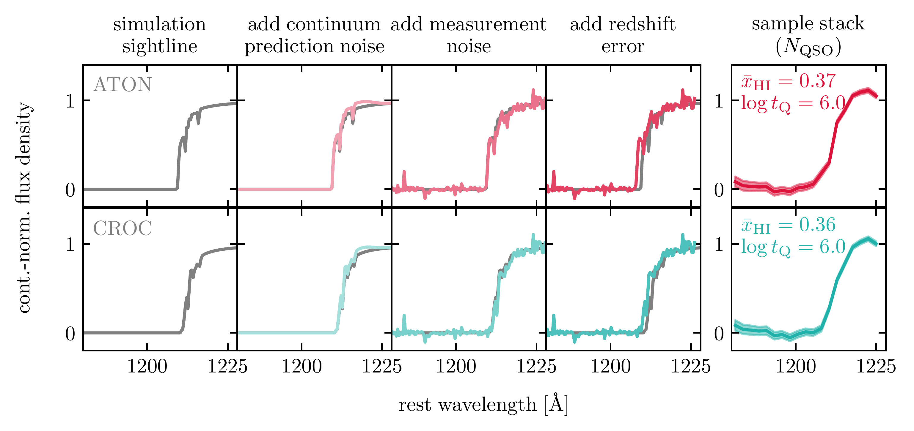
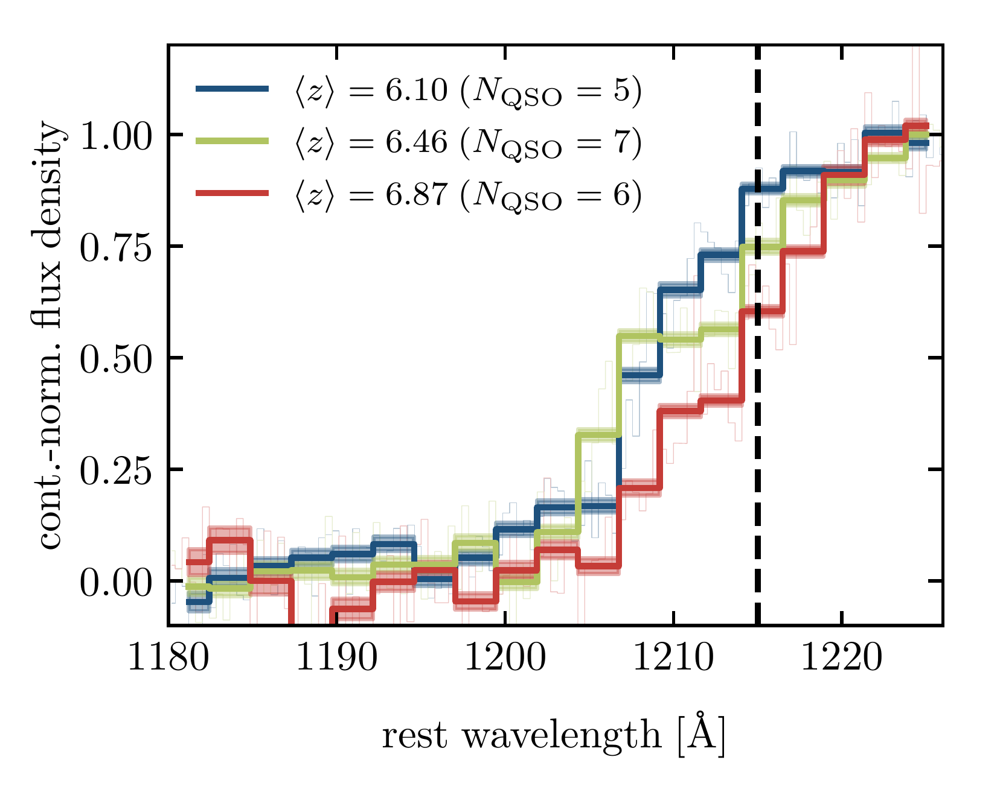

$\newcommand{\ensuremath}{}$
$\newcommand{\xspace}{}$
$\newcommand{\object}[1]{\texttt{#1}}$
$\newcommand{\farcs}{{.}''}$
$\newcommand{\farcm}{{.}'}$
$\newcommand{\arcsec}{''}$
$\newcommand{\arcmin}{'}$
$\newcommand{\ion}[2]{#1#2}$
$\newcommand{\textsc}[1]{\textrm{#1}}$
$\newcommand{\hl}[1]{\textrm{#1}}$
$\newcommand{\footnote}[1]{}$
$\newcommand{\vdag}{(v)^\dagger}$
$\newcommand$
$\newcommand$
$\newcommand{\msol}{M_\odot}$
$\newcommand{\vxhi}{\bar{x}_{\rm HI}}$
$\newcommand{\logtq}{\log{t_{\rm Q}}}$
$\newcommand{\zbar}{\langle z \rangle }$
$\newcommand{\chimp}{{\rm c Mpc}/h}$
$\newcommand{\lya}{Ly\alpha }$
$\newcommand{\lyb}{Ly\beta }$
$\newcommand{\lyc}{Ly\gamma}$
$\newcommand{\ciisf}{[C II]}$
$\newcommand{\cii}{[C{\small II}]}$
$\newcommand{\civ}{C{\small IV}}$
$\newcommand{\mgii}{Mg{\small II}}$
$\newcommand{\oiii}{[O{\small III}]}$
$\newcommand{\ddu}[1]{\texttt{\color{red}[DD: #1]}}$

# Chronicling the reionization history at $6\lesssim z \lesssim 7$ with emergent quasar damping wings

<mark>Appeared on: 2024-01-22</mark> -  _28 pages, 14 figures_

D. {. D. c}{í}kov{á}, et al.

**Abstract:** The spectra of high-redshift ( $z\gtrsim 6$ ) quasars contain valuable information on the progression of the Epoch of Reionization (EoR). At redshifts $z<6$ , the observed Lyman-series forest shows that the intergalactic medium (IGM) is nearly ionized, while at $z>7$ the observed quasar damping wings indicate high neutral gas fractions. However, there remains a gap in neutral gas fraction constraints at $6\lesssim z \lesssim 7$ where the Lyman series forest becomes saturated but damping wings have yet to fully emerge.In this work, we use a sample of 18 quasar spectra at redshifts $6.0<z<7.1$ to close this gap. We apply neural networks to reconstruct the quasars' continuum emission around the partially absorbed Lyman $\alpha$ line to normalize their spectra, and stack these continuum-normalized spectra in three redshift bins. To increase the robustness of our results, we compare the stacks to a grid of models from two hydrodynamical simulations, ATON and CROC, and we measure the volume-averaged neutral gas fraction, $\vxhi$ , while jointly fitting for the mean quasar lifetime, $t_{\rm Q}$ , for each stacked spectrum. We chronicle the evolution of neutral gas fraction using the ATON (CROC) models as follows: $\vxhi = 0.21_{-0.07}^{+0.17}$ ( $\vxhi = 0.10_{<10^{-4}}^{+0.73}$ ) at $\zbar =6.10$ , $\vxhi = 0.21_{-0.07}^{+0.33}$ ( $\vxhi =0.57_{-0.47}^{+0.26}$ ) at $\zbar =6.46$ , and $\vxhi = 0.37_{-0.17}^{+0.17}$ ( $\vxhi =0.57_{-0.21}^{+0.26}$ ) at $\zbar =6.87$ . At the same time we constrain the average quasar lifetime to be $t_{\rm Q} \lesssim 7 {\rm Myr}$ across all redshift bins, in good agreement with previous studies.

**Figure 10. -** Maximum likelihood estimation with ATON models (top two rows) and CROC models (bottom two rows) for all three redshift bins. In the top panel, we show the 2D joint probability distribution evaluated for each combination of $\logtq$ and $\vxhi$, as well as the $1\sigma$ and $2\sigma$ contours as white dashed and dotted curves, respectively. Note that the parameter space where we do not have ATON models is hatched. In the bottom panel, we plot stacked spectrum for each bin along with the model corresponding to the maximum likelihood point on the 2D grid in the top panel (marked by a star). (*fig:fits*)

**Figure 8. -** Illustration of the forward modeling of uncertainties and model construction for both simulations (ATON in the top panel, CROC in the bottom panel). For a particular quasar and a combination of $\vxhi$ and $\logtq$ values, we draw one sightline at random from the corresponding simulation (first column from the left). We forward model the uncertainties by adding the smooth continuum prediction noise (second column), random measurement noise (third column), and finally the corresponding redshift error along the x-axis (fourth column; $\sigma_z = 0.01$ for illustration purposes). We repeat this sightline processing for all quasars within a given redshift bin ($N_{\rm QSO}$), and then stack $N_{\rm QSO}$ processed sightlines to form a sample stack (rightmost column). The whole procedure is repeated $10000$ times for the same combination of $\vxhi$ and $\logtq$ in order to calculate the final model and noise statistics that are used for inference. (*fig:noise*)

**Figure 2. -** Stacked spectra of quasars in our sample in three distinct redshift bins show the emergence of damping wings between $z\sim 6$ and $z\sim 7$(thick colored curves, the location of $\lya$ is marked by the dashed black line). The number of quasars within a given redshift bin is noted in brackets, and the shaded region around the stacked spectra shows the variance in the mean flux. The thin colored lines show a higher-resolution ($\Delta v = 100 {\rm km/s}$) version of the three stacked spectra. (*fig:zstacks*)

