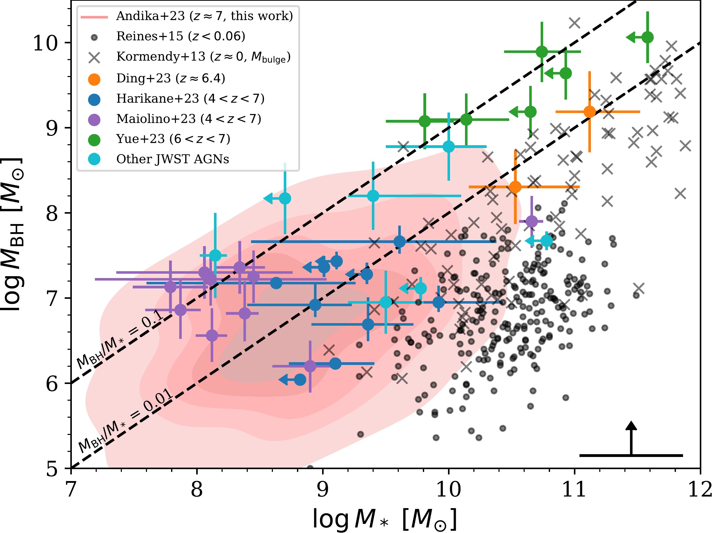
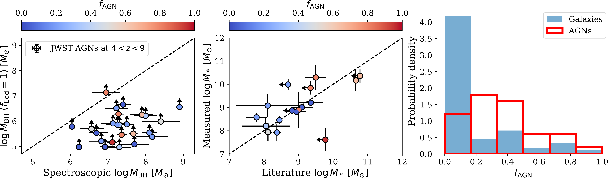
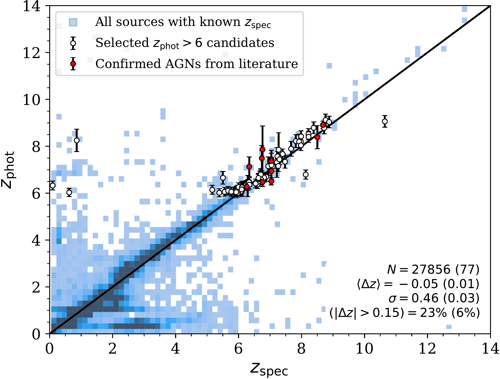

$\newcommand{\ensuremath}{}$
$\newcommand{\xspace}{}$
$\newcommand{\object}[1]{\texttt{#1}}$
$\newcommand{\farcs}{{.}''}$
$\newcommand{\farcm}{{.}'}$
$\newcommand{\arcsec}{''}$
$\newcommand{\arcmin}{'}$
$\newcommand{\ion}[2]{#1#2}$
$\newcommand{\textsc}[1]{\textrm{#1}}$
$\newcommand{\hl}[1]{\textrm{#1}}$
$\newcommand{\footnote}[1]{}$
$\newcommand{\nodata}{ ~\cdots~ }$
$\newcommand{\MBH}{M_\mathrm{BH}}$
$\newcommand{\MSeed}{M_\mathrm{seed}}$
$\newcommand{\MStar}{M_*}$
$\newcommand{\MSun}{M_\odot}$
$\newcommand{\LEdd}{L_\mathrm{Edd}}$
$\newcommand{\Lbol}{L_\mathrm{bol}}$
$\newcommand{\arraystretch}{1.5}$

# Tracing the rise of supermassive black holes:

<mark>Appeared on: 2024-01-23</mark> -  _Submitted to the Astronomy & Astrophysics journal. 25 pages, 10 figures, and 4 tables. We welcome comments from the reader_

I. T. Andika, et al. -- incl., <mark>K. Jahnke</mark>

**Abstract:** We report the identification of 64 new candidates of compact galaxies, potentially hosting faint quasars with bolometric luminosities of $L_\mathrm{bol} = 10^{43}$ --10 $^{46}$ erg s $^{-1}$ , residing in the reionization epoch within the redshift range of $6 \lesssim z \lesssim 8$ .These candidates were selected by harnessing the rich multiband datasets provided by the emerging JWST-driven extragalactic surveys, focusing on COSMOS-Web, as well as JADES, UNCOVER, CEERS, and PRIMER.Our search strategy includes two stages: applying stringent photometric cuts to catalog-level data and detailed spectral energy distribution fitting.These techniques effectively isolate the quasar candidates while mitigating contamination from low-redshift interlopers, such as brown dwarfs and nearby galaxies.The selected candidates indicate physical traits compatible with low-luminosity active galactic nuclei, likely hosting $\approx10^5$ -- $10^7 M_\odot$ supermassive black holes (SMBHs) living in galaxies with stellar masses of $\approx10^8$ -- $10^{10} M_\odot$ .The SMBHs selected in this study, on average, exhibit elevated mass compared to their hosts, with the mass ratio distribution slightly higher than those of galaxies in the local universe.As with other high- $z$ studies, this is at least in part due to the selection method for these quasars.An extensive Monte Carlo analysis provides compelling evidence that heavy black hole seeds from the direct collapse scenario appear to be the preferred pathway to mature this specific subset of SMBHs by $z\approx7$ .Notably, most of the selected candidates might have emerged from seeds with masses of $\sim10^5 M_\odot$ , assuming a thin disk accretion with an average Eddington ratio of $f_\mathrm{Edd}=0.6\pm0.3$ and a radiative efficiency of $\epsilon = 0.2\pm0.1$ .This work underscores the significance of further spectroscopic observations, as the quasar candidates presented here offer exceptional opportunities to delve into the nature of the earliest galaxies and SMBHs formed during cosmic infancy.

**Figure 8. -** 
		Relation between the black hole mass ($\MBH$) and its host galaxy stellar mass ($\MStar$).
		The red contour represents our quasar candidates at $z\gtrsim6$, where our measurements can only provide lower limits for $M_\mathrm{BH}$, considering Eddington ratio values ranging from 0.1 to 1.
		The typical statistical errors for $M_*$ are indicated in the lower right corner of the panel.
		High-$z$ quasar samples with available JWST spectroscopic data from [Harikane, Zhang and Nakajima (2023)](), [Yue, Eilers and Simcoe (2023)](), [Ding, Onoue and Silverman (2023)](), and \citet[][excluding dual AGNs]{2023arXiv230801230M} are presented with blue, green, orange, and purple circles with error bars.
		Additional AGN samples from [Larson, Finkelstein and Kocevski (2023)](), [Übler, Maiolino and Curtis-Lake (2023)](), [Stone, et. al (2023)](), [Kocevski, Onoue and Inayoshi (2023)](), [Kokorev, Fujimoto and Labbe (2023)](), and [Goulding, Greene and Setton (2023)]() are indicated with cyan circles.
		The gray dots and crosses are nearby galaxies and AGNs from [ and Kormendy (2013)]() and [ and Reines (2015)]().
		The black dashed lines mark the limits where $M_\mathrm{BH}$/$M_*$ equals 0.1 and 0.01.
		Our candidates show a slightly higher $M_\mathrm{BH}$ to $M_*$ ratios than other galaxies at $z\sim0$ with consistent properties compared to high-$z$ low-luminosity quasars.
	 (*fig:mbh_mstar*)

**Figure 9. -** 
		Distribution of black hole masses ($\MBH$), stellar masses ($\MStar$), and the fraction of AGN emission ($f_\mathrm{AGN}$) of known sources (see text).
		The left panel compares the lower limit $\MBH$ assuming an Eddington ratio of $f_\mathrm{Edd}=1$ that we calculated and actual values reported in the literature.
		The data points are color-coded according to the inferred $f_\mathrm{AGN}$ of each source.
		The middle panel shows the $\MStar$ from other studies versus our own measurements.
		The right panel illustrates the distribution of $f_\mathrm{AGN}$ for active and inactive galaxies.
		To compensate for the difference in sample sizes, we normalize the bin heights of the histogram, ensuring that the integral of the distribution equals unity.
	 (*fig:known_prop*)

**Figure 1. -** 
		Comparison between $z_\mathrm{phot}$ and $z_\mathrm{spec}$.
		The number count ($N$), average bias ($|\Delta z|$), scatter ($\sigma$), and outlier fraction ($|\Delta z| > 0.15$) of all sources (blue squares) with available spectroscopic data are reported.
		The region with darker colors corresponds to a higher number of sources within the 2D histogram bins.
		We also show the metrics for a subset that satisfies our high-$z$ selection criteria (white circles with error bars).
		Samples of spectroscopically confirmed AGNs from the literature are depicted with red circles.
	 (*fig:zphot*)

