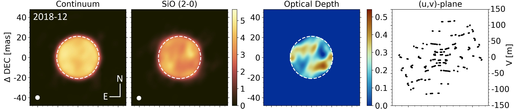
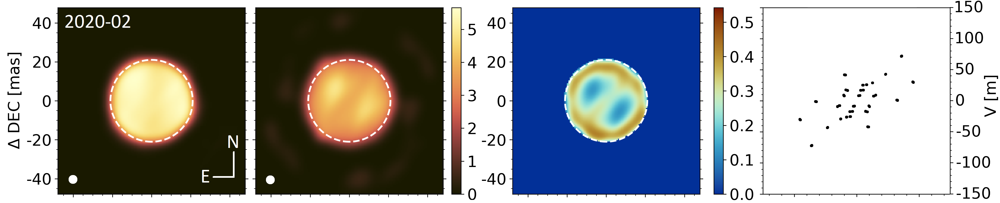
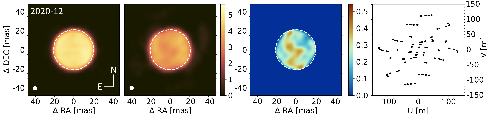
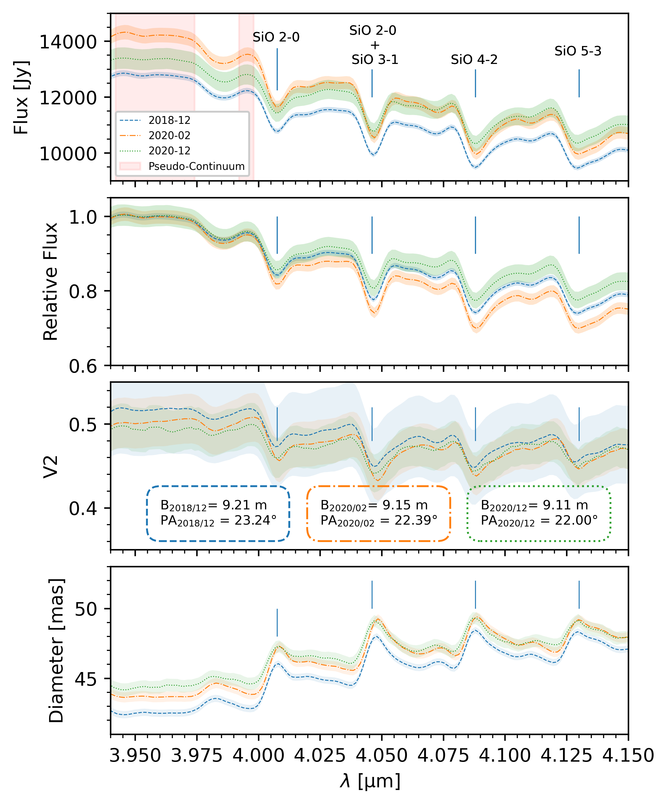
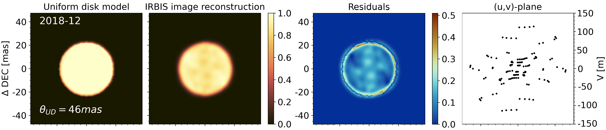
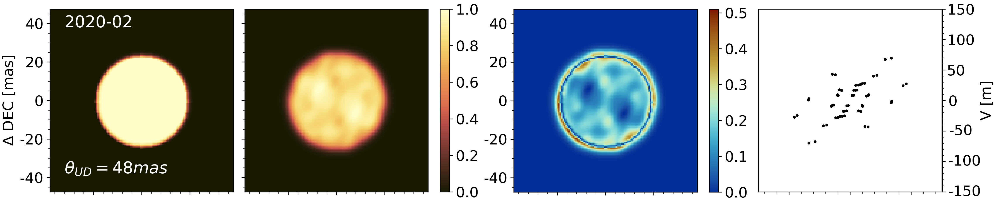
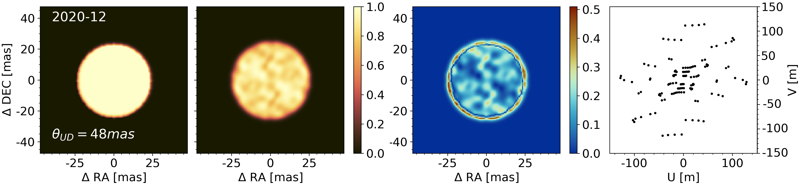

$\newcommand{\ensuremath}{}$
$\newcommand{\xspace}{}$
$\newcommand{\object}[1]{\texttt{#1}}$
$\newcommand{\farcs}{{.}''}$
$\newcommand{\farcm}{{.}'}$
$\newcommand{\arcsec}{''}$
$\newcommand{\arcmin}{'}$
$\newcommand{\ion}[2]{#1#2}$
$\newcommand{\textsc}[1]{\textrm{#1}}$
$\newcommand{\hl}[1]{\textrm{#1}}$
$\newcommand{\footnote}[1]{}$
$\newcommand$
$\newcommand$
$\newcommand$
$\newcommand$
$\newcommand$
$\newcommand{\angstrom}{\textup{Å}}$
$\newcommand{\thebibliography}{\DeclareRobustCommand{\VAN}[3]{##3}\VANthebibliography}$

# Images of Betelgeuse with VLTI/MATISSE across the Great Dimming

<mark>Appeared on: 2024-01-24</mark> - 

J. Drevon, et al. -- incl., <mark>R. v. Boekel</mark>

**Abstract:** From Nov. 2019 to May 2020, the red supergiant star Betelgeuse experienced an unprecedented drop of brightness in the visible domain called the great dimming event. Large atmospheric dust clouds and large photospheric convective features are suspected to be responsible for it. To better understand the dimming event, we used mid-infrared long-baseline spectro-interferometric measurements of Betelgeuse taken with the VLTI/MATISSE instrument before (Dec. 2018), during (Feb. 2020), and after (Dec. 2020) the GDE. We present data in the 3.98 to 4.15 $\mu$ m range to cover SiO spectral features molecules as well as adjacent continuum. We have employed geometrical models, image reconstruction, as well as radiative transfer models to monitor the spatial distribution of SiO over the stellar surface.  We find a strongly in-homogeneous spatial distribution of SiO that appears to be looking very different between our observing epochs, indicative of a vigorous activity in the stellar atmosphere. The contrast of our images is small in the pseudo-continuum for all epochs, implying that our MATISSE observations support both cold spot and dust cloud model.

**Figure 4. -** Each rows correspond to a given epoch precised in the top-left corner of the first panel. From left to right: 1) Reconstructed map in the pseudo-continuum, 2) in the SiO (2--0) absorption band (both scaled in Jy/pix with a squared pixel size of 0.78 mas), 3) deduced map of the optical depth for the SiO (2--0), 4) (u,v)-plane coverage of the used measurements. The dashed white circles on the maps enclose intensities higher than 70\% of the maximum (42 mas in diameter). The small white disks at the bottom left corners of the reconstructed maps corresponds to an equivalent circular interferometric beam used for the convolution of all the reconstructed images ($\approx$ 4 mas in diameter). The angular size has been estimated using the Feb. 2020 observations which has the poorest (u,v)-plane coverage among the three epochs. (*fig:IMAGES*)

**Figure 1. -** Top panel: VLTI/MATISSE absolute spectra for the three epochs with the identification of the main features.  The filled area close to the data point corresponds to the error bars associated to the given quantities. The red area represent the pseudo-continuum range used in this work. Second panel: Relative flux with respect to the continuum for the three epochs. Third panel: visibility squared plotted versus wavelengths for the various epochs of the observations. Bottom panel: fitted uniform disk diameter versus wavelengths for the various epochs. (*fig:FIT*)

**Figure 5. -** Each row correspond to a given epoch precised in the top-left corner of the first panel. From left to right: 1) model of the uniform disk convolved with the same interferometric beam as used in Figure \ref{fig:IMAGES}, 2) reconstructed image using \texttt{IRBIS} of a simulated interferometric data of an uniform disk with an angular diameter determined using the values fitted on the visibility squared showed in Figure \ref{fig:FIT} for the SiO first overtone wavelength, 3) residuals between the model and the image reconstructed, 4) simulated (u,v)-plane coverage used for the image reconstruction of the simulated data. (*fig:IRBIS_test*)

