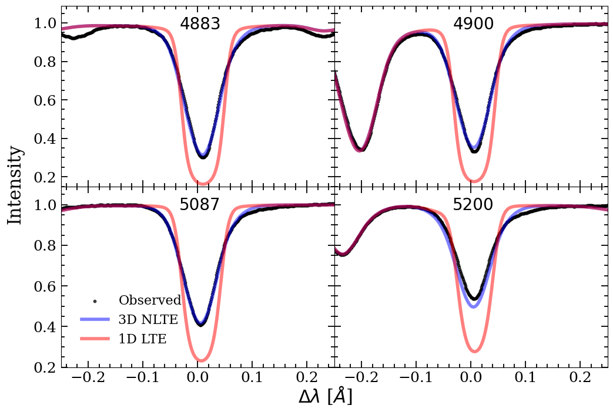
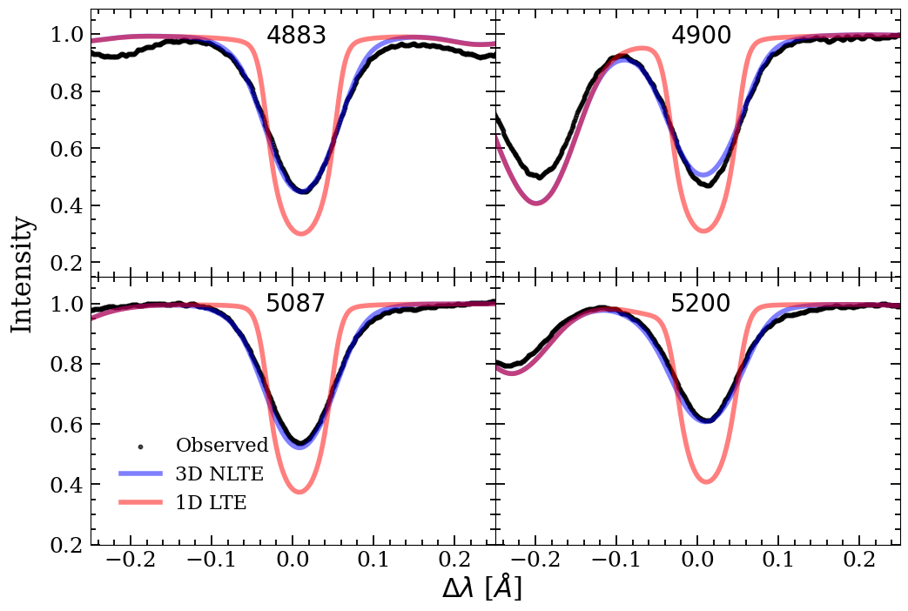
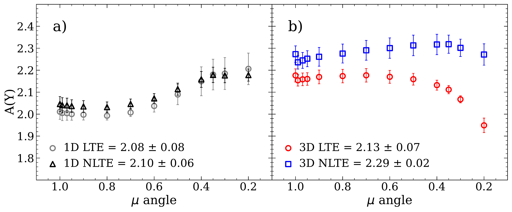

$\newcommand{\ensuremath}{}$
$\newcommand{\xspace}{}$
$\newcommand{\object}[1]{\texttt{#1}}$
$\newcommand{\farcs}{{.}''}$
$\newcommand{\farcm}{{.}'}$
$\newcommand{\arcsec}{''}$
$\newcommand{\arcmin}{'}$
$\newcommand{\ion}[2]{#1#2}$
$\newcommand{\textsc}[1]{\textrm{#1}}$
$\newcommand{\hl}[1]{\textrm{#1}}$
$\newcommand{\footnote}[1]{}$
$\newcommand{\teff}{T_{\rm eff}}$
$\newcommand{\logg}{\log g}$
$\newcommand{\vmic}{\xi_{\rm t}}$
$\newcommand{\Vmic}{\xi_{\rm t}}$
$\newcommand{\vmac}{V_{\rm mac}}$
$\newcommand{\EW}{W_{\lambda}}$
$\newcommand{\mA}{{\rm mÅ}}$
$\newcommand{\Elow}{E_{\rm low}}$
$\newcommand{\Eup}{E_{\rm up}}$
$\newcommand{\SH}{S\!_{\rm H}}$
$\newcommand{\Eu}[5]{\mbox{#1 ^#2{\rm #3}^{{\rm #4}}_{\rm #5}}}$
$\newcommand{\Y}[5]{\mbox{#1 ^#2{\rm #3}^{{\rm #4}}_{\rm #5}}}$
$\newcommand{\footnoterule}$
$\newcommand{\footnoterule}$
$\newcommand{\footnoterule}$

# 3D NLTE modelling of Y and Eu

<mark>Appeared on: 2024-01-25</mark> -  _8 pages, 4 figures, accepted by A&A_

<mark>N. Storm</mark>, et al. -- incl., <mark>M. Bergemann</mark>, <mark>R. Hoppe</mark>

**Abstract:** Abundances of s- and r-process elements in Sun-like stars constrain nucleosynthesis in extreme astrophysical events, such as compact binary mergers and explosions of highly magnetised rapidly rotating massive stars. We measure solar abundances of yttrium (Y) and europium (Eu) using 3D non-local thermal equilibrium (NLTE) models. We use the model to determine the abundance of Y, and also explore the model's ability to reproduce the solar centre-to-limb variation of its lines. In addition, we determine the Eu abundance using solar disc-centre and integrated flux spectra. We developed an NLTE model of Eu and updated our model of Y with collisional data from detailed quantum-mechanical calculations. We used the IAG spatially resolved  high-resolutionsolar spectra to derive the solar abundances of Y across the solar disc and of Eu for integrated flux and at disc ${centre}$ using a set of carefully selected lines and a 3D radiation-hydrodynamics model of the solar atmosphere. We find 3D NLTE solar abundances of ${A(Y)$_{\textrm{3D NLTE}} $ = $2.30 \pm 0.03_{\textrm{stat}} \pm 0.07_{\textrm{syst}}$}$ dex based on observations at all angles and ${A(Eu) = $0.57 \pm 0.01_{\textrm{stat}} \pm 0.06_{\textrm{syst}}$}$ dex based on the integrated flux and disc-centre intensity. ${3D}$ NLTE modelling offers the most consistent abundances across the solar disc, and resolves the problem of severe systematic bias in Y and Eu abundances inherent to 1D LTE, 1D NLTE, and 3D LTE modelling.

**Figure 1. -** {Comparison of the observed Y II line profiles from the solar disc-centre ($\mu = 1.00$) intensity atlas (black) with the 3D NLTE (blue) and 1D LTE (red) model profiles with the instrumental broadening and a constant microturbulence of $\vmic = 1$ km/s for 1D models. A(Y) = 2.3 dex is used for all models for clear comparison.} (*fig:y_lines_examples_1.0*)

**Figure 2. -** Same as Fig. \ref{fig:y_lines_examples_1.0} but for the limb, $\mu = 0.20$. (*fig:y_lines_examples_0.2*)

**Figure 3. -** {Abundances of Y determined from the IAG high-resolution solar observations taken at different viewing angles ($\mu$) using 1D LTE, 1D NLTE, 3D LTE, and 3D NLTE models. The results obtained using 1D LTE and 1D NLTE line formation models are shown in the left panel (a). The results obtained using 3D LTE and 3D NLTE models are shown in the right panel (b). The average solar A(Y) value and its standard deviation are provided in the figure inset for each model. See the main text for further details.} (*fig:y_fit_4883*)

