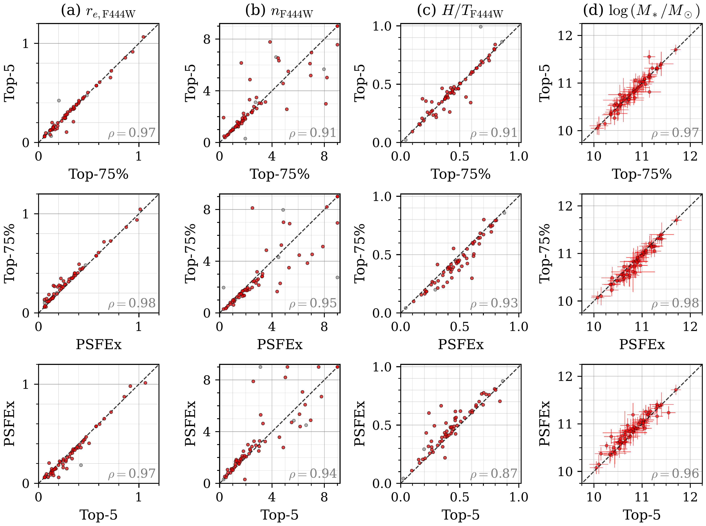
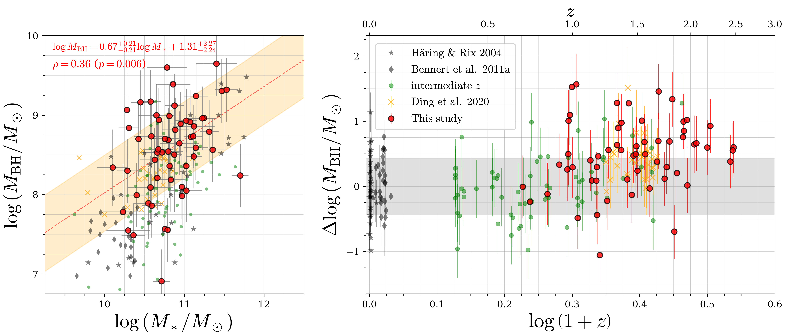
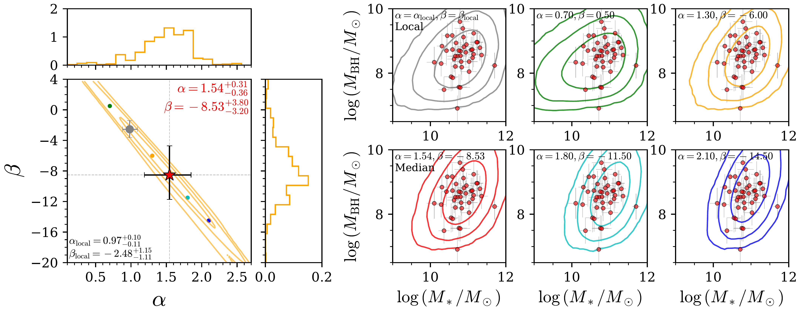
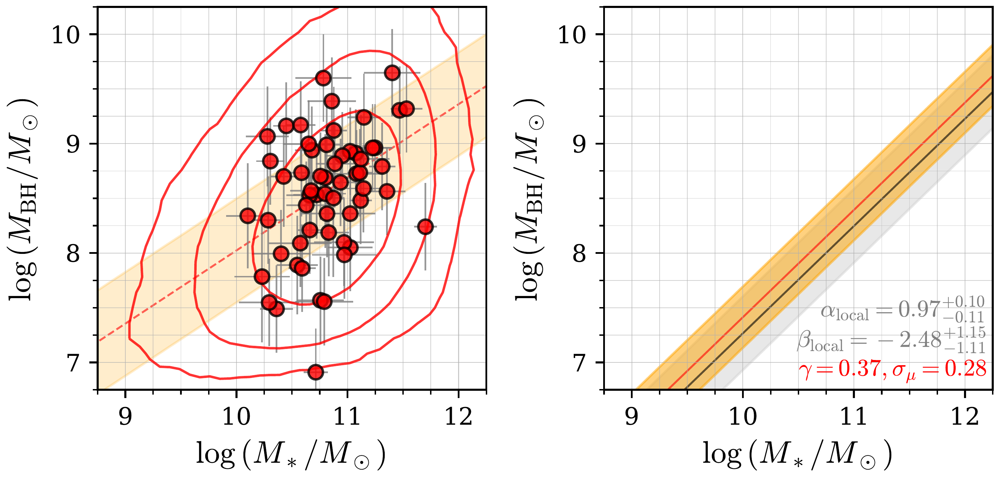
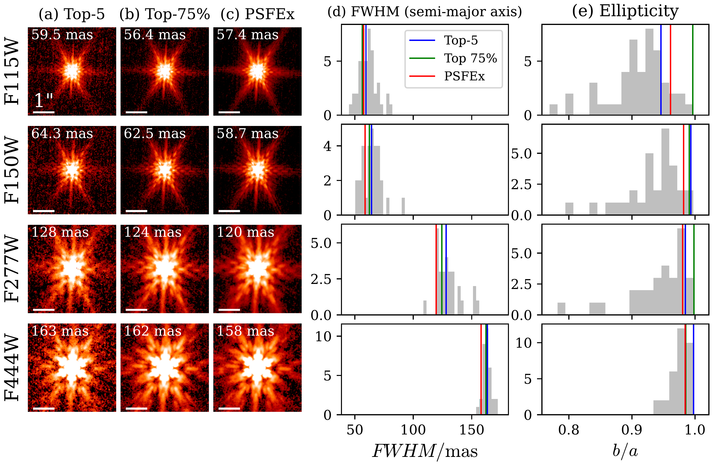

$\newcommand{\ensuremath}{}$
$\newcommand{\xspace}{}$
$\newcommand{\object}[1]{\texttt{#1}}$
$\newcommand{\farcs}{{.}''}$
$\newcommand{\farcm}{{.}'}$
$\newcommand{\arcsec}{''}$
$\newcommand{\arcmin}{'}$
$\newcommand{\ion}[2]{#1#2}$
$\newcommand{\textsc}[1]{\textrm{#1}}$
$\newcommand{\hl}[1]{\textrm{#1}}$
$\newcommand{\footnote}[1]{}$
$\newcommand{\vdag}{(v)^\dagger}$
$\newcommand$
$\newcommand$
$\newcommand$
$\newcommand{\sersic}{{Sérsic}\xspace}$
$\newcommand$
$\newcommand$
$\newcommand$
$\newcommand$

# The $M_{\rm BH}-M_*$ relation up to $z\sim2$ through decomposition of COSMOS-Web NIRCam images

<mark>Appeared on: 2024-01-26</mark> -  _31 pages, 19 figures, submitted to ApJ_

T. S. Tanaka, et al. -- incl., <mark>K. Jahnke</mark>

**Abstract:** Our knowledge of relations between supermassive black holes and their host galaxies at $z\gtrsim1$ is still limited, even though being actively sought out to $z\sim6$ .Here, we use the high resolution and sensitivity of JWST to measure the host galaxy properties for 61 X-ray-selected type-I AGNs at $0.7<z<2.5$ with rest-frame optical/near-infrared imaging from COSMOS-Web and PRIMER.Black hole masses ( $\log\left(M_{\rm BH}/M_\odot\right)\sim7.5-9.5$ ) are available from previous spectroscopic campaigns.We extract the host galaxy components from four NIRCam broadband images and the HST/ACS F814W image by applying a 2D image decomposition technique.We detect the host galaxy for $\sim90\%$ of the sample after subtracting the unresolved AGN emission.With host photometry free of AGN emission, we determine the stellar mass of the host galaxies to be $\log\left(M_*/M_\odot\right)\sim10-11.5$ through SED fitting and measure the evolution of the mass relation between SMBHs and their host galaxies.Considering selection biases and measurement uncertainties, we find that the $M_\mathrm{ BH}/M_*$ ratio evolves as $\left(1+z\right)^{0.37_{-0.60}^{+0.35}}$ thus remains essentially constant or exhibits mild evolution up to $z\sim2.5$ .We also see an amount of scatter ( $\sigma_{\mu}=0.28\pm0.13$ ) is similar to the local relation and consistent with low- $z$ studies; this appears to not rule out non-causal cosmic assembly where mergers contribute to the statistical averaging towards the local relation.We highlight improvements to come with larger samples from JWST and, particularly, Euclid, which will exceed the statistical power of wide and deep surveys such as Subaru Hyper Suprime-Cam.

**Figure 5. -** Comparison of the decomposition results ($r_e$ in the unit of arcsec, $n$, and $H/T$) based on the F444W filter using different PSFs (Columns a--c). Data points in red have satisfied our stringent criteria for host detection (Sec. \ref{subsubsec:detection}).
  Column (d) compares $M_*$ estimated by the SED fitting, with colors corresponding to whether each object was detected in more than two bands.
  Spearman's correlation coefficient $\rho$ for each prior is shown in the lower right corner of each panel.
  High correlation coefficients and the distribution around $y=x$(black dashed line) suggest consistent results among the fitting with different PSFs.
   (*fig:comp_res_deco*)

**Figure 9. -** (_ left_) Observed $M_{\rm BH}$ and $M_*$ distribution as shown by the red circles. A linear fit is indicated by the red line with the shaded region indicating the $1\sigma$ confidence range.
  The best-fit relation and Spearman's correlation coefficient are reported at the top of the panel.
  (_ right_) $\Delta\log\left(M_{\rm BH}/M_\odot\right)$ as a function of redshift where zero corresponds to the local relation as marked by the gray band having a width representing the local dispersion.
  In both panels, samples from previous studies using HST are plotted:
  gray for low-$z$ \citep{Haring2004, Bennert2011}, green for intermediate-$z$ \citep{Jahnke2009,Bennert2011highz,Cisternas2011,Schramm2013}
  and orange indicating those from \cite{Ding2020_HST} at $z\sim1.5$.
  }
\end{figure*}
For comparison, we also provide the linear fit to the local sample consisting of 30 inactive galaxies \citep{Haring2004} and 25 active galaxies \citep{Bennert2011}. The fit to these 55 galaxies results in $\alpha_{\rm local}\simeq0.97^{+0.10}_{-0.11}$ and $\beta_{\rm local}\simeq-2.48^{+1.15}_{-1.11}$.
Note that the local sample and our high-$z$ sample have different selection effects. Thus, we cannot directly compare $\alpha$ and $\beta$ with $\alpha_{\rm local}$ and $\beta_{\rm local}$ (see Sections \ref{subsec:sel_alpha} and \ref{subsec:redshift_evolution} for the discussion with consideration of selection bias).
For investigating the redshift dependence of the mass relation, we calculate $\Delta\log\left(M_{\rm BH}/M_\odot\right)$, the relative offset of the black hole mass at given $M_*$ from the local relation:

$$
    \Delta\log\left(M_{\rm BH}/M_\odot\right)= M_{\rm BH} - \alpha_{\rm local}\log\left(M_*/M_\odot\right)-\beta_{\rm local},
$$

For $\alpha_{\rm local}$ and $\beta_{\rm local}$, we use the above values from the local samples \citep{Haring2004, Bennert2011}, i.e., $0.97$ and $-2.48$, respectively.
We plot $\Delta\log\left(M_{\rm BH}/M_\odot\right)$ as a function of $z$ in the right panel of Figure \ref{fig:massmass}. We then parameterize $\Delta\log\left(M_{\rm BH}/M_\odot\right)$ to evolve with $z$ as:

$$
    \Delta\log\left(M_{\rm BH}/M_\odot\right)= \gamma\log\left(1+z\right). 
$$

Here, we assume there is no redshift change in $\alpha$ and $\beta$ and $\Delta\log M_{\rm BH}$ can be described by only the evolution from the local relation ($\log M_{\rm BH} = \alpha_{\rm local} \log M_{\rm *} + \beta_{\rm local}$).
Fitting our data with Equation (\ref{eq:Delta}) without considering the selection bias results in $\gamma=1.19^{+0.17}_{-0.15}$, suggesting positive evolution.
However, because our sample is (X-ray) flux-limited, it's essential to consider the impact of selection bias when determining the mass relation \citep[e.g.,]{Ding2020_HST, Li2021_HSC, Li2021_EoR}.
Thus, for the rest of this section, we measure the intrinsic slope of the mass relation ($\alpha$) at $z\sim1.5$ and the redshift evolution parameter ($\gamma$) by comparing our results with mock catalogs as described in Section \ref{subsubsec:_mock}. This approach allows us to account for selection bias and measurement uncertainties to determine the intrinsic redshift evolution and dispersion of the mass relation.
\begin{figure*}[ht!]\epsscale{1.15}
  \includegraphics{alpha.pdf}
  \caption{
  (_ left_) Posterior distribution in the $\alpha-\beta$ plane obtained through a comparison between mock observation and our sample.
  The posterior distributions for $\alpha$ and $\beta$ are shown in the right and upper 1D histogram.
  Each contour indicates $1$, $2$, and $3\sigma$ levels.
  The median and $1\sigma$ confidence levels of $\alpha$ and $\beta$ are shown in the top-right corner of each panel.
  (_ right_) Comparison of mock observed masses generated with each $\alpha$ and $\beta$ at $z=1.5$ with the real observed data at $z=1-2$ shown in red circles.
  Contours show the distribution of mock observation, indicating $1$, $2$, and $3\sigma$ levels.
  Each parameter set, $\alpha$ and $\beta$, is shown in the upper left corner of each panel.
  As shown, we cannot reject the scenario that $\alpha$ does not evolve up to $z\sim2.5$.
  }
\end{figure*}\subsection{Intrinsic slope ($\alpha$) of the mass relation at $z\sim1.5$}
Past efforts to establish the evolution of the ratio between black hole and galaxy mass assume that there is a linear relation at higher redshifts and the slope of the relation matches the local relation \citep[e.g.,][]{Ding2020_HST, Li2021_HSC}.
This may not necessarily be the case.
Here, we assess how well the parameters of a linear relation can be constrained.
In particular, we initially assumed that $\alpha$ and $\beta$, for constructing the mock samples (Equation (\ref{eq:mock_mr}), have constant values independent of the redshift, and the evolution is expressed simply as $\gamma\log\left(1+z\right)$. However, the results in the previous Section \ref{subsec:mass-mass} may indicate a different $\alpha$ from the local value without considering selection biases.
In this section, we examine whether the constant $\alpha$ assumption is valid by estimating the intrinsic value of $\alpha$ while considering selection bias and provide evidence for an intrinsic relation between $M_{\rm BH}$ and $M_*$ at $z > 1$ for the first time.
Since the parameters $\alpha$, $\beta$, and $\gamma$ exhibit degeneracies, we constrain the $z$ range to $z=1-2$ and perform fitting for $\alpha$ and $\beta$ with an assumption of $\gamma=0$ over this redshift range.
Consequently, we cannot compare the estimated $\beta$ with the values in the local relation directly.
For the intrinsic dispersion of the mass relation $\sigma_\mu$, we assume 0.3 dex, thus matching local studies.
\begin{figure*}[ht!]\epsscale{1.15}
  \includegraphics{selbias_top5.pdf}
  \caption{Posterior distribution on the $\sigma_\mu-\gamma$ plane obtained through a comparison between mock observation and our sample (the result with the top-5 stacked PSFs).
  Panels (a) to (c) correspond to the result using basic, Gaussian, and realistic prior settings, respectively.
  The posterior distribution for $\sigma_\mu$ and $\gamma$ are shown in the right and upper 1D histogram.
  Each contour (red to orange) indicates $1$, $2$, and $3\sigma$ from inner to outer.
  The median and $1\sigma$ confidence levels of $\gamma$ and $\sigma_\mu$ are shown in the top-right corner of each panel.
  Only in panel (b), we plot the contour from \cite{Li2021_HSC} in gray, and their $\gamma$ and $\sigma_\mu$ estimations are shown in the lower left corner based on SDSS quasars at $0.3<z<0.8$ with Subaru HSC imaging.
  Regardless of the prior, the results suggest no or mild evolution at $z < 2.5$.
  }
\end{figure*}
With the mock observed data described in Section \ref{subsubsec:_mock}, we apply the selection criteria corresponding to our sample (Section \ref{subsec:sample_selection}) and compare them with the observed results to constrain the evolution parameters.
We assume the observation thresholds as;
\begin{align}
    F_{\rm[2-10 keV]} &> F_{\rm[2-10 keV], lim},\FWHM_{\rm line} &> 1000 {\rm km s^{-1}},
\end{align}
where the first and second conditions correspond to the detection limit of the X-ray observation and broad lines for single epoch $M_{\rm BH}$ estimation.
As shown in Figure \ref{fig:sample_range} (a), excluding the three objects, all sources in our sample have $F_{\rm[2-10 keV]}$ above the XMM-Newton $F_{\rm[2-10 keV], lim}$.
Note that all of the three targets with $F_{\rm[2-10 keV]}$ smaller than XMM-Newton $F_{\rm[2-10 keV], lim}$ are targets observed only with Chandra.
Therefore, for the 57 sources other than the three targets, we utilized the XMM-Newton $F_{\rm[2-10 keV], lim}$, while for the remaining three$\footnote${
We exclude CID-166 manually (Section \ref{subsubsec:detection}), so the sum $57+3=60$ is smaller than our sample size $61$.}, we employed the Chandra $F_{\rm[2-10 keV], lim}$; i.e., we changed $F_{\rm[2-10 keV], lim}$ depending on the compared observation galaxy.
Because $M_{\rm BH}$ of our real targets are based on single epoch estimation with three different lines (${\rm H\alpha}$, ${\rm H\beta}$, and ${\rm Mg{\sc II}}$), we have three different selection thresholds on the mock galaxy using $FWHM_{\rm H\alpha}$, $FWHM_{\rm H\beta}$, and $FWHM_{\rm Mg{\sc II}}$.
For each of our targets, we first select the mock galaxies with the corresponding selection bias, i.e., the selection condition using the same line information used to estimate $M_{\rm BH}$.
Furthermore, we select the mock galaxies with a similar redshift; $\left|z-z_{\rm mock}\right|<0.1$.
Then, we calculate the probability that the mock galaxies with the similar $z_{\rm mock}$ as the real galaxy would have the same $\Tilde{M}_{\rm *,mock}$ with $\left|\Delta M_{\rm *}\right|<0.1$ and $M_{\rm vir,mock}$ with $\left|\Delta M_{\rm BH}\right|<0.1$, i.e., calculate the probability $p$ following

$$
    p = \frac{N_{\left|\Delta z\right|<0.1, \left|\Delta M_*\right|<0.1, \left|\Delta M_{\rm BH}\right|<0.1}}{N_{\left|\Delta z\right|<0.1}}.
$$

We then calculate the likelihood of our sample being observed for each parameter combination of $\alpha$ and $\beta$.
Thereby, we estimate the probability distribution of these parameters using MCMC.
In the sampling, we assume a uniform prior between 0.1 to 3 for $\alpha$, and -25 to 8 for $\beta$.
\begin{figure*}\epsscale{0.9}
  \includegraphics{massmass_final.pdf}
  \caption{
  (_ left_) Comparison of the observed sample and the mock observation of $z\sim1.5$ AGN on the $M_{\rm BH}-M_*$ plane.
  The mock data at $z\sim1.5$ is constructed with the best-fit $\gamma$ and $\sigma_\mu$ (the result with the top-5 stacked PSFs assuming the "Gaussian" prior) while assuming $\alpha_{\rm local}$ and $\beta_{\rm local}$.
  Small red circles with error bars and the red dashed lines indicate the observed data and the linear fit results (same with Figure \ref{fig:massmass}_ left_).
  Contours indicate a distribution of mock observed samples, showing $1$, $2$, and $3\sigma$ from inner to outer.
  (_ right_)
  Comparison of the intrinsic $M_{\rm BH}$--$M_*$ relation at $z\sim1.5$ (the red line) to the local relation (the gray line).
  }
\end{figure*}
The obtained $\alpha-\beta$ distribution is shown on the left panel of Figure \ref{fig:alpha}, indicating a strong anti-correlated degeneracy between $\alpha$ and $\beta$.
Because the $1\sigma$ contour includes values $\left(\alpha_{\rm local}, \beta_{\rm local}\right)$ corresponding to the local relation, our results do not definitively reject the scenario where $\alpha$ and $\beta$ do not evolve compared to the local relation up to $z\sim2.5$.
However, our results have a preference to higher $\alpha$ than the local relation with $\alpha=1.54^{+0.31}_{-0.36}$.
This result suggests high-$z$ mass relation is steeper than the local relation for massive ellipticals, being more consistent with quasar host galaxies at $z\lesssim0.35$\citep{Zhuang2023nature}.
In the right panels of Figure \ref{fig:alpha}, we show the $M_{\rm BH}-M_*$ distribution for mock observed galaxies (similar to Figure \ref{fig:mockmake}f) generated with manually sampled parameters on the ridge of the $\alpha-\beta$ degenerated relation and the real observed galaxies ($\alpha\sim0.7-2.1$).
The plots suggest that the mock data exhibits a similar distribution to our sample within the comparable mass range.
However, because these parameters are constrained only with our results, more significant differences in $M_*$ distribution between the shown parameters become evident at the lower $M_{\rm BH}$ range ($\log\left(M_{\rm BH}/M_\odot\right)< 8$).
Therefore, to break this degenerate relation and improve the precision of determining $\alpha$ and $\beta$, a larger sample with a wider $M_{\rm BH}$ range in future studies is essential.
Even so, we demonstrate that a relation between $M_{\rm BH}$ and $M_*$ at high-$z$ is realized based on having a statistical sample afforded by the COSMOS-Web data set. As indicated by Figure \ref{fig:comp_res_deco}(d), the difference in the PSF reconstruction methods does not significantly affect the $M_*$ estimation. Therefore, the posterior distribution of $\alpha$ and $\beta$ that are estimated based on $M_*$ also shows no significant PSF dependency.
\subsection{Intrinsic evolution ($\gamma$) of the $M_{\rm BH}/M_*$ relation}
To determine the evolution of mass relation with consideration of the selection bias and measurement uncertainties, we generate mock observed catalogs with free parameters of $\gamma$(evolution rate) and $\sigma_\mu$(intrinsic dispersion of the mass relation) and constrain them by comparing the mock catalogs with observational data in a similar manner to Section \ref{subsec:sel_alpha}. In contrast to Section \ref{subsec:sel_alpha}, we fixed $\alpha$ and $\beta$ in Equation (\ref{eq:mock_mr}) to the values in the local relation ($\alpha_{\rm local}$, $\beta_{\rm local}$) to consider the redshift evolution.
As illustrated in Section \ref{subsec:sel_alpha}, we cannot rule out the possibility for evolution of $\alpha$.
However, as described in Section \ref{subsec:sel_alpha}, $\alpha$, $\beta$, and $\gamma$ are strongly degenerate, and obtaining physically meaningful results is challenging when all three parameters are left free for the sample being considered here.
There is still a possibility that $\sigma_\mu$ depends on redshift. Nevertheless, as discussed later, imposing strong constraints on $\sigma_\mu$ in our results is challenging due to the sample size and its uncertainties.
Therefore, we set $\sigma_\mu$ as a constant independent of redshift in the fitting.
It means $\sigma_\mu$ obtained through this method is considered to be an averaged value over $z\sim0.7-2.5$.
Even so, this $\sigma_\mu$ estimation has the highest statistical significance for such a study at $z \gtrsim 1$.
We discuss the redshift evolution of $\sigma_\mu$ in Section \ref{subsubsec:scatter_evol}.
Finally, in this analysis, we assume no redshift-dependent parameters among the free parameters.
Therefore, there is no need to restrict the redshift range within the data, as in Section \ref{subsec:sel_alpha}.
In the fitting process, we assume a uniform prior distribution for $\gamma$ between $-1<\gamma<1$.
Then, we have three different prior settings for $\sigma_\mu$: a uniform distribution between $0.01<\sigma_\mu<1.0$(basic), a Gaussian distribution with a mean of 0.3 dex and a standard deviation of 0.1 dex (Gaussian), and a uniform distribution between $0.25<\sigma_\mu<1.0$ with a prohibition of $\sigma_\mu<0.25$(realistic).
Figure \ref{fig:selbias} shows the estimated posterior distributions of $\gamma$ and $\sigma_\mu$ using each prior setting with the top-5 stacked PSF results.
As evident in all panels by the orange contours, the intrinsic dispersion $\sigma_\mu$ is strongly degenerate with the evolution rate $\gamma$ where a smaller $\gamma$ results in a larger $\sigma_\mu$ as demonstrated in previous studies \citep{Ding2020_HST, Li2021_HSC}.
To reiterate, a smaller value for $\gamma$ biases the mass relation towards relatively lower $M_{\rm BH}$ values thus a larger $\sigma_\mu$ is required to reproduce a certain set of observation data.
Considering the likelihood distribution for $\gamma$, the "basic" prior setting shows a slight positive-to-no evolution with $\gamma=0.34^{+0.37}_{-0.58}$.
Similarly, the  "Gaussian" prior setting results in $\gamma=0.37^{+0.35}_{-0.60}$, just slightly closer to the case of "no evolution ($\gamma=0$).
If we assume that the intrinsic dispersion should not be significantly smaller than the local dispersion, we limit the allowed range for $\sigma_\mu$ to be above $0.25$("Realistic" case).
In this case, we find $\gamma=0.06^{+0.37}_{-0.50}$, remarkably close to the case for no evolution.
For the latter, the intrinsic dispersion is slightly higher at $0.36^{+0.10}_{-0.07}$.
In all cases, our results are consistent with very mild or essentially a lack of evolution with respect to the local relation.
Then, the left panel of Figure \ref{fig:massmass_final} compares mock observations using the median parameters ($\gamma=0.30$ and $\sigma_\mu=0.29$) under the assumption of "Gaussian" prior with the actual observational $M_{\rm BH}$--$M_*$ distribution and relation.
We can see that the mock data can explain the observed data well.
The right panel of Figure \ref{fig:massmass_final} compares the intrinsic relationship, i.e., the relation corrected for the selection bias, with the local relation.
Again, the resulting intrinsic relation is consistent with the local relation within the range of errors.
\n\end{document}(_ left_) Posterior distribution in the $\alpha-\beta$ plane obtained through a comparison between mock observation and our sample.
  The posterior distributions for $\alpha$ and $\beta$ are shown in the right and upper 1D histogram.
  Each contour indicates $1$, $2$, and $3\sigma$ levels.
  The median and $1\sigma$ confidence levels of $\alpha$ and $\beta$ are shown in the top-right corner of each panel.
  (_ right_) Comparison of mock observed masses generated with each $\alpha$ and $\beta$ at $z=1.5$ with the real observed data at $z=1-2$ shown in red circles.
  Contours show the distribution of mock observation, indicating $1$, $2$, and $3\sigma$ levels.
  Each parameter set, $\alpha$ and $\beta$, is shown in the upper left corner of each panel.
  As shown, we cannot reject the scenario that $\alpha$ does not evolve up to $z\sim2.5$.
  Posterior distribution on the $\sigma_\mu-\gamma$ plane obtained through a comparison between mock observation and our sample (the result with the top-5 stacked PSFs).
  Panels (a) to (c) correspond to the result using basic, Gaussian, and realistic prior settings, respectively.
  The posterior distribution for $\sigma_\mu$ and $\gamma$ are shown in the right and upper 1D histogram.
  Each contour (red to orange) indicates $1$, $2$, and $3\sigma$ from inner to outer.
  The median and $1\sigma$ confidence levels of $\gamma$ and $\sigma_\mu$ are shown in the top-right corner of each panel.
  Only in panel (b), we plot the contour from \cite{Li2021_HSC} in gray, and their $\gamma$ and $\sigma_\mu$ estimations are shown in the lower left corner based on SDSS quasars at $0.3<z<0.8$ with Subaru HSC imaging.
  Regardless of the prior, the results suggest no or mild evolution at $z < 2.5$.
  (_ left_) Comparison of the observed sample and the mock observation of $z\sim1.5$ AGN on the $M_{\rm BH}-M_*$ plane.
  The mock data at $z\sim1.5$ is constructed with the best-fit $\gamma$ and $\sigma_\mu$(the result with the top-5 stacked PSFs assuming the "Gaussian" prior) while assuming $\alpha_{\rm local}$ and $\beta_{\rm local}$.
  Small red circles with error bars and the red dashed lines indicate the observed data and the linear fit results (same with Figure \ref{fig:massmass}_ left_).
  Contours indicate a distribution of mock observed samples, showing $1$, $2$, and $3\sigma$ from inner to outer.
  (_ right_)
  Comparison of the intrinsic $M_{\rm BH}$--$M_*$ relation at $z\sim1.5$(the red line) to the local relation (the gray line).
   (*subsec:sel_alpha*)

**Figure 13. -** 
  Comparison of different methods to evaluate empirical models of the PSF.
  Columns (a) to (c) show images of the top-5 stacked PSF, the top-75\% stacked PSF, and the {\tt PSFEx}-PSF for an example galaxy, CID-62 ($z=1.92$), in F115W, F150W, F277W, and F444W, from top to bottom.
  FWHM along the semi-major axis measured from the 2D Gaussian fits shown in the top-left corner of each image.
  The white bars in the lower left indicate a scale of $1^{\prime\prime}$.
  Columns (d) and (e) show the distribution of the FWHM (semi-major axis) and ellipticity $b/a$.
  Gray histograms display the distribution of each single PSF in the library (Section \ref{subsubsec:chisq_PSF}).
  The values for the top-5 stacked PSF, the top-75\% stacked PSF, {\tt PSFEx}-PSF are marked by the blue, green, and red vertical lines, respectively.
   (*fig:final_PSF*)

