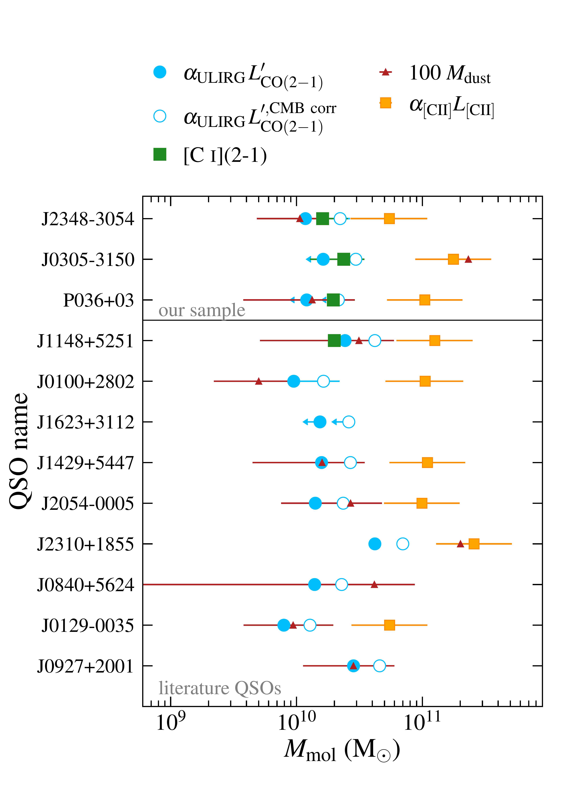
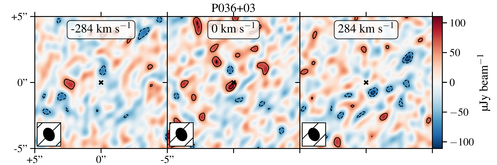
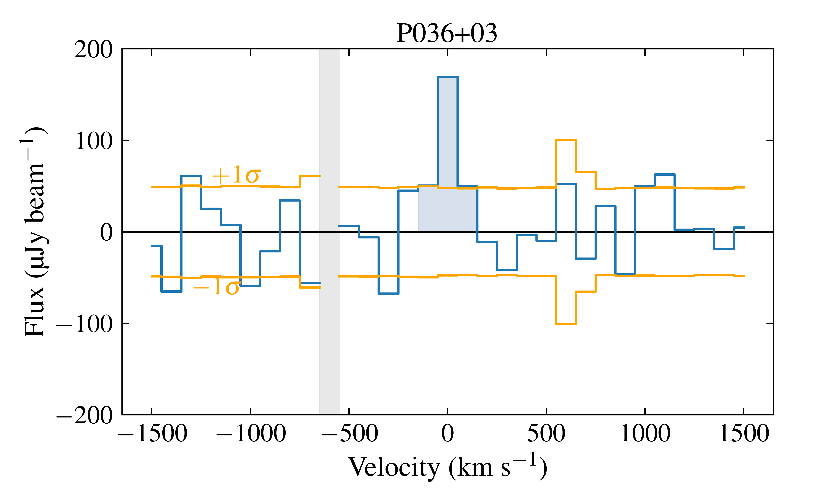
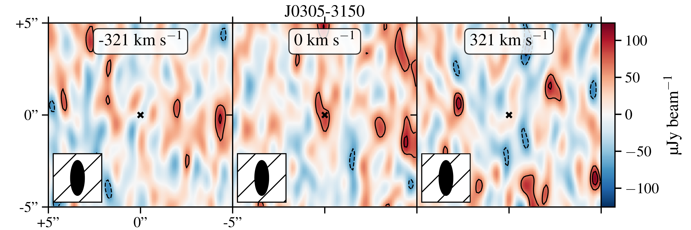
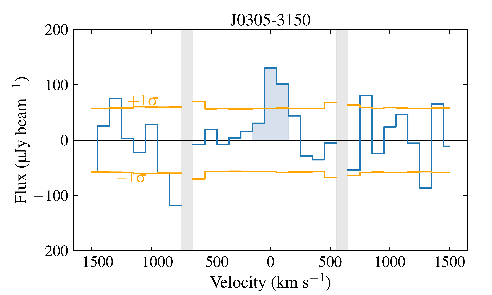
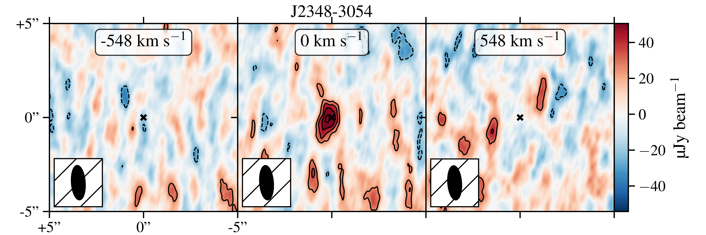
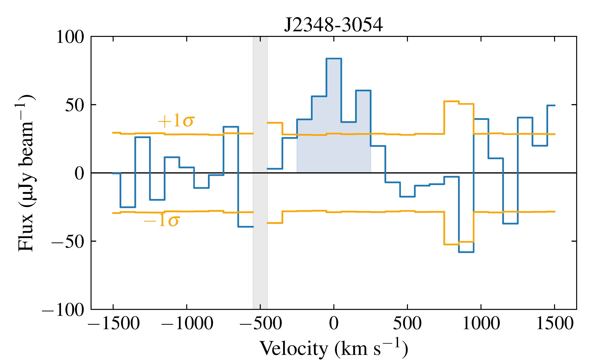
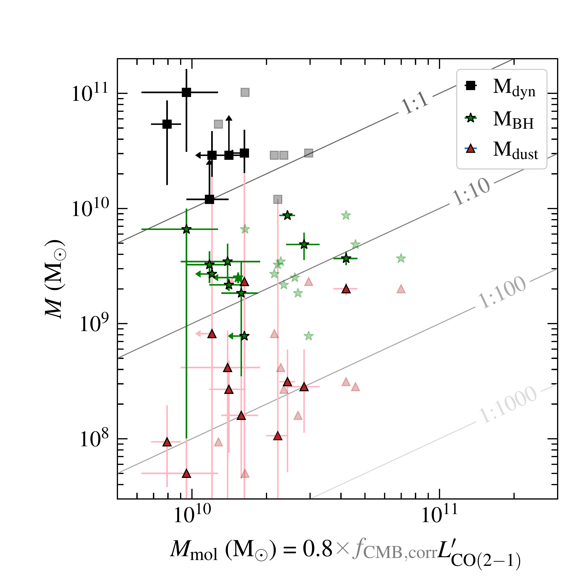

$\newcommand{\ensuremath}{}$
$\newcommand{\xspace}{}$
$\newcommand{\object}[1]{\texttt{#1}}$
$\newcommand{\farcs}{{.}''}$
$\newcommand{\farcm}{{.}'}$
$\newcommand{\arcsec}{''}$
$\newcommand{\arcmin}{'}$
$\newcommand{\ion}[2]{#1#2}$
$\newcommand{\textsc}[1]{\textrm{#1}}$
$\newcommand{\hl}[1]{\textrm{#1}}$
$\newcommand{\footnote}[1]{}$
$\newcommand{\ci}{[\ion{C}{I}] (2--1)}$
$\newcommand{\cii}{[\ion{C}{II}] 158 \textmu m}$
$\newcommand{\kms}{\ensuremath{\rm{km}  \rm{s}^{-1}}}$
$\newcommand{\peryr}{\ensuremath{\rm{yr}^{-1}}}$
$\newcommand{\Msun}{\ensuremath{\rm{M}_{\odot}}}$
$\newcommand{\Mstar}{\ensuremath{\rm{M}_{*}}}$
$\newcommand{\Mmol}{\ensuremath{\rm{M}_{\rm{mol}}}}$
$\newcommand{\aco}{\alpha_\mathrm{CO}}$
$\newcommand{\arraystretch}{1.5}$
$\newcommand{\arraystretch}{1}$
$\newcommand{\arraystretch}{1}$
$\newcommand{\arraystretch}{1.5}$
$\newcommand{\arraystretch}{1}$
$\newcommand{\arraystretch}{1.5}$
$\newcommand{\arraystretch}{1.5}$
$\newcommand{\arraystretch}{1}$

# The cold molecular gas in $z\gtrsim 6$ quasar host galaxies

<mark>Appeared on: 2024-02-09</mark> -  _accepted for publication in A&A_

M. Kaasinen, et al. -- incl., <mark>E. Bañados</mark>, <mark>F. Walter</mark>

**Abstract:** Probing the molecular gas reservoirs of $z\gtrsim6$ quasar (QSO) host galaxies is fundamental to understanding the coevolution of star formation and black hole growth in these extreme systems. Yet, there is still an inhomogeneous coverage of molecular gas tracers for $z\gtrsim6$ QSO hosts. To measure the average excitation and mass of the molecular gas reservoirs in the brightest $z>6.5$ QSO hosts, we combined new observations of CO(2--1) emission with existing observations of CO(6--5), CO(7--6), $\ci$ , $\cii$ , and dust-continuum emission. We reduced and analysed observations of CO(2--1), taken with the Karl G. Jansky Very Large Array, in three $z=6.5-6.9$ QSO hosts---the highest redshift observations of CO(2--1) to date. By combining these with the nine $z=5.7-6.4$ QSO hosts for which CO(2--1) emission has already been observed, we studied the spread in molecular gas masses and CO excitation of $z\gtrsim6$ QSOs. Two of our three QSOs, P036+03 and J0305--3150, were not detected in CO(2--1), implying more highly excited CO than in the well-studied $z=6.4$ QSO J1148+5251. However, we detected CO(2--1) emission at $5.1\sigma$ for our highest-redshift target, J2348--3054, yielding a molecular gas mass of $(1.2\pm0.2)\times 10^{10}  \mathrm{M}_\odot$ , assuming $\alpha_\mathrm{CO} = 0.8$ (K km s $^{-1}$ pc $^2$ ) $^{-1}$ and $r_\mathrm{2,1}=1$ . This molecular gas mass is equivalent to the lower limit on the dynamical mass measured previously from resolved $\cii$ observations, implying that there is little mass in stars or neutral gas within the [ $\ion{C}{II}$ ] -emitting region and that a low CO-to-$H_2$ conversion factor is applicable. On average, these $z\gtrsim6$ QSO hosts have far higher CO(6--5)-, CO(7--6)-, and $\cii$ versus CO(2--1) line ratios than the local gas-rich and IR-luminous galaxies that host active galactic nuclei, but with a large range of values, implying some variation in their interstellar medium conditions. We derived a mean CO(6--5)-to-CO(1--0) line luminosity ratio of $r_\mathrm{6,1}=0.9\pm0.2$ . Our new CO(2--1) observations show that even at 780 Myr after the Big Bang, QSO host galaxies can already have molecular gas masses of $10^{10}$ M $_\odot$ , consistent with a picture in which these $z\gtrsim6$ QSOs reside in massive starbursts that are coevolving with the accreting supermassive black holes. Their high gas versus dynamical masses and extremely high line excitation imply the presence of extremely dense and warm molecular gas reservoirs illuminated by strong interstellar radiation fields.

**Figure 1. -** Comparison of molecular gas masses inferred from different sets of observations for our three QSO hosts (top three) and the literature sample of $z\gtrsim 6$ QSO hosts (bottom nine). For the CO-based values, we have assumed a ULIRG CO-to-$H_2$ conversion factor of $\alpha_\mathrm{CO}=0.8$ M$_\odot$(K km s$^{-1}$ pc$^2$)$^{-1}$.  We show two masses for CO(2--1), one derived without any CMB correction being applied (filled blue circles) and one derived by applying a correction assuming the high-density ($n_\mathrm{H_2}=10^{4.2}$ cm$^{-3}$) and high-temperature ($T_\mathrm{kin}=40$ K), non-LTE scenario presented in $\ci$te{2013ApJ...766...13D}(blue outlined circles). We also show molecular gas masses derived from $\ci$ emission (green squares) assuming the [$\ion${C}{i}] is optically thin, in LTE and has the same abundance as the sample of lensed starbursts studied in $\ci$te{2021ApJ...908...95H}, namely [$\ion${C}{I}]/$H_2 = (6.82\pm3.04)\times10^{-5}$. We also compare to molecular gas masses derived from the dust masses fit here, assuming the local gas-to-dust ratio of 100 (red triangles), as well as molecular gas masses derived from the $\ci$i line luminosities, assuming the mean [$\ion${C}{II}]-to-$H_2$ conversion factor ($\alpha_\mathrm{[CII]} = 31 $\Msun$/L_{\odot}$) derived by $\ci$te{2018MNRAS.481.1976Z}.  (*fig:Mmol_comp*)

**Figure 3. -** CO(2--1) observations of P036+03, J0305--3150, and J2348--3054 (from top to bottom, respectively). Left: Cleaned channel maps with the middle panel depicting the moment-0 map centred on the $\ci$i redshift and integrated over $1.2\times$\ac{fwhm} of the $\ci$i line, which should encompass 84\% of the CO(2--1) emission assuming there is no spatial or velocity offset. Right: Observed CO(2--1) spectra extracted from the pixel at the peak position of the moment 0 maps (blue line) and $1\sigma$ rms per channel (orange line). The spectra are shown for channels of 100 km s$^{-1}$ velocity width, the shaded region indicating the $1.2$ FWHM region used to create the channel maps to the left. P036+03 and J0305--3150 are undetected (with a significant number of negative and positive peaks in the data cube exceeding the significance of the peaks in emission near the expected source centres), so we place $4\sigma$ upper limits on their CO(2--1) emission. J2348--3054 is detected at $5.1\sigma$(central velocity-integrated map in bottom row).
				 (*fig:channelmaps*)

**Figure 2. -** Dynamical masses (black squares), dust masses (red triangles), and black hole masses (green stars) compared to the CO(2--1)-derived molecular gas masses assuming a ULIRG $\alpha_\mathrm{CO}$, with a CMB correction (light shaded symbols) and without a CMB correction (dark shaded symbols). For the CO(2--1)-derived values, we assume that the low-$J$ CO emission is thermalised ($L_\mathrm{CO(1-0)}^\prime = L_\mathrm{CO(2-1)}^\prime$). Most molecular gas masses are high, spanning $0.1-1\times$ the dynamical mass.  (*fig:mass_comp*)

