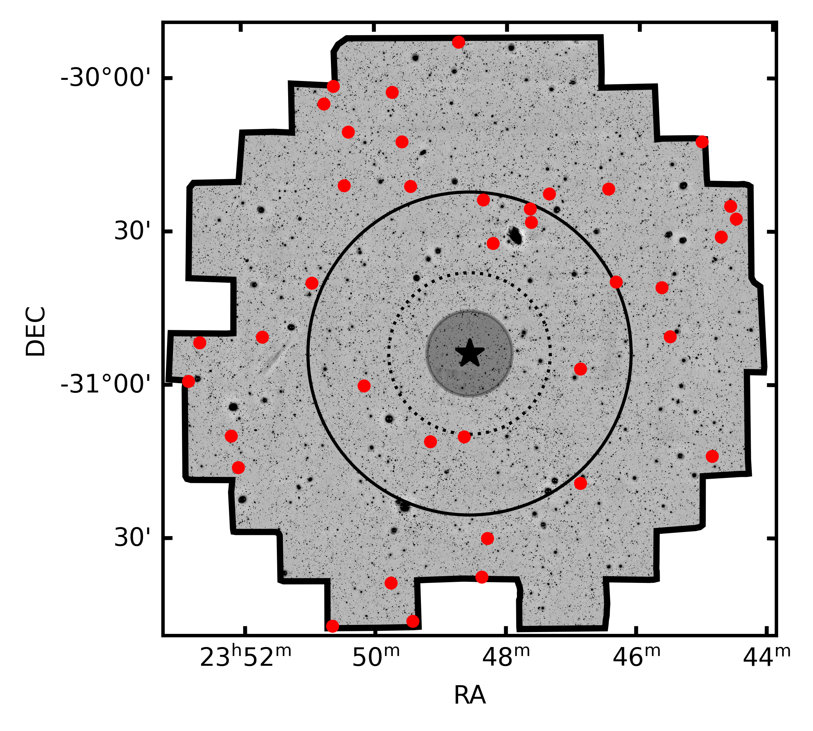
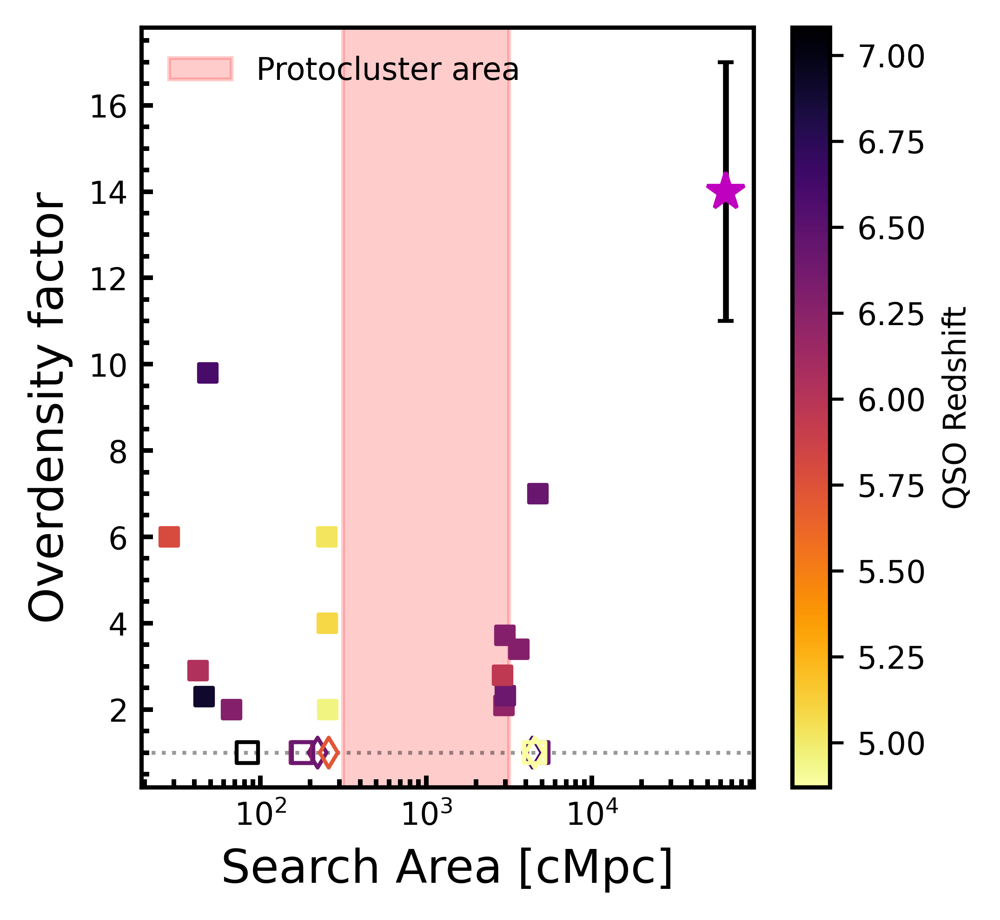
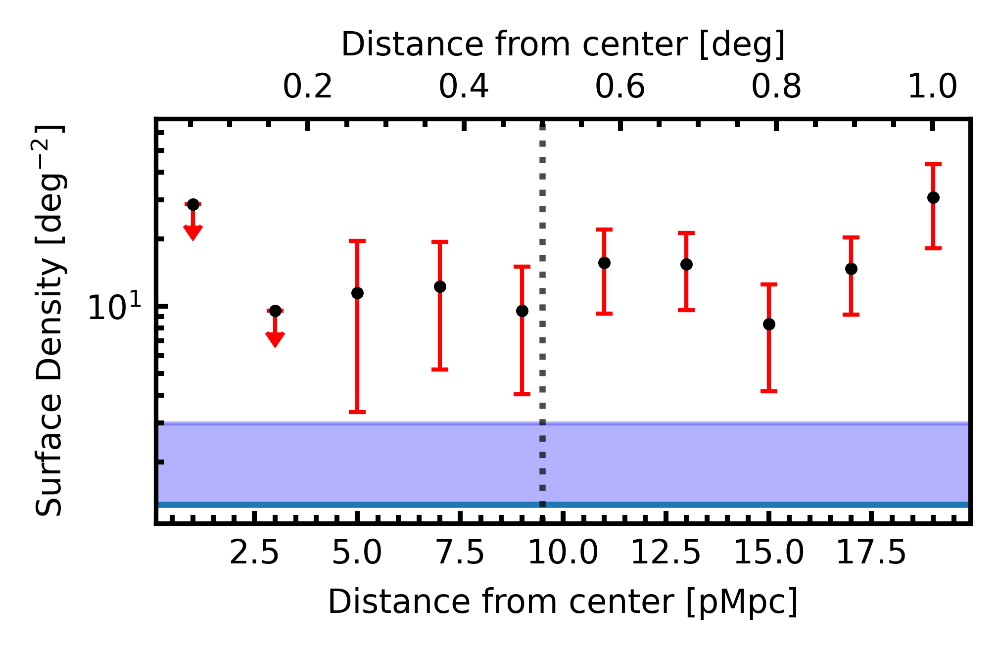

$\newcommand{\ensuremath}{}$
$\newcommand{\xspace}{}$
$\newcommand{\object}[1]{\texttt{#1}}$
$\newcommand{\farcs}{{.}''}$
$\newcommand{\farcm}{{.}'}$
$\newcommand{\arcsec}{''}$
$\newcommand{\arcmin}{'}$
$\newcommand{\ion}[2]{#1#2}$
$\newcommand{\textsc}[1]{\textrm{#1}}$
$\newcommand{\hl}[1]{\textrm{#1}}$
$\newcommand{\footnote}[1]{}$
$\newcommand{\thefigure}{\arabic{figure} (Cont.)}$
$\newcommand{\thefigure}{\arabic{figure} (Cont.)}$
$\newcommand{\thefigure}{\arabic{figure}}$

# A lack of LAEs within 5Mpc of a luminous quasar in an overdensity at z=6.9: potential evidence of quasar negative feedback at protocluster scales

<mark>Appeared on: 2024-02-13</mark> -  _Submitted to A&A. 15 pages, 11 figures_

T. S. Lambert, et al. -- incl., <mark>E. Bañados</mark>

**Abstract:** High-redshift quasars are thought to live in the densest regions of space which should be made evident by an overdensity of galaxies around them. However, campaigns to identify these overdensities through the search of Lyman Break Galaxies (LBGs) and Lyman $\alpha$ emitters (LAEs) have had mixed results. These may be explained by either the small field of view of some of the experiments, the broad redshift ranges targeted by LBG searches, and by the inherent large uncertainty of quasar redshifts estimated from UV emission lines, which makes it difficult to place the Ly- $\alpha$ emission line within a narrowband filter. Here we present a three square degree search ( $\sim 1000$ pMpc) for LAEs around the $z=6.9$ quasar VIK J2348--3054 using the Dark Energy CAMera (DECam), housed on the 4m Blanco telescope, finding 38 LAEs. The systemic redshift of VIK J2348--3054 is known from ALMA [ CII ] observations and place the Ly- $\alpha$ emission line of companions within the NB964 narrowband of DECam. This is the largest field of view LAE search around a $z>6$ quasar conducted to date. We find that this field is $\sim$ 10 times more overdense when compared to the Chandra Deep-Field South, observed previously with the same instrumental setup as well as several combined blank fields. This is strong evidence that VIK J2348--3054 resides in an overdensity of LAEs over several Mpc. Surprisingly, we find a lack of LAEs within 5 physical Mpc of the quasar and take this to most likely be evidence of the quasar suppressing star formation in its immediate vicinity. This result highlights the importance of performing overdensity searches over large areas to properly assess the density of those regions of the Universe.

**Figure 7. -** LAE on-sky distribution around the quasar. The black outline is the area used to identify LAE and is slightly smaller than the full DECam FOV. The star at the image center is the quasar location. The shaded region shows the proximity zone determined by [Mazzucchelli, Bañados and Venemans (2017)](). The inner and outer rings highlight 5 pMpc and 10 pMpc from the quasar respectively, with the later being the maximum scale at which objects are expected to collapse and form clusters at $z=0$ ([Overzier, Guo and Kauffmann 2009]()) . (*fig:on_sky_distribution_us*)

**Figure 4. -** Summary plot of the various studies and results of looking for LAEs and LBGs around high-redshift quasars. Squares are Lyman-break searches and diamonds are Ly-$\alpha$ studies. Filled in values indicate that an overdensity was found, whilst not filled in represents that no overdensity was found. (*fig:chiara_plot*)

**Figure 8. -** Surface density profile as a function of distance from the central quasar. The data were binned using 2 pMpc bins. Red arrows indicate the 1 $\sigma$ upper limits based on non-detections and assuming a Poisson uncertainty. The blue shaded region is the average upper limit for the degraded CDFS data. The dashed line is the maximum theoretical collapse radius found by [Overzier, Guo and Kauffmann (2009)](). (*fig:surface density*)

