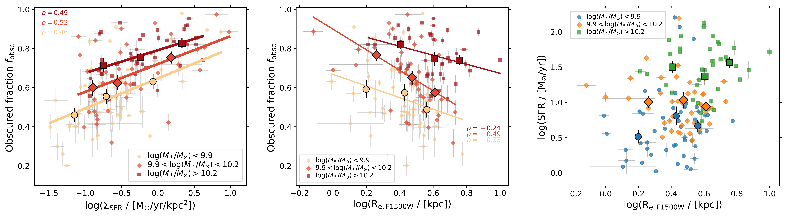
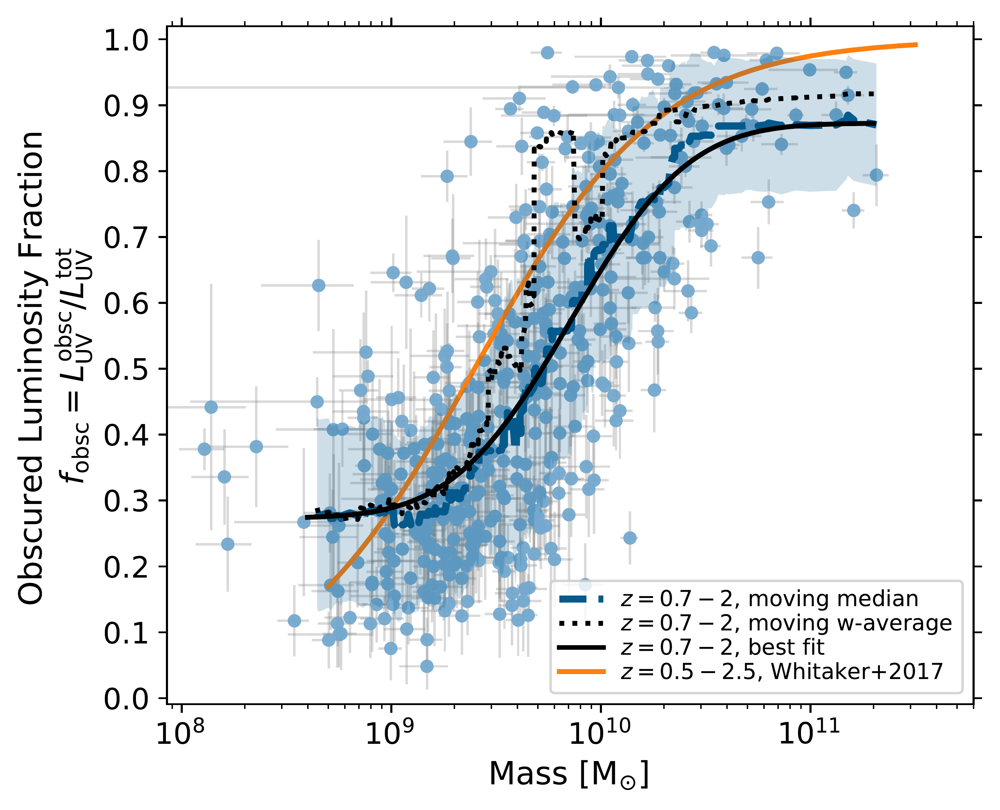
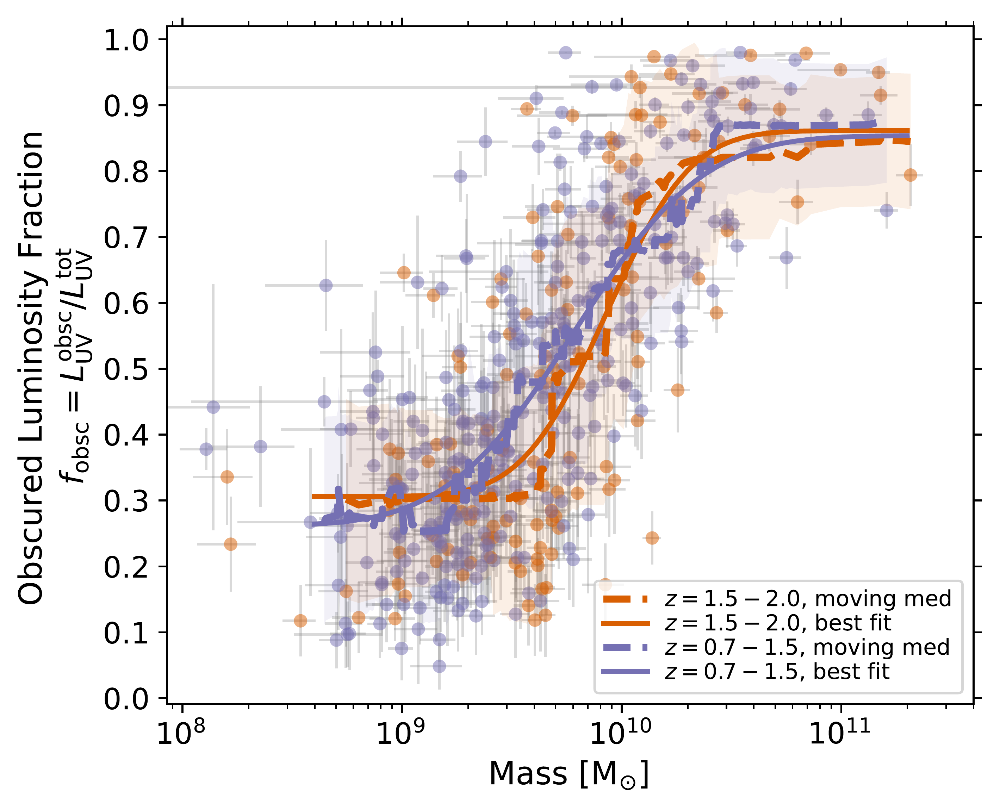
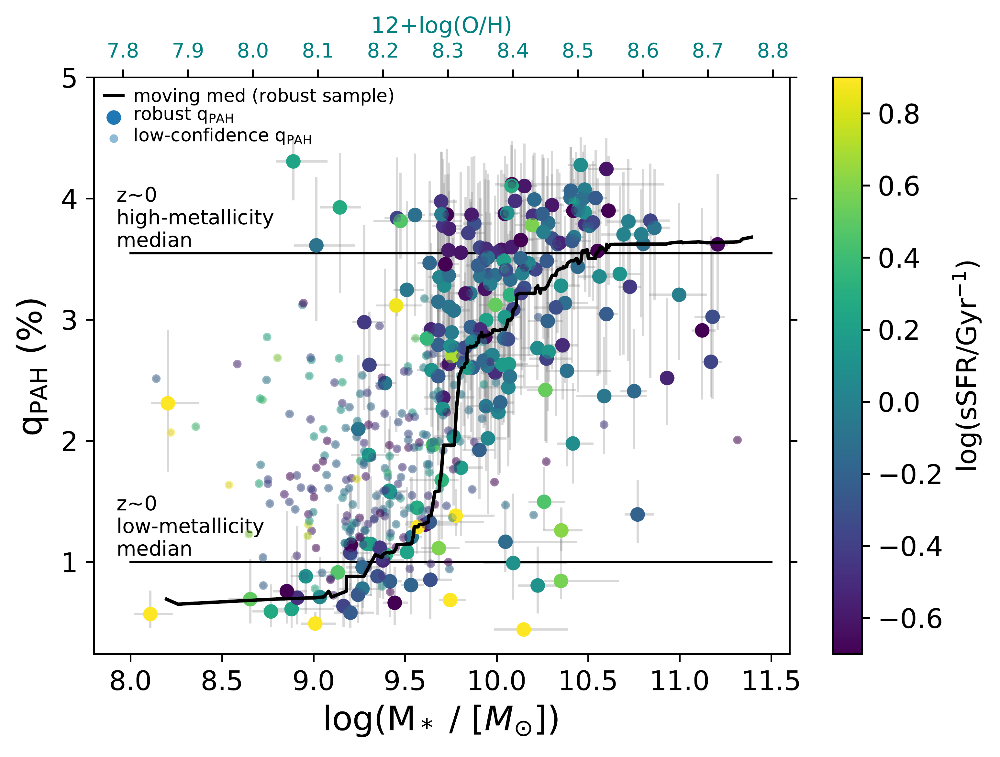

$\newcommand{\ensuremath}{}$
$\newcommand{\xspace}{}$
$\newcommand{\object}[1]{\texttt{#1}}$
$\newcommand{\farcs}{{.}''}$
$\newcommand{\farcm}{{.}'}$
$\newcommand{\arcsec}{''}$
$\newcommand{\arcmin}{'}$
$\newcommand{\ion}[2]{#1#2}$
$\newcommand{\textsc}[1]{\textrm{#1}}$
$\newcommand{\hl}[1]{\textrm{#1}}$
$\newcommand{\footnote}[1]{}$
$\newcommand{\Msun}{ M_{\odot}}$
$\newcommand{\Lsun}{ L_{\odot}}$
$\newcommand{\um}{ \mum}$
$\newcommand{\uJy}{ \muJy}$
$\newcommand{\qpah}{q_{\rm PAH}}$
$\newcommand{\logoh}{12+\log{\rm{(O/H)}}}$
$\newcommand{\fobsc}{f_{\rm obsc}}$
$\newcommand{\Ssfr}{\Sigma_{\rm SFR}}$
$\newcommand{\}{natexlab}$

# A new census of dust and PAHs at $z=0.7-2$ with JWST MIRI   

<mark>Appeared on: 2024-02-14</mark> -  _Submitted to A&A_

I. Shivaei, et al.

**Abstract:** This paper utilizes the James Webb Space Telescope (JWST) Mid-Infrared Instrument (MIRI) to extend the observational studies of dust and Polycyclic Aromatic Hydrocarbon (PAH) emission to a new mass and star formation rate (SFR) parameter space beyond our local universe. The combination of fully sampled SEDs with multiple mid-IR bands and the unprecedented sensitivity of MIRI allows us to investigate dust obscuration and PAH behavior from $z=0.7$ up to $z=2$ in typical main-sequence galaxies. Our focus is on constraining the evolution of PAH strength and dust-obscured luminosity fraction before and during cosmic noon, the epoch of peak star formation activity in the universe. In this study, we utilize MIRI multi-band imaging data from the SMILES survey (5 to 25 ${\um}$ ), complemented with NIRCam photometry from the JADES survey (1 to 5 ${\um}$ ), available HST photometry (0.4 to 0.9 ${\um}$ ), and spectroscopic redshifts from the FRESCO and JADES surveys in GOODS-S for 443 star-forming (non-AGN) galaxies at $z=0.7-2.0$ . This redshift range is chosen to ensure that the MIRI data cover mid-IR dust emission. Our methodology involves employing UV-to-IR energy balance SED fitting to robustly constrain the fraction of dust mass in PAHs and dust obscured luminosity. Additionally, we infer dust sizes from MIRI 15 ${\um}$ imaging data, enhancing our understanding of the physical characteristics of dust within these galaxies. We find a strong correlation between the fraction of dust in PAHs (PAH fraction, ${\qpah}$ ) with stellar mass. Moreover, the PAH fraction behaviour as a function of gas-phase metallicity is similar to that at $z\sim 0$ from previous studies, suggesting a universal relation: ${\qpah}$ is constant ( $\sim 3.4$ \% ) above a metallicity of $Z \sim 0.5 Z_{\odot}$ and decreases to $<1$ \% at metallicities $\lesssim 0.3 Z_{\odot}$ . This indicates that metallicity is a good indicator of the ISM properties that affect the balance between the formation and destruction of PAHs. The lack of a redshift evolution from $z\sim 0-2$ also implies that above $Z\sim 0.5 Z_{\odot}$ , the PAH emission effectively traces obscured luminosity and the previous locally-calibrated PAH-SFR calibrations remain applicable in this metallicity regime. We observe a strong correlation between obscured UV luminosity fraction (ratio of obscured to total luminosity) and stellar mass. Above the stellar mass of $M_*>5\times 10^9$ ${\Msun}$ , on average, more than half of the emitted luminosity is obscured, while there exists a non-negligible population of lower mass galaxies with $>50\%$ obscured fractions. At a fixed mass, the obscured fraction correlates with SFR surface density. This is a result of higher dust covering fractions in galaxies with more compact star forming regions. Similarly, galaxies with high IRX (IR to UV luminosity) at a given mass or UV continuum slope ( $\beta$ ) tend to have higher ${\Ssfr}$ and shallower attenuation curves, owing to their higher effective dust optical depths and more compact star forming regions.

**Figure 13. -** Obscured luminosity fraction as a function of {$\Ssfr$}(using F1500W sizes) and F1500W effective radius (middle) for the F1500W spatially resolved sample (the filter FWHM is 0.5 arcsec). At a given mass, {$\fobsc$} increases with {$\Ssfr$} and decreases with rest-frame mid-IR (dust) radii. Right panel shows SFR versus F1500W size for the same sample. The near constant SFR with ${\rm R_{e,F1500W}}$ in each mass bin indicates that the relationship between {$\fobsc$} and size is independent of SFR.
    Individual measurements are shown with small symbols and color-coded in three stellar mass bins with the same number of galaxies, shown in the legend. In each mass bin, average values in bins of the parameter on the x-axis are shown with larger symbols with the corresponding shape and color of the mass bin. Pearson correlation coefficients ($\rho$) are shown in the corners of the plots with corresponding colors of each mass bin.  Linear fits to the average values of {$\fobsc$} versus $\log$({$\Ssfr$}) are shown in the left panel. The fit parameters are in Table \ref{table:fobsc}.  (*fig:obsc_frac*)

**Figure 12. -** Obscured luminosity fraction as a function of stellar mass for the full sample (left) and separated by redshift (right). Obscured fraction is defined as the obscured UV to total (intrinsic) UV luminosity at 1550 {Å}, inferred from the best-fit UV-to-IR SEDs.
    We show the moving median (dashed thick lines), moving weighted-average (dotted line) and best-fit curve (solid lines) to the samples at $M_*>4\times10^8${$\Msun$}, where the data is mass-complete.
    In the left panel, we also show the \citet{whitaker17} fit to $z= 0.5-2.5$ with an orange curve. The \citet{whitaker17} study was based on Spitzer/MIPS data with a wider area but biased to more obscured systems.
    Our weighted-average trend is also dominated by the heavily obscured systems, and therefore similar to the \citep{whitaker17} curve. However, the median trend that is more representative of the full population captured by the deeper MIRI data (relative to the MIPS data) is systematically lower.
    Furthermore, as shown in the right panel, there is no redshift evolution in this relation in our sample.
     (*fig:obsc_frac_w17*)

**Figure 8. -** PAH mass fraction (left) and luminosity fraction (right) as a function of stellar mass. Moving median (black curve) is shown for the robust {$\qpah$} sample (see Section \ref{sec:final-sample} for the definition of samples), and all galaxies are color-coded by sSFR. In the left panel, vertical lines show the median PAH mass fractions of $z\sim 0$ galaxies with {$\logoh$}$<8.1$ and $>8.1$ from \citet{draine07b}. On the top x-axes, we also show the estimated metallicities from the O3N2-based mass-metallicity relation (MZR) of \cite{topping21} at $z\sim 1.5$, and assuming the \cite{pp04} calibration. The $z\sim 0.7-2$ sample has a very similar {$\qpah$}-metallicity behaviour to that inferred at $z\sim 0$.
     (*fig:pah-mass*)

