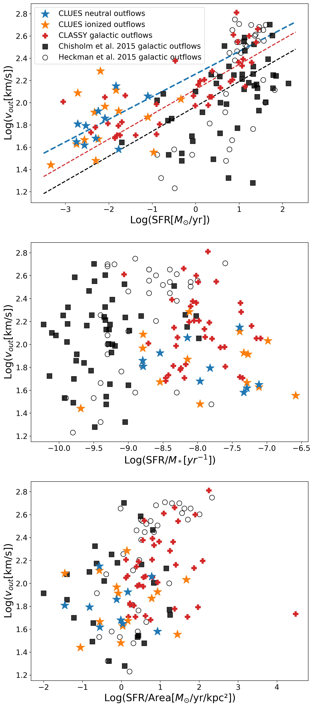

$\newcommand{\ensuremath}{}$
$\newcommand{\xspace}{}$
$\newcommand{\object}[1]{\texttt{#1}}$
$\newcommand{\farcs}{{.}''}$
$\newcommand{\farcm}{{.}'}$
$\newcommand{\arcsec}{''}$
$\newcommand{\arcmin}{'}$
$\newcommand{\ion}[2]{#1#2}$
$\newcommand{\textsc}[1]{\textrm{#1}}$
$\newcommand{\hl}[1]{\textrm{#1}}$
$\newcommand{\footnote}[1]{}$
$\newcommand{\vdag}{(v)^\dagger}$
$\newcommand$
$\newcommand$
$\newcommand{\HI}{\mbox{H~{\sc i}}}$
$\newcommand{\HII}{\mbox{H~{\sc ii}}}$
$\newcommand{\AlII}{\mbox{Al~{\sc ii}}}$
$\newcommand{\SiIII}{\mbox{Si~{\sc iii}}}$
$\newcommand{\SiII}{\mbox{Si~{\sc ii}}}$
$\newcommand{\SII}{\mbox{S~{\sc ii}}}$
$\newcommand{\CII}{\mbox{C~{\sc ii}}}$
$\newcommand{\CIII}{\mbox{C~{\sc iii}}}$
$\newcommand{\SiIV}{\mbox{Si~{\sc iv}}}$
$\newcommand{\CIV}{\mbox{C~{\sc iv}}}$
$\newcommand{\NII}{\mbox{N~{\sc ii}}}$
$\newcommand{\NV}{\mbox{N~{\sc v}}}$
$\newcommand{\SV}{\mbox{S~{\sc v}}}$
$\newcommand{\msun}{\hbox{M_\odot}}$

# CLusters in the Uv as EngineS (CLUES). II. Sub-kpc scale outflows driven by stellar feedback

<mark>Appeared on: 2024-02-19</mark> -  _Accepted for publication on the Astronomical Journal on 14th February 2024. 32 pages, 13 figures_

M. Sirressi, et al. -- incl., <mark>E. Schinnerer</mark>

**Abstract:** We analyze the far-ultraviolet (FUV, 1130 $\rm Å$ to 1770 $\rm Å$ restframe) spectroscopy of 20 young ( $<$ 50 Myr) and massive ( $>10^4$ $\msun$ ) star clusters (YSCs) in 11 nearby star-forming galaxies. We probe the interstellar gas intervening along the line of sight, detecting several metal absorption lines of a wide range of ionization potentials, from 6.0 eV to 77.5 eV.Multiple-component Voigt fits to the absorption lines are used to study the kinematics of the gas. We find that nearly all targets in the sample feature gas outflowing from 30 km s $^{-1}$ up to 190 km s $^{-1}$ , often both in the neutral and ionized phase. The outflow velocities correlate with the underlying stellar population properties directly linked to the feedback: the mass of the YSCs, the photon production rate and the instantaneous mechanical luminosity produced by stellar winds and SNe. We detect a neutral inflow in 4 targets, which we interpret as likely not associated with the star cluster but tracing larger scale gas kinematics. A comparison between the outflows’ energy and that produced by the associated young stellar populations suggests an average coupling efficiency of 10 \% with a broad scatter.Our results extend the relation found in previous works between galactic outflows and the host galaxy star-formation rate to smaller scales, pointing towards the key role that clustered star formation and feedback play in regulating galaxy growth.

**Figure 4. -** Outflow velocities plotted against (from top to bottom): the SFR, the SFR per unit stellar mass and the SFR per unit area. The data points plotted are taken from three different samples: in blue and orange the CLUES neutral and ionized outflows respectively, in red the CLASSY galactic outflows \citep{Xu2022}, the empty circles represent the data points of \cite{Heckman2015}, the black squares the data points of \cite{Chisholm2015}. In the top panel we report the least-square linear regression fit for the black squares points, the blue points and the red crosses, separately. (*fig:sfr*)

**Figure 12. -** Outflow velocities plotted against six different stellar properties: age of young stellar population, mass of the young stellar population, mechanical luminosity of stellar winds, mechanical luminosity of SNe, photon production rate and total mechanical luminosity from stellar winds and SNe. The blue data points represent the neutral gas, whereas the orange data points represent the ionized gas. Hollow markers (NGC1566-YSC2, NGC4485-YSC2, NGC1566-YSC1, NGC7793-YSC2, NGC1313-YSC2, NGC4656-YSC1) indicate the targets with an age uncertainty larger than 25\%, which gives a sense of which data points are the most uncertain in all the plots. Error bars for the outflow velocities are plotted. $\tau$ and p are two parameters of the Kendall statistics performed to assess the presence or lack of correlation (see text). (*fig:correlations*)

**Figure 11. -** Best-fit values of the multi-component Voigt fit analysis of the interstellar gas kinematics. The panels from left to right show the central velocity, the column density of $\SiII$$ $ and $\SiIV$$ $ and the $b$ parameter of the outflow and inflow components detected). The blue circles represent the neutral gas traced by $\SiII$, the orange stars represent the ionized gas traced by $\SiIV$. The empty blue circles mark the gas components inflowing towards the target star cluster. M51-YSC1 is the exception target for which we used $\CIV$$ $ instead of $\SiIV$. The targets are sorted by the age of the FUV dominant stellar population (*fig:voigtfit*)

