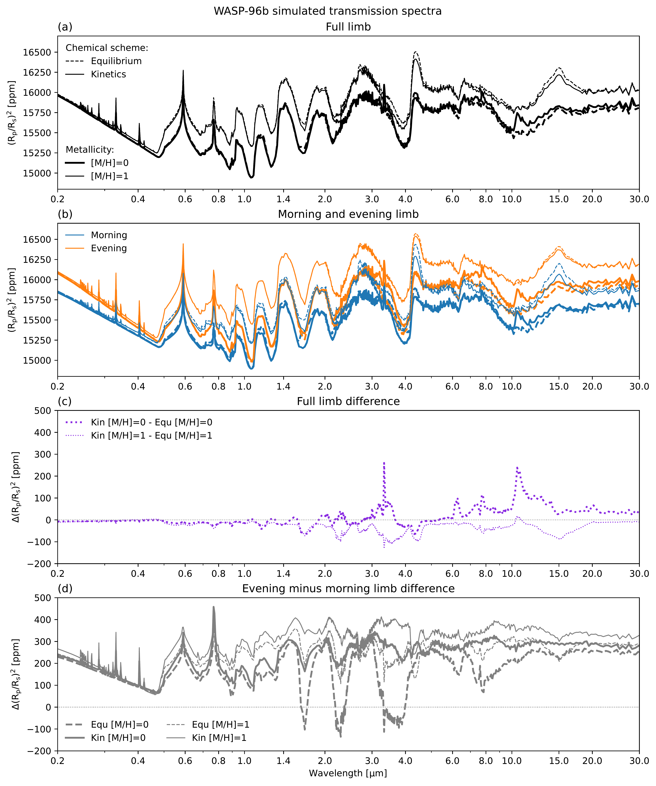
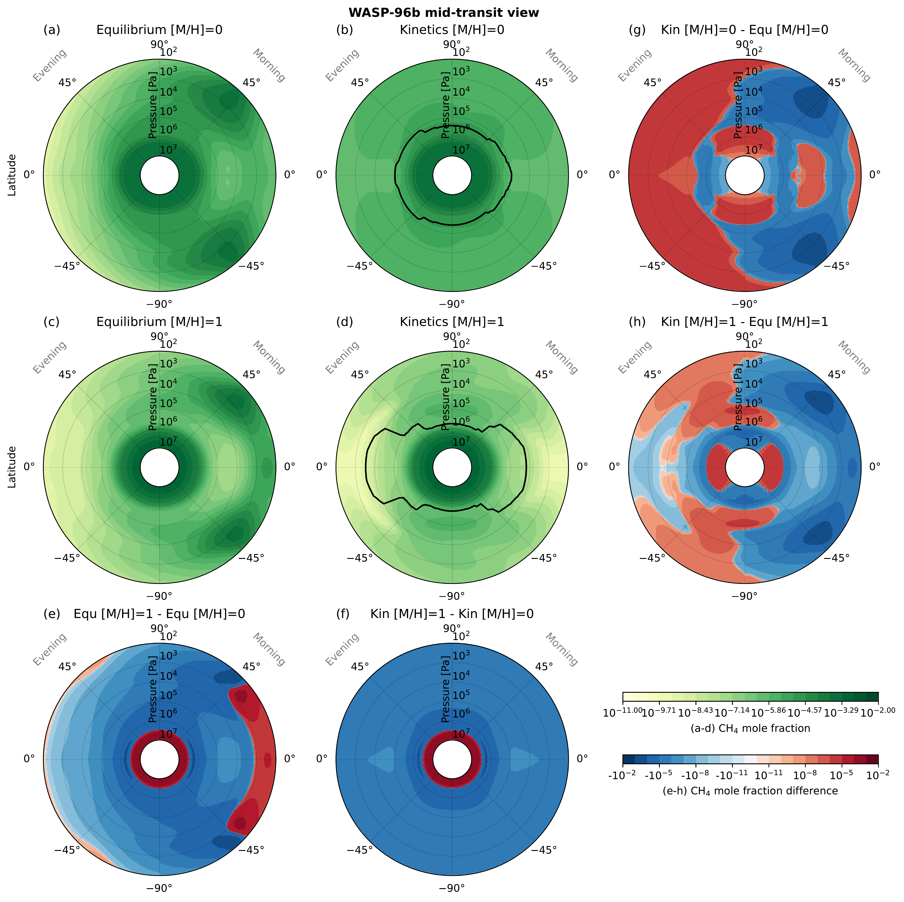
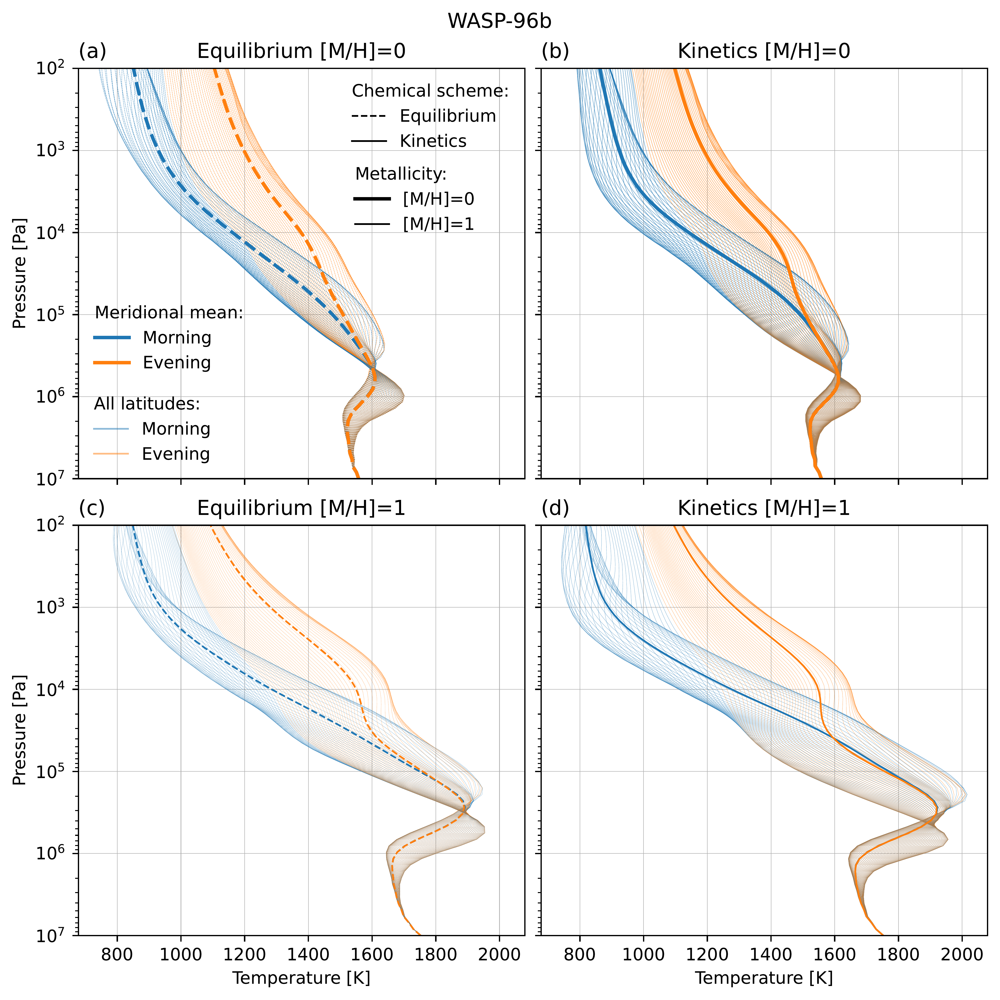

$\newcommand{\ensuremath}{}$
$\newcommand{\xspace}{}$
$\newcommand{\object}[1]{\texttt{#1}}$
$\newcommand{\farcs}{{.}''}$
$\newcommand{\farcm}{{.}'}$
$\newcommand{\arcsec}{''}$
$\newcommand{\arcmin}{'}$
$\newcommand{\ion}[2]{#1#2}$
$\newcommand{\textsc}[1]{\textrm{#1}}$
$\newcommand{\hl}[1]{\textrm{#1}}$
$\newcommand{\footnote}[1]{}$
$\newcommand{\thebibliography}{\DeclareRobustCommand{\VAN}[3]{##3}\VANthebibliography}$

# Quenching-driven equatorial depletion and limb asymmetries in hot Jupiter atmospheres: WASP-96b example

<mark>Appeared on: 2024-02-23</mark> -  _accepted to MNRAS, 27 pages, 24 figures_

M. Zamyatina, et al. -- incl., <mark>E.-M. Ahrer</mark>

**Abstract:** Transport-induced quenching in hot Jupiter atmospheres is a process that determines the boundary between the part of the atmosphere at chemical equilibrium and the part of the atmosphere at thermochemical (but not photothermochemical) disequilibrium. The location of this boundary, the quench level, depends on the interplay between the dynamical and chemical timescales in the atmosphere, with quenching occurring when these timescales are equal. We explore the sensitivity of the quench level position to an increase in the planet's atmospheric metallicity using aerosol-free 3D GCM simulations of a hot Jupiter WASP-96b. We find that the temperature increase at pressures of $\sim$ $\SIrange{e4}{e7}{\pascal}$ that occurs when metallicity is increased could shift the position of the quench level to pressures dominated by the jet, and cause an equatorial depletion of $\ce{CH4}$ , $\ce{NH3}$ and $\ce{HCN}$ . We discuss how such a depletion affects the planet's transmission spectrum, and how the analysis of the evening-morning limb asymmetries, especially within $\sim$ $\SIrange{3}{5}{\micro\metre}$ , could help distinguish atmospheres of different metallicities that are at chemical equilibrium from those with the upper layers at thermochemical disequilibrium.

**Figure 6. -** WASP-96b transmission spectra predicted by the Met Office Unified Model equilibrium and kinetics simulations assuming $[M/H]=0$ or $[M/H]=1$. Panel (a) shows the full limb (morning plus evening) spectra, and (b) the morning and evening limb spectra. Panel (c) shows the difference between the full limb spectra due to the disequilibrium thermochemistry, and panel (d) shows the difference between evening and morning limb spectra (evening minus morning). Faint grey dotted lines indicate the location of zero to better guide the eye. (*fig:wasp96b_transpec_wl02_30_combores_full_mor_eve*)

**Figure 4. -** Pressure-\ce{CH4} cross-sections through WASP-96b's limb ("mid-transit view") according to the equilibrium and kinetics simulations assuming $[M/H]=0$ or $[M/H]=1$. Panels (a-d) show \ce{CH4} distribution in each simulation. Panels (e-f) show the difference caused by an increase in metallicity, and (g-h) the difference caused by disequilibrium thermochemistry. Panels (a-d) and (e-h) share the top and bottom colour scale in the bottom right of the figure, respectively. The black thick lines in panels (b) and (d) indicate the location of \ce{CH4} quench level. All panels show variable distributions at longitudes \ang{90}E and \ang{270}E exactly (not the average over the opening angle). (*fig:wasp96b_pres_ch4_in_transit*)

**Figure 11. -** Pressure-temperature vertical profiles at the morning and evening limb from the WASP-96b equilibrium and kinetics simulations assuming $[M/H]=0$ or $[M/H]=1$. (*fig:wasp96b_vp_pres_temp_limbs*)

