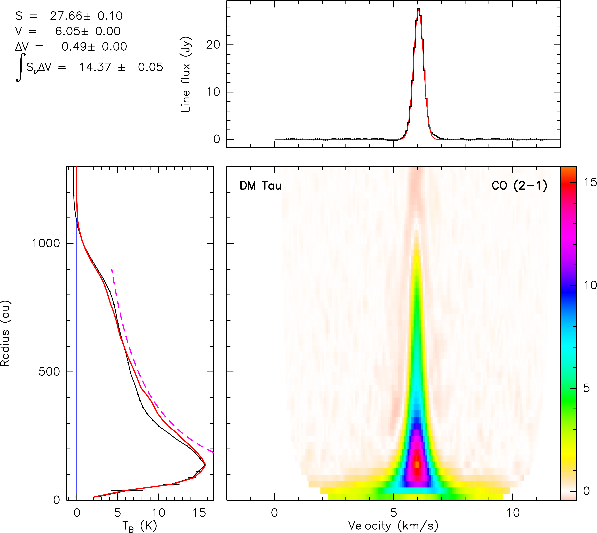
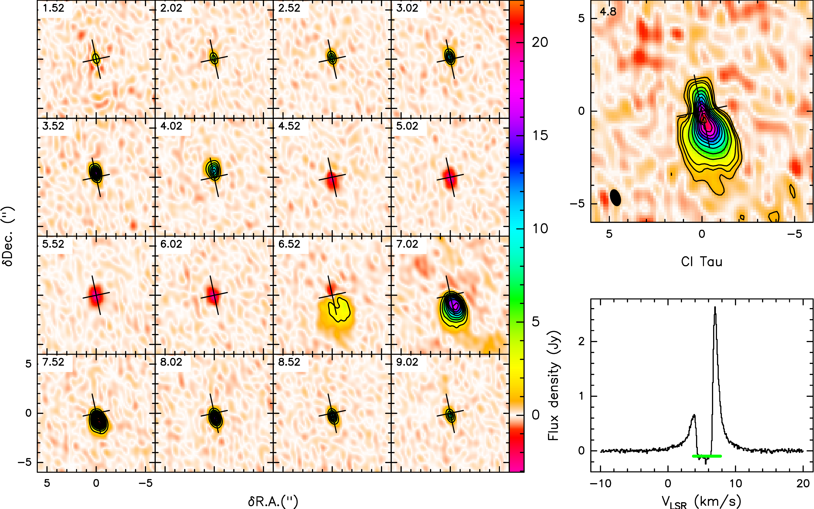

$\newcommand{\ensuremath}{}$
$\newcommand{\xspace}{}$
$\newcommand{\object}[1]{\texttt{#1}}$
$\newcommand{\farcs}{{.}''}$
$\newcommand{\farcm}{{.}'}$
$\newcommand{\arcsec}{''}$
$\newcommand{\arcmin}{'}$
$\newcommand{\ion}[2]{#1#2}$
$\newcommand{\textsc}[1]{\textrm{#1}}$
$\newcommand{\hl}[1]{\textrm{#1}}$
$\newcommand{\footnote}[1]{}$
$\newcommand{\setvalue}[1]{\pgfkeys{/variables/#1}}$
$\newcommand{\getvalue}[1]{\pgfkeysvalueof{/variables/#1}}$
$\newcommand{\declare}[1]{$
$ \pgfkeys{$
$  /variables/#1.is family,$
$  /variables/#1.unknown/.style = {\pgfkeyscurrentpath/\pgfkeyscurrentname/.initial = ##1}$
$ }$
$}$
$\newcommand$
$\newcommand$
$\newcommand{\textsg}[1]{\textcolor{black}{#1}}$
$\newcommand{\textds}[1]{\textcolor{black}{#1}}$
$\newcommand{\upd}[1]{\textcolor{black}{#1}}$
$\newcommand{\sgupd}[1]{\textcolor{black}{#1}}$
$\newcommand{\setvalue}[1]{\pgfkeys{/variables/#1}}$
$\newcommand{\getvalue}[1]{\pgfkeysvalueof{/variables/#1}}$
$\newcommand{\declare}[1]{$
$ \pgfkeys{$
$  /variables/#1.is family,$
$  /variables/#1.unknown/.style = {\pgfkeyscurrentpath/\pgfkeyscurrentname/.initial = ##1}$
$ }$
$}$
$\newcommand$
$\newcommand$
$\newcommand{\textsg}[1]{\textcolor{black}{#1}}$
$\newcommand{\textds}[1]{\textcolor{black}{#1}}$
$\newcommand{\upd}[1]{\textcolor{black}{#1}}$
$\newcommand{\sgupd}[1]{\textcolor{black}{#1}}$

# PRODIGE - Planet-forming disks in Taurus with NOEMA.

<mark>Appeared on: 2024-02-23</mark> -  _47 pages, 10 figures, accepted for publication by A&A_

<mark>D. Semenov</mark>, et al. -- incl., <mark>K. Schwarz</mark>, <mark>S. v. Terwisga</mark>

**Abstract:** Physics and chemistry of planet-forming disks are far from being fully understood. $\upd{To make further progress, both broad line surveys and observations of individual tracers in}$ a statistically-significant number of disks are required. We are performing a line survey of $\upd{8 planet-forming Class II disks in Taurus}$ with the IRAM NOrthern Extended Millimeter Array (NOEMA), as a part of the MPG-IRAM Observatory Program PRODIGE (PROtostars and DIsks: Global Evolution; PIs: P. Caselli and Th. Henning). Compact and extended disks around T Tauri stars CI, CY, DG, DL, DM, DN, IQ Tau, and UZ Tau E are observed $\upd{in $\sim 80$ lines from $>20$ C-, O,- N-, and S-bearing species.}$ The observations $\upd{in four spectral settings at 210-280 GHz with $1\sigma$ rms sensitivity}$ of $\sim 8-12$ mJy/beam at $0.9\arcsec$ and 0.3 km s $^{-1}$ resolution $\upd{will be completed in 2024.The $uv$-visibilities}$ are fitted with the DiskFit model to obtain key stellar and disk properties. $\upd{In this first paper, the combined $^{12}$CO, $^{13}$CO and C$^{18}$O $J=2-1$ data are presented. We find that the CO fluxes and disk masses inferred from dust continuum tentatively correlate with the CO emission sizes. We constrain dynamical stellar masses, geometries, temperatures, the CO column densities and gas masses for each disk.}$ The best-fit temperatures $\upd{at 100 au}$ are $\sim 17-37$ K, $\upd{and decrease radially with the power-law exponent $q \sim 0.05-0.76$. The inferred CO column densities decrease radially with the power-law exponent $p \sim 0.2-3.1$. The gas masses estimated from $^{13}$CO (2-1) are $\sim 0.001 - 0.2 M_\odot$.}$ $\upd{Using NOEMA, we confirm the presence of temperature gradients in our disk sample. The best-fit CO column densities point to severe CO freeze-out in these disks. The DL Tau disk is an outlier, and has either stronger CO depletion or lower gas mass than the rest of the sample. The CO isotopologue ratios are roughly consistent with the observed values in disks and the low-mass star-forming regions. The high $^{13}$CO/C$^{18}$O ratio of $\sim 23$ in DM Tau could be indicative of strong selective photodissociation of C$^{18}$O in this disk. }$

**Figure 16. -** Observations of $^{12}$CO (2-1) emission in the DM Tau disk. Shown is a pixel-deprojected Keplerian plot consisting of the three panels: (left) the radial profile of the line brightness temperature (K) $\upd${with observations and errorbars in black, and profile derived from the best-fit disk model in red. The magenta dashed curve indicates the expected brightness temperature of an optically thick line derived from temperature power law}. (Top) the integrated spectrum (black line) overlaid with the best-fit Gaussian profile (red line). (Bottom right) aligned and stacked line intensity (K) as a function of disk radius (Y-axis; au) and velocity (X-axis; km s$^{-1}$). The color bar units are in Kelvin. (*fig:DM_Tau-CO_kepl*)

**Figure 22. -** Observations of $^{12}$CO (2-1) emission in the DM Tau disk. Shown is a pixel-deprojected Keplerian plot consisting of the three panels: (left) the radial profile of the line brightness temperature (K) $\upd${with observations and errorbars in black, and profile derived from the best-fit disk model in red. The magenta dashed curve indicates the expected brightness temperature of an optically thick line derived from temperature power law}. (Top) the integrated spectrum (black line) overlaid with the best-fit Gaussian profile (red line). (Bottom right) aligned and stacked line intensity (K) as a function of disk radius (Y-axis; au) and velocity (X-axis; km s$^{-1}$). The color bar units are in Kelvin. (*fig:DM_Tau-CO_kepl*)

**Figure 26. -** The observed $^{12}$CO (2-1) emission in the CI Tau disk.
Shown are the channel map of the observed line brightness distribution (top left), the moment-zero map (top right), and the integrated spectrum (top middle). The channel map shows 16 velocity channels with a step of $0.5$ km s$^{-1}$ in the [-4.5, +4.5] km s$^{-1}$ range around the systemic velocity. The contour lines start at $2$ K, with a step of $2$ K. The color bar shows line brightness temperatures (K). The contour lines in the moment-zero plot start at 3, 6, and $9\sigma$, with a step of $6\sigma$ afterward. The $1\sigma$ rms noise (mJy km s$^{-1}$) is shown in the upper left corner of the moment-zero plot, and the synthesized beam is depicted by the dark ellipse in the left bottom corner. The $^{12}$CO (2-1) spectrum shows a nearly absent blueshifted velocity component due to the cloud absorption. (*fig:CI_Tau-CO_comp*)

