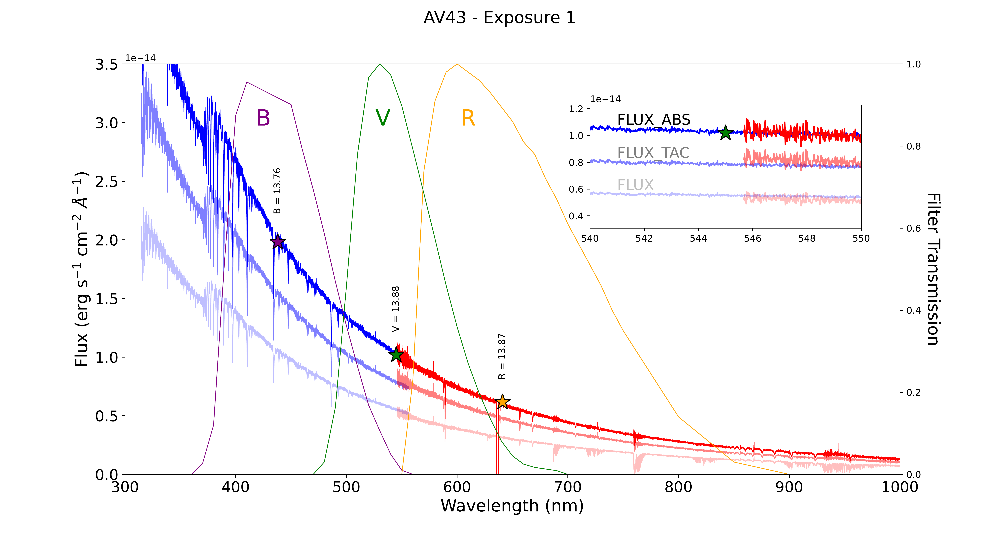
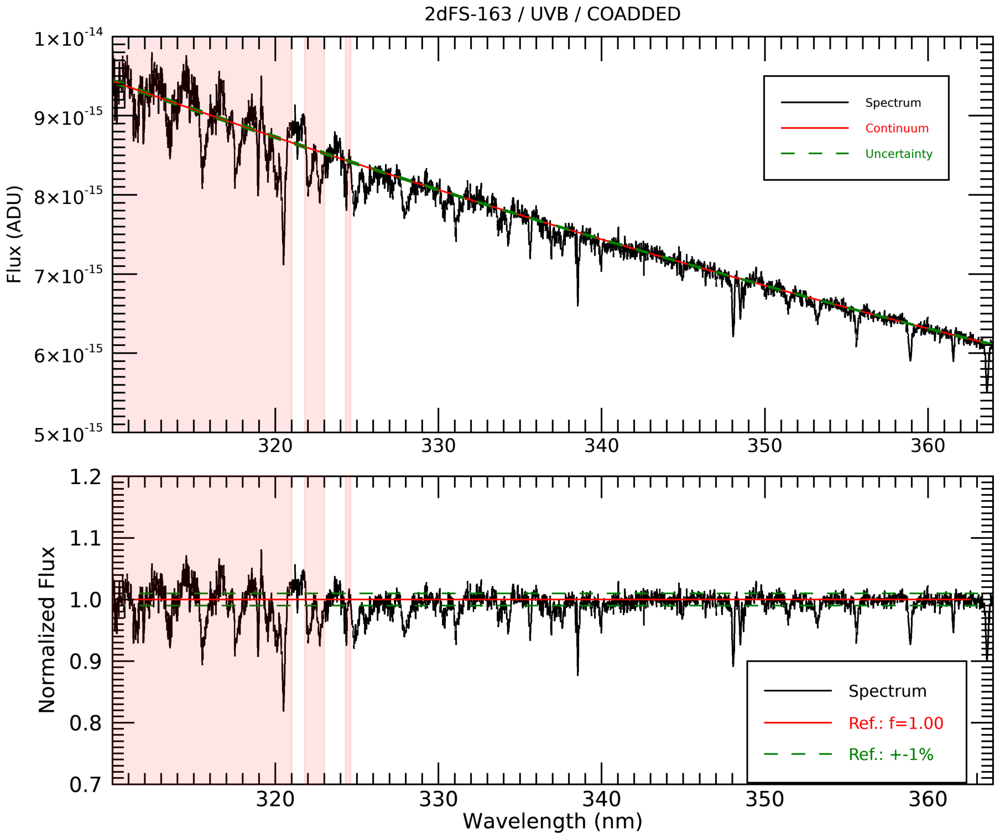
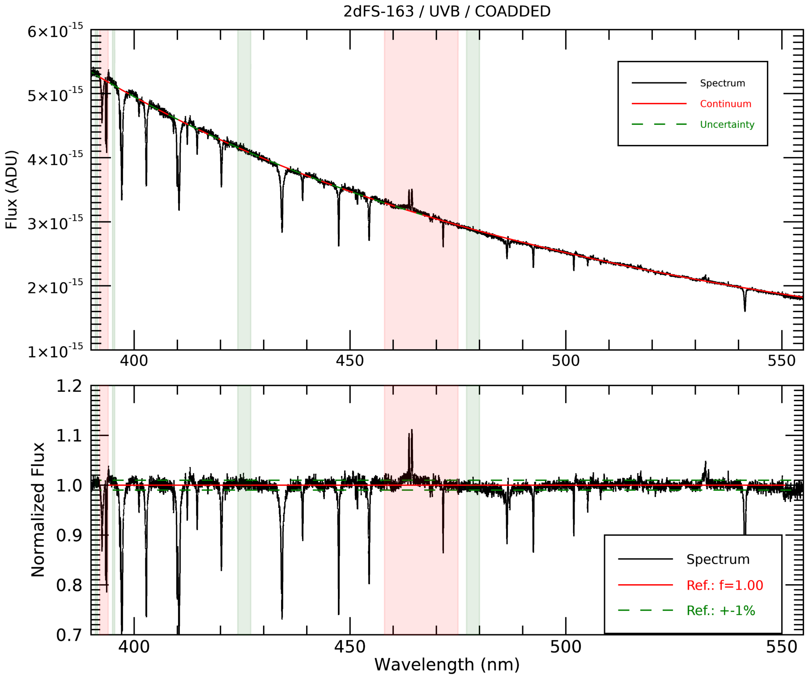
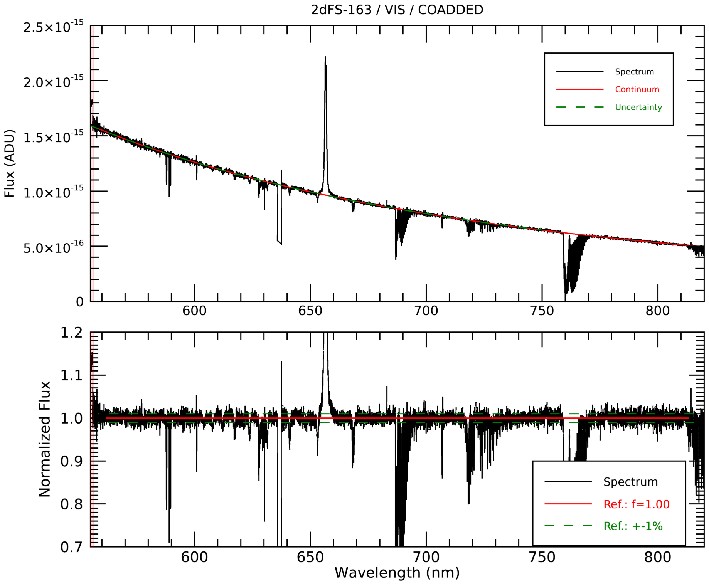
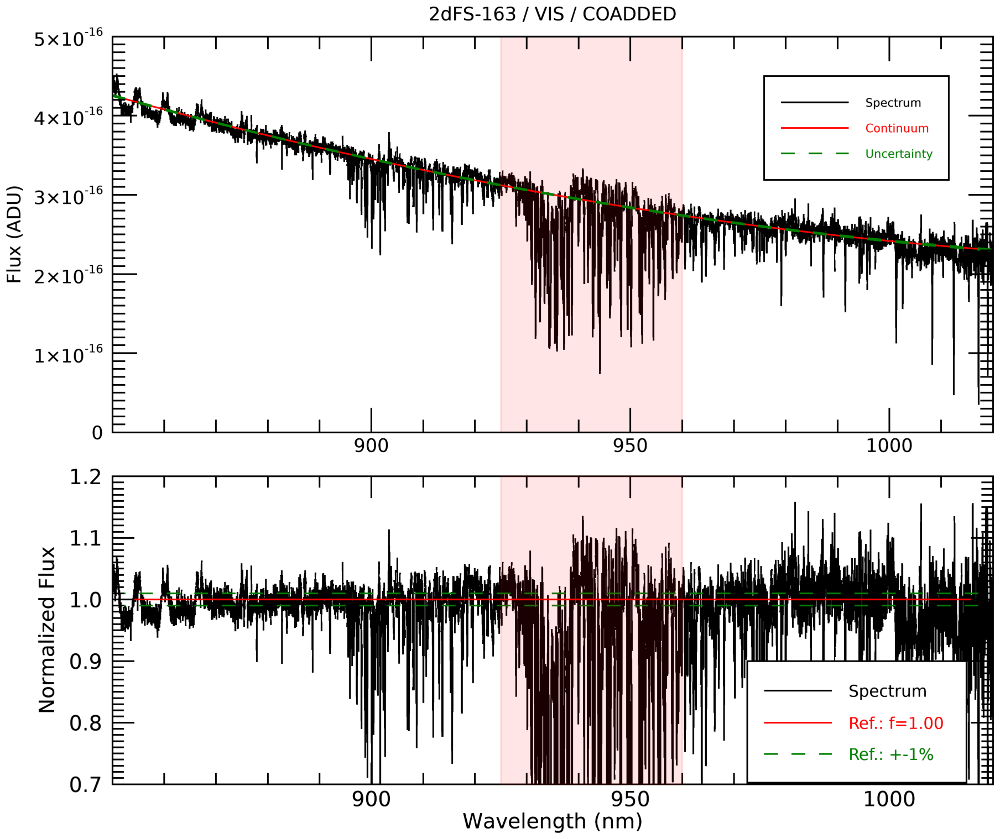
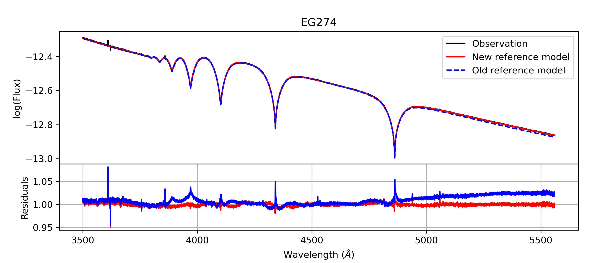
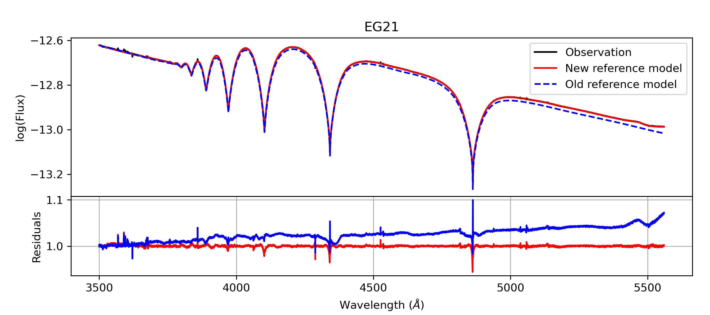

$\newcommand{\ensuremath}{}$
$\newcommand{\xspace}{}$
$\newcommand{\object}[1]{\texttt{#1}}$
$\newcommand{\farcs}{{.}''}$
$\newcommand{\farcm}{{.}'}$
$\newcommand{\arcsec}{''}$
$\newcommand{\arcmin}{'}$
$\newcommand{\ion}[2]{#1#2}$
$\newcommand{\textsc}[1]{\textrm{#1}}$
$\newcommand{\hl}[1]{\textrm{#1}}$
$\newcommand{\footnote}[1]{}$
$\newcommand{\kms}{km s^{-1}}$
$\newcommand{\cms}{cm s^{-2}}$
$\newcommand{\ergscm}{erg s^{-1} cm^{-2}}$
$\newcommand{\ergs}{erg s^{-1}}$
$\newcommand{\lsol}{L_{\odot}}$
$\newcommand{\lsun}{L_{\odot}}$
$\newcommand{\Lsun}{L_{\odot}}$
$\newcommand{\Msun}{M_{\odot}}$
$\newcommand{\msun}{M_{\odot}}$
$\newcommand{\msunyr}{M_{\odot} yr^{-1}}$
$\newcommand{\msol}{M_{\odot}}$
$\newcommand{\rsol}{R_{\odot}}$
$\newcommand{\rsun}{R_{\odot}}$
$\newcommand{\Rsun}{R_{\odot}}$
$\newcommand{\teff}{T_\mathrm{eff}}$
$\newcommand{\logg}{\log g}$
$\newcommand{\mdot}{M_\odot}$
$\newcommand{\vinf}{v_\infty}$
$\newcommand{\vsini}{\varv \sin i}$
$\newcommand{\ha}{H{\alpha}}$
$\newcommand{\halpha}{H{\alpha}}$
$\newcommand{\hb}{H{\beta}}$
$\newcommand{\hbeta}{H{\beta}}$
$\newcommand{\hdelta}{H{\delta}}$
$\newcommand{\hgamma}{H{\gamma}}$
$\newcommand{\l}{\lambda}$
$\newcommand{\hea}{\ion{He}{i}}$
$\newcommand{\heb}{\ion{He}{ii}}$
$\newcommand{\snr}{S/N}$
$\newcommand{\xsh}{X-shooter}$
$\newcommand{\xshooter}{X-shooter}$
$\newcommand{\ullyses}{{\sc ULLYSES}}$
$\newcommand{\xshootu}{XShootU}$
$\newcommand{\sci}{{\sc science}}$
$\newcommand{\flat}{{\sc ff}}$
$\newcommand{\ff}{{\sc ff}}$
$\newcommand{\raw}{{\sc raw}}$
$\newcommand{\flux}{{\sc flux}}$
$\newcommand{\science}{{\sc science}}$
$\newcommand{\errs}{{\sc errs}}$
$\newcommand{\qual}{{\sc qual}}$

# X-Shooting ULLYSES: Massive Stars at low metallicity$\thanks{Based on observations collected at the European Southern Observatory under ESO program ID 106.211Z.001.}$$^,$$\thanks{Tables \ref{t:targets}, \ref{t:journal} and \ref{t:RV_results} are only available in electronic form at the CDS via anonymous ftp to cdsarc.u-strasbg.fr (130.79.128.5) or via \url{http://cdsweb.u-strasbg.fr/cgi-bin/qcat?J/A+A/}.}$

<mark>Appeared on: 2024-02-28</mark> -  _22 pages, 19 figures; accepted for publication in Astronomy & Astrophysics. Links to online tables and databases will be included upon publication_

H. Sana, et al. -- incl., <mark>C. Larkin</mark>

**Abstract:** The $\xshootu$ project aims to obtain ground-based optical to near-infrared spectroscopy of all targets observed by the $_ Hubble Space Telescope (HST)_$ under the Director's Discretionary program $\ullyses$ .  Using the medium resolution spectrograph $\xshooter$ , spectra of 235 OB and Wolf-Rayet (WR) stars  in sub-solar metallicity environments have been secured. The bulk of the targets belong to the Large and Small Magellanic Clouds, with the exception of three stars in NGC 3109 and Sextans A. This second paper of the series focuses on the optical  observations of Magellanic Clouds targets. It describes the uniform reduction of the UVB ( $300-560$ nm) and VIS ( $550-1020$ nm) $\xshootu$ data  as well as the preparation of advanced data products that are suitable for homogeneous scientific analyses. The data reduction of the $\raw$ data is based on  the ESO CPL $\xshooter$ pipeline. We paid particular attention to the determination of the response curves. This required equal flat-fielding of the science and flux standard star data and the derivation of improved flux standard models.   The pipeline products were then processed with our own set of routines to produce a series of advanced data products.  In particular, we  implemented slit-loss correction, absolute flux calibration, (semi-)automatic rectification to the continuum, and a correction for telluric lines. The spectra of individual epochs were further corrected for the barycentric motion, re-sampled and co-added, and the spectra from the two arms were merged into a single flux calibrated spectrum covering the entire optical range with maximum signal-to-noise ratio. We identify and describe an undocumented recurrent ghost visible on the $\raw$ data. We present an improved flat-fielding strategy that limits artefacts when the $\science$ and $\flux$ standard stars are observed on different nights.   The improved $\flux$ standard models and the new grid of anchor points allow to limit artefacts of the response curve correction on, e.g., the shape of the wings of the Balmer lines, from a couple of per cent  of the continuum level to less than 0.5 \% .   We confirm the presence of a radial velocity shift of about 3.5 $\kms$ between the UVB and the VIS arm of $\xshooter$ and that there is no short term variations impacting the RV measurements. RV precision better than 1 $\kms$ can be obtained on sharp telluric lines while RV precision of the order of 2 to 3 $\kms$ are obtained on data with the best $\snr$ . For each target observed by $\xshootu$ , we provide three types of data products: (i) two-dimensional spectra for each UVB and VIS exposure before and after correction for the instrument response;   (ii) one-dimensional UVB and VIS spectra as produced by the $\xshooter$ pipeline  before and after response-correction, as well as after applying various processing, including  absolute flux calibration, telluric removal, normalisation and barycentric correction; and (iii) co-added flux-calibrated and rectified spectra over the full optical range, for which all available $\xshootu$ exposures were combined. For the large majority of the targets, the final signal-to-noise ratio per resolution element  is above 200 in both the UVB and the VIS co-added spectra. The reduced data and advanced scientific data products are made available to the community. Together with the HST UV ULLYSES data, they should enable various science goals, from detailed stellar atmosphere and stellar wind studies, to empirical libraries for population synthesis, to study of the local nebular environment and feedback of massive stars in sub-solar metallicity environments.

**Figure 16. -** Comparison of the spectrum of AV-43 before slit-loss correction (lower spectrum), after slit-loss and telluric absorption correction (middle spectrum), and after the scaling to the B magnitude and lining up the VIS to the UVB (upper spectrum). The corresponding V and R magnitudes are indicated using a star symbol. Transmission curves are from [ and Bessell (1990)](). (*f:FluxCal*)

**Figure 19. -** Example of automatic normalisation of 2DFS-163 for each range in the UVB and VIS arms. Regions shaded in red and green are regions that are rejected or forcefully included as continuum regions.  (*f:QCnorm*)

**Figure 4. -** Comparison of new and old reference models for  the EG 274 and EG 21 $\flux$ standard stars used by the $\xsh$ootu program.  The top sub-panel of each star show the observed co-added spectrum (in black) and the new and old reference models (in red and blue, respectively).  The bottom sub-panels show the residuals between the observation and each of the reference models using the same color scheme. (*f:FluxModel*)

