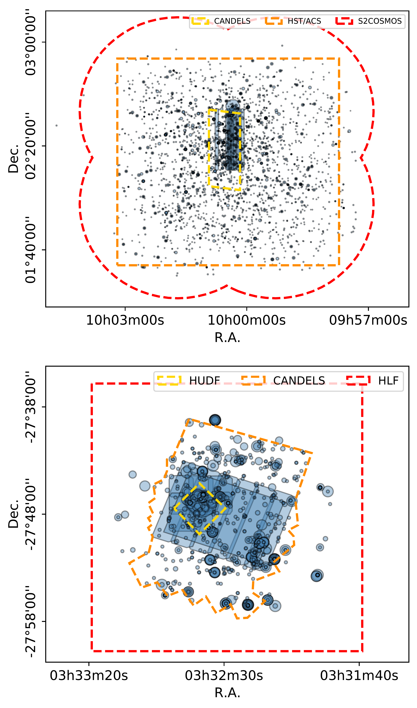
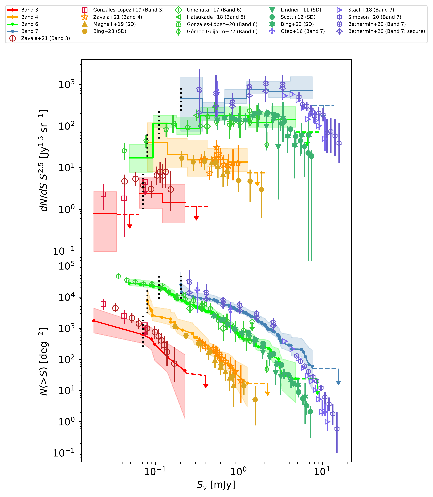
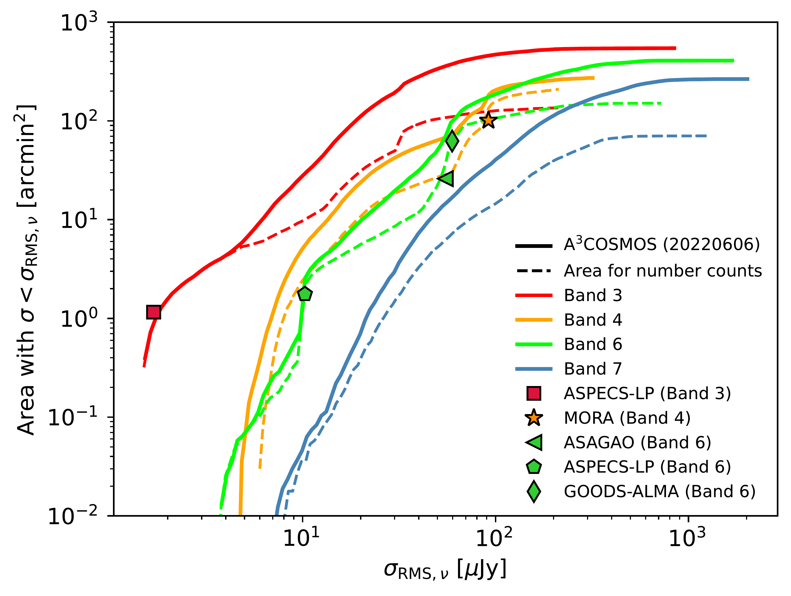

$\newcommand{\ensuremath}{}$
$\newcommand{\xspace}{}$
$\newcommand{\object}[1]{\texttt{#1}}$
$\newcommand{\farcs}{{.}''}$
$\newcommand{\farcm}{{.}'}$
$\newcommand{\arcsec}{''}$
$\newcommand{\arcmin}{'}$
$\newcommand{\ion}[2]{#1#2}$
$\newcommand{\textsc}[1]{\textrm{#1}}$
$\newcommand{\hl}[1]{\textrm{#1}}$
$\newcommand{\footnote}[1]{}$
$\newcommand{\acosmos}[0]{A^3COSMOS\xspace}$
$\newcommand{\agoodss}[0]{A^3GOODSS\xspace}$

# $\acosmos$ \& $\agoodss$: Continuum source catalogues and multi-band number counts

<mark>Appeared on: 2024-03-06</mark> -  _27 pages, 14 figures, A&A in press. Catalogues will be released at the CDS, see this https URL , and on the A3COSMOS website, see this https URL_

S. Adscheid, et al. -- incl., <mark>E. Schinnerer</mark>

**Abstract:** Galaxy submillimetre number counts are a fundamental measurement in our understanding of galaxy evolution models.   Most early measurements are obtained via single-dish telescopes with substantial source confusion, whereas recent interferometric observations are limited to small areas. We used a large database of ALMA continuum observations to accurately measure galaxy number counts in multiple (sub)millimetre bands, thus bridging the flux density range between single-dish surveys and deep interferometric studies. We continued the Automated Mining of the ALMA Archive in the COSMOS Field project ( $\acosmos$ ) and extended it with observations from the GOODS-South field ( $\agoodss$ ).   The database consists of $\sim$ 4,000 pipeline-processed continuum images from the public ALMA archive, yielding 2,050 unique detected sources,   including sources   with and without a known optical counterpart.   To infer galaxy number counts, we constructed a method to reduce the observational bias inherent to targeted pointings that dominate the database.   This method comprises a combination of image selection, masking, and source weighting.   The effective area was calculated by accounting for inhomogeneous wavelengths, sensitivities, and resolutions and for the spatial overlap between images.   We tested and calibrated our method with simulations. We obtained the first number counts derived in a consistent and homogeneous way in four different ALMA bands covering a relatively large area.   The results are consistent with number counts retrieved from the literature within the uncertainties.   We extended the available depth in ALMA Band 4 by 0.4 dex with respect to previous studies.   In Band 7, at the depth of the inferred number counts, $\sim$ 40 \% of the cosmic infrared background is resolved into discrete sources. This fraction, however, decreases with increasing wavelength, reaching $\sim$ 4 \% in Band 3.   Finally, we used the number counts to test models of dusty galaxy evolution, and find a good agreement within the uncertainties. By continuing the $\acosmos$ and $\agoodss$ archival effort, we obtained the deepest archive-based (sub)millimetre number counts  measured to date over such a wide area. This database proves to be a valuable resource that, thanks to its substantial size, can be used for statistical analyses after having applied certain conservative restrictions.

**Figure 1. -** Spatial sky coverage of all successfully imaged ALMA archival data available for COSMOS (_top panel_) and GOODS-S (_bottom panel_) as of June 6, 2022. The blue shaded shapes are outlines of single pointings and blind surveys; the darker shades of blue indicate an overlap of multiple images. For single pointings, the circle size corresponds to the area where the primary beam attenuation is >0.5. The outlines of blind surveys have been traced manually. For easier visibility the outlines of surveys are only drawn once, even if multiple coverages of the same survey exist in our database. The dashed coloured lines indicate the approximate outlines of different ancillary survey fields. In COSMOS: CANDELS \citep[yellow;][]{grogin11}, COSMOS _HST_/ACS imaging \citep[orange;][]{koekemoer07}, and S2COSMOS \citep[red;][]{simpson19}. In GOODS-S: Hubble Ultra Deep Field \citep[yellow;][]{hudf}, CANDELS \citep[orange; as in][]{guo13}, and Hubble Legacy Fields \citep[red;][]{hlf}. (*sky_coverage*)

**Figure 10. -** Number counts inferred from the $\acosmos$ database in four ALMA bands: red, Band 3 (2.6--3.6 mm); orange, Band 4 (1.8--2.4 mm); green, Band 6 (1.1--1.4 mm); blue, Band 7 (0.8--1.1 mm).
  Number counts were measured by combining blind surveys and single pointings containing a detected source within 1 arcsec radius around the phase centre and excluding a central area of 1 arcsec radius in Band 3, 4, and 6, and 4 arcsec in Band 7. _Top panel_: Differential. _Bottom panel_: Cumulative. The number counts calculated in this work are shown as solid lines, with the shaded area indicating the uncertainty resulting from flux density, contamination, and completeness errors, quadratically combined with Poisson errors.
  The respective flux densities of the individual sources are shown as points in the cumulative panel.
  The vertical dotted lines indicate the flux density above which our number counts can be considered  complete.
  Number counts from the literature are shown as symbols and are colour-coded to the respective ALMA band. (*figure-nc-all*)

**Figure 2. -** Cumulative areal coverage of the $\acosmos$ database, version \texttt{20220606}, as a function of 1 $\sigma_{\rm RMS}$ sensitivity for ALMA Bands 3, 4, 6, and 7. The noise of all images in each band is normalised to the central wavelength of the band, and spatial overlaps of images are accounted for. The solid lines indicate an  entire database; the image areas are considered out to a primary beam attenuation of 0.2. The  dashed lines are images selected for the computation of the number counts after masking out the phase centres and cropping the edges at a primary beam attenuation of 0.3 (see Sect. \ref{subsec_selection_criteria}). The symbols (see legend) represent the area and normalised depth of multiple ALMA blind surveys: ASPECS-LP \citep{gonzales-lopez19, gonzales-lopez20}, MORA \citep{zavala21,casey21}, ASAGAO \citep{hatsukade18}, and GOODS-ALMA \citep{gomez-guijarro21}.  (*sensitivity_curve*)

