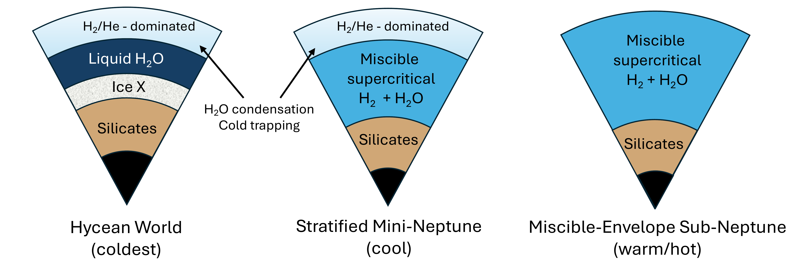
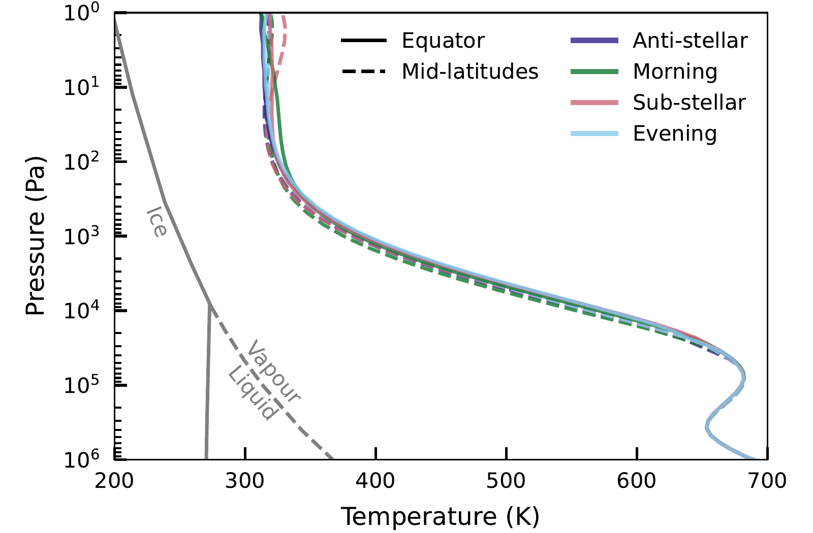

$\newcommand{\ensuremath}{}$
$\newcommand{\xspace}{}$
$\newcommand{\object}[1]{\texttt{#1}}$
$\newcommand{\farcs}{{.}''}$
$\newcommand{\farcm}{{.}'}$
$\newcommand{\arcsec}{''}$
$\newcommand{\arcmin}{'}$
$\newcommand{\ion}[2]{#1#2}$
$\newcommand{\textsc}[1]{\textrm{#1}}$
$\newcommand{\hl}[1]{\textrm{#1}}$
$\newcommand{\footnote}[1]{}$
$\newcommand{\icarus}{Icarus}$
$\newcommand{\mnras}{MNRAS}$
$\newcommand{\pasp}{PASP}$
$\newcommand{\jqsrt}{JQSRT}$
$\newcommand{\aj}{AJ}$
$\newcommand{\apj}{ApJ}$
$\newcommand{\apjl}{ApJL}$
$\newcommand{\apjs}{ApJS}$
$\newcommand{\aap}{A\&Aj}$
$\newcommand{\araa}{ARAA}$
$\newcommand{\nat}{Nature}$
$\newcommand{\vdag}{(v)^\dagger}$
$\newcommand$
$\newcommand$
$\newcommand{\vect}[1]{\mathbf{#1}}$
$\newcommand{\mt}[1]{\mathrm{#1}}$
$\newcommand{\Msun}{\ensuremath{ M_{\odot}}}$
$\newcommand{\Mearth}{\ensuremath{ M_{\oplus}}}$
$\newcommand{\Mmoon}{\ensuremath{ M_{\mathrm{Moon}}}}$
$\newcommand{\Mjup}{\ensuremath{ M_{\mathrm{Jup}}}}$
$\newcommand{\Rjup}{\ensuremath{ R_{\mathrm{Jup}}}}$
$\newcommand{\mum}{\ensuremath{\mathrm{ \mu m}}}$
$\newcommand{\AMMF}{\ensuremath{\mathrm{AMMF}}}$
$\newcommand{\Zatm}{\ensuremath{Z_{\mathrm{atm}}}}$
$\newcommand{\Zenv}{\ensuremath{Z_{\mathrm{env}}}}$
$\newcommand{\farcmin}{\mbox{\ensuremath{.\mkern-4mu^\prime}}}$
$\newcommand{\farcsec}{\mbox{\ensuremath{ .\!\!^{\prime\prime}}}}$
$\newcommand{\water}{H_{2}O}$
$\newcommand{\logX}[1]{\ensuremath{\log(\mathrm{X_{\ce{#1}}})}}$
$\newcommand{\logXratio}[2]{\ensuremath{\log(\mathrm{X_{\ce{#1}} / X_{\ce{#2}} })}}$
$\newcommand{\rstar}{R_*}$
$\newcommand{\re}{ R_\oplus}$
$\newcommand{\me}{ M_\oplus}$
$\newcommand{\rsun}{ R_\odot}$
$\newcommand{\project}[1]{\textsl{#1}}$
$\newcommand{\JWST}{\project{JWST}}$
$\newcommand{\HST}{\project{HST}}$
$\newcommand{\Hubble}{\project{Hubble}}$
$\newcommand{\Spitzer}{\project{Spitzer}}$
$\newcommand{\Kepler}{\project{Kepler}}$
$\newcommand{\Ktwo}{\project{K2}}$
$\newcommand{\TESS}{\project{TESS}}$
$\newcommand{\CHEOPS}{\project{CHEOPS}}$
$\newcommand$
$\newcommand$
$\newcommand{\umontreal}{Department of Physics and Trottier Institute for Research on Exoplanets, Université de Montréal, Montreal, QC, Canada \href{mailto:bjorn.benneke@umontreal.ca}{bjorn.benneke@umontreal.ca}}$

# $\large{_JWST_ Reveals $CH_4$, $CO_2$, and $H_2$O in a Metal-rich Miscible Atmosphere\ on a Two-Earth-Radius Exoplanet}$

<mark>Appeared on: 2024-03-07</mark> -  _25 pages, 12 figures_

B. Benneke, et al. -- incl., <mark>E.-M. Ahrer</mark>, <mark>D. Christie</mark>, <mark>L. Acuna</mark>

**Abstract:** Even though sub-Neptunes likely represent the most common outcome of planet formation, their natures remain poorly understood. In particular, planets near 1.5--2.5 $\re$ often have bulk densities that can be explained equally well with widely different compositions and interior structures, resulting in grossly divergent implications for their formation and potential habitability. Here, we present the full 0.6--5.2 $ \mu \mathrm{m}$ _JWST NIRISS/SOSS_ + _NIRSpec/G395H_ transmission spectrum of the 2.2 $ \re$ planet TOI-270 d ( $4.78 \me$ , $T_\mathrm{eq}$ =350--380 K), delivering unprecedented sensitivity for atmospheric characterization in the sub-Neptune regime. We detect five vibrational bands of $CH_4$ at 1.15, 1.4, 1.7, 2.3, and 3.3 $\mu$ m (9.4 $\sigma$ ), the signature of $CO_2$ at 4.3 $\mu$ m (4.8 $\sigma$ ), water vapor (2.5 $\sigma$ ), and potential signatures of $SO_2$ at 4.0 $ \mu \mathrm{m}$ and $CS_2$ at 4.6 $ \mu\mathrm{m}$ . Intriguingly, we find an overall highly metal-rich atmosphere, with a mean molecular weight of $5.47_{-1.14}^{+1.25}$ . We infer an atmospheric metal mass fraction of $58_{-12}^{+8}\%$ and a C/O of $0.47_{-0.19}^{+0.16}$ , indicating that approximately half the mass of the outer envelope is in high-molecular-weight volatiles ($H_2$ O, $CH_4$ , CO, $CO_2$ ) rather than $H_2$ /He. We introduce a sub-Neptune classification scheme and identify TOI-270 d as a "miscible-envelope sub-Neptune" in which $H_2$ /He is well-mixed with the high-molecular-weight volatiles in a miscible supercritical metal-rich envelope. For a fully miscible envelope, we conclude that TOI-270 d's interior is $90_{-4}^{+3}$ wt \% rock/iron, indicating that it formed as a rocky planet that accreted a few wt \% of $H_2$ /He, with the overall envelope metal content explained by magma-ocean/envelope reactions without the need for significant ice accretion. TOI-270 d may well be an archetype of the overall population of sub-Neptunes.

**Figure 8. -** _JWST/NIRISS + NIRSpec_ transmission spectrum of the temperate $2.2 R_\oplus$ exoplanet TOI-270 d. The top panel shows the observed transit depths (black points) compared to a random sampling of the model transmission spectra in the atmospheric retrieval posterior (blue), with the overall best-fitting model shown in red. The middle panel illustrates the contributions of individual molecular absorbers in the atmosphere of TOI-270 d, with a zoom on the NIRSpec G395H data shown in the bottom panel. Strong vibrational bands of methane gas are detected at 1.15, 1.4, 1.7, 2.3, and 3.3 $\mu$m (purple), with $H_2$O absorption contributing as well at 1.4 and 1.9$ \mu$m. In addition, $CO_2$ absorption is detected at 4.2--4.5 $\mu$m (green) and the increased transit depth around 4.7 $\mu$m is a possible signature of $CS_2$(cyan). The inclusion of $SO_2$ improves the fit at 4.1 $\mu$m. The combined effect of cloud and haze opacity, which becomes significant at wavelengths below 1.1 $\mu$m, is illustrated through the lower gray envelope of the model spectra. (*fig:TransmissionSpectrum*)

**Figure 11. -** Temperature-dependent interior structure of sub-Neptunes driven by the phase changes of $H_2$O. TOI-270 d's high atmospheric metal mass fraction indicates that high-molecule-weight volatiles ($H_2$O, $CH_4$, CO, $CO_2$) are well-mixed with the $H_2$/He in a warm miscible envelope (right scenario). The C/H and O/H of the atmosphere is therefore much more representative of the overall envelope composition than for stratified mini-Neptune and hycean worlds. (*fig:Temp_vs_InteriorStructure*)

**Figure 4. -** Pressure-temperature profiles from the dual-grey GCM model of TOI-270 d, averaged over the final 100 days of the simulation. Profiles at the equator (solid lines) and at a latitude of $\theta=45^{\circ}$ are shown. TOI-270 d is sufficiently warm around the planet that water remains miscible and transitions directly from the vapor form at low pressures into the supercritical phase at high pressure. (*fig:gcm_pt*)

