

$\newcommand{\ensuremath}{}$
$\newcommand{\xspace}{}$
$\newcommand{\object}[1]{\texttt{#1}}$
$\newcommand{\farcs}{{.}''}$
$\newcommand{\farcm}{{.}'}$
$\newcommand{\arcsec}{''}$
$\newcommand{\arcmin}{'}$
$\newcommand{\ion}[2]{#1#2}$
$\newcommand{\textsc}[1]{\textrm{#1}}$
$\newcommand{\hl}[1]{\textrm{#1}}$
$\newcommand{\footnote}[1]{}$
$\newcommand{\rahms}[4]{#1^{\rm h}#2^{\rm m}#3\mbox{^{\rm s}\mskip-7.6mu. }#4}$
$\newcommand{\decdms}[4]{#1^{\circ}#2'#3\mbox{"\mskip-7.6mu. }#4}$
$\newcommand{\msec}[2]{#1\mbox{"\mskip-7.6mu. }#2}$
$\newcommand{\arraystretch}{1.3}$
$\newcommand{\arraystretch}{1.0}$
$\newcommand{\arraystretch}{1.25}$
$\newcommand{\arraystretch}{1.3}$
$\newcommand{\arraystretch}{1.0}$
$\newcommand{\arraystretch}{1.0}$

# VLBI detection of nearby ($<100$ pc) young stars    

<mark>Appeared on: 2024-03-08</mark> -  _Accepted for publication in A&A, 12 pages, 4 figures, 6 tables_

S. A. Dzib, L. Loinard, <mark>R. Launhardt</mark>, J. Ordóñez-Toro

**Abstract:** To increase the number of sources with Very Long Baseline  Interferometry (VLBI) astrometry available for comparison with the $_ Gaia_$ results,  we have observed 31 young stars with recently reported radio emission.  These stars are all in the $_ Gaia_$ DR3 catalog and were suggested, on the basis on conventional interferometry observations, to be non-thermal radio emitters and, therefore, good candidates for VLBI detections. The observations were carried out with the Very Long Baseline Array (VLBA) at two epochs separated by a few days and yielded 10 detections (a $\sim30$ \% detection rate).  Using the astrometric $_ Gaia_$ results,  we have extrapolated the target positions to the epochs of our radio observations  and compared them with the position of the radio sources.  For seven objects, the optical and radio positions are coincident within five times their combined position errors. Three targets, however, have position discrepancies  above eight times the position errors, indicating different emitting sources at optical and radio wavelengths. In one case, the VLBA emission is very likely associated with a known companion of the primary target. In the other two cases, we associate the VLBA emission with previously unknown companions, but further observations will be needed to confirm this.

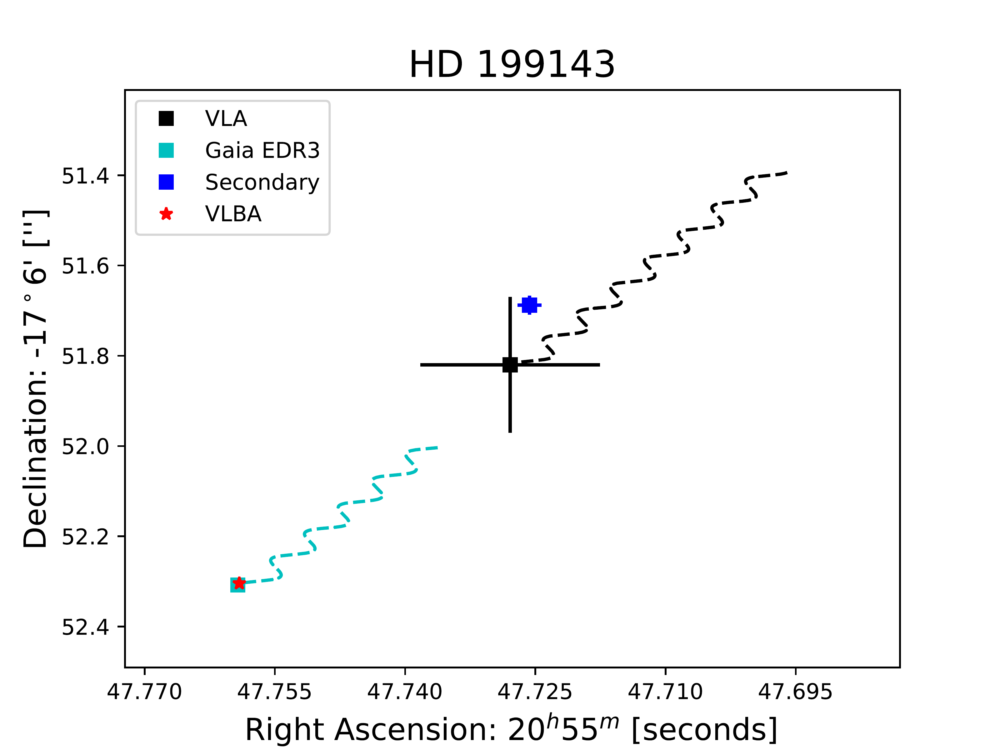

**Figure 1. -** Positions of radio and optical sources related to HD 199143.
The red star indicates the position of the radio source in the first
detected epoch by the VLBA observations. The Cyan dashed line indicates the optical trajectory of the primary component of the HD 199143 stellar
system from 2016.0
to the epoch of detection of the radio source with the VLBA. The optical position
of the star at the VLBA observed epoch is indicated with the cyan square.
The blue square indicates the position of the secondary, HD 199143 B, whose absolute coordinates are unknown; coordinates relative to the primary from the WDS catalog are used to estimate the absolute position.
_ Gaia_ DR3 and VLBA position errors are smaller than the symbol sizes.
The black line is the trajectory followed by the radio source detected
with the VLA  ([Launhardt, Loinard and Dzib 2022]()) , assuming the derived astrometry at
optical wavelengths, from the VLA observed epoch
to the VLBA observed epoch. The black square indicates the
extrapolated position of the VLA radio source at the epoch of the VLBA
detection. The black cross size indicates the VLA positional error.
 (*fig:VVG*)

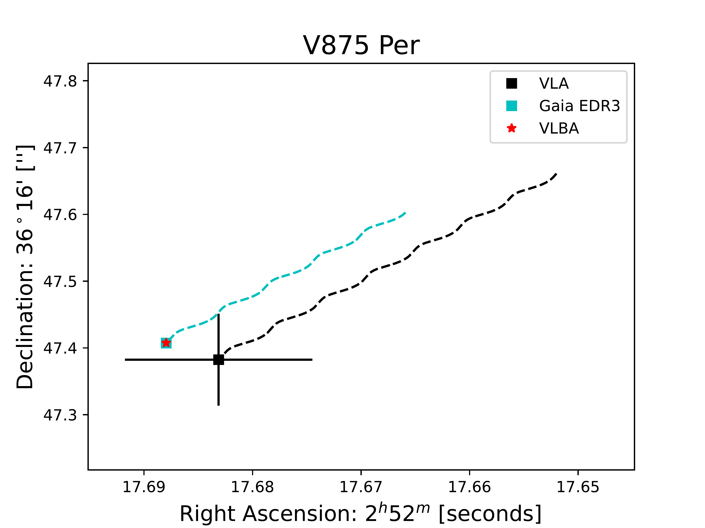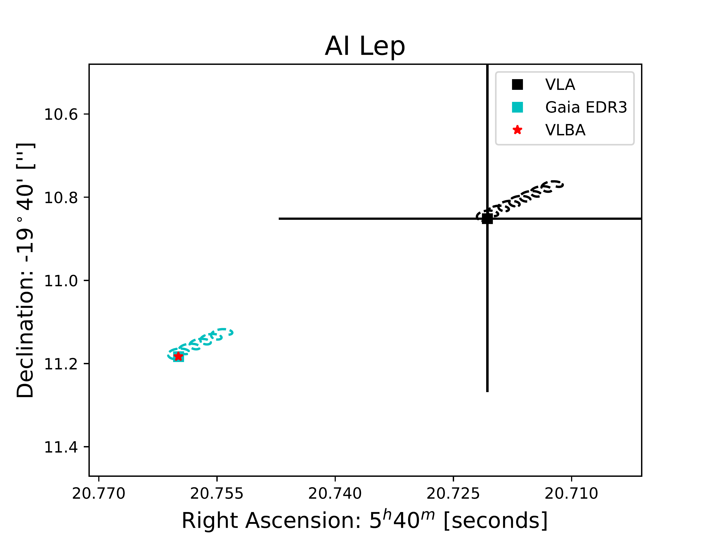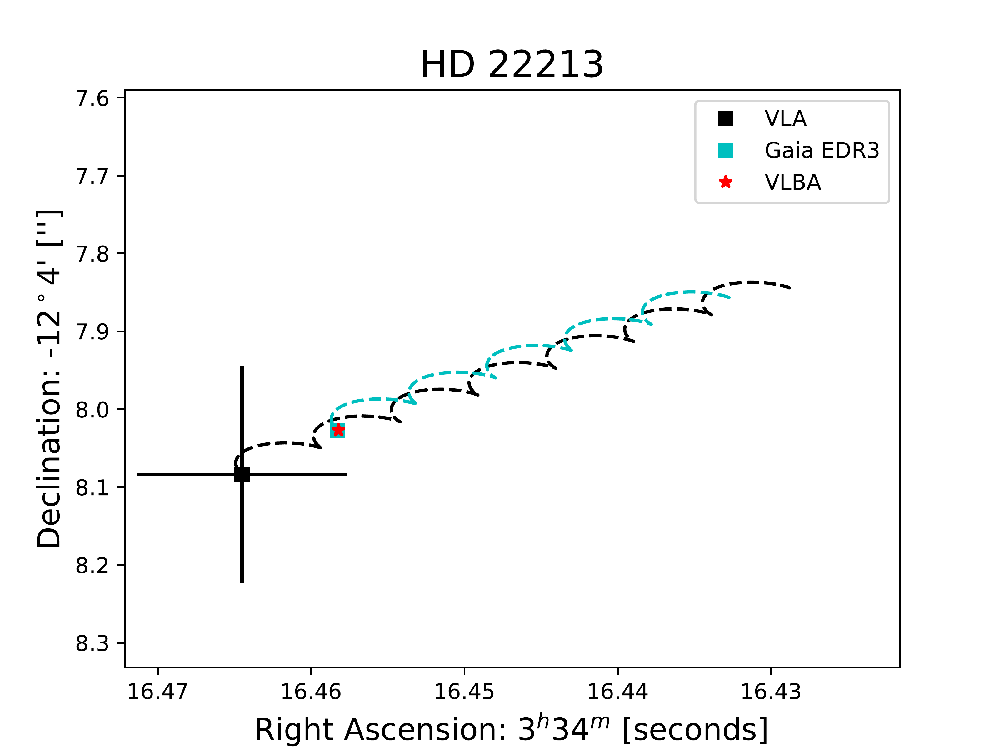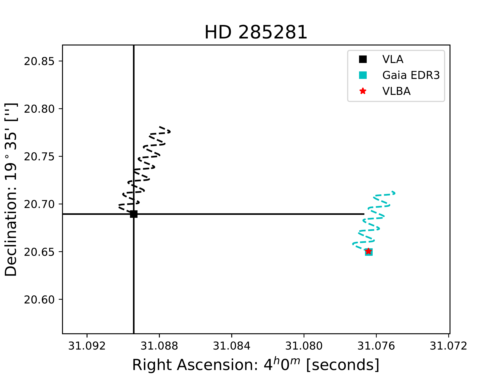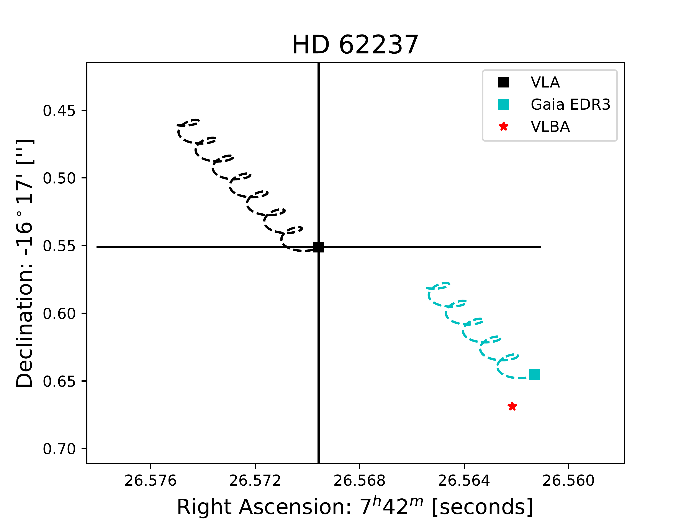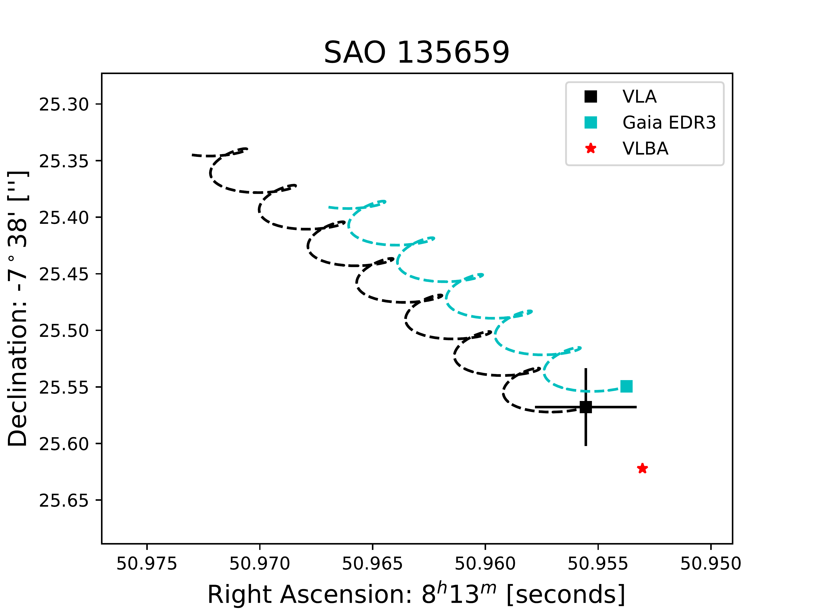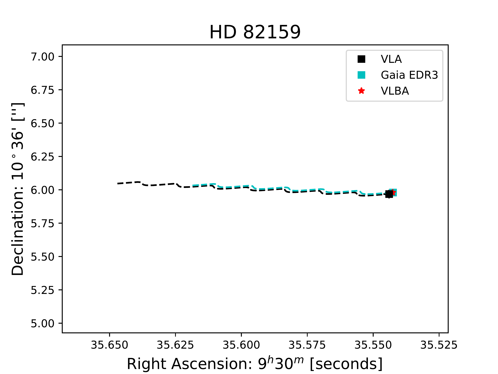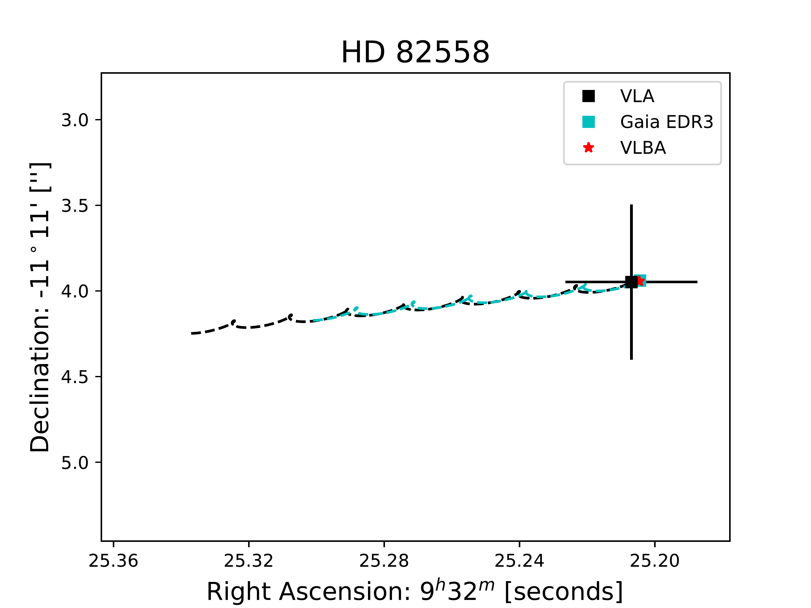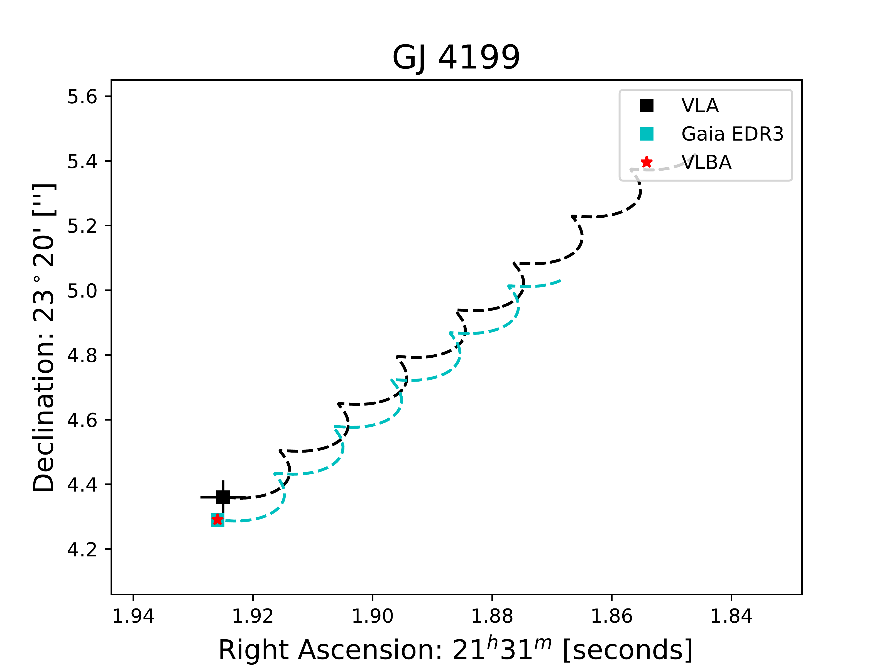

**Figure 6. -** Positions of radio and optical sources related to our target sources.
The name of source is indicated at the top of each plot.
Red stars indicate the position of the radio source in the first
detected epoch by the VLBA observations.
The black line is the trajectory followed by the radio source detected
with the VLA  ([Launhardt, Loinard and Dzib 2022]()) , assuming the derived astrometry at
optical wavelengths (see Table \ref{tab:am}) from the VLA observed epoch
to the VLBA observed epoch. The black square indicates the
extrapolated position of the VLA radio source at the epoch of the VLBA
detection. The black cross size indicates the VLA positional error.
Cyan line indicates the trajectory of the optical results from 2016.0
to the epoch of detection of the radio source with the VLBA, the position
of the optical source at this epoch is indicated with the cyan square. _ Gaia_ DR3 and VLBA
position errors are smaller than the symbol sizes. Companion relative positions are shown
as blue squares. (*fig:AmP*)

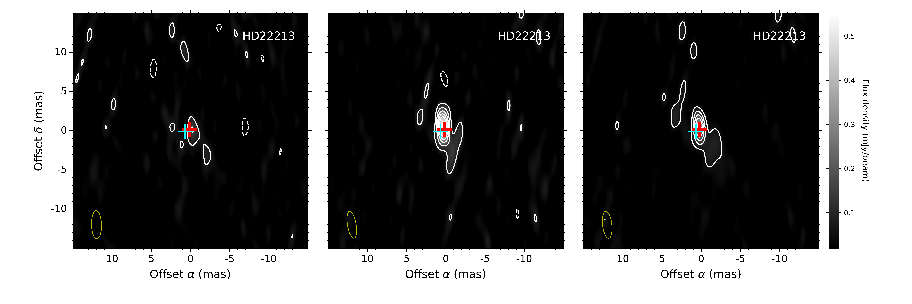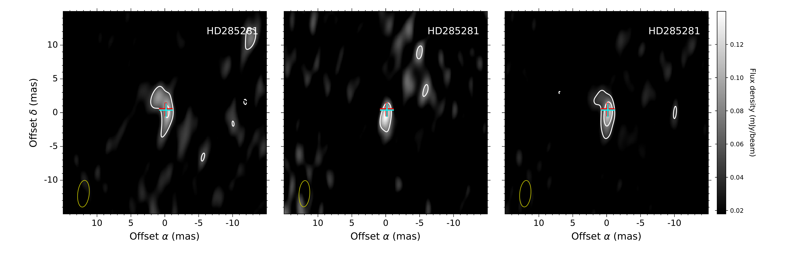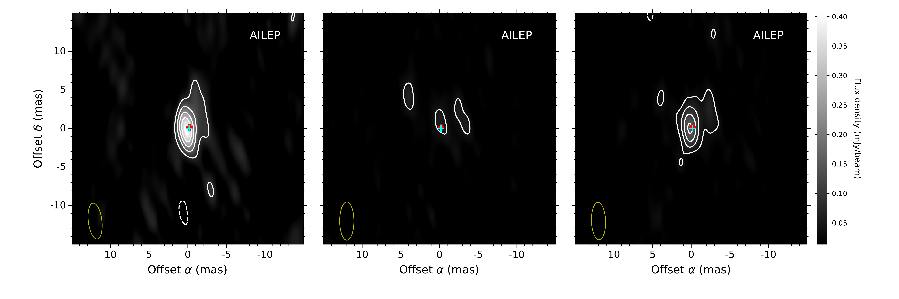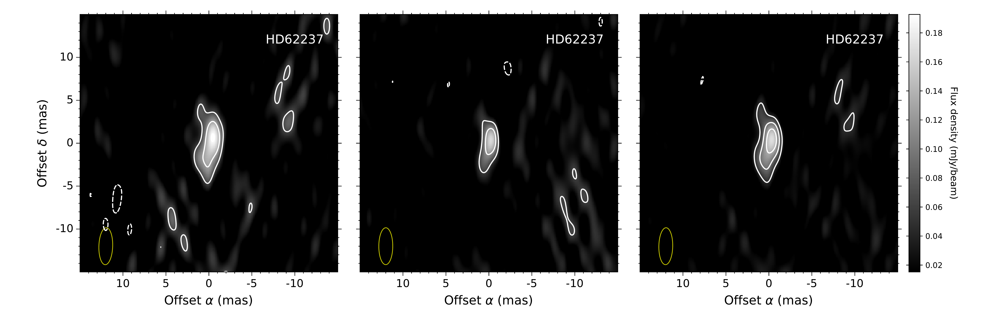

**Figure 3. -** VLBA images of detected radio sources. The images are centered in the position of the radio source as detected in the first epoch (see Table \ref{tab:am}). The name of the stellar source related to the radio sources is labeled in the top-left corner. Images from
left to right correspond to the epochs 1, 2, and the combination of both epochs. Contour levels are -3, 3, 6, 9, 12, and 15 times the noise level of the image as listed in Table \ref{tab:Imr}. The
yellow open ellipse in the bottom-left corner represents the size of the synthesized beam of the image as listed in Table \ref{tab:Imr}. The predicted optical position in epochs 1, and 2 are shown as red and cyan crosses, respectively. For HD 62237 and SAO 135659, these positions fall outside the region shown. (*fig:NF2*)

