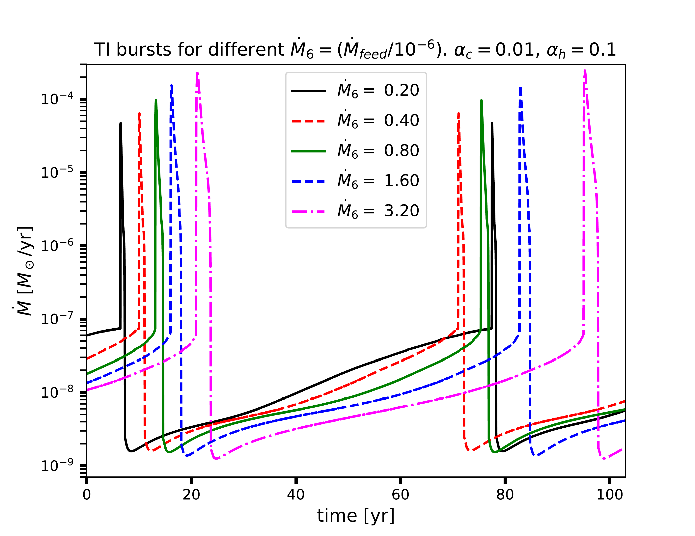
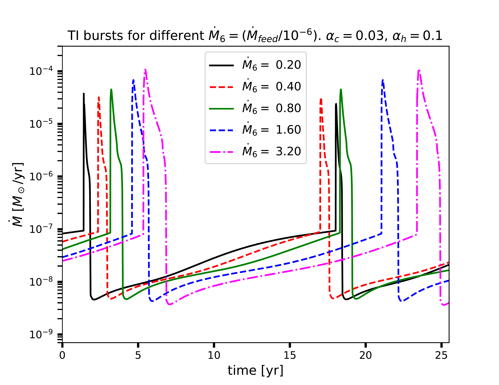
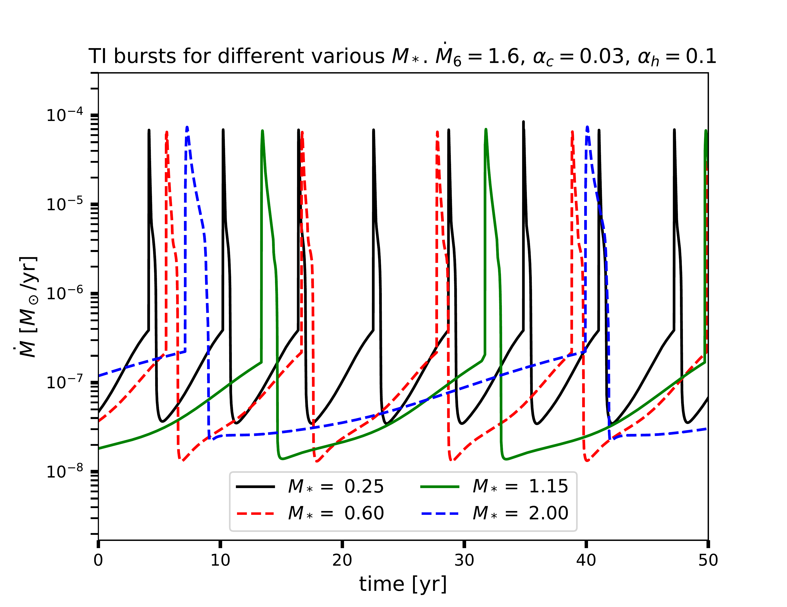
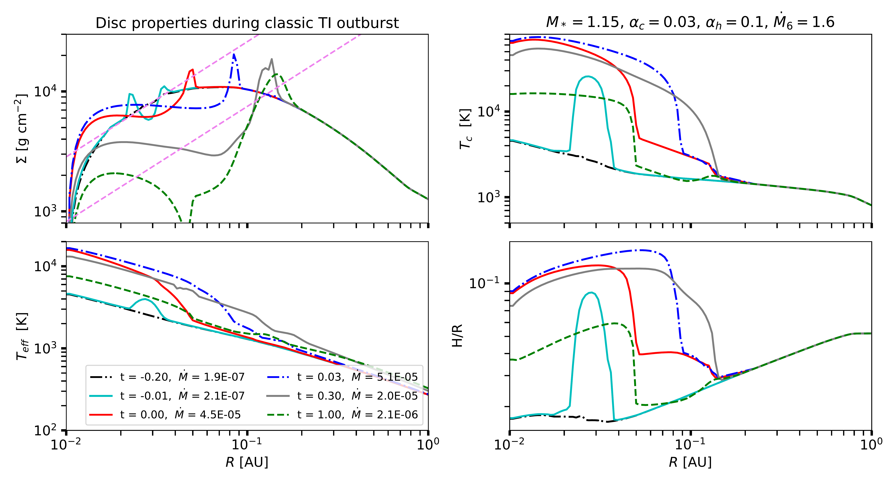
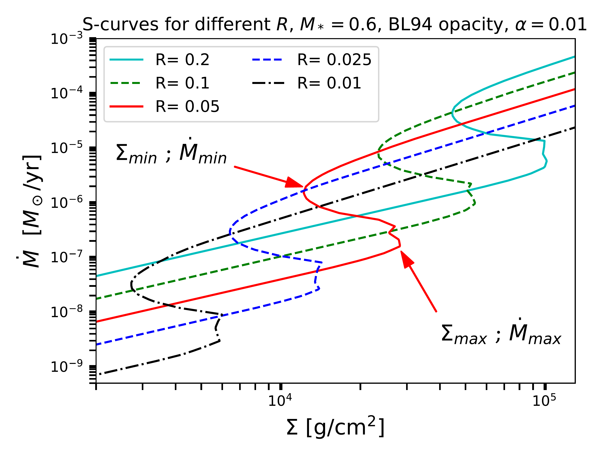
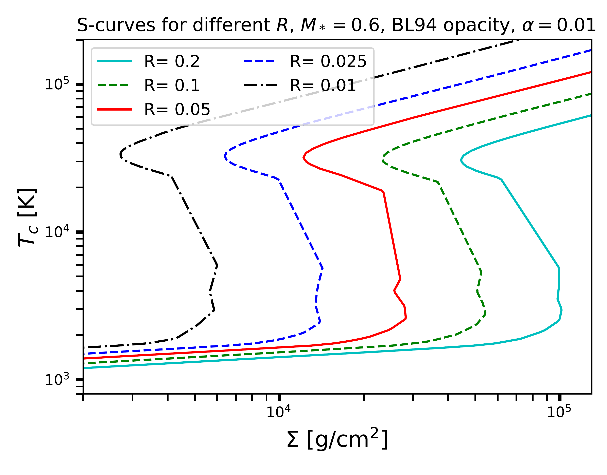

$\newcommand{\ensuremath}{}$
$\newcommand{\xspace}{}$
$\newcommand{\object}[1]{\texttt{#1}}$
$\newcommand{\farcs}{{.}''}$
$\newcommand{\farcm}{{.}'}$
$\newcommand{\arcsec}{''}$
$\newcommand{\arcmin}{'}$
$\newcommand{\ion}[2]{#1#2}$
$\newcommand{\textsc}[1]{\textrm{#1}}$
$\newcommand{\hl}[1]{\textrm{#1}}$
$\newcommand{\footnote}[1]{}$
$\newcommand$
$\newcommand$
$\newcommand$
$\newcommand$
$\newcommand$
$\newcommand{\avc}[1]{\textcolor{magenta}{\textit{[\small #1]}}}$
$\newcommand{\bref}[1]{{ #1}}$
$\newcommand$
$\newcommand$
$\newcommand$
$\newcommand$
$\newcommand$
$\newcommand{\lsun}{{\rm L_{\odot}}}$
$\newcommand{\msun}{{\rm M_{\odot}}}$
$\newcommand{\lta}{\la}$
$\newcommand{\gta}{\ga}$
$\newcommand{\be}{\begin{equation}}$
$\newcommand{\ee}{\end{equation}}$
$\newcommand{\le}{{L_{\rm Edd}}}$
$\newcommand{\rp}{{R_{\rm ph}}}$
$\newcommand{\rs}{{R_{\rm s}}}$
$\newcommand{\mo}{{\dot M_{\rm out}}}$
$\newcommand{\me}{{\dot M_{\rm Edd}}}$
$\newcommand{\tc}{{t_{\rm C}}}$
$\newcommand{\rc}{{R_{\rm core}}}$
$\newcommand{\mc}{{M_{\rm core}}}$
$\newcommand{\mbh}{{M_{\rm BH}}}$
$\newcommand{\e}{{\dot m_{\rm E}}}$
$\newcommand{\sgra}{Sgr~A^*}$
$\newcommand\del{#1}{ }$
$\newcommand\SNc{#1}{\textcolor{red}{#1}}$
$\newcommand\mearth{{ {\rm M}_{\oplus}}}$
$\newcommand\mj{{ {\rm M}_{\rm J}}}$
$\newcommand\rj{{ {\rm R}_{\rm J}}}$
$\newcommand\St{ {\rm St}}$
$\newcommand{\avc}[1]{\textcolor{magenta}{\textit{[\small #1]}}}$
$\newcommand\av{#1}{\textcolor{blue}{#1}}$
$\newcommand\SNc{#1}{\textcolor{red}{#1}}$
$\newcommand{\bref}[1]{{ #1}}$
$\newcommand\MSunPerYear{~{\rm M_{\odot}}~yr^{-1} }$
$\newcommand\target{Gaia20eae}$
$\newcommand\konkoly{Konkoly Observatory, Research Centre for Astronomy and Earth Sciences,\\Eötvös Loránd Research Network (ELKH), Konkoly-Thege Miklós út 15--17, 1121 Budapest, Hungary}$
$\newcommand\elte{ELTE Eötvös Loránd University, Institute of Physics, Pázmány Péter sétány 1/A, \ 1117 Budapest, Hungary}$
$\newcommand\heidelberg{Max Planck Institute for Astronomy, Königstuhl 17, 69117 Heidelberg, Germany}$
$\title[Thermal Instability and episodic accretion]{Episodic eruptions of young accreting stars: the key role of disc thermal instability due to Hydrogen ionisation.}$
$\author[Nayakshin et al.]{Sergei Nayakshin^{1 \orcidlink{0000-0002-6166-2206}}\thanks{sergei.nayakshin@le.ac.uk}, Fernando Cruz Sáenz de Miera^{2,3,4 \orcidlink{0000-0002-4283-2185}},$
$Ágnes Kóspál^{4,5,6 \orcidlink{0000-0001-7157-6275}},$
$\newauthor$
$Aleksandra \'{C}alovi\'{c}^{1},$
$Jochen Eislöffel^{7} and Douglas N.C. Lin^{8,9}$
$\ ^{1}School of Physics and Astronomy, University of$
$  Leicester, Leicester, LE1 7RH, UK. \ ^2 Institut de Recherche en Astrophysique et Planétologie, Université de$
$Toulouse, UT3-PS, CNRS, CNES, 9 av. du Colonel Roche, \ 31028 Toulouse Cedex 4, France \ ^3\konkoly\ ^4 CSFK, MTA Centre of Excellence, Konkoly-Thege Miklós út 15-17, 1121 Budapest, Hungary\ ^5 \elte\ ^6 \heidelberg\ ^7 Thüringer Landessternwarte Tautenburg, Sternwarte 5, 07778 Tautenburg, Germany\ ^8 Department of Astronomy \& Astrophysics, University of California, Santa Cruz, CA 95064, USA\ ^9 Institute for Advanced Studies, Tsinghua University, Being 100084, China$
$}$
$\date{Accepted XXX. Received YYY; in original form ZZZ}$
$\pubyear{2023}$
$\begin{document}$
$\label{firstpage}$
$\pagerange{\pageref{firstpage}--\pageref{lastpage}}$
$\maketitle$
$\begin{abstract}$
$In the classical grouping of large magnitude episodic variability of young accreting stars, FUORs outshine their stars by a factor of \sim 100, and can last for up to centuries; EXORs are dimmer, and last months to a year. A disc Hydrogen ionisation Thermal Instability (TI) scenario was previously proposed for FUORs but required \bref{unrealistically low} disc viscosity. In the last decade, many intermediate type objects, e.g., FUOR-like in luminosity and spectra but EXOR-like in duration were found.  Here we show that the intermediate type bursters Gaia20eae, PTF14jg, Gaia19bey and Gaia21bty \bref{may be naturally explained} by the TI scenario with realistic viscosity values.  We argue that TI predicts a dearth (desert) of bursts with \bref{peak} accretion rates between 10^{-6}\MSunPerYear  \lesssim \dot M_{\rm burst} \lesssim 10^{-5}\MSunPerYear, and that this desert is seen in the sample of all the bursters with previously determined \dot M_{\rm burst}. Most classic EXORs (FUORs) appear to be on the cold (hot) branch of the S-curve during the peak light of their eruptions; \bref{thus TI may play a role in this class differentiation}.$
$At the same time, TI is unable to explain how classic FUORs can last for up to centuries, \bref{and over-predicts the occurrence rate of short FUORs by at least an order of magnitude}. We conclude that TI is a required ingredient of episodic accretion operating at R\lesssim 0.1~au, but additional physics must play a role at larger scales. \bref{Knowledge of TI inner workings from related disciplines may enable its use as a tool to constrain the nature of this additional physics.}$
$\end{abstract}$
$\begin{keywords}$
$stars:formation -- stars: protostars -- protoplanetary discs$
$\end{keywords}$
$\n\end{document}\end{equation}}$
$\newcommand{\ee}{\end{equation}}$
$\newcommand{\le}{{L_{\rm Edd}}}$
$\newcommand{\rp}{{R_{\rm ph}}}$
$\newcommand{\rs}{{R_{\rm s}}}$
$\newcommand{\mo}{{\dot M_{\rm out}}}$
$\newcommand{\me}{{\dot M_{\rm Edd}}}$
$\newcommand{\tc}{{t_{\rm C}}}$
$\newcommand{\rc}{{R_{\rm core}}}$
$\newcommand{\mc}{{M_{\rm core}}}$
$\newcommand{\mbh}{{M_{\rm BH}}}$
$\newcommand{\e}{{\dot m_{\rm E}}}$
$\newcommand{\sgra}{Sgr~A^*}$
$\newcommand\del{#1}$
$\newcommand\SNc{#1}$
$\newcommand\av{#1}$
$\newcommand\SNc{#1}$

# Episodic eruptions of young accreting stars: the key role of disc thermal instability due to Hydrogen ionisation.

<mark>Appeared on: 2024-03-08</mark> -  _submitted to MNRAS; version taking referee's comments into account_

S. Nayakshin, et al. -- incl., <mark>A. Kospal</mark>

**Abstract:** In the classical grouping of large magnitude episodic variability of young accreting stars, FUORs outshine their stars by a factor of $\sim 100$ , and can last for up to centuries; EXORs are dimmer, and last months to a year. A disc Hydrogen ionisation Thermal Instability (TI) scenario was previously proposed for FUORs but required $\bref{unrealistically low}$ disc viscosity. In the last decade, many intermediate type objects, e.g., FUOR-like in luminosity and spectra but EXOR-like in duration were found.  Here we show that the intermediate type bursters Gaia20eae, PTF14jg, Gaia19bey and Gaia21bty $\bref{may be naturally explained}$ by the TI scenario with realistic viscosity values.  We argue that TI predicts a dearth (desert) of bursts with $\bref{peak}$ accretion rates between $10^{-6}$ $\MSunPerYear$ $\lesssim \dot M_{\rm burst} \lesssim 10^{-5}$ $\MSunPerYear$ , and that this desert is seen in the sample of all the bursters with previously determined $\dot M_{\rm burst}$ . Most classic EXORs (FUORs) appear to be on the cold (hot) branch of the S-curve during the peak light of their eruptions; $\bref{thus TI may play a role in this class differentiation}$ .At the same time, TI is unable to explain how classic FUORs can last for up to centuries, $\bref{and over-predicts the occurrence rate of short FUORs by at least an order of magnitude}$ . We conclude that TI is a required ingredient of episodic accretion operating at $R\lesssim 0.1$ au, but additional physics must play a role at larger scales. $\bref{Knowledge of TI inner workings from related disciplines may enable its use as a tool to constrain the nature of this additional physics.}$

**Figure 1. -** Top: Stellar accretion rate history for five different feeding rates and $\alpha_{\rm c} =0.01$, $M_* = 1.15  $\msun$$. Middle: Same but for $\alpha_{\rm c} = 0.03$. Bottom: Similar to the above but for a fixed $\dot M_{\rm feed} = 1.6\times 10^{-6}$\MSunPerYear, $\alpha_{\rm c} = 0.03$, and several values of $M_*$. Please note that the time axis is different for the three panels. For further detail and discussion see \S\ref{sec:param_space}. (*fig:Lots_of_bursts*)

**Figure 11. -** Snapshots of the inner disc just before and during one burst of the classic TI corresponding to the blue curve in the middle panel of Fig. \ref{fig:Lots_of_bursts}. The purple dashed lines in the top left panel show the critical disc surface densities (cf. the left panel of Fig. \ref{fig:S-Curve} and eq. 11) on the S-curve as a function of radius. The upper curve corresponds to $\Sigma_{\rm max}$ and the lower one to $\Sigma_{\rm min}$. Above $\Sigma_{\rm max}$ the TI is triggered and the disc travels to the hot (ionised H) stable branch of the S-curve, whereas below $\Sigma_{\rm min}$ the disc falls back to the cold neutral H branch. Note that the instability trigger occurs close to the star and is very rapid. The maximum extent of the TI-affected region is $R_{\rm TI} \sim 0.15$ au. The legend shows the respective times for each snapshot. (*fig:Classic_TI_Sigma_T*)

**Figure 8. -** Left: Equilibrium $\dot M$ vs disc column depth, $\Sigma$, for the Bell \& Lin (1994) opacities,  mass $M_* =0.6$\msun$$, fixed $\alpha=0.01$ and various values of radius $R$. Two critical points where the instability sets in are marked with arrows for $R=0.04$ au curve. This disc annulus is unstable to TI if the long-term feeding rate $\dot M_{\rm feed}$ is between $\dot M_{\rm max}$ and $\dot M_{\rm min}$. Right: the same S-curves but with the central (midplane) disc temperature on the vertical axis. See text in \S\ref{sec:scaling} for details. (*fig:S-Curve*)

