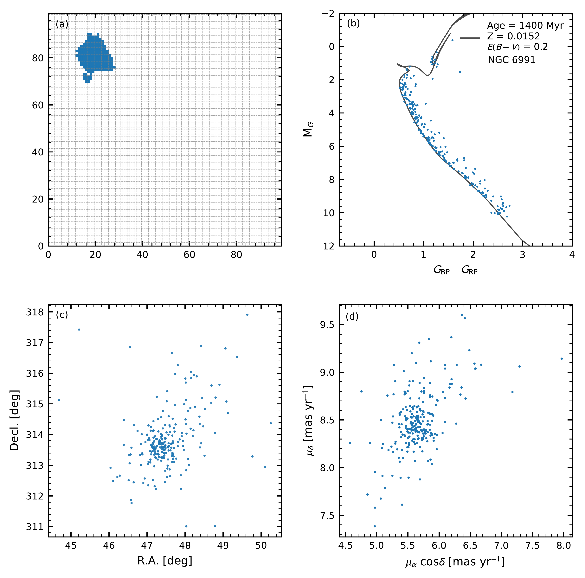
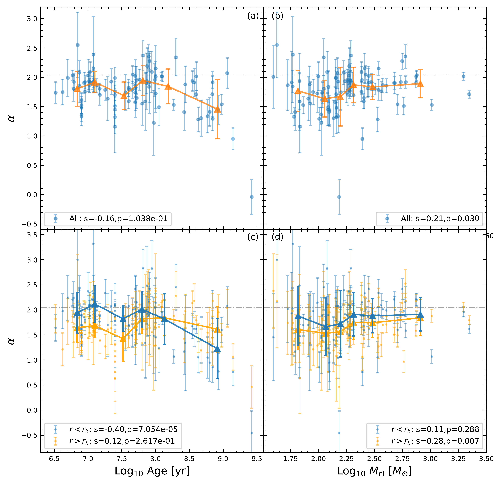
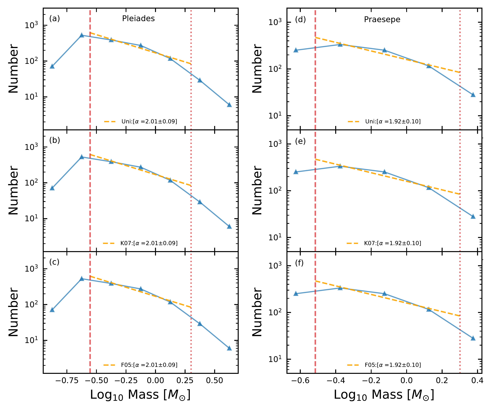

$\newcommand{\ensuremath}{}$
$\newcommand{\xspace}{}$
$\newcommand{\object}[1]{\texttt{#1}}$
$\newcommand{\farcs}{{.}''}$
$\newcommand{\farcm}{{.}'}$
$\newcommand{\arcsec}{''}$
$\newcommand{\arcmin}{'}$
$\newcommand{\ion}[2]{#1#2}$
$\newcommand{\textsc}[1]{\textrm{#1}}$
$\newcommand{\hl}[1]{\textrm{#1}}$
$\newcommand{\footnote}[1]{}$
$\newcommand{\pmra}{\mu_\alpha \cos\delta}$
$\newcommand{\pmdec}{\mu_\delta}$
$\newcommand{\rh}{r_{\rm h}}$
$\newcommand{\Teff}{T_\mathrm{eff}}$
$\newcommand{\zt}[1]{\textcolor{blue}{  #1}}$
$\newcommand{\xy}[1]{\textcolor{blue}{  #1}}$
$\newcommand{\yf}[1]{\textcolor{orange}{  #1}}$
$\newcommand{\jd}[1]{\textcolor{teal}{  #1}}$
$\newcommand{\mjnote}[1]{\textit{\textcolor{magenta}{[mingjie:#1]}}}$
$\newcommand{\mj}[1]{\textcolor{magenta}{#1}}$
$\newcommand{\tk}[1]{\textcolor{red}{  #1}}$

# The Present-Day Mass Function of Star Clusters in the Solar Neighborhood

<mark>Appeared on: 2024-03-15</mark> -  _19 pages, 10 figures, accepted to ApJ_

X. Pang, et al. -- incl., <mark>J. Li</mark>

**Abstract:** This work analyses the present-day mass function (PDMF) of 93 star clusters utilizing Gaia DR3 data, with membership determined by the \texttt{StarGo} machine learning algorithm.The impact of unresolved binary systems on mass estimation is rigorously assessed, adopting three mass ratio profiles for correction. The PDMF is characterized by the power-law index, $\alpha$ , derived through a robust maximum likelihood method that avoids biases associated with data binning.The value of $\alpha$ for stars between the completeness limited mass of Gaia (with a mean 0.3 $M_\odot$ for our cluster samples) and 2 $M_\odot$ , exhibits stability for clusters younger than 200 Myr, decreasing for older clusters, particularly when considering stars within the half-mass radius.The PDMF of these star clusters is consistent with a dynamically evolved Kroupa IMF via the loss of low-mass stars. Cluster morphology shows a correlation with $\alpha$ , as $\alpha$ values exhibit a decreasing trend from filamentary to tidal-tail clusters, mirroring the sequence of increasing cluster age. The dependence of $\alpha$ on total cluster mass is weak, with a subtle increase for ${ higher-mass}$ clusters, especially outside the half-mass radius.  We do not observe a correlation between $\alpha$ and the mean metallicity of the clusters. Younger clusters have lower metallicity compared to their older counterparts, which indicates that the older ${  clusters}$ might ${  have migrated}$ to the solar neighbourhood from the inner disk. A comparison with numerical models incorporating a black hole population suggests the need for observations of distant, older, massive open clusters to ${  determine whether or not they contain black holes}$ .

**Figure 6. -** (a): A 100$\times$100 2D neural network generated by StarGO for NGC 6991. Each grid is one neuron. Neurons corresponding to member stars (5\% contamination rate) formed a blue patch in this figure. (b): {  CMD} obtained from the Gaia DR 3 absolute magnitude ${\rm M}_G$ for member stars in NGC 6991. The PARSEC isochrones of the fitted age are indicated with the black solid curve, the fitted extinction and metallicity are also indicated in the upper right corner. (c): Spatial distribution of member stars (blue dots) selected by StarGO. (d) The proper motion vector plot for member stars.  (*fig:ngc6991*)

**Figure 9. -**  Dependence of the power-law index ($\alpha$) of the most probable PDMF on the cluster age (left panels) and total cluster mass above completeness limit, $M_{\rm cl}$(right panels). The uniform mass ratio distribution is used for binary correction. The grey dashed-dotted line in each panel corresponds to $\alpha=2.04$ computed from the \citet{kroupa2001} IMF in the mass range from 0.3 $M_\odot$ to 2 $M_\odot$. The values of $\alpha$ in panels (a) and (b) are computed for all members in the cluster.
    The orange triangles are average values of cluster age and $\alpha$ for all 15--16 clusters in each bin, with the standard deviation indicated by the error bar. In panels (c) and (d), we separate each cluster into two parts and derive the PDMF individually: within the half-mass radius ($r<r_h$: blue dots) and outside half-mass radius ($r>r_h$: orange dots). The orange and blue triangles are computed in the same manner as in panels (a) and (b). We exclude the disrupted cluster Group X from panels (c) and (d) since it is hard to define the cluster center for its two-piece-fragmented shape.
    The quantity $s$ is Spearman’s rank correlation coefficient, and $p$ is the probability of the null hypothesis (i.e., that no correlation exists between two variables) of the correlation test. A $p$ value of less than 0.1 indicates that the null hypothesis is rejected.
     (*fig:alpha_age_mass*)

**Figure 7. -** The most probable PDMFs of example clusters Pleiades (a, b, c) and Praesepe (d, e, f) after binary correction, considering three different mass ratio distributions. The red vertical dashed line indicates the completeness limited mass of Gaia DR 3 data $m_{\rm lower}$, which is 0.28 $M_\odot$ and 0.31 $M_\odot$ for Pleiades and Praesepe respectively. The red vertical dotted line corresponds to the upper mass limit  $m_{\rm upper}$ of 2 $M_\odot$. The blue curves are the mass distributions of Pleiades and Praesepe. The PDMFs (orange dashed lines) are determined only for the stellar mass between  $m_{\rm lower}$ and  $m_{\rm upper}$. The power-law index $\alpha$ value obtained from the maximum likelihood method in Section \ref{sec:MLE} is indicated in each panel.
     (*fig:mass_function*)

