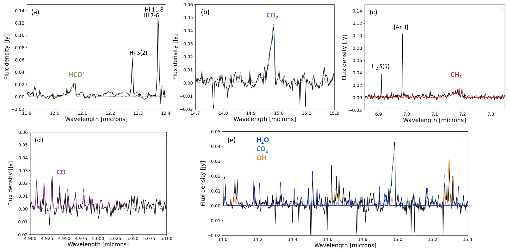
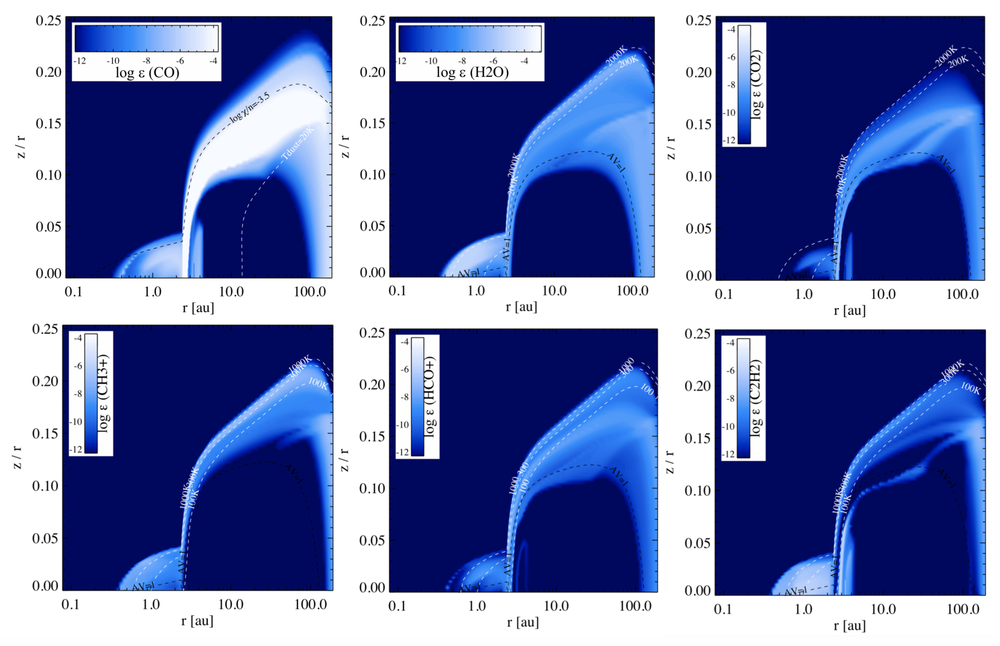
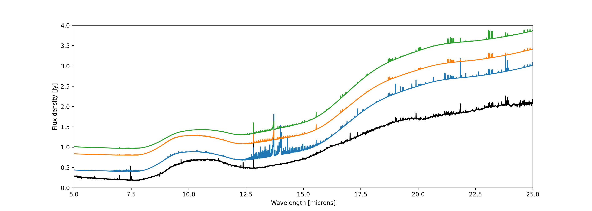

$\newcommand{\ensuremath}{}$
$\newcommand{\xspace}{}$
$\newcommand{\object}[1]{\texttt{#1}}$
$\newcommand{\farcs}{{.}''}$
$\newcommand{\farcm}{{.}'}$
$\newcommand{\arcsec}{''}$
$\newcommand{\arcmin}{'}$
$\newcommand{\ion}[2]{#1#2}$
$\newcommand{\textsc}[1]{\textrm{#1}}$
$\newcommand{\hl}[1]{\textrm{#1}}$
$\newcommand{\footnote}[1]{}$
$\newcommand{\vdag}{(v)^\dagger}$
$\newcommand$
$\newcommand$
$\newcommand{\ikc}[1]{\textcolor{blue}{\textsf{IK: #1 }}}$
$\newcommand{\ik}[1]{\textcolor{green}{\textsf{#1}}}$
$\newcommand{\gp}[1]{\textcolor{cyan}{\textsf{GP: #1 }}}$

# MINDS: The JWST MIRI Mid-INfrared Disk Survey

<mark>Appeared on: 2024-03-15</mark> -  _accepted for publication in PASP_

T. Henning, et al. -- incl., <mark>M. Samland</mark>, <mark>J. Bouwman</mark>, <mark>G. Perotti</mark>, <mark>J. Schreiber</mark>, <mark>K. Schwarz</mark>

**Abstract:** The study of protoplanetary disks has become increasingly important with the Kepler satellite finding that exoplanets are ubiquitous around stars in our galaxy and the discovery of enormous diversity in planetary system architectures and planet properties. High-resolution near-IR and ALMA images show strong evidence for ongoing planet formation in young disks. The JWST MIRI mid-INfrared Disk Survey (MINDS) aims to (1) investigate the chemical inventory in the terrestrial planet-forming zone across stellar spectral type, (2) follow the gas evolution into the disk dispersal stage, and (3) study the structure of protoplanetary and debris disks in the thermal mid-IR. The MINDS survey will thus build a bridge between the chemical inventory of disks and the properties of exoplanets. The survey comprises 52 targets (Herbig Ae stars, T Tauri stars, very low-mass stars and young debris disks). We primarily obtain MIRI/MRS spectra with high S/N ( $\sim\!100-500$ ) covering the complete wavelength range from 4.9 to 27.9 $\mu$ m. For a handful of selected targets we also obtain NIRSpec IFU high resolution spectroscopy (2.87-5.27 $\mu$ m). We will search for signposts of planet formation in thermal emission of micron-sized dust – information complementary to near-IR scattered light emission from small dust grains and emission from large dust in the submillimeter wavelength domain. We will also study the spatial structure of disks in three key systems that have shown signposts for planet formation, TW Hya and HD 169142 using the MIRI coronagraph at 15.5 $\mu$ m and 10.65 $\mu$ m respectively and PDS 70 using NIRCam imaging in the $1.87 \mu$ m narrow and the $4.8 \mu$ m medium band filter. We provide here an overview of the MINDS survey and showcase the power of the new JWST mid-IR molecular spectroscopy with the TW Hya disk spectrum where we report the detection of the molecular ion $\ce{CH3+}$ and the robust confirmation of $\ce{HCO+}$ earlier detected with Spitzer.

**Figure 6. -** Continuum subtracted TW Hya MIRI spectrum (black) with (a) \ce{HCO+} slab model (green) overplotted ($T=250$ K, also visible the \ce{H2} S(2) line at 12.28 $\mu$m and the H {\sc i} 11-8 and 7-6 lines at 12.39 and 12.37 $\mu$m), (b) \ce{CO2} slab model (blue) overplotted ($T=200$ K), (c) \ce{CH3+} slab model (red) overplotted ($T=500$ K, also visible the \ce{H2} S(5) line at 6.91 $\mu$m and the \ce{Ar+} fine-structure line at 6.99 $\mu$m), (d) CO slab model (magenta) overplotted ($T=500$ K), (e) \ce{H2O}, OH and \ce{CO2} slab models (colors indicated in legend, $T=400, 1000, 200$ K, respectively) in the $14.0-15.4 \mu$m wavelength range. All slab models are calculated in LTE and used only for identification of molecular emission features. (*fig:TWHya-zoom-molecular-spectra*)

**Figure 9. -** Selected abundance distribution of specific molecules and molecular ions in the adjusted TW Hya DIANA thermo-chemical disk model (elemental abundances of C, N, O depleted by a factor 50 in the inner 2.4 au). Overplotted are the PDR parameter $\log \chi/n_{\langle \rm H \rangle}$(see footnote in Sect. \ref{Sec:Thermo-chemical-Model}) and the dust temperature of 20 K for CO, and for all other molecules the gas temperature contours of 100, 300 and 1000 K (white) and the $A_{\rm V}\!=\!1$ mag line (black). (*fig:TWHyamodel-abundances*)

**Figure 10. -** JWST/MIRI MRS spectrum (black) compared to the adjusted DIANA TW Hya model using a gas-to-dust mass ratio in the inner disk of 15 (blue, shifted by 0.2 Jy), and 0.15 (green, shifted by 1 Jy). The orange spectrum (shifted by 0.6 Jy) shows the model with a gas-to-dust mass ratio of 15 and the C, N and O abundances in the inner 2.4 au lowered by a factor 50. (*fig:TWHya-obs-model*)

