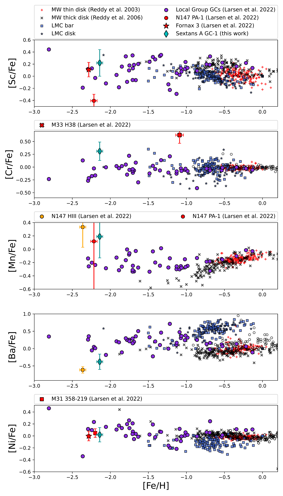
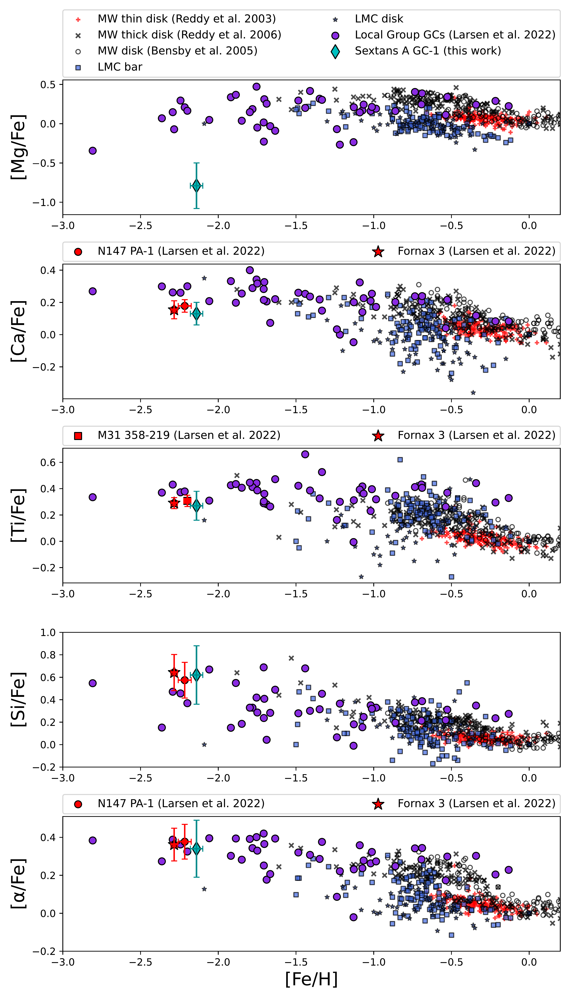
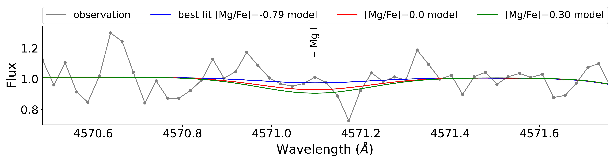

$\newcommand{\ensuremath}{}$
$\newcommand{\xspace}{}$
$\newcommand{\object}[1]{\texttt{#1}}$
$\newcommand{\farcs}{{.}''}$
$\newcommand{\farcm}{{.}'}$
$\newcommand{\arcsec}{''}$
$\newcommand{\arcmin}{'}$
$\newcommand{\ion}[2]{#1#2}$
$\newcommand{\textsc}[1]{\textrm{#1}}$
$\newcommand{\hl}[1]{\textrm{#1}}$
$\newcommand{\footnote}[1]{}$

# Detailed chemical composition of the globular cluster Sextans A GC-1 on the outskirts of the Local Group

<mark>Appeared on: 2024-03-19</mark> -  _14 pages, 8 figures_

A. Gvozdenko, et al. -- incl., <mark>P. Eitner</mark>

**Abstract:** The chemical composition of globular clusters (GCs) across the Local Group provides information on chemical abundance trends. Studying GCs in isolated systems in particular provides us with important initial conditions plausibly unperturbed by mergers and tidal forces from the large Local Group spirals. We present a detailed chemical abundance analysis of Sextans A GC-1. The host galaxy, Sextans A, is a low-surface-brightness dwarf irregular galaxy located on the edge of the Local Group. We derive the dynamical mass of the GC together with the mass-to-light ratio and the abundances of the $\alpha$ , Fe-peak, and heavy elements. Abundance ratios were determined from the analysis of an optical integrated-light spectrum of Sextans A GC-1, obtained with UVES on the VLT. We apply non-local thermodynamic equilibrium (NLTE) corrections to Mg, Ca, Ti, Fe, and Ni. The GC appears to be younger and more metal-poor than the majority of the GCs of the Milky Way, with an age of 8.6 $\pm$ 2.7 Gyr and $\text{[Fe/H]}=-2.14\pm0.04$ dex. The calculated dynamical mass is $M_{dyn}=(5.18 \pm1.62) \times 10^5 M_{\odot}$ , which results in an atypically high value of the mass-to-light ratio, 4.35 $\pm$ 1.40 M $_{\odot}$ /L $_{V \odot}$ . Sextans A GC-1 has varying $\alpha$ elements -- the Mg abundance is extremely low, Ca and Ti are solar-scaled or mildly enhanced, and Si is enhanced. The measured values are $\text{[Mg/Fe]}=-0.79\pm0.29$ , $\text{[Ca/Fe]}=+0.13\pm0.07$ , $\text{[Ti/Fe]}=+0.27\pm0.11$ , and $\text{[Si/Fe]}=+0.62\pm0.26$ , which makes the mean $\alpha$ abundance (excluding Mg) to be enhanced $\text{[<Si,Ca,Ti>/Fe]}_{\text{NLTE}}=+0.34\pm0.15$ . The Fe-peak elements are consistent with scaled-solar or slightly enhanced abundances: $\text{[Cr/Fe]}=+0.31\pm0.18$ , $\text{[Mn/Fe]}=+0.19\pm0.32$ , $\text{[Sc/Fe]}=+0.22\pm0.22$ , and $\text{[Ni/Fe]}=+0.02\pm0.12$ . The heavy elements measured are Ba, Cu, Zn, and Eu. Ba and Cu have sub-solar abundance ratios ( $\text{[Ba/Fe]}=-0.48\pm0.21$ and $\text{[Cu/Fe]}<-0.343$ ), while Zn and Eu are consistent with their upper limits being solar-scaled and enhanced, $\text{[Zn/Fe]}<+0.171$ and $\text{[Eu/Fe]}<+0.766$ . The composition of Sextans A GC-1 resembles the overall pattern and behaviour of GCs in the Local Group. The anomalous values are the mass-to-light ratio and the depleted abundance of Mg. There is no definite explanation for such an extreme abundance value. Variations in the initial mass function or the presence of an intermediate-mass black hole might explain the high mass-to-light ratio value.

**Figure 7. -** Fe-peak and heavy elements plotted against iron abundance, [Fe/H]. Top: [Sc/Fe] vs [Fe/H]. Second row: [Cr/Fe] vs [Fe/H]. Third row: [Mn/Fe] vs [Fe/H]. Fourth row: [Ba/Fe] vs [Fe/H]. Bottom: [Ni/Fe] vs [Fe/H].  Symbols are the same as in Figure \ref{Fig_alpha_elemVSfe}.
 (*Fig_other_elemVSfe*)

**Figure 6. -** Individual $\alpha$ elements plotted against iron abundance, [Fe/H]. Top: [Mg/Fe] vs [Fe/H]. Second row: [Ca/Fe] vs [Fe/H]. Third row: [Ti/Fe] vs [Fe/H]. Fourth row: [Si/Fe] vs [Fe/H]. Bottom: $\text{[<Si,Ca,Ti>/Fe]}$ vs [Fe/H]. Turquoise rhombus refers to this work. Purple circles show the NLTE abundance of the GCs in the Local Group from [Larsen, Eitner and Magg (2022)]();
some of these Local Group GCs are highlighted in red symbols and introduced in the legends accordingly, e.g. N147 PA-1 is a red circle, Fornax 3 is a red star, M31 358-219 is a red square,
and red crosses and black Xs present MW disc abundances from [Reddy, Tomkin and Lambert (2003)](), [Reddy and Lambert (2006)](), respectively.
Black open circles are the MW disc abundances from [Bensby, et. al (2005)]().
Blue squares and stars belong to LMC bar and inner disc abundances presented by  ([Hill, Primas and Cole 2013]()) ).
 (*Fig_alpha_elemVSfe*)

**Figure 1. -** Variation in [Mg/Fe] test. Top: Spectral window of the Mg I line at 4571 Å. Bottom: Spectral window of the Mg I line at 4703 Å.
The best-fit model is in blue, the solar value of [Mg/Fe] is in red, the enhanced [Mg/Fe] abundance is in green, and the observed spectrum is in grey. (*Fig_Mg_test*)

