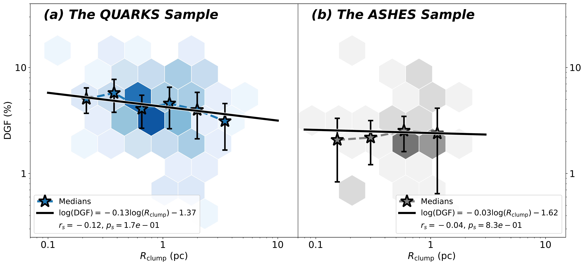
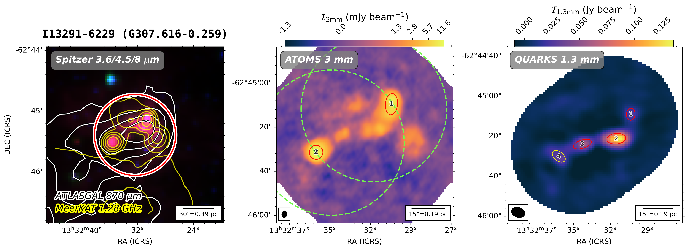

$\newcommand{\ensuremath}{}$
$\newcommand{\xspace}{}$
$\newcommand{\object}[1]{\texttt{#1}}$
$\newcommand{\farcs}{{.}''}$
$\newcommand{\farcm}{{.}'}$
$\newcommand{\arcsec}{''}$
$\newcommand{\arcmin}{'}$
$\newcommand{\ion}[2]{#1#2}$
$\newcommand{\textsc}[1]{\textrm{#1}}$
$\newcommand{\hl}[1]{\textrm{#1}}$
$\newcommand{\footnote}[1]{}$
$\newcommand{\massrate}{M_{\odot} yr^{-1}}$
$\newcommand{\hi}{H\textsc{i}}$
$\newcommand{\hii}{H\textsc{ii}}$
$\newcommand{\msun}{ M_\odot}$
$\newcommand{\lsun}{ L_\odot}$
$\newcommand{\kms}{km s^{-1}}$
$\newcommand{\jybeam}{Jy beam^{-1}}$
$\newcommand{\mjybeam}{mJy beam^{-1}}$
$\newcommand{\hmole}{H_2}$
$\newcommand{◦ee}{^{\circ}}$
$\newcommand{\parcsec}{\mbox{.\!\!\arcsec}}$
$\newcommand{\ssstyle}{\scriptscriptstyle}$
$\newcommand{\htco}{H_2CO}$
$\newcommand{\arraystretch}{1.8}$
$\newcommand{\arraystretch}{1.5}$
$\newcommand{\arraystretch}{1.5}$
$\newcommand{\arraystretch}{1.5}$

# The ALMA-QUARKS Survey: II. the ACA 1.3 mm continuum source catalog and the assembly of dense gas in massive star-forming clumps

<mark>Appeared on: 2024-04-04</mark> -  _24 pages, 7 figures. Accepted for publication in Research in Astronomy and Astrophysics. QUARKS atlas link: this https URL_

F. X. (许峰玮), et al. -- incl., <mark>S. Li</mark>

**Abstract:** Leveraging the high resolution, sensitivity, and wide frequency coverage of the Atacama Large Millimeter/submillimeter Array (ALMA), the QUARKS survey, standing for `Querying Underlying mechanisms of massive star formation with ALMA-Resolved gas Kinematics and Structures', is observing 139 massive star-forming clumps at ALMA Band 6 ( $\lambda\sim$ 1.3 mm). This paper introduces the Atacama Compact Array (ACA) 7-m data of the QUARKS survey, describing the ACA observations and data reduction. Combining multi-wavelength data, we provide the first edition of QUARKS atlas, offering insights into the multiscale and multiphase interstellar medium (ISM) in high-mass star formation. The ACA 1.3 mm catalog includes 207 continuum sources that are called ACA sources. Their gas kinetic temperatures are estimated using three formaldehyde transitions with a non-LTE radiation transfer model, and the mass and density are derived from a dust emission model. The ACA sources are massive (16--84 percentile values of 6--160 $\msun$ ), gravity-dominated ( $M\propto R^{1.1}$ ) fragments within massive clumps, with supersonic turbulence ( $\mathcal{M}>1$ ) and embedded star-forming protoclusters. We find a linear correlation between the masses of the fragments and the massive clumps, with a ratio of 6 \% between the two. When considering the fragments as representative of dense gas, the ratio indicates a dense gas fraction (DGF) of 6 \% , although with a wide scatter ranging from 1 \% to 10 \% . If we consider the QUARKS massive clumps to be what is observed at various scales, then the size-independent DGF indicates a self-similar fragmentation or collapsing mode in protocluster formation. With the ACA data over four orders of magnitude of luminosity-to-mass ratio ( $L/M$ ), we find that the DGF increases significantly with $L/M$ , which indicates clump evolutionary stage. We observed a limited fragmentation at the subclump scale, which can be explained by dynamic global collapse process.

**Figure 3. -** Histograms of (a) kinetic temperature $T_{\rm kin}$, (b) source mass $M_{\rm source}$, (c) surface density, (d) Mach number $\mathcal{M}$, (e) source size $R_{\rm dec}$, and (f) volume density $n_{\rm H_2}$.
 (*fig:stats*)

**Figure 6. -** Dense gas fraction (DGF) versus clump radius ($R_{\rm clump}$) of (a) the QUARKS sample and (b) the ASHES sample. The hexagons indicate the probability distributions of data points. The colored stars show the median values with errorbars in the $R_{\rm clump}$ bins.
 (*fig:DGF_Rclump*)

**Figure 1. -** QUARKS multi-band atlas of representative source I13291-6229. _Left panel_: the background is the Spitzer 3.6/4.5/8 $\mu$m pseudo color map, overlaid with Herschel 500 $\mu$m (white contours) and MeerKAT Galactic Plane Survey (MGPS) 1.28 GHz data (yellow contours). The red circle indicates the field of view ($\sim80$\arcsec) of the combined ATOMS 12m + ACA 3 mm continuum data. _Middle panel_: the background is the ATOMS combined 3 mm continuum data, linearly scaled from $-9\sigma$ to $9\sigma$ and logarithmically scaled from $9\sigma$ to peak intensity. The source IDs are in order from North to South, and the nomenclature follows "\#Field\_ATOMS\#ID". The green dashed circle(s) indicate the QUARKS pointing(s), with size of 7-m primary beam response of 0.2. The ATOMS beam size is shown on the bottom left. _Right panel_: the background is the QUARKS ACA 1.3 mm continuum data, linearly scaled from $-3\sigma$ to peak intensity. The continuum sources are shown as red ellipses (SNR$>9$) and yellow ellipses (SNR$<9$). The source IDs are in order from North to South and the nomenclature follows "\#Field\_ACA\#ID". The QUARKS beam size is shown in the bottom left. The scale bars in three panels are shown on the bottom right. (*fig:atlas_example*)

