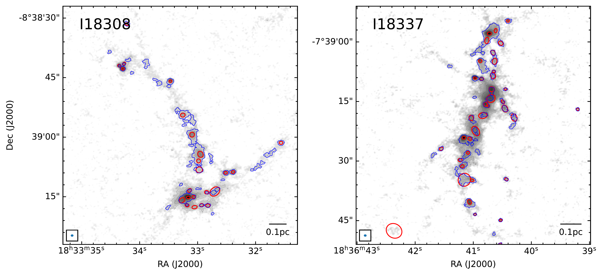
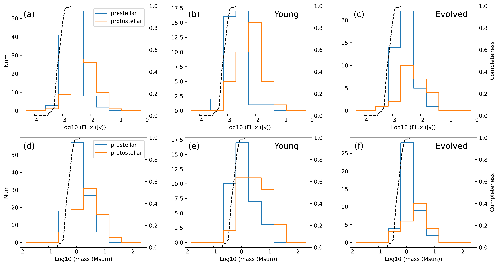
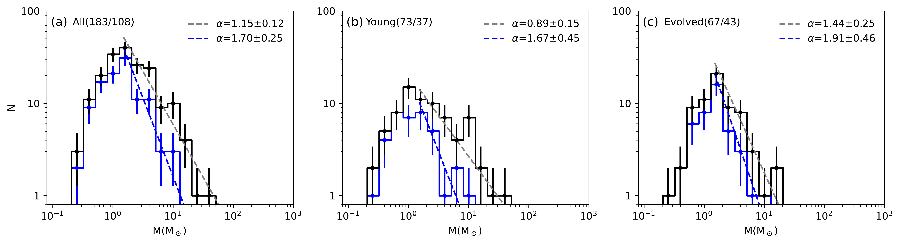

$\newcommand{\ensuremath}{}$
$\newcommand{\xspace}{}$
$\newcommand{\object}[1]{\texttt{#1}}$
$\newcommand{\farcs}{{.}''}$
$\newcommand{\farcm}{{.}'}$
$\newcommand{\arcsec}{''}$
$\newcommand{\arcmin}{'}$
$\newcommand{\ion}[2]{#1#2}$
$\newcommand{\textsc}[1]{\textrm{#1}}$
$\newcommand{\hl}[1]{\textrm{#1}}$
$\newcommand{\footnote}[1]{}$
$\newcommand{\kms}{\mbox{km s^{-1}}}$
$\newcommand{\kmspc}{\mbox{km s^{-1} pc^{-1}}}$
$\newcommand{\sqc}{\mbox{cm^{-2}}}$
$\newcommand{ç}{\mbox{cm^{-3}}}$
$\newcommand{\lsol}{\mbox{L_\odot}}$
$\newcommand{\msol}{\mbox{M_\odot}}$
$\newcommand{\msolpyr}{\mbox{M_\odot yr^{-1}}}$
$\newcommand{\mujypbm}{\mbox{\muJy beam^{-1}}}$
$\newcommand{\mjypbm}{\mbox{mJy beam^{-1}}}$
$\newcommand{\jypbm}{\mbox{Jy beam^{-1}}}$
$\newcommand{\hii}{\mbox{H {\sc ii}}}$
$\newcommand{\vlsr}{\mbox{V_\text{lsr}}}$
$\newcommand{\methanol}{\mbox{\rm CH_3OH}}$
$\newcommand{\ntwodp}{\mbox{\rm N_2D^+}}$
$\newcommand{\ntwohp}{\mbox{\rm N_2H^+}}$
$\newcommand{\htwoco}{\mbox{\rm H_2CO}}$
$\newcommand{\ceighteeno}{\mbox{\rm C^{18}O}}$
$\newcommand{\thirteenco}{\mbox{\rm ^{13}CO}}$
$\newcommand{\dcop}{\mbox{\rm DCO^+}}$
$\newcommand{\hcop}{\mbox{\rm HCO^+}}$
$\newcommand{\dcn}{\mbox{\rm DCN}}$
$\newcommand{\ammonia}{\mbox{\rm NH_3}}$
$\newcommand{\gcm}{\mbox{g cm^{-2}}}$
$\newcommand{\lsun}{\mbox{ L_\odot}}$
$\newcommand{\msun}{\mbox{ M_\odot}}$
$\newcommand{\msunyr}{\mbox{ M_\odot yr^{-1}}}$
$\newcommand{\arraystretch}{1.0}$
$\newcommand{\arraystretch}{1.0}$
$\newcommand{\arraystretch}{1.0}$
$\newcommand{\arraystretch}{1.0}$
$\newcommand{\arraystretch}{1.0}$

# INvestigations of massive Filaments ANd sTar formation (INFANT). I. Core Identification and Core Mass Function

<mark>Appeared on: 2024-04-08</mark> -  _25 pages, 8 figures, accepted for ApJ_

Y. C. (程宇), et al. -- incl., <mark>S. Li</mark>

**Abstract:** Filamentary structures are ubiquitously found in high-mass star-forming clouds. To investigate the relationship between filaments and star formation, we carry out the INFANT (INvestigations of massive Filaments ANd sTar formation) survey, a multi-scale, multi-wavelength survey of massive filamentary clouds with ALMA band 3/band 6 and VLA K band. In this first paper, we present the ALMA band 6 continuum observations toward a sample of 8 high-mass star forming filaments. We covered each target with approximately rectangular mosaic field of view with two 12-m array configurations, achieving an angular resolution of $\sim$ 0 $\farcs{6}$ (2700 AU at 4.5 kpc) and a continuum rms of $\sim$ 0.1 $\mjypbm$ ( $\sim$ 0.06 $\msol$ in gas mass assuming 15 K). We identify cores using the $_ getsf_$ and $_ astrodendro_$ and find the former is more robust in terms of both identification and measuring flux densities. We identify in total 183 dense cores (15--36 cores in each cloud) and classify their star formation states via outflow and warm gas tracers. The protostellar cores are statistically more massive than the prestellar cores, possibly indicating further accretion onto cores after formation of protostars. For the high-mass end ( $M_\text{core}$ $>$ 1.5 $\msun$ ) of the core mass function (CMF) we derive a power-law index of $-$ 1.15 $\pm$ 0.12 for the whole sample, and $-$ 1.70 $\pm$ 0.25 for the prestellar population. We also find a steepening trend in CMF with cloud evolution ( $-$ 0.89 $\pm$ 0.15 for the young group v.s. $-$ 1.44 $\pm$ 0.25 for the evolved group) and discuss its implication for cluster formation.

**Figure 3. -** Examples of core identification results with _ getsf_ and _ astrodendro_.
The 1.3 mm image is shown in grey colorscale and black contours with levels of 0.2 $\mjypbm$$\times$(5, 10, 20, 40, 80, 160). Red ellipses show the FWHM size of cores extracted by _ getsf_, and blue contours show the core boundaries identified by _ astrodendro_.  (*fig:map_iden*)

**Figure 7. -** _ (a)_ 1.3 mm flux distribution for the prestellar candidate cores and protostellar cores. The dashed black line indicates the recovery fraction (or completeness level) estimated for I18310 as a representative. _ (b)_ Same as _ (a)_ but only including cores from the relatively early type clouds, defined in \autoref{sec:evolution}, i.e., I18308, I18337, I18460. _ c)_ Same as _ (a)_ but only including cores from the relatively late type clouds, defined in \autoref{sec:evolution}, i.e., I18530, I19220, I19368. _ (d)_ Mass distribution for the prestellar candidate cores and protostellar cores, where the masses are estimated using the $\ammonia$  gas temperature. The dashed lines indicate the estimated recovery fraction for I18310 as a representative. A temperature of 14 K and 19 K, i.e., the median $\ammonia$  temperature for the two populations, are adopted for the red and blue line, respectively. _ (e)_ Same as _ (d)_ but only including cores from the relatively early type clouds, i.e., I18308, I18337, I18460. _ (f)_ Same as _ (d)_ but only including cores from the relatively early type clouds, i.e., I18530, I19220, I19368.
 (*fig:comp_mass*)

**Figure 8. -** _ (a)_ CMF and prestellar CMF of the INFANT sample shown in black and blue, respectively. The core masses are calculated using the $\ammonia$  gas temperatures. The dashed lines show the best power-law fit result for the high-mass end (M $>$ 1.5 $\msun$) for the corresponding CMFs. _ (b)_ Same as _ (a)_ but only including cores from the relatively early type clouds, i.e., I18308, I18337, I18460.  _ (c)_ Same as _ (a)_ but but only including cores from the relatively late type clouds, i.e., I18530, I19220, I19368.  (*fig:cmf*)

