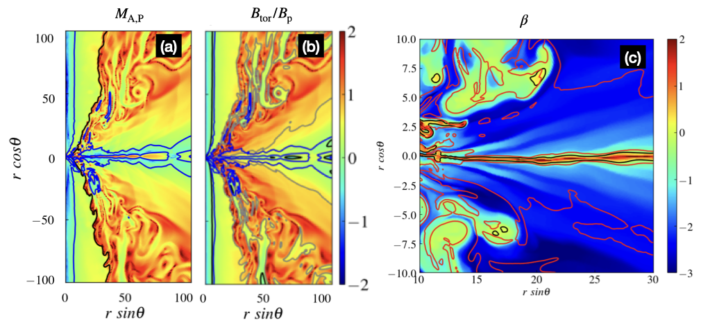
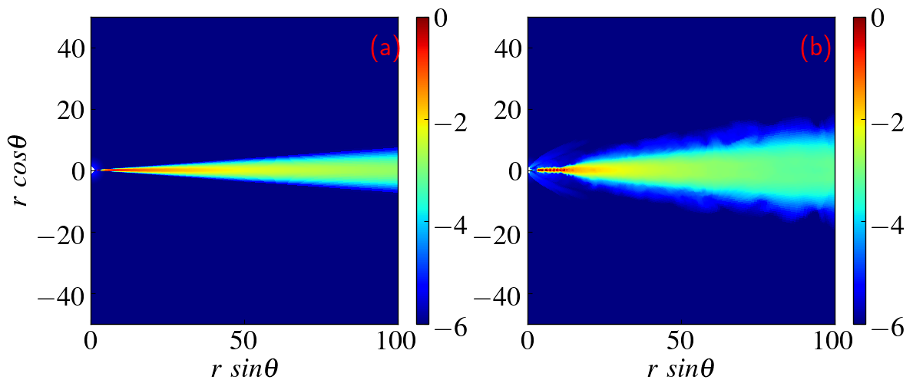
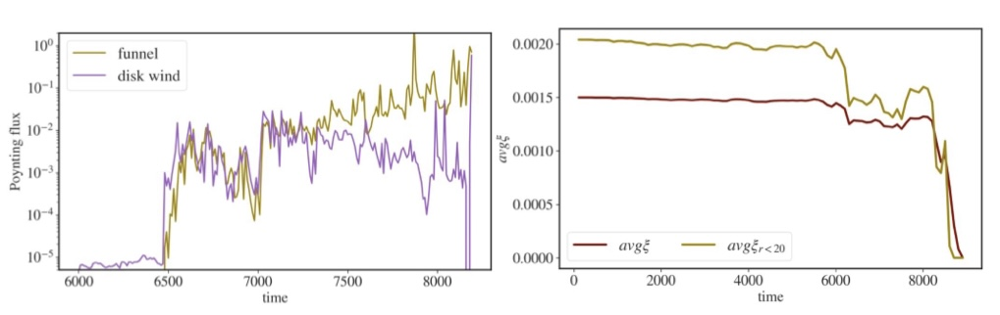

$\newcommand{\ensuremath}{}$
$\newcommand{\xspace}{}$
$\newcommand{\object}[1]{\texttt{#1}}$
$\newcommand{\farcs}{{.}''}$
$\newcommand{\farcm}{{.}'}$
$\newcommand{\arcsec}{''}$
$\newcommand{\arcmin}{'}$
$\newcommand{\ion}[2]{#1#2}$
$\newcommand{\textsc}[1]{\textrm{#1}}$
$\newcommand{\hl}[1]{\textrm{#1}}$
$\newcommand{\footnote}[1]{}$
$\newcommand{\ic}[1]{\textcolor{red}{ #1}}$
$\newcommand{\cf}{\textcolor{purple}}$
$\newcommand{\enquote}[1]{"#1"}$

# Thin Accretion disks in GR-MHD simulations

<mark>Appeared on: 2024-04-10</mark> -  _37 pages, 15 figures, Invited chapter for the edited book New Frontiers in GRMHD Simulations (Eds. C. Bambi, Y. Mizuno, S. Shashank and F. Yuan, Springer Singapore, expected in 2024)_

I. K. Dihingia, <mark>C. Fendt</mark>

**Abstract:** We review some recent results of general relativistic magnetohydrodynamic (GR-MHD) simulations considering the evolution of geometrically thin disks around a central black hole.Thin disk GR-MHD simulations complement the widely used MAD (Magnetically Arrested Disk) or SANE (Standard And Normal Evolution) approaches of evolving from an initial disk torus.In particular, we discuss the dynamical evolution of the disk, its role in the formation of disk winds or jets, the impact of disk resistivity, and its potential role in generating magnetic flux by an internal disk dynamo.The main characteristics of a thin disk in our approach are the Keplerian rotation of the disk material, which allows to launch disk outflows by the Blandford-Payne magneto-centrifugal effect, in addition to the Blandford-Znajek-driven spine jet from the black hole ergosphere. Thus, for this approach, we neglect disk thermodynamics and radiative effects, concentrating predominantly on the dynamical evolution of the system.Resistive MHD further allows the investigation of physical reconnection and also dynamo action.Magnetic reconnection may generate magnetic islands of plasmoids that are ejected from the disk along with the outflow.We also discussed potential applications of thin disk in explaining the decaying phase of an outburst in black hole X-ray binaries (BH-XRBs). Post-processing of radiation using the simulated dynamical data allows to derive spectra or fluxes, e.g., in the X-ray band,and to derive potential variability characteristics.

**Figure 6. -** Distribution of (a) poloidal Alfvénic Mach number ($M_{\rm A,P}$), (b) $B_{\rm tor}/B_{\rm p}$, and (c) plasma-$\beta$ for a magnetised thin accretion disk evolution from \cite{Dihingia-etal2021}. In panel (a), the solid black and blue lines correspond to contours of magnetisation $\sigma=1$ and $M_{\rm A,P}=1$, respectively. In panel (b),  the solid black, grey, and blue lines correspond to contours of $B_{\rm tor}/B_{\rm p} = 1, 5$, and $M_{\rm A,P} = 1$, respectively. In panel (c), the black and red lines correspond to the contours $\beta=1$, and $M_{\rm A,P} = 1$, respectively. (*fig-wind-prop*)

**Figure 4. -** Hydrodynamic evolution of NTD setup from \cite{Dihingia-etal2021}. Panel (a) and (b) show density distribution at time $t=0$ and $t=10000 t_g$, respectively. (*fig-hyd*)

**Figure 15. -** Evolution magnetic field strength during the dynamo process.
    Shown is the Poynting flux for the funnel BZ jet, and the disk wind (left).
    The flux is integrated along a sphere with radius $r=35 R_{\rm g}$, while the BZ considered
    for the segment $0\deg <\theta < 25\deg$ and the disk wind for the segment
    $25\deg <\theta < 65\deg$. The values are averaged over the corresponding segments at the
    lower hemisphere.
    The corresponding evolution of the absolute dynamo parameter $\xi$ is shown at the bottom,
    averaged in space for the whole disk, and for the inner disk area, $r < 20 R_{\rm g}$.
    Panels taken from \cite{VourellisFendt2021}. (*fig-evolv-poynting*)

