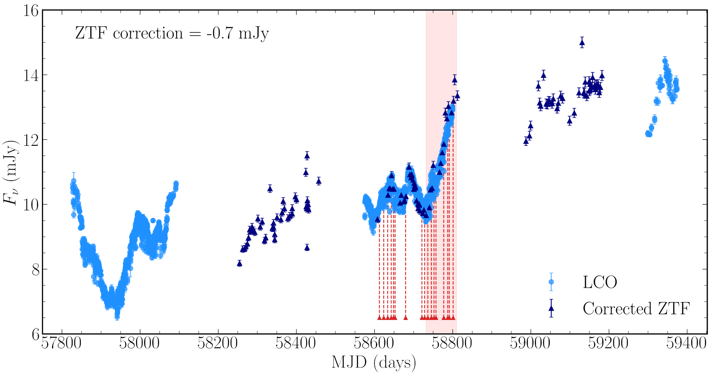
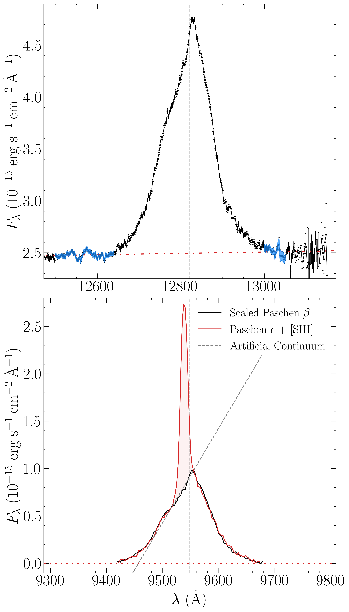
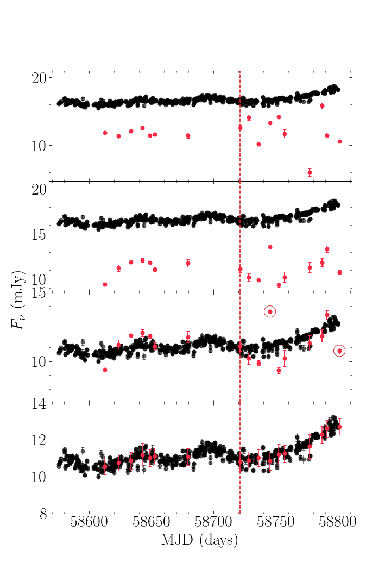

$\newcommand{\ensuremath}{}$
$\newcommand{\xspace}{}$
$\newcommand{\object}[1]{\texttt{#1}}$
$\newcommand{\farcs}{{.}''}$
$\newcommand{\farcm}{{.}'}$
$\newcommand{\arcsec}{''}$
$\newcommand{\arcmin}{'}$
$\newcommand{\ion}[2]{#1#2}$
$\newcommand{\textsc}[1]{\textrm{#1}}$
$\newcommand{\hl}[1]{\textrm{#1}}$
$\newcommand{\footnote}[1]{}$
$\newcommand{\la}{\mathrel{\hbox{\rlap{\hbox{\lower4pt\hbox{\sim}}}\hbox{<}}}}$
$\newcommand{\ga}{\mathrel{\hbox{\rlap{\hbox{\lower4pt\hbox{\sim}}}\hbox{>}}}}$
$\newcommand{\OIII}{[O~{\sevenrm III}]}$
$\newcommand{\FeII}{Fe~{\sevenrm II}}$
$\newcommand{\FeIIf}{[Fe~{\sevenrm II}]}$
$\newcommand{\SIII}{[S~{\sevenrm III}]}$
$\newcommand{\HeI}{He~{\sevenrm I}}$
$\newcommand{\HeII}{He~{\sevenrm II}}$
$\newcommand{\NeV}{[Ne~{\sevenrm V}]}$
$\newcommand{\OIV}{[O~{\sevenrm IV}]}$
$\newcommand{\iraf}{{\sevenrm IRAF}}$
$\newcommand{\mpfit}{{\sevenrm MPFIT}}$
$\newcommand{\galfit}{{\sevenrm GALFIT}}$
$\newcommand{\mapspec}{{\sevenrm mapspec}}$
$\newcommand{\cream}{{\sevenrm CREAM}}$
$\newcommand{\javelin}{{\sevenrm JAVELIN}}$
$\newcommand{\clumpy}{{\sevenrm CLUMPY}}$
$\newcommand{\cloudy}{{\sevenrm CLOUDY}}$
$\newcommand{\astroimagej}{{\sevenrm AstroImageJ}}$
$\newcommand{\banzai}{{\sevenrm BANZAI}}$
$\newcommand{\orac}{{\sevenrm ORAC}}$
$\newcommand{\python}{{\sevenrm python}}$
$\newcommand{\prepspec}{{\sevenrm prepspec}}$
$\newcommand{\GW}{{\sevenrm GW92}}$
$\newcommand{\spextool}{{\sevenrm Spextool}}$

# The first spectroscopic IR reverberation programme on Mrk 509

<mark>Appeared on: 2024-04-11</mark> -  _16 pages, 12 figures_

J. A. J. Mitchell, et al. -- incl., <mark>J.-U. Pott</mark>

**Abstract:** Near IR spectroscopic reverberation of Active Galactic Nuclei (AGN) potentiallyallows the IR broad line region (BLR)to be reverberated alongside the disc and dust continua, while the spectra can also reveal details of dust astro-chemistry. Here we describe results of a short pilot study (17 near-IR spectra over a 183 day period) for Mrk 509. The spectra give a luminosity-weighted dust radius of $\mbox{$\langle R_{\rm d,lum} \rangle = 186\pm4$ light-days}$ for blackbody (large grain dust), consistent with previous (photometric) reverberation campaigns, whereas carbon and silicate dust give much larger radii.We develop a method of calibrating spectral data in objects where the narrow lines are extended beyond the slit width. Wedemonstrate this by showing our resultantphotometric band lightcurves are consistent with previous results, with ahot dust lag at >40 days in the $K$ -band, clearly different from the accretion disc response at <20 days in the $z$ -band. We place this limit of 40 days by demonstrating clearly that the modest variability that we do detect in the $H$ and $K$ -band does not reverberate on timescales of less than 40 days.We also extract the Pa $\beta$ line lightcurve, and find a lag which is consistent with the optical BLR H $\beta$ line of $\sim70-90$ days. This is important as direct imaging of the near-IR BLR is now possible in a few objects, so we need to understand its relation to the better studied optical BLR.

**Figure 9. -**  LCO $g$-band observations of Mrk 509 with complementary corrected ZTF $g$ band data. The most significant variability feature measured contemporaneously with our near-IR spectra is shaded in red. Archival LCOGT data (MJD<58200) is shown to extend the time baseline. Spectral epochs are marked by red arrows.  (*ztf_lco*)

**Figure 2. -** **Top Panel:**  Pa$\beta$ emission line from Mrk 509 spectrum taken on 26 August 2019. Red line represents a linearly fitted continuum, subtracted in order to calculate enclosed flux. The continuum has been fit using a blueward clean continuum window of (12500-12640) Å  and the redward clean continuum window of (13000-13050) Å, these regions are highlighted in blue. The redward window is necessarily short as beyond this there is significant telluric absorption. **Bottom Panel:**  Mean spectrum of Mrk 509 from all 4 nights with photometric conditions. Pa$\mathrm{\beta}$ profile (black) scaled to match Pa$\mathrm{\epsilon}$(red), in order to isolate the constant $\SIII$$\mathrm{$\la$mbda 9531}$ component from any variable broad line emission. The slope of the Pa$\mathrm{\beta}$ profile in the $\SIII$  window is shown as the artificial continuum in grey. Both panels centre on the rest frame wavelengths of 12821.6 $\mathrm{\Angstrom}$ and 9548.6 $\mathrm{\Angstrom}$ for Pa$\beta$ and Pa$\epsilon$ respectively and have a matched velocity range.
 (*siii_flux_window*)

**Figure 4. -** **Top Panel:** LCO $z_s$ band photometry, uncorrected for host galaxy contribution in black, with all 17 spectral LCO $z_s$ band (8180-9220 $\mathrm{\Angstrom}$ observed frame) uncorrected fluxes plotted in red. **Second Panel:** LCO $z_s$ band photometry, uncorrected for host galaxy contribution in black, with all 17 spectral  LCO $z_s$ band ((8180-9220) $\mathrm{\Angstrom}$ observed frame) fluxes, corrected with $\mapspec$  scaling factors are plotted in red.**Third Panel:** LCO $z_s$ band photometry, corrected for a constant host galaxy contribution in black, with all 17 spectral LCO $z_s$ band (8180-9220 $\mathrm{\Angstrom}$ observed frame) fluxes, corrected with the $\mapspec$  scaling factors  plotted in red. Spectral fluxes measured on MJD 58745.30 and 58801.20 are encircled in red as they do not match well with the   LCO $z_s$ band photometry. The night of 26$\mathrm{^{th}}$ August 2019 is highlighted with a dashed red line. **Bottom Panel:** The $\mapspec$  corrected lightcurve has been further corrected to the LCO $z_s$ band photometry by scaling to the weighted mean of all photometric data points within three days of each spectral data point. The errors displayed are defined by the spread of the data to which the spectral points have been corrected, or the mean spread of the photometry within any given 3 day period of the spread if the correction was less than this value. These uncertainties have been propagated to our corrected lightcurves along with the $\mapspec$  uncertainties displayed in the panel above.   (*z_check*)

