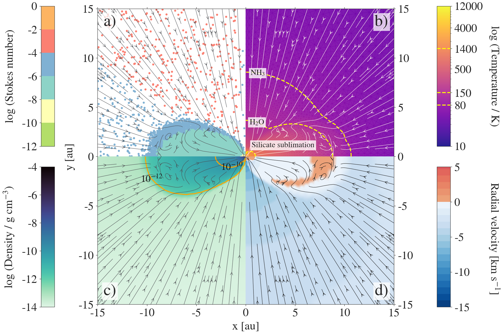
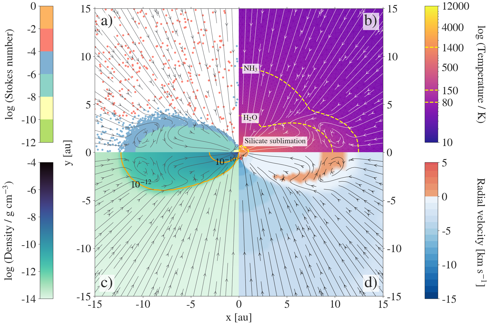
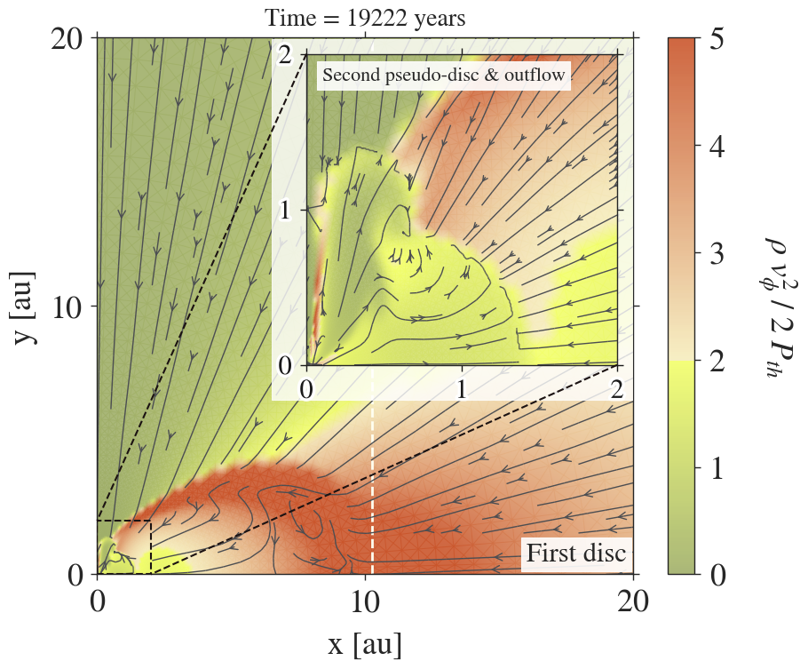
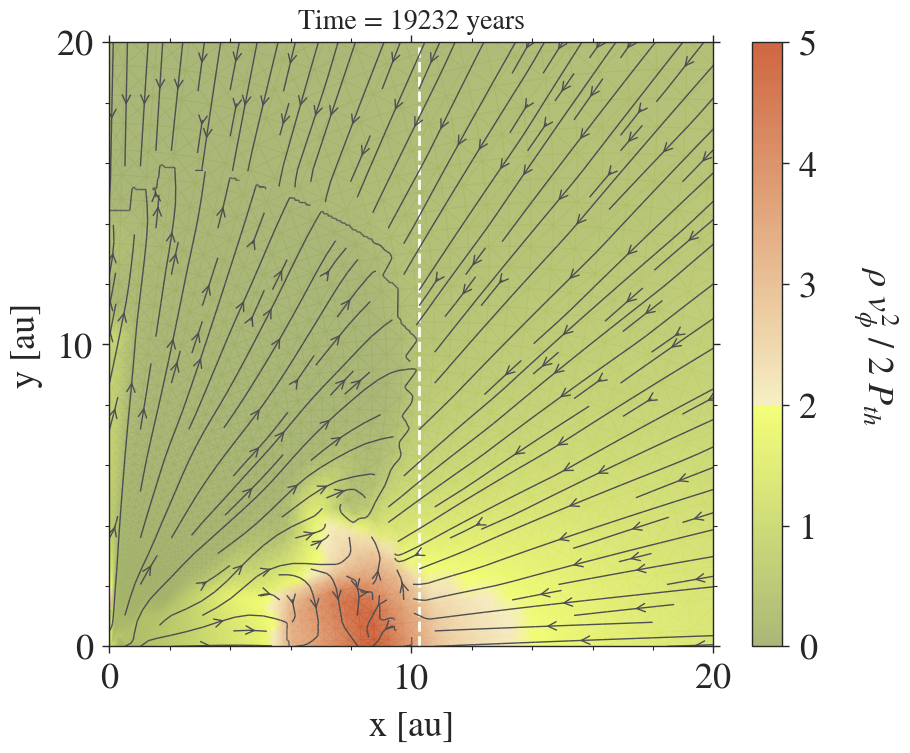
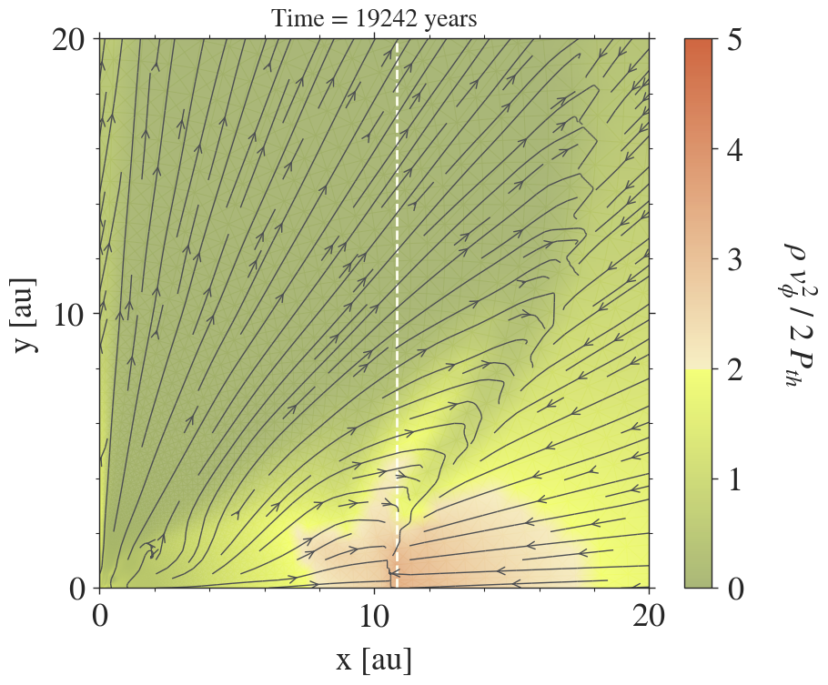
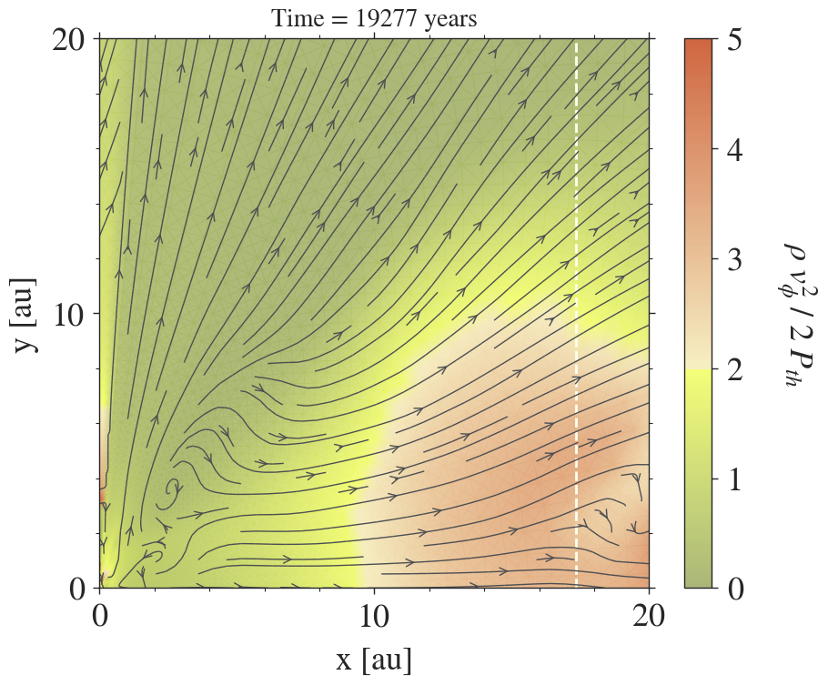

$\newcommand{\ensuremath}{}$
$\newcommand{\xspace}{}$
$\newcommand{\object}[1]{\texttt{#1}}$
$\newcommand{\farcs}{{.}''}$
$\newcommand{\farcm}{{.}'}$
$\newcommand{\arcsec}{''}$
$\newcommand{\arcmin}{'}$
$\newcommand{\ion}[2]{#1#2}$
$\newcommand{\textsc}[1]{\textrm{#1}}$
$\newcommand{\hl}[1]{\textrm{#1}}$
$\newcommand{\footnote}[1]{}$
$\newcommand$
$\newcommand$
$\newcommand$
$\newcommand$

# Mixing is easy: new insights for cosmochemical evolution from pre-stellar core collapse

<mark>Appeared on: 2024-04-16</mark> -  _24 pages and 27 figures. Accepted for publication in A&A_

A. Bhandare, et al. -- incl., <mark>M. Flock</mark>

**Abstract:** Signposts of early planet formation are ubiquitous in sub-structured young discs. Dense, hot and high-pressure regions formed during the gravitational collapse process, integral to star formation,  facilitate dynamical mixing of dust within the protostellar disc. This provides an incentive to constrain the role of gas and dust interaction and resolve potential zones of dust concentration during star and disc formation stages. We explore if the thermal and dynamical conditions developed during protostellar disc formation can generate gas flows that efficiently mix and transport the well-coupled gas and dust components. We simulate the collapse of dusty molecular cloud cores with the hydrodynamics code \texttt{PLUTO} augmented with radiation transport and self-gravity. We use a two-dimensional axisymmetric geometry and follow the azimuthal component of the velocity. The dust is treated as Lagrangian particles that are subject to drag from the gas, whose motion is computed on a Eulerian grid. We consider 1, 10 and 100 micron-sized neutral spherical dust grains. Importantly, the equation of state accurately includes molecular hydrogen dissociation. We focus on molecular cloud core masses of 1 and 3 $M_{\odot}$ and explore effects of different initial rotation rates and cloud core sizes. Our study underlines mechanisms for early transport of dust from the inner hot disc regions via the occurrence of two transient gas motions, namely, meridional flow and outflow. The vortical flow fosters dynamical mixing and retention of dust, while the thermal pressure driven outflow replenishes dust in the outer disc. Notably, these phenomena occur regardless of the initial cloud core mass, size and rotation rate. Young dynamical precursors to planet-forming discs exhibit regions with complex hydrodynamical gas features and high-temperature structures. These can play a crucial role in concentrating dust for subsequent growth into protoplanets. Dust transport, especially, from sub-au scales surrounding the protostar to the outer relatively cooler parts, offers an efficient pathway for thermal reprocessing during pre-stellar core collapse.

**Figure 17. -** 2D view of the first hydrostatic core evolved into a rotationally supported disc at 1221 years after its formation as a result of the fiducial collapse of a 1 $M_{\odot}$ pre-stellar core with an initial rotation rate of \mbox{$\Omega_\mathrm{0} = 1.77 \times 10^{-13}$ rad $\mathrm{s}^{-1}$}(same time snapshot as Fig. \ref{fig:HD-seconddisc007}). The dust size is fixed to a constant value of 1 $\muup$m. The four panels show the \mbox** a)** Stokes number, \mbox** b)** gas temperature, \mbox** c)** gas density and \mbox** d)** radial gas velocity within the inner 15 au of the 3000 au collapsing pre-stellar core. The gas velocity streamlines indicate the material falling onto the disc and the mixing within. The meridional flow exhibited in the plot between 5--10 au forms in the inner regions and travels outwards. This motion results in an outward transport and retains dust in the outer disc. (*fig:HDdisc007*)

**Figure 23. -** 2D view of a first hydrostatic core evolved into a rotationally supported disc at 1427 years after its formation as a result of the collapse of a 1 $M_{\odot}$ pre-stellar core with an initial rotation rate of \mbox{$\Omega_\mathrm{0} = 2.099 \times 10^{-13}$ rad $\mathrm{s}^{-1}$}(same time snapshot as Fig. \ref{fig:HD-seconddisc001}). The dust size is fixed to a constant value of 1 $\muup$m. The four panels show the \mbox** a)** Stokes number, \mbox** b)** gas temperature, \mbox** c)** gas density and \mbox** d)** radial gas velocity within the inner 15 au of the 3000 au collapsing pre-stellar core. The gas velocity streamlines indicate the material falling onto the disc and the mixing within the meridional flow located at around 10 au. (*fig:HDdisc001*)

**Figure 7. -** Rotational support (\mbox{$\rho v_{\phi}^2 / 2 > 2 P_\mathrm{th}$}) at different time snapshots highlighting the merger of the first core disc and pseudo-disc around second core formed during the 1 $M_{\odot}$ pre-stellar core collapse. The topmost plot shows the presence of both discs, which eventually merge _after_ the outflow is launched. The white dashed vertical line marks the radius of the rotationally supported first core disc using the definition detailed in Sect. \ref{sec:hydrodisc}. Gas velocity streamlines show the infalling envelope, mixing within the discs and the outflowing gas. (*fig:discmerger*)

