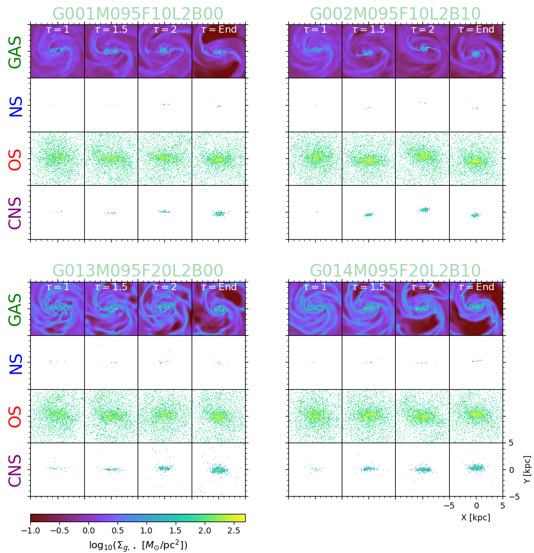
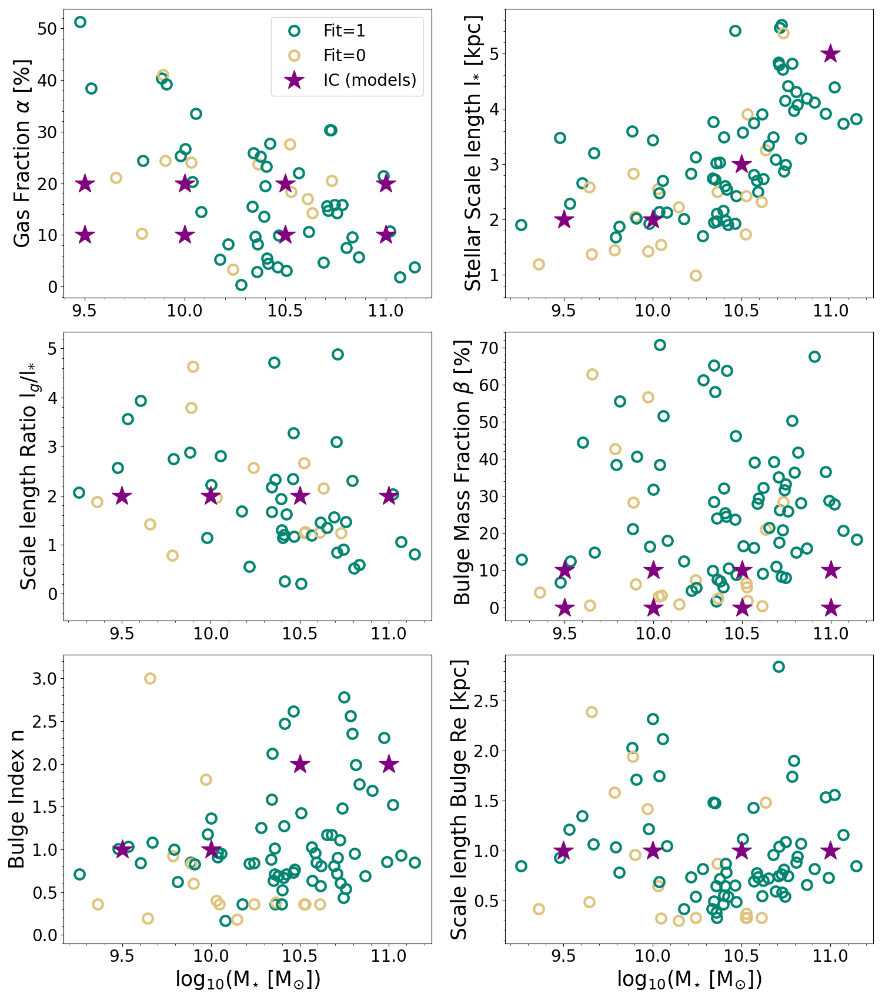
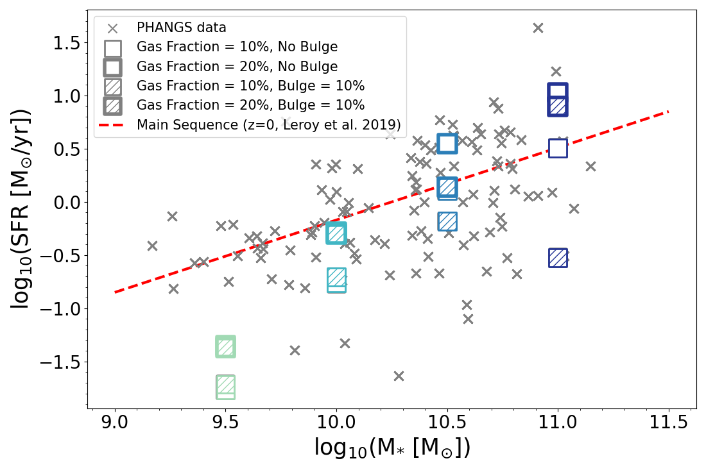

$\newcommand{\ensuremath}{}$
$\newcommand{\xspace}{}$
$\newcommand{\object}[1]{\texttt{#1}}$
$\newcommand{\farcs}{{.}''}$
$\newcommand{\farcm}{{.}'}$
$\newcommand{\arcsec}{''}$
$\newcommand{\arcmin}{'}$
$\newcommand{\ion}[2]{#1#2}$
$\newcommand{\textsc}[1]{\textrm{#1}}$
$\newcommand{\hl}[1]{\textrm{#1}}$
$\newcommand{\footnote}[1]{}$
$\newcommand{\A}{A_{2}}$
$\newcommand{\tb}{t_{bar}}$
$\newcommand{\Msun}{\mbox{M}_{\sun}}$
$\newcommand{\kms}{km.s^{-1}}$

# Simulating nearby disc galaxies on the main star formation sequence

<mark>Appeared on: 2024-04-16</mark> -  _22 pages, 17 figures_

P. Verwilghen, et al. -- incl., <mark>J. Neumann</mark>, <mark>E. Schinnerer</mark>

**Abstract:** Past studies have long emphasised the key role played by galactic stellar bars in the context of disc secular evolution, via the redistribution of gas and stars, the triggering of star formation, and the formation of prominent structures such as rings and central mass concentrations. However, the exact physical processes acting on those structures, as well as the timescales associated with the building and consumption of central gas reservoirs are still not well understood. We are building a suite of hydro-dynamical RAMSES simulations of isolated, low-redshift galaxies that mimic the properties of the PHANGS sample. The initial conditions of the models reproduce the observed stellar mass, disc scale length, or gas fraction, and this paper presents a first subset of these models. Most of our simulated galaxies develop a prominent bar structure, which itself triggers central gas fuelling and the building of an over-density with a typical scale of 100-1000 pc. We confirm that if the host galaxy features an ellipsoidal component, the formation of the bar and gas fuelling are delayed. We show that most of our simulations follow a common time evolution, when accounting for mass scaling and the bar formation time. In our simulations, the stellar mass of $10^{10}$ M $_{\odot}$ seems to mark a change in the phases describing the time evolution of the bar and its impact on the interstellar medium. In massive discs (M $_{\star} \geq 10^{10}$ M $_{\odot}$ ), we observe the formation of a central gas reservoir with star formation mostly occurring within a restricted starburst region, leading to a gas depletion phase. Lower-mass systems (M $_{\star} < 10^{10}$ M $_{\odot}$ ) do not exhibit such a depletion phase, and show a more homogeneous spread of star-forming regions along the bar structure, and do not appear to host inner bar-driven discs or rings. Our results seem to be supported by observations, and we briefly discuss how this new suite of simulations can help our understanding of the secular evolution of main sequence disc galaxies.

**Figure 14. -** Time evolution as a function of $\tau$ of the gas surface density (top row, \textcolor{OliveGreen}{GAS}), formed stars' surface density (second row, \textcolor{blue}{NS}), old stars' surface density (third row, \textcolor{red}{OS}), and cumulative formed stars' surface density (bottom row, \textcolor{violet}{CNS}) of the four lowest stellar mass models (10$^{9.5}$\Msun). Each panel shows a box with a side length of 10 kpc. (*fig:Dens_Glob_095*)

**Figure 8. -** Results of the fit for different parameters of the models as a function of the stellar mass. Top panels: gas fraction (left) and stellar scale length (right). Middle panels: scale length ratio between the gas and stars (left) and scale length of the stellar bulge (right). Bottom panels: bulge index (left) and bulge mass fraction (right). Colour circles show the actual fits (see the text in Sec. \ref{sub:cont_params} for details) to the PHANGS-ALMA sample, while the selected values for our used initial conditions (IC(models)) are shown with purple stars. (*fig:PH_IC_Tot*)

**Figure 2. -** Comparison of the SFR stemming from the PHANGS data sample (grey crosses) and the SFR computed from the simulated galaxies (coloured squared). The colour of the squares corresponds to the different stellar masses. The red dashed line represents the star formation main sequence at $z=0$ from [Leroy, Sandstrom and Lang (2019)](). (*fig:SFR*)

