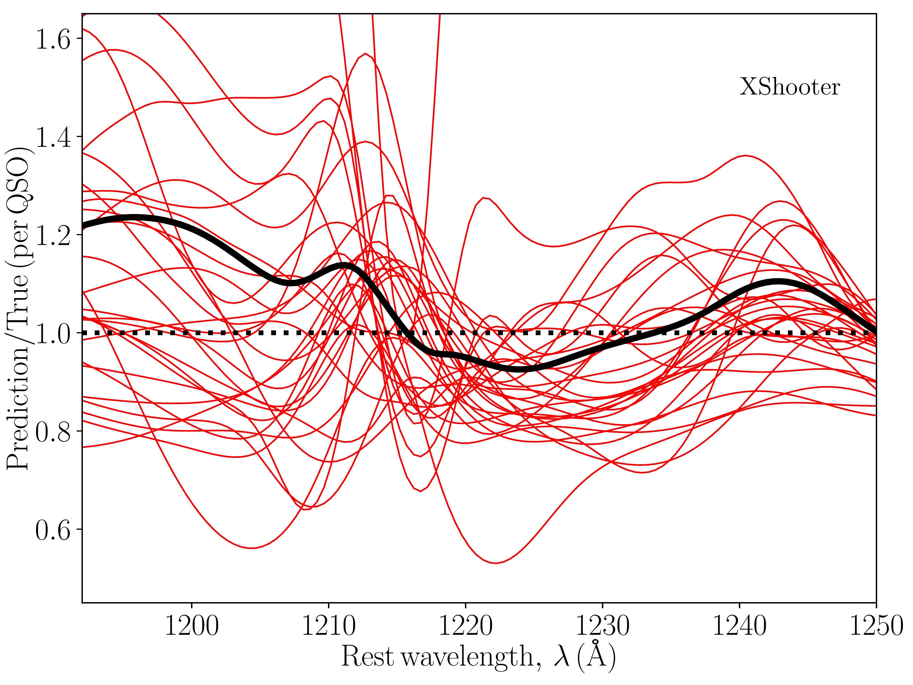
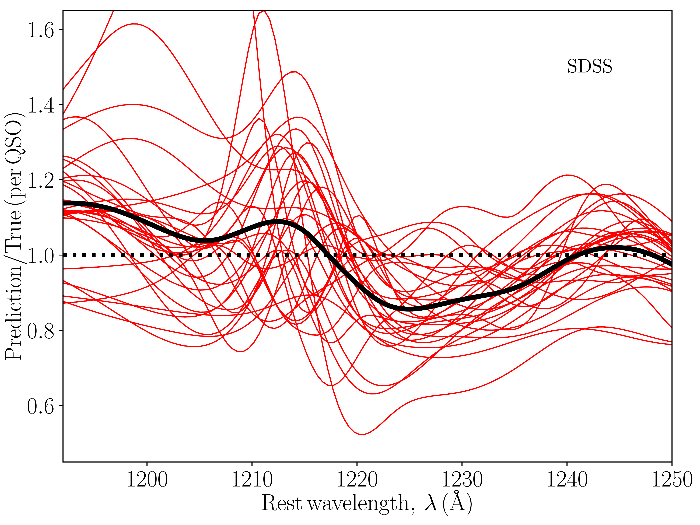
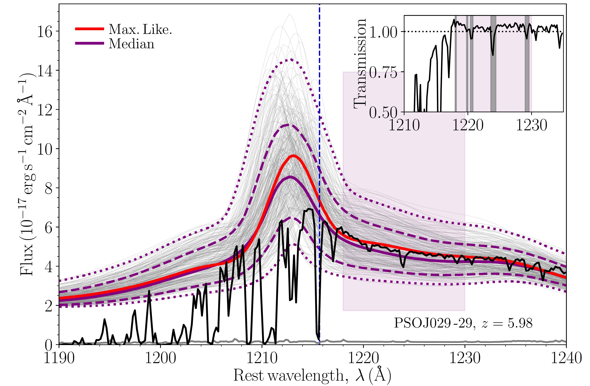
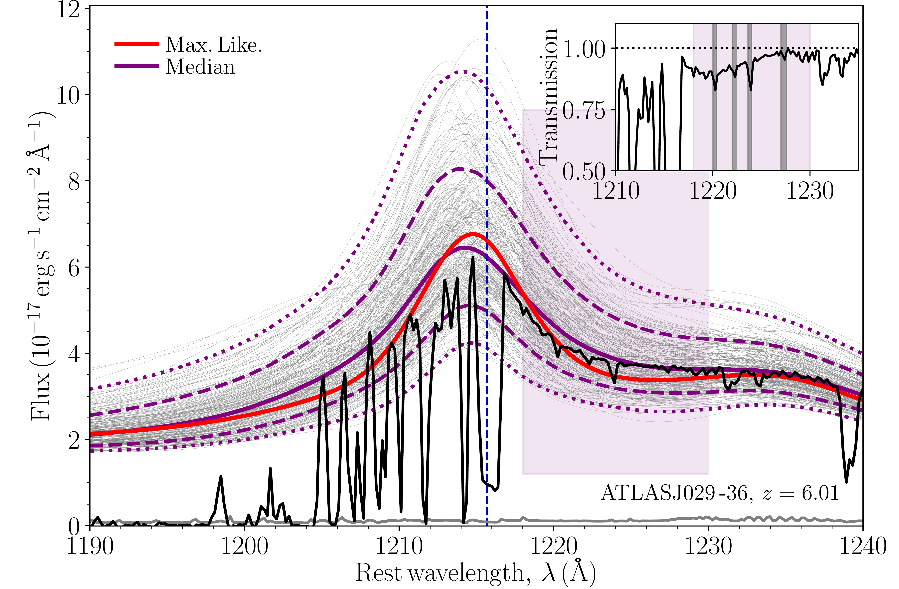
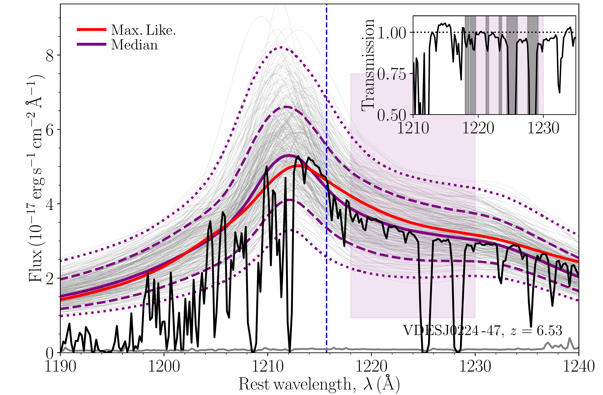
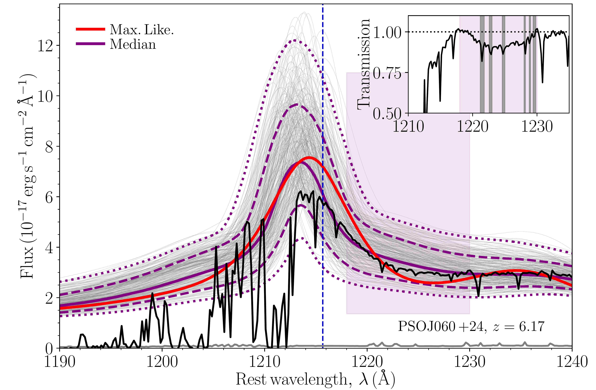
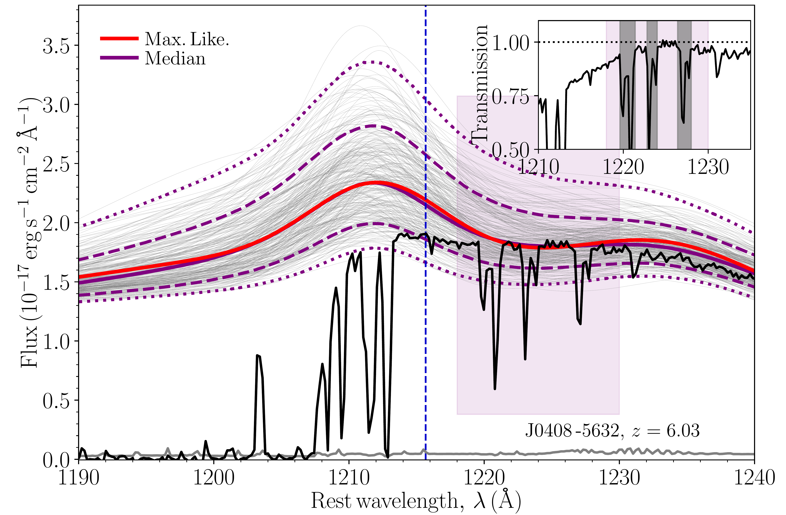
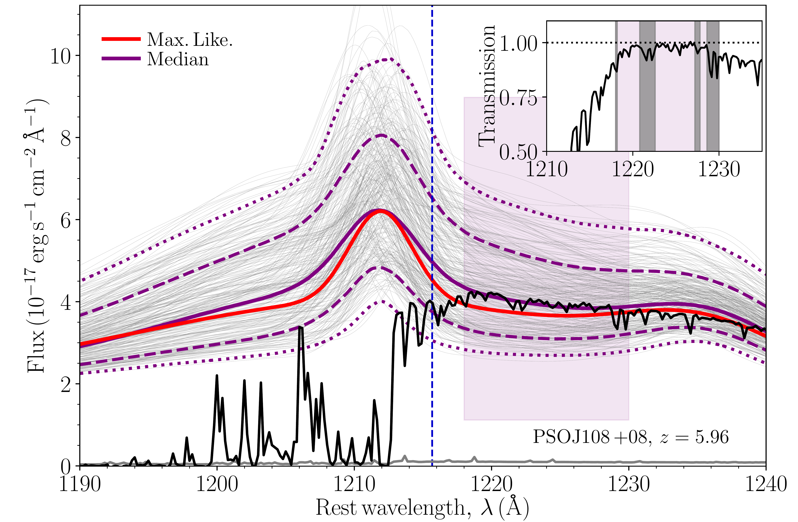
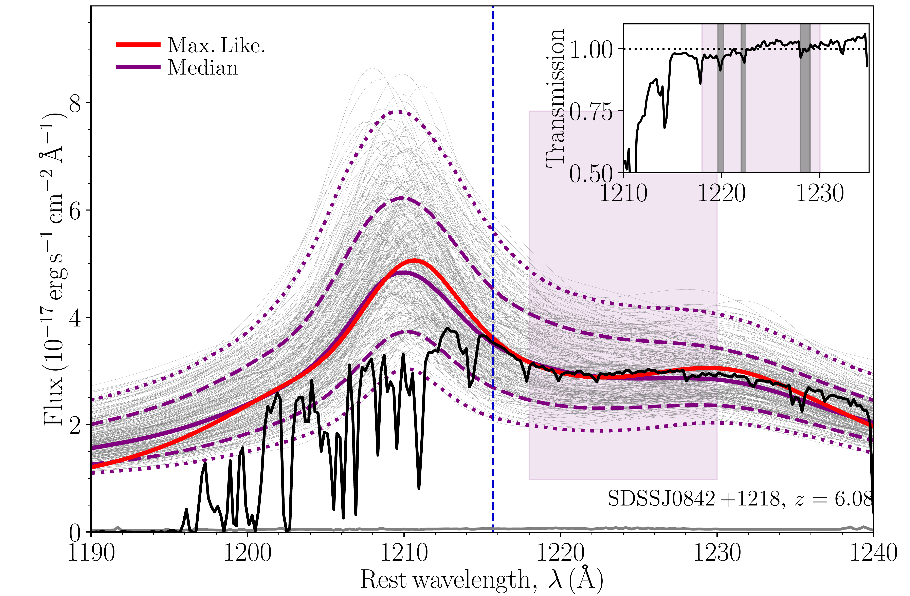
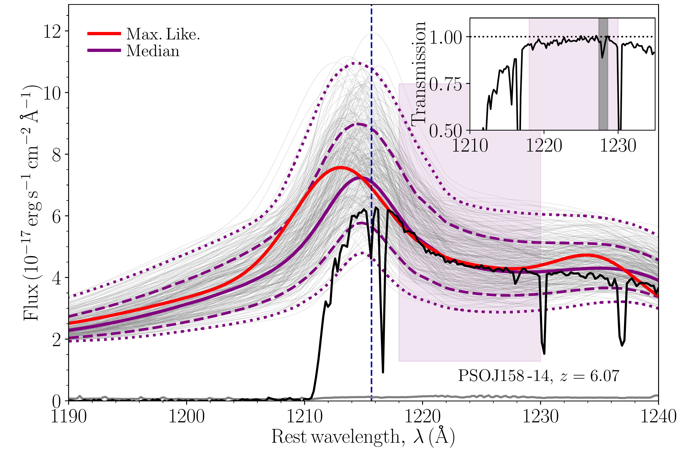

$\newcommand{\ensuremath}{}$
$\newcommand{\xspace}{}$
$\newcommand{\object}[1]{\texttt{#1}}$
$\newcommand{\farcs}{{.}''}$
$\newcommand{\farcm}{{.}'}$
$\newcommand{\arcsec}{''}$
$\newcommand{\arcmin}{'}$
$\newcommand{\ion}[2]{#1#2}$
$\newcommand{\textsc}[1]{\textrm{#1}}$
$\newcommand{\hl}[1]{\textrm{#1}}$
$\newcommand{\footnote}[1]{}$
$\newcommand$
$\newcommand$
$\newcommand$
$\newcommand{\lya}{\ifmmode\mathrm{Ly}\alpha\else Ly\alpha\fi}$
$\newcommand{\lyb}{\ifmmode\mathrm{Ly}\beta\else Ly\beta\fi}$
$\newcommand{\igm}{\ifmmode\mathrm{IGM}\else IGM\fi}$
$\newcommand{\lae}{\ifmmode\mathrm{LAE}\else LAE\fi}$
$\newcommand{\h}{\ifmmode\mathrm{H}\else H\fi}$
$\newcommand{\hi}{\ifmmode\mathrm{H {\scriptscriptstyle I}}\else H {\scriptsize I}\fi}$
$\newcommand{\hii}{\ifmmode\mathrm{H {\scriptscriptstyle II}}\else H {\scriptsize II}\fi}$
$\newcommand{\cmb}{\ifmmode\mathrm{CMB}\else CMB\fi}$
$\newcommand{\qso}{\ifmmode\mathrm{QSO}\else QSO\fi}$
$\newcommand{\eor}{\ifmmode\mathrm{EoR}\else EoR\fi}$
$\newcommand{\heii}{\ifmmode\mathrm{He {\scriptscriptstyle II}}\else He {\scriptsize II}\fi}$
$\newcommand{\heiii}{\ifmmode\mathrm{He {\scriptscriptstyle III}}\else He {\scriptsize III}\fi}$
$\newcommand{\ciii}{\ifmmode\mathrm{C {\scriptscriptstyle III]}}\else C {\scriptsize III]}\fi}$
$\newcommand{\oiii}{\ifmmode\mathrm{O {\scriptscriptstyle III}}\else O {\scriptsize III}\fi}$
$\newcommand{\aliii}{\ifmmode\mathrm{Al {\scriptscriptstyle III}}\else Al {\scriptsize III}\fi}$
$\newcommand{\mgii}{\ifmmode\mathrm{Mg {\scriptscriptstyle II}}\else Mg {\scriptsize II}\fi}$
$\newcommand{\fe}{\ifmmode\mathrm{Fe}\else Fe\fi}$
$\newcommand{\nv}{\ifmmode\mathrm{N {\scriptscriptstyle V}}\else N {\scriptsize V}\fi}$
$\newcommand{\niv}{\ifmmode\mathrm{N {\scriptscriptstyle IV]}}\else N {\scriptsize IV]}\fi}$
$\newcommand{\cii}{\ifmmode\mathrm{C {\scriptscriptstyle II}}\else C {\scriptsize II}\fi}$
$\newcommand{\civ}{\ifmmode\mathrm{C {\scriptscriptstyle IV}}\else C {\scriptsize IV}\fi}$
$\newcommand{\siv}{\ifmmode\mathrm{Si {\scriptscriptstyle IV}}\else Si {\scriptsize IV}\fi}$
$\newcommand{\siii}{\ifmmode\mathrm{Si {\scriptscriptstyle II}}\else Si {\scriptsize II}\fi}$
$\newcommand{\siiii}{\ifmmode\mathrm{Si {\scriptscriptstyle III]}}\else Si {\scriptsize III]}\fi}$
$\newcommand{\ovi}{\ifmmode\mathrm{O {\scriptscriptstyle VI}}\else O {\scriptsize VI}\fi}$
$\newcommand{\sioiv}{\ifmmode\mathrm{Si {\scriptscriptstyle IV} \plus O {\scriptscriptstyle IV]}}\else Si {\scriptsize IV} +O {\scriptsize IV]}\fi}$
$\newcommand{\Msun}{M_\odot}$
$\newcommand{\note}[1]{{\color{red} #1}}$
$\newcommand{\comment}[1]{{\color{blue} #1}}$
$\newcommand{\nf}{x_{\rm HI}}$
$\newcommand{\avenf}{\bar{x}_{\rm HI}}$
$\newcommand{\faintgal}{\textsc{\small Faint galaxies}}$
$\newcommand{\brightgal}{\textsc{\small Bright galaxies}}$
$\newcommand{\smallHII}{\textsc{\small Small \hii }}$
$\newcommand{\intermediateHII}{\textsc{\small Intermediate \hii }}$
$\newcommand{\largeHII}{\textsc{\small Large \hii }}$
$\newcommand{\cmmc}{\textsc{\small 21CMMC}}$
$\newcommand{\cmfst}{\textsc{\small 21CMFAST}}$
$\newcommand{\sense}{{\small 21}\textsc{cmsense}}$
$\newcommand{\CH}{\textsc{cosmohammer}}$
$\newcommand{\emcee}{\textsc{emcee}}$
$\newcommand{\thebibliography}{\DeclareRobustCommand{\VAN}[3]{##3}\VANthebibliography}$

# IGM damping wing constraints on the tail end of reionisation from the enlarged XQR-30 sample

<mark>Appeared on: 2024-04-22</mark> -  _21 pages, 9 figures and 2 tables. Accepted for publication in MNRAS_

B. Greig, et al. -- incl., <mark>E. Bañados</mark>

**Abstract:** $\noindent$ The attenuation of Ly $\alpha$ photons by neutral hydrogen in the intergalactic medium (IGM) at $z\gtrsim5$ continues to be a powerful probe for studying the epoch of reionisation. Given a framework to estimate the intrinsic (true) Ly $\alpha$ emission of high- $z$ sources, one can infer the ionisation state of the IGM during reionisation. In this work, we use the enlarged XQR-30 sample of 42 high-resolution and high-SNR QSO spectra between $5.8\lesssim z\lesssim 6.6$ obtained with VLT/X-Shooter to place constraints on the IGM neutral fraction. This is achieved using our existing Bayesian QSO reconstruction framework which accounts for uncertainties such as the: (i) posterior distribution of predicted intrinsic $\lya$ emission profiles (obtained via covariance matrix reconstruction of the Ly $\alpha$ and $\nv$ emission lines from unattenuated high-ionisation emission line profiles; $\civ$ , $\sioiv$ and $\ciii$ ) and (ii) distribution of ionised regions within the IGM using synthetic damping wing profiles drawn from a $1.6^3$ Gpc $^3$ reionisation simulation. Following careful quality control, we used 23 of the 42 available QSOs to obtain constraints/limits on the IGM neutral fraction during the tail-end of reionisation. Our median and 68th percentile constraints on the IGM neutral fraction are: $0.20\substack{+0.14\\-0.12}$ and $0.29\substack{+0.14\\-0.13}$ at $z = 6.15$ and 6.35. Further, we also report 68th percentile upper-limits of $\bar{x}_{\hi } < 0.21$ , 0.20, 0.21 and 0.18 at $z = 5.8, 5.95, 6.05$ and 6.55. These results imply reionisation is still ongoing at $5.8\lesssim z\lesssim 6.55$ , consistent with previous results from XQR-30 (dark fraction and Ly $\alpha$ forest) along with other observational probes considered in the literature.

**Figure 2. -** A visual demonstration of the initial covariance reconstruction for ATLAS J025-33 at $z=6.34$ highlighting problems with our original reconstruction pipeline. _Left panel:_ The observed QSO spectrum (black curve), corresponding maximum-likelihood (red curve) reconstruction and 300 random profile draws (grey curves) from our full reconstructed covariance matrix. The solid purple curve corresponds to the median reconstruction profile obtained from the full distribution of reconstructed profiles while the dashed (dotted) curves correspond to the 68th (95th) distribution of profiles. The vertical blue dashed line corresponds to rest-frame $\lya$  while the purple box denotes the region over which we fit for the IGM damping wing imprint (1218-1230Å). _Right panel:_ The observed $\lya$  transmission profile (black curve) obtained by dividing the observed spectrum by the median reconstructed profile. The coloured lines correspond to the median synthetic IGM damping wing profiles for each IGM neutral fraction value sampled by our EoR simulations. Grey shaded regions correspond to absorption features that are masked by our damping wing fitting pipeline. (*fig:uncalibrated*)

**Figure 3. -** The performance of our covariance matrix reconstruction method from two distinct samples of 30 QSOs from X-shooter (left panel) and SDSS (BOSS; right panel) at $3.5 < z < 4.5$. The red solid lines correspond to the flux ratio (reconstructed maximum-likelihood profile over true intrinsic profile) for each individual QSO in the samples. The black solid lines correspond to the median determined over each sample. (*fig:Correction*)

**Figure 5. -** Intrinsic QSO reconstructions of the XQR-30 sample. We provide the maximum-likelihood reconstruction (red curve), the purple solid, dashed and dotted curves correspond to the median, 68th and 95th percentile profiles and the thin grey curves represent 300 random draws from our full posterior distribution. The solid thick grey curve near zero corresponds to the QSO noise spectrum, amplified by a factor of 5 to improve the numerical performance of our neutral fraction inference approach (see text for further details). The purple shaded box demarcates our damping wing fitting region (1218-1230Å region). _Inset panel:_ The $\lya$  transmission profile highlighting the presence (if any) of an IGM damping wing imprint (i.e. observed transmission spectrum below unity) assuming the median (purple curve). Grey shaded regions correspond to features in the observed spectrum removed from our likelihood fitting. (*fig:results*)

