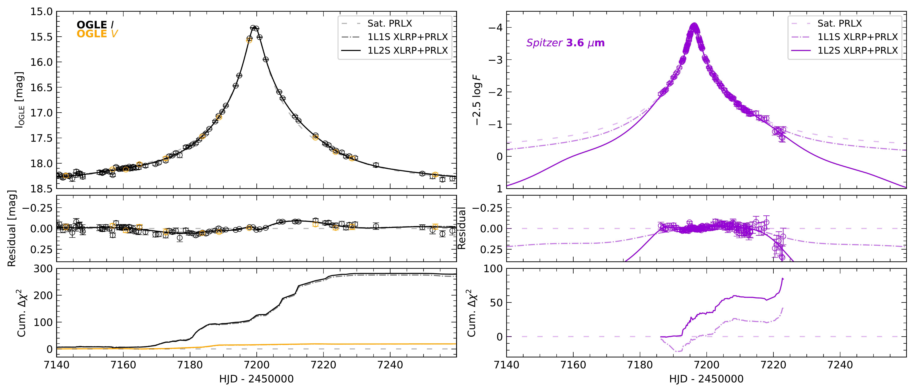
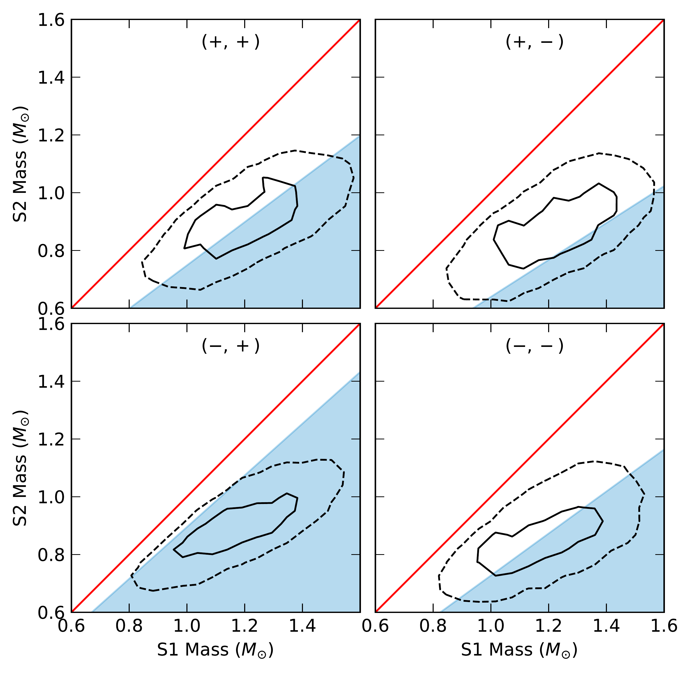
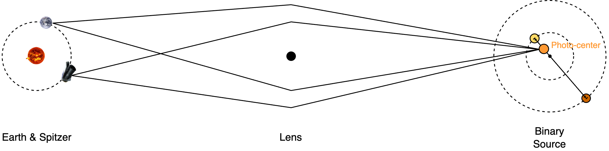

$\newcommand{\ensuremath}{}$
$\newcommand{\xspace}{}$
$\newcommand{\object}[1]{\texttt{#1}}$
$\newcommand{\farcs}{{.}''}$
$\newcommand{\farcm}{{.}'}$
$\newcommand{\arcsec}{''}$
$\newcommand{\arcmin}{'}$
$\newcommand{\ion}[2]{#1#2}$
$\newcommand{\textsc}[1]{\textrm{#1}}$
$\newcommand{\hl}[1]{\textrm{#1}}$
$\newcommand{\footnote}[1]{}$
$\newcommand{\wei}{\color{red}}$
$\newcommand{\remove}{\color{lightgray}}$
$\newcommand{\zhecheng}{\color{cyan}}$
$\newcommand{\eventname}{OGLE-2015-BLG-0845 }$
$\newcommand{\spitzer}{\emph{Spitzer} }$
$\newcommand{\anupiE}{\pi_{\rm{E}} = 2.60^{+0.31}_{-0.22}}$
$\newcommand{\satpiEs}{\pi_{\rm{E}} = 0.087^{+0.002}_{-0.002}}$
$\newcommand{\satpiEl}{\pi_{\rm{E}} = 0.127^{+0.003}_{-0.002}}$
$\newcommand{\DeltaChisrPX}{\Delta \chi^{2} \simeq  340}$
$\newcommand{\DeltaChisrTwoSPX}{\Delta \chi^{2} \simeq  50}$
$\newcommand{\binsDeltachisq}{220}$
$\newcommand{\binlDeltachisq}{180}$
$\newcommand{\SonePhot}{(V-I, I)_{\rm{S1}} = (1.46 \pm 0.04, 18.65 \pm 0.13)}$
$\newcommand{\StwoPhot}{(V-I, I)_{\rm{S2}} = (1.4\pm 0.3, 20.6\pm 0.5)}$
$\newcommand{\RCzero}{(V-I, I)_{\rm{RC,0}} = (1.06 \pm 0.06, 14.46 \pm 0.04)}$
$\newcommand{\RCfit}{(V-I, I)_{\rm{RC}} = (1.972\pm0.012, 15.82\pm 0.07)}$
$\newcommand{\Extinction}{(E_{\rm{S}}(V-I), A_{\rm{S}}(I)) = (0.91 \pm 0.06, 1.37 \pm 0.08)}$
$\newcommand{\SonePhotZero}{(V-I, M_{\rm{I}} )_{\rm{S1,0}} = (0.54 \pm 0.07, 2.7 \pm 0.3)}$
$\newcommand{\StwoPhotZero}{(V-I, M_{\rm{I}} )_{\rm{S2,0}} = (0.5 \pm 0.4, 4.7 \pm 0.5)}$
$\newcommand{\orcid}[1]{\href{https://orcid.org/#1}{\textcolor[HTML]{A6CE39}{\aiOrcid}}}$
$\newcommand{\arraystretch}{1.4}$
$\newcommand{\arraystretch}{1.4}$
$\newcommand{\arraystretch}{1.4}$
$\newcommand{\thebibliography}{\DeclareRobustCommand{\VAN}[3]{##3}\VANthebibliography}$

# OGLE-2015-BLG-0845L: A low-mass M dwarf from the microlensing parallax and xallarap effects

<mark>Appeared on: 2024-04-22</mark> -  _13 pages, 10 figures. Submitted to Monthly Notices of the Royal Astronomical Society_

Z. Hu, et al. -- incl., <mark>A. Gould</mark>

**Abstract:** We present the analysis of the microlensing event OGLE-2015-BLG-0845, which was affected by both the microlensing parallax and xallarap effects. The former was detected via the simultaneous observations from the ground and Spitzer, and the latter was caused by the orbital motion of the source star in a relatively close binary. The combination of these two effects led to a direct mass measurement of the lens object, revealing a low-mass ( $0.14 \pm 0.05 M_{\sun}$ ) M-dwarf at the bulge distance ( $7.6 \pm 1.0$ kpc). The source binary consists of a late F-type subgiant and a K-type dwarf of $\sim1.2 M_{\sun}$ and $\sim 0.9 M_{\sun}$ , respectively, and the orbital period is $70 \pm 10$ days. OGLE-2015-BLG-0845 is the first single-lens event in which the lens mass is measured via the binarity of the source. Given the abundance of binary systems as potential microlensing sources, the xallarap effect may not be a rare phenomenon. Our work thus highlights the application of the xallarap effect in the mass determination of microlenses, and the same method can be used to identify isolated dark lenses.

**Figure 8. -** 
OGLE $I$ and $V$ band light curves (left panels) and $\spitzer$ 3.6 $\mu$m light curve (right panels) of the microlensing event $\eventname$. In each panel, the best-fit 1L1S parallax model, 1L1S parallax + xallarap model, and the 1L2S parallax + xallarap model are shown as dashed gray line, dash-dotted line, and solid line, respectively. The OGLE $V$-band data have been aligned to the OGLE $I$-band data based on the best-fit flux parameters, and the $\spitzer$ flux values are shown in logarithmic scale (quasi-magnitudes).
The top panels show the observed data and the best-fit models, and the middle panels show the residuals of data and the other models relative to the 1L1S parallax model. In the lower panels, we show the cumulative $\Delta \chi^2$ distribution of the other two models relative to the 1L1S parallax model.
 (*fig:lc-all*)

**Figure 4. -** 
    Comparison between the binary mass from the isochrone fitting and the mass ratio $q$ from light curve fitting.
    The red line represents the $q=1$ line.
    The stellar masses determined by isochrone fitting are shown in black contours, with the solid and dashed contours showing the 1 and 2 sigma regions.
    The light blue shadow regions mark the mass ratio 90\% upper limit of each degenerate model.
 (*fig:q-iso*)

**Figure 7. -** An illustration of the satellite parallax method and the xallarap effect in the microlensing phenomenon. Distances and physical sizes are not to scale. The microlensing source is a binary system, with the yellow circle indicating the primary star (i.e., primary source) and the brown circle indicating the secondary star (i.e., secondary source). The centre of light, namely the photocentre, of the source system is indicated by the orange circle. On the observer plane, Spitzer was in an Earth-trailing orbit and observed the same source simultaneously as the ground-based observatories.
     (*fig:xlrp_geo*)

