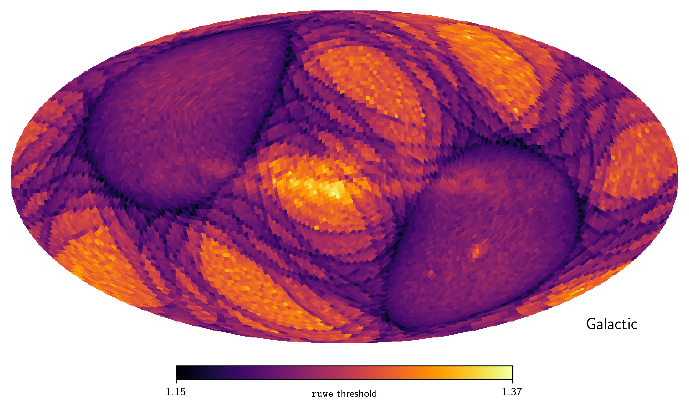
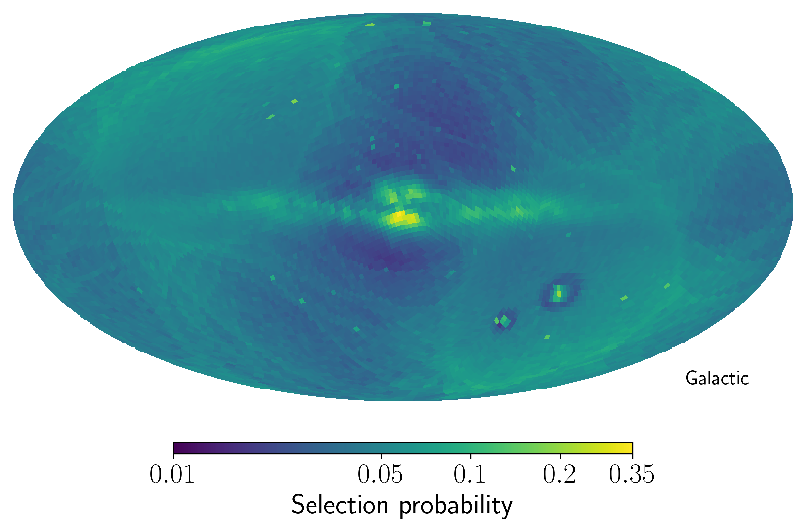
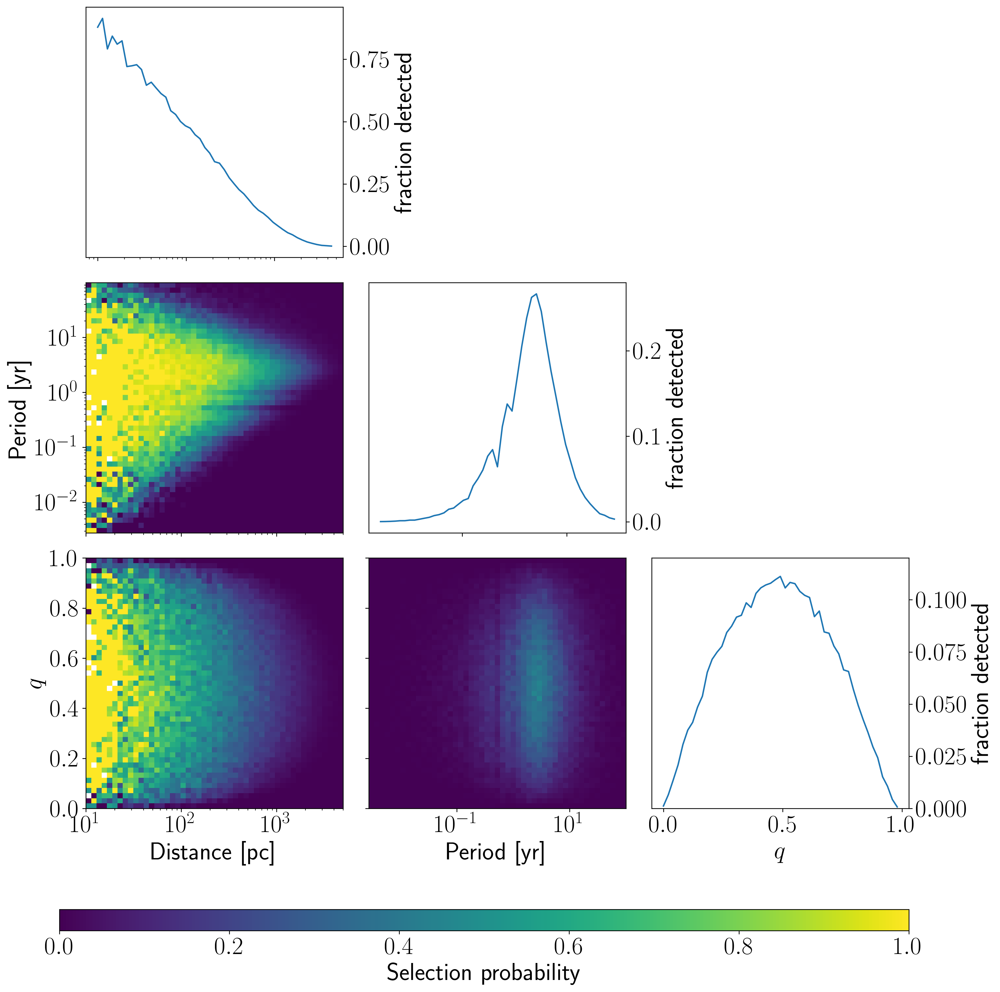

$\newcommand{\ensuremath}{}$
$\newcommand{\xspace}{}$
$\newcommand{\object}[1]{\texttt{#1}}$
$\newcommand{\farcs}{{.}''}$
$\newcommand{\farcm}{{.}'}$
$\newcommand{\arcsec}{''}$
$\newcommand{\arcmin}{'}$
$\newcommand{\ion}[2]{#1#2}$
$\newcommand{\textsc}[1]{\textrm{#1}}$
$\newcommand{\hl}[1]{\textrm{#1}}$
$\newcommand{\footnote}[1]{}$
$\newcommand$
$\newcommand$
$\newcommand$
$\newcommand$
$\newcommand{\Gaia}{\textit{Gaia}\xspace}$
$\newcommand{\ruwe}{\texttt{ruwe}\xspace}$
$\newcommand{\cat}{\ensuremath{\mathcal{C}}}$
$\newcommand{\arraystretch}{1.2}$

# $\Gaia$ DR3 detectability of unresolved binary systems

<mark>Appeared on: 2024-04-23</mark> -  _11 pages, 10 figures. Accepted for publication in A&A_

A. Castro-Ginard, et al. -- incl., <mark>T. Cantat-Gaudin</mark>, <mark>M. Fouesneau</mark>, <mark>H.-W. Rix</mark>

**Abstract:** $\Gaia$ can not individually resolve very close binary systems, however, the collected data can still be used to identify them. A powerful indicator of stellar multiplicity is the sources reported Renormalized Unit Weight Error ( $\ruwe$ ), which effectively captures the astrometric deviations from single-source solutions. We aim to characterise the imprints left on $\ruwe$ caused by binarity. By flagging potential binary systems based on $\ruwe$ , we aim to characterise which of their properties will contribute the most to their detectability. We develop a model to estimate $\ruwe$ values for observations of $\Gaia$ sources, based on the biases to the single-source astrometric track arising from the presence of an unseen companion. Then, using the recipes from previous GaiaUnlimited selection functions, we estimate the selection probability of sources with high $\ruwe$ , and discuss what binary properties contribute to increasing the sources' $\ruwe$ . We compute the maximum $\ruwe$ value which is compatible with single-source solutions as a function of their location on-sky. We see that binary systems selected as sources with a $\ruwe$ higher than this sky-varying threshold have a strong detectability window in their orbital period distribution, which peaks at periods equal to the $\Gaia$ observation time baseline. We demonstrate how our sky-varying $\ruwe$ threshold provides a more complete sample of binary systems when compared to single sky-averaged values by studying the unresolved binary population in the $\Gaia$ Catalogue of Nearby Stars. We provide the code and tools used in this study, as well as the sky-varying $\ruwe$ threshold through the GaiaUnlimited Python package.

**Figure 9. -** Sky map of the sky-varying $\ruwe$ threshold at the resolution of HEALPix level 5. Sources above these $\ruwe$ threshold indicate potential binary systems. These $\ruwe$ values show a strong influence of the $\Gaia$ scanning law, while also highlighting regions with high source density. (*fig:ruwe_singleSource*)

**Figure 3. -** Selection probability for sources with a $\ruwe$ higher than the threshold represented in Fig. \ref{fig:ruwe_singleSource}. The regions with higher selection probability, e.g., cores of globular clusters, the Galactic plane and the Magellanic Clouds, contain sources with a $\ruwe$ increased due to a combination of binarity, source crowding and other effects. These regions may indicate a higher contamination rate when selecting binaries solely based on $\ruwe$. The dark halos around the Magellanic Clouds are due to an excess of faint sources with low $\ruwe$ in that region. (*fig:binaries_SF*)

**Figure 4. -** Heatmap of binary systems' properties, i.e., distance, period and mass rations, that will enhance their detection. The detectability of these systems monotonically decreases with distance, reaching a detection fraction of $50\%$ at around $100$ pc. There is a strong detectability window around periods of three years, corresponding to the $\Gaia$ observation time baseline. Systems with mass ratios of zero, i.e., single sources, or one show no sign of binarity on $\ruwe$ since there is no wobbling of their CoM around the photocentre. (*fig:detectability_cornerPlot*)

