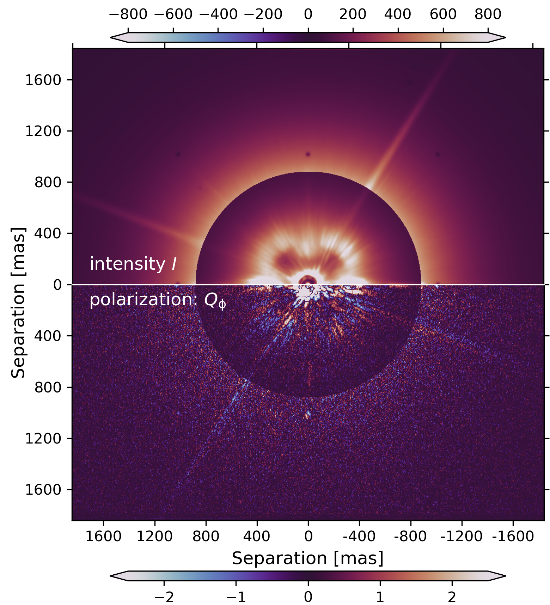
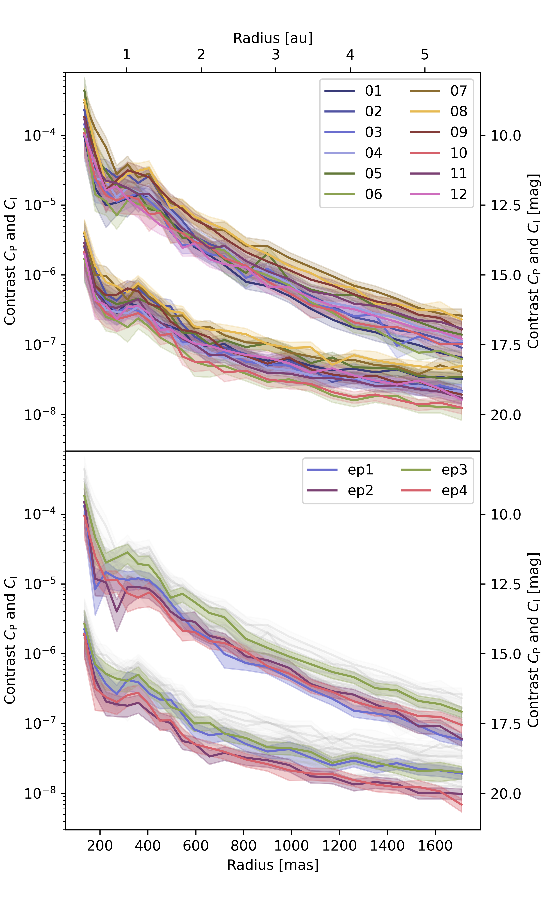
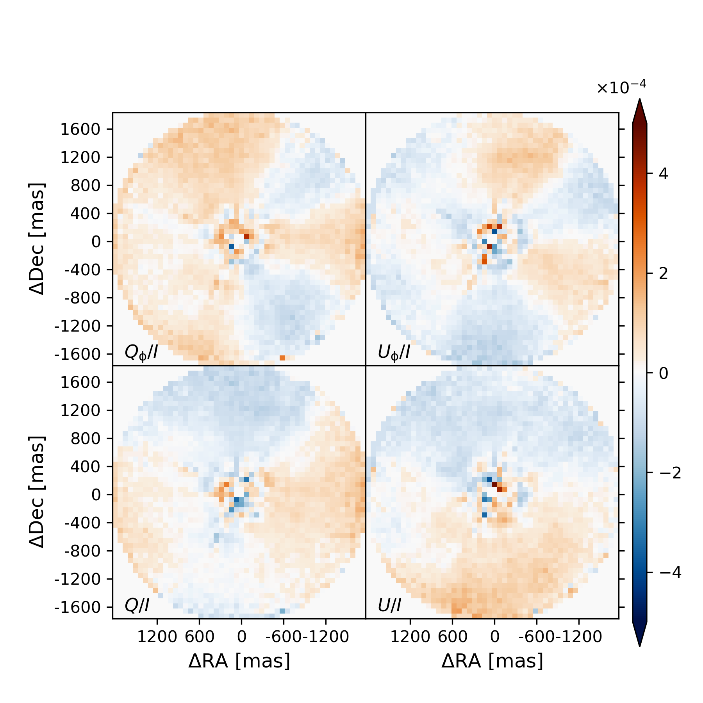

$\newcommand{\ensuremath}{}$
$\newcommand{\xspace}{}$
$\newcommand{\object}[1]{\texttt{#1}}$
$\newcommand{\farcs}{{.}''}$
$\newcommand{\farcm}{{.}'}$
$\newcommand{\arcsec}{''}$
$\newcommand{\arcmin}{'}$
$\newcommand{\ion}[2]{#1#2}$
$\newcommand{\textsc}[1]{\textrm{#1}}$
$\newcommand{\hl}[1]{\textrm{#1}}$
$\newcommand{\footnote}[1]{}$
$\newcommand{\sntot}[0]{(\mathrm{S/N})_{\mathrm{tot}}}$
$\newcommand{\snks}[0]{(\mathrm{S/N})_{\mathrm{KS}}}$

# SPHERE RefPlanets: Search for $\epsilon$ Eridani b and warm dust

<mark>Appeared on: 2024-05-01</mark> -  _26 pages, 20 figures, 5 tables. Accepted for publication in A&A_

C. Tschudi, et al. -- incl., <mark>M. Feldt</mark>

**Abstract:** Cold planets, including all habitable planets, produce only scattered light emission in the visual tonear-infrared wavelength range. For this reason it is highly desirable to adapt the technique for the direct imaging of reflected light from extra-solar planets. For the nearby system $\epsilon$ Eri, we want to set much deeper detection limits forthe expected scattered radiation from the radial velocity planet candidate ( $\approx 0.7 {\rm M_{\rm J}}$ ) and the warm dust using the VLT/SPHERE adaptive optics (AO) instrument with the ZIMPOL imaging polarimeter. We carried out very deep imaging polarimetryof $\epsilon$ Eri based on 38.5 hours of integration time witha broad-band filter ( $\lambda_{\rm c}=735 {\rm nm}$ ) for the search of the polarization signalfrom a planet or from circumstellar dustusing AO,coronagraphy, high precision differential polarimetry, and angular differential imaging. The data were collected during 12 nights within four epochs distributed over 14 months and we searched for a signalin the individual epochs. We also combined the full data set to achieve an even higher contrast limit  considering the Keplerian motion using the K-Stacker software.All data were also combined for the search of the scattering signalfrom extended dust clouds.We improved various data reduction and post-processing procedures and also developed new ones to enhance the sensitivity of SPHERE/ZIMPOL further. The final detection limits were quantified and we investigated the potential of SPHERE/ZIMPOL for deeper observations. The data of $\epsilon$ Eridani provide unprecedented contrast limits but no significant detection of a point source or an extended signal from circumstellar dust. For each observing epoch, we achieved a $5 \sigma_{\mathcal{N}}$ point source contrast for the polarized intensity $C_{\rm P}=Q_{\rm \phi}/I_\star$ between $2\cdot 10^{-8}$ and $4\cdot 10^{-8}$ at a separation of $\rho\approx1\arcsec$ , which is as expected for the proposed radial velocity planet at a quadrature phase. The polarimetric contrast limits are close to the photon noise limits for $\rho>0.6\arcsec$ or about six times to 50 times better than the intensity limits becausepolarimetric imaging is much more efficient for speckle suppression.Combining the data for the search of a planet moving on a Keplerian orbit with the K-Stacker technique improves the contrast limits further by about a factor of two, when compared to an epoch, to about $C_{\rm P}=0.8 \cdot 10^{-8}$ at $\rho=1\arcsec$ . This would allow the detection of a planet with aradius of about 2.5 ${\rm R_{\rm J}}$ . Should future astrometry provide strong constraints on the position of the planet, then a $3 \sigma_{\mathcal{N}}$ detection at $1\arcsec$ with $C_{\rm P}\approx 5\cdot 10^{-9}$ would be within reach of our data.The surface brightness contrast limits achieved for the polarized intensity from an extended scattering region is about $15 {\rm mag} {\rm arcsec}^{-2}$ at $1\arcsec$ or up to $3 {\rm mag} {\rm arcsec}^{-2}$ deeper than previous limits. For $\epsilon$ Eri, these limits exclude the presenceof a narrow dust ring and they constrain the dust properties.The photon statistics would allow deeper limits but wefind a very weak systematic noise pattern probably introduced bypolarimetric calibration errors. This $\epsilon$ Eri study shows that the polarimetric contrast limitsfor reflecting planets with SPHERE/ZIMPOL can beimproved to a level below $C_{\rm p}<10^{-8}$ by just collecting more dataduring many nights using software such as K-Stacker, which can combine all data considering the expected planet orbit.Contrast limits of $C_{\rm p}\approx 10^{-9}$ are within reach for $\epsilon$ Eriif the search can be optimized for a planet with a well-known orbit. This limitis also attainable for other bright nearby stars, such as $\alpha$ Cen or Sirius A. Such data also provide unprecedented sensitivity for the searchof extended polarized emission from warm circumstellar dust.

**Figure 4. -** One polarimetric cycle $t_{\rm exp} = 240$ s
corrected for the telescope polarization: The top half shows the intensity
$I$ and bottom half the polarized intensity $Q_{\rm \phi}$ with corresponding colour
scales in ct/(px$\cdot$ DIT).
The counts inside 0.9$\arcsec$ are scaled down for a better visibility by a factor of six for the intensity and a factor of three
for $Q_{\rm \phi}$.
 (*PolarimetricCycle*)

**Figure 7. -** Sensitivity expressed as contrast curves with $5 \sigma_{\mathcal{N}}$ Gaussian significance. Top: Individual nights for the intensity $ C_{\rm I} = I_{\rm p} / I_\star$(upper curves), the polarized light $C_{\rm P} = p_{\rm p} \cdot I_{\rm p} / I_\star$(lower curves). Bottom: The four epochs in colour in comparison to the individual nights in grey. (*contrcurve*)

**Figure 11. -** 
Final fractional polarization maps
$Q_{\rm \phi}/I$, $U_{\rm \phi}/I$, $Q/I$, and $U/I$ derived from the 38.5 hours of the SPHERE/ZIMPOL integration of $\epsilon$ Eri.
 (*2d_dustsearch_c*)

