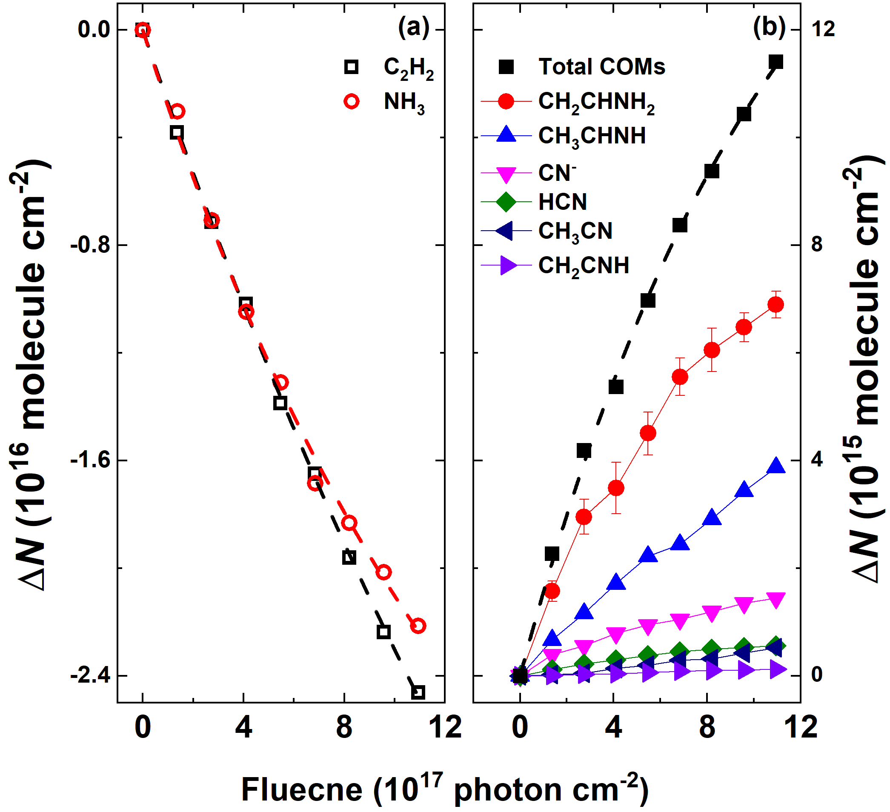
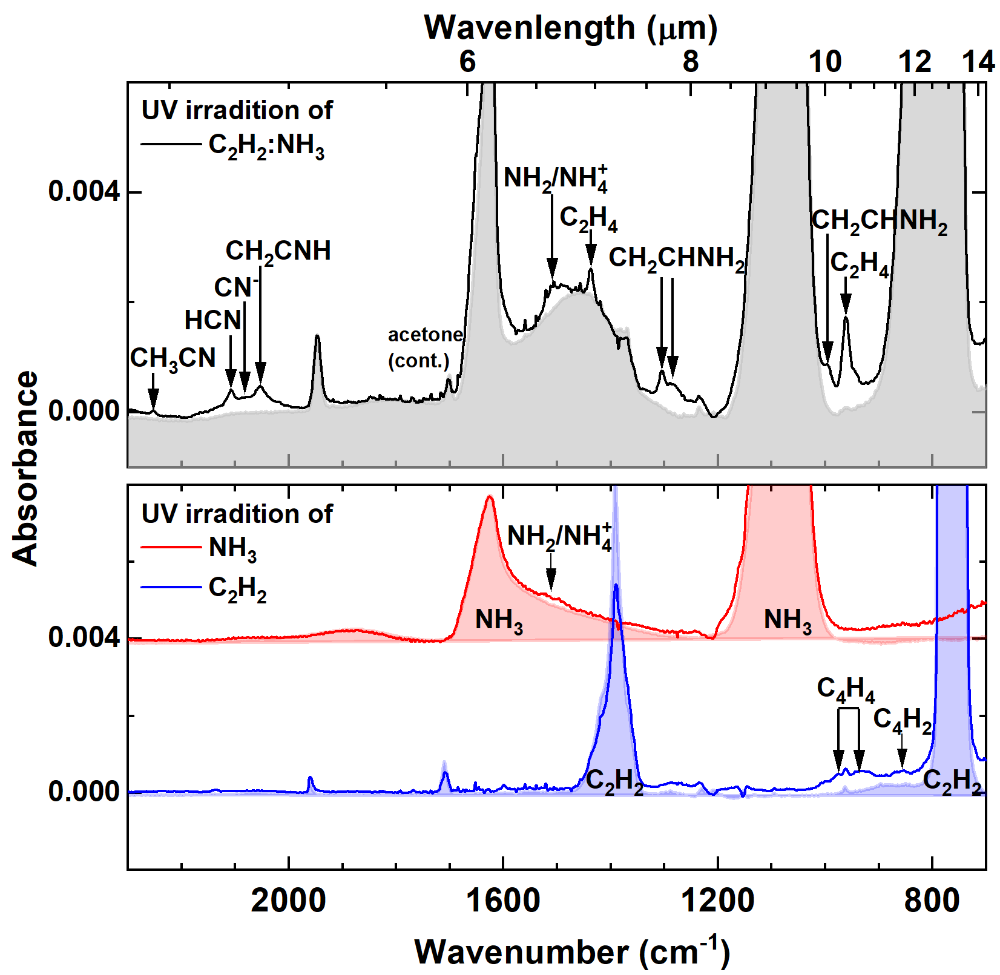
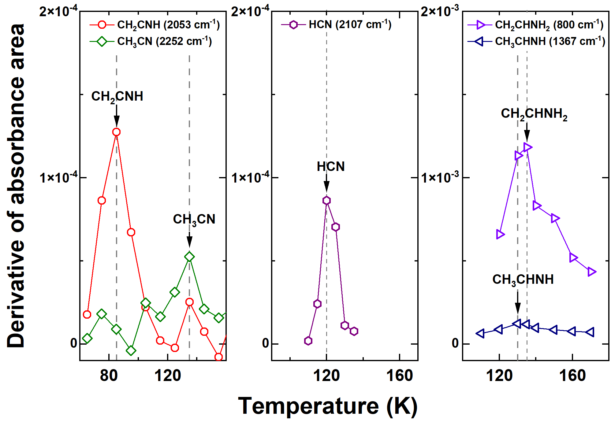

$\newcommand{\ensuremath}{}$
$\newcommand{\xspace}{}$
$\newcommand{\object}[1]{\texttt{#1}}$
$\newcommand{\farcs}{{.}''}$
$\newcommand{\farcm}{{.}'}$
$\newcommand{\arcsec}{''}$
$\newcommand{\arcmin}{'}$
$\newcommand{\ion}[2]{#1#2}$
$\newcommand{\textsc}[1]{\textrm{#1}}$
$\newcommand{\hl}[1]{\textrm{#1}}$
$\newcommand{\footnote}[1]{}$

# Formation of N--bearing complex organic molecules in molecular clouds: Ketenimine, acetonitrile, acetaldimine, and vinylamine via the UV photolysis of $C_2$$H_2$ ice

<mark>Appeared on: 2024-05-14</mark> -  _22 pages, 9 figures_

K.-J. Chuang, C. Jäger, J. C. Santos, <mark>T. Henning</mark>

**Abstract:** The solid-state $C_2$ $H_2$ chemistry in interstellar $H_2$ O-rich ice has been proposed to explain astronomically observed complex organic molecules (COMs), including ketene ($CH_2$ CO), acetaldehyde ($CH_3$ CHO), and ethanol ($CH_3$ $CH_2$ OH), toward early star-forming regions. This formation mechanism is supported by recent laboratory studies and theoretical calculations for the reactions of $C_2$ $H_2$ +OH/H. However, the analog reaction of $C_2$ $H_2$ +$NH_2$ forming N-bearing species has been suggested to have a relatively low rate constant that is orders of magnitude lower than the value of $C_2$ $H_2$ +OH. This work extends our previous laboratory studies on O-bearing COM formation to investigate the interactions between $C_2$ $H_2$ and $NH_3$ ice triggered by cosmic ray-induced secondary UV photons under molecular cloud conditions. Experiments were performed in an ultra-high vacuum chamber to investigate the UV photolysis of the $C_2$ $H_2$ :$NH_3$ ice mixture at 10 K. The ongoing chemistry was monitored in situ by Fourier-transform infrared spectroscopy as a function of photon fluence. The IR spectral identification of the newly formed N-bearing products was further secured by a quadrupole mass spectrometer during the temperature-programmed desorption experiment. The studied ice chemistry of $C_2$ $H_2$ with $NH_2$ radicals and H atoms resulting from the UV photodissociation of $NH_3$ leads to the formation of several N-bearing COMs, including vinylamine ($CH_2$ $CHNH_2$ ), acetaldimine ($CH_3$ CHNH), acetonitrile ($CH_3$ CN), ketenimine ($CH_2$ CNH), and tentatively ethylamine ($CH_3$ $CH_2$ $NH_2$ ). The experimental results show an immediate and abundant $CH_2$ $CHNH_2$ yield as the first-generation product, which is further converted into other chemical derivatives. The effective destruction and formation cross-section values of parent species and COMs were derived, and we discuss the chemical links among these molecules and their astronomical relevance.

**Figure 5. -** Kinetic evolution of (a) parent and (b) products derived from UV photolysis of the $C_2$$H_2$:$NH_3$(1:1.4) ice mixture at 10 K over a fluence of 1.1$\times$10$^{18}$ photon cm$^{-2}$. The dashed lines present the fitting results, and the solid lines connecting data are only for clarity. (*Fig7*)

**Figure 1. -** Infrared spectra of the studied interstellar ice analogs. Upper: IR spectra obtained after UV irradiation of the $C_2$$H_2$:$NH_3$(1:1.4) ice mixture at 10 K for a fluence of 5.7$\times$10$^{17}$ photon cm$^{-2}$. The column densities of $C_2$$H_2$ and $NH_3$ in the ice mixture are 8.1$\times$10$^{16}$ and 1.1$\times$10$^{-17}$ molecule cm$^{-2}$, respectively. Bottom: Infrared spectra obtained after UV irradiation of pure ice $NH_3$ and $C_2$$H_2$ at 10 K for a fluence of 5.7$\times$10$^{17}$ photon cm$^{-2}$ and offset for clarity. The column densities of pure $C_2$$H_2$ and $NH_3$ ice are 7.3$\times$10$^{-17}$ and 1.1$\times$10$^{-17}$ molecule cm$^{-2}$, respectively. The shaded area is present for the IR spectra before UV irradiation. The IR peaks of the newly formed products are labeled with an arrow. (*Fig1*)

**Figure 2. -** Derivatives of the species' absorbance area during the TPD experiment are presented as a function of temperature. (*Fig4*)

