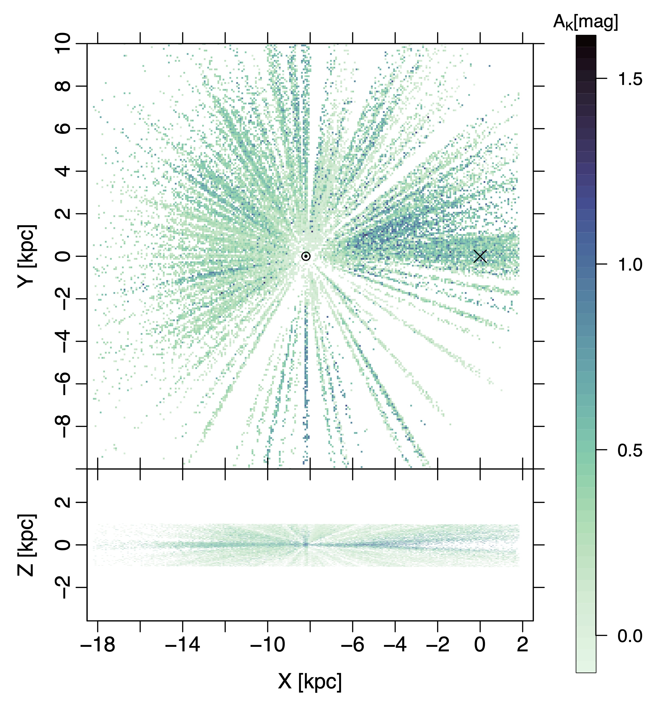

. (*fig:CO*)

**Figure 1. -** Final sample used as our input data. The top panel shows the X-Y plane, perpendicular to the Galactic plane and the bottom panel presents the X-Z plane where our cut on the 1kpc Galactic height is visible. The colour shows estimated extinctions for individual stars. The Sun is at (-8.2,0,0) and the Galactic Centre is marked with an X, assuming the Sun is at the distance of 8.2 kpc from the Galactic Centre. The gaps between different LOS indicate that the sky is not observed uniformly by APOGEE. (*fig:input*)

