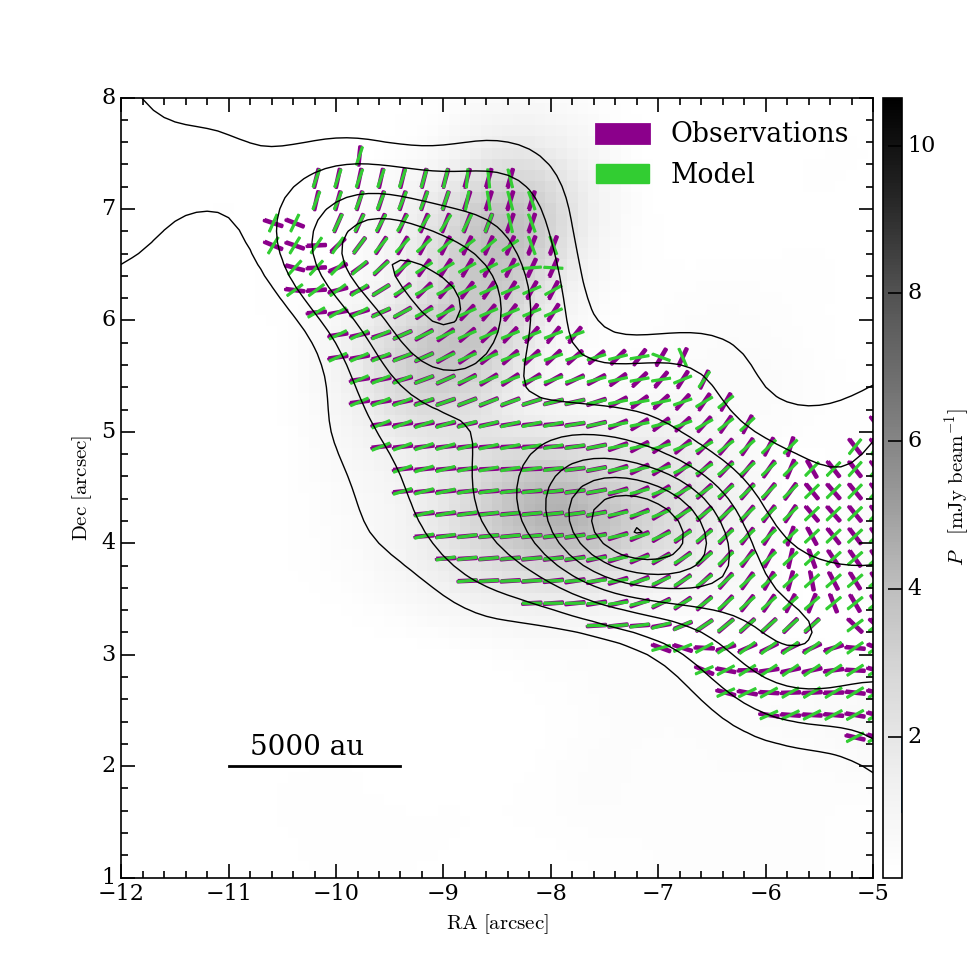
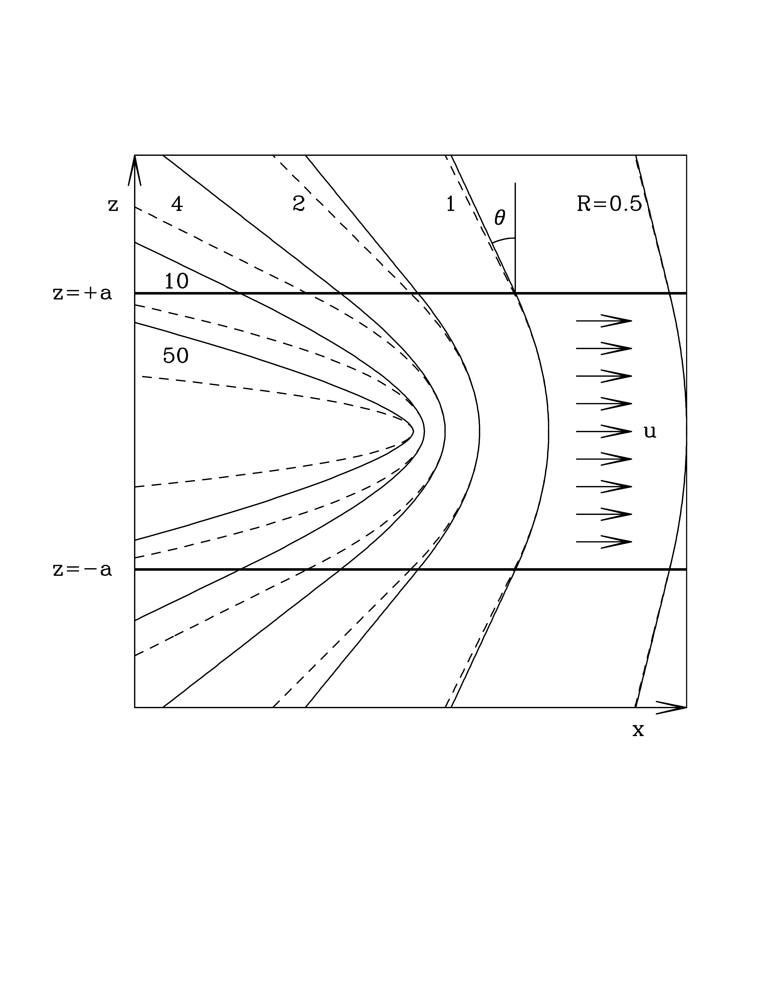
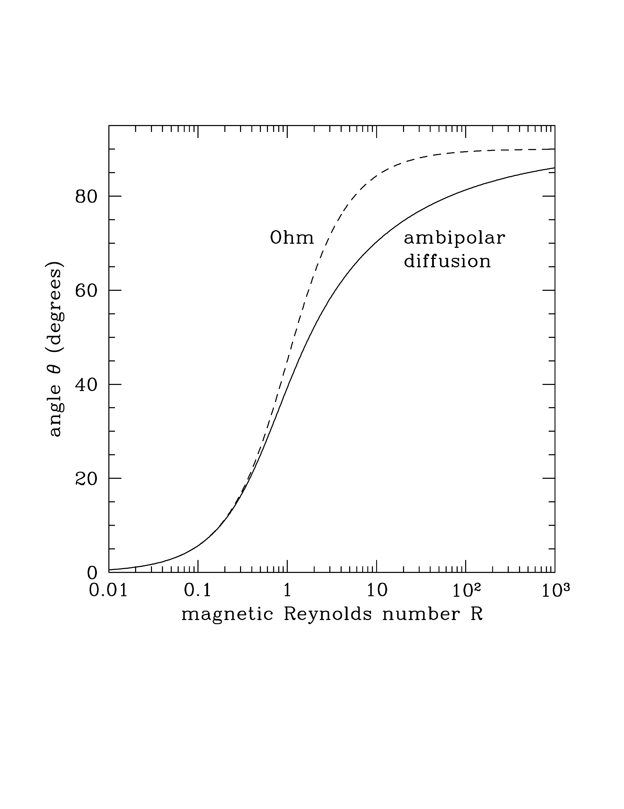

$\newcommand{\ensuremath}{}$
$\newcommand{\xspace}{}$
$\newcommand{\object}[1]{\texttt{#1}}$
$\newcommand{\farcs}{{.}''}$
$\newcommand{\farcm}{{.}'}$
$\newcommand{\arcsec}{''}$
$\newcommand{\arcmin}{'}$
$\newcommand{\ion}[2]{#1#2}$
$\newcommand{\textsc}[1]{\textrm{#1}}$
$\newcommand{\hl}[1]{\textrm{#1}}$
$\newcommand{\footnote}[1]{}$
$\newcommand{\be}{\begin{equation}}$
$\newcommand{\ee}{\end{equation}}$
$\begin{document}$
$\title{Magnetic field dragging in filamentary molecular clouds}$
$\authorrunning{D. Tapinassi et al.}$
$\titlerunning{Magnetic field in filaments}$
$\author{Domitilla Tapinassi\inst{1}$
$\and$
$Daniele Galli\inst{2}$
$\and$
$Marco Padovani\inst{2}$
$\and$
$Henrik Beuther\inst{3}$
$}$
$\institute{^1Dipartimento di Fisica e Astronomia, Università degli Studi di Firenze, Italy \ \email{domitilla.tapinassi@edu.unifi.it} \ ^2INAF--Osservatorio Astrofisico di Arcetri, Largo E. Fermi 5, 50125 Firenze, Italy \ ^3Max Planck Institute for Astronomy, Königstuhl 17, D-69117 Heidelberg, Germany$
$}$
$\date $
$\abstract{Maps of polarized dust emission of molecular clouds reveal the$
$morphology of the magnetic field associated with star-forming regions.$
$In particular, polarization maps of hub-filament systems show the$
$distortion of  magnetic field lines induced by gas flows onto and$
$inside filaments.}{We aim to understand the relation between the curvature of magnetic$
$field lines associated with filaments in hub-filament systems and the$
$properties of the underlying gas flows.}{We consider steady-state models of gas with finite electrical$
$resistivity flowing across a transverse magnetic field. We derive$
$the relation between the bending of the field lines and the flow$
$parameters represented by the Alfvén Mach number and the magnetic$
$Reynolds number.}{We find that, on the scale of the filaments, the relevant parameter$
$for a gas of finite electrical resistivity is the magnetic Reynolds$
$number, and we derive the relation between the newcommandlection angle of$
$the field from the initial direction (assumed perpendicular to the$
$filament) and the value of the electrical resistivity, due to either$
$Ohmic dissipation or ambipolar diffusion.}{Application of this model to specific observations of polarized$
$dust emission in filamentary clouds shows that magnetic Reynolds$
$numbers of a few tens are required to reproduce the data. Despite$
$significant uncertainties in the observations (the flow speed, the$
$geometry and orientation of the filament), and the idealization$
$of the model, the specific cases considered show that ambipolar$
$diffusion can new the resistivity needed to maintain a$
$steady state flow across magnetic fields of significant strength$
$over realistic time scales.}$
$\keywords{ISM: clouds; ISM: kinematics and dynamics; ISM: magnetic$
$fields; dust; polarization}$
$\maketitle$
$\section{Introduction}$
$\label{sec_intro}$
$The filamentary structure of molecular clouds has recently received$
$significant attention, both observationally and theoretically,$
$particularly in relation to the morphology of the associated magnetic$
$field derived from optical, near-infrared and sub-millimeter$
$polarization maps \citep[see, e.g.,][for a recent review]{pattle23}.$
$Various theoretical models have been developed to describe$
$self-gravitating cylindrical filaments in hydrostatic equilibrium,$
$partially supported by magnetic fields with a poloidal, toroidal$
$or helical geometry  ([ and Nagasawa 1987](), [ and Fiege 2000](), [ and Tomisaka 2014](), [ and Toci 2015](), [ and Toci 2015]()) .$
$While these characteristics may be suitable for describing massive$
$and relatively isolated filaments, a frequently observed feature$
$in star-forming regions is the "hub-filament" structure, consisting$
$of a network of filaments converging to a central density concentration$
$(the "hub") hosting star and cluster formation \citep[see,$
$e.g.,][]{myers09}.$
$Velocity gradients observed along filaments \citep[see, e.g.,][]{friesen13,$
$kirk13,pan24} suggest the presence of accretion flows possibly$
$driven by the gravitational attraction of dense clumps or hubs.$
$This is also supported by numerical simulations$
$ ([Zamora-Avilés, Ballesteros-Paredes and Hartmann 2017](), [Gómez, Vázquez-Semadeni and Zamora-Avilés 2018]()) .  However, these velocity gradients$
$can also be interpreted as projection of large-scale turbulence$
$ ([Fernández-López, Arce and Looney 2014]()) . If these accretion flows exist, they would$
$be responsible for feeding star formation in the central hub, and$
$for dragging the magnetic field lines, stretching and progressively$
$aligning them with the filament's axis$
$ ([Juárez, Girart and Zamora-Avilés 2017](), [Yuan, Li and Wu 2018](), [Wang, Koch and Galván-Madrid 2020](), [Koch, Tang and Ho 2022]()) .$
$In some high-mass star-forming regions the overall morphology of$
$the hub-filament system takes the form of a spiral pattern, which$
$could be the consequence of a coherent large-scale rotation motion$
$in the parent clump \citep[][]{li17,liu18,schworer19,mookerjea23}.$
$When available, the direction of polarized dust emission in these$
$regions generally follows the spiral pattern, indicating that the$
$magnetic field morphology is primarily shaped by the gas dynamics.$
$Some examples of such regions include the high-mass star-forming$
$complexes Monoceros R2  ([Treviño-Morales, Fuente and Sánchez-Monge 2019]()) , G9.62+0.19  ([Vlemmings and Persson 2019]()) ,$
$G327.3  ([Beuther, Soler and Linz 2020]()) , IRAS 18089-1732  ([Sanhueza, Girart and Padovani 2021]()) , and$
$Monoceros R2  ([Hwang, Kim and Pattle 2022]()) .$
$In other cases of hub-filament systems there appears to be a$
$progressive transition in the orientation of the magnetic field.$
$The field is preferentially parallel to relatively low column density$
$filaments (also known as "striations"), but, as column$
$density increases, it becomes preferentially$
$perpendicular to filaments \citep[see,$
$e.g.,][]{chapman11,cox16,arzoumanian21,chen23}. This change occurs$
$at a visual extinction of A_{\rm V} \approx 2.7 mag, corresponding$
$to a column density of N_{\rm H} \approx 10^{21.7} cm^{-2}$
$ ([Ade and Aghanim 2016]()) .  In this scenario, the magnetic field within a$
$filament is stretched in the longitudinal direction by the accretion$
$flow, taking on a strongly pinched "hairpin"- or "U"-shape.$
$Observations of bow- or U-shaped magnetic fields have been made in$
$various regions, such as the massive infrared-dark cloud G035.39-00.33$
$ ([Liu, Li and Juvela 2018]()) , the high-mass star-forming region G327.3  ([Beuther, Soler and Linz 2020]()) ,$
$and the massive hub-filament system SDC13  ([Wang, Koch and Tang 2022]()) .  In all$
$of these regions, it seems that the magnetic field has been partially$
$dragged by the collapsing gas flows responsible for forming the$
$densest structures. This scenario of dragged magnetic fields and$
$accretion flows within filaments finds support in high-resolution$
$and high-sensitivity observations of polarized dust emission. These$
$observations have resolved the magnetic field structure inside$
$filaments at scales <0.1 pc. In some cases, they have revealed$
$a transition from perpendicular to aligned fields occurring at$
$A_{\rm V} \approx 21 mag (N_{\rm H}\approx 10^{22.6} cm^{-2})$
$in the Serpens South molecular cloud  ([Pillai, Clemens and Reissl 2020]())  and in the$
$hub-filament system NGC 6334  ([Arzoumanian, Furuya and Hasegawa 2021]()) .$
$In this work we investigate the configuration of the magnetic field$
$in and around a filament that results from dragging and bending a$
$pre-existing uniform magnetic field by a prescribed accretion flow.$
$Our motivation is to establish the relationship between observable$
$geometrical characteristics of the field (as derived from dust$
$polarization maps) and the physical properties of the filament.$
$First, in Sect. \ref{sec_wings} we consider the case of clumpy$
$filaments, made by perfectly conducting localized overdensities$
$that move toward the central hub across the cloud's magnetic field.$
$Then, in Sect. \ref{sec_diffusion} we examine the configuration$
$of the magnetic field in stationary accretion-diffusion flows with$
$constant Ohmic or ambipolar diffusion resistivity. In$
$Sect. \ref{sec_applications} we apply the methods described in$
$Sect. \ref{sec_wings}--\ref{sec_diffusion} to two specific examples,$
$the hub-filament structure in the Serpens South molecular cloud and$
$the high-mass star-forming region G327.3, and derive the magnetic$
$field strength from available dust polarization data. Finally, in$
$Sect. \ref{sec_disc} we discuss the implications of this work, and$
$in Sect. \ref{sec_conc} we draw our conclusions.$
$\section{Alfvén wings}$
$\label{sec_wings}$
$[Gómez, Vázquez-Semadeni and Zamora-Avilés (2018)]() explore the shape of magnetic field lines in MHD$
$simulations, in which filaments are long-lived structures that$
$channel gas flows toward a central accreting clump. Along the$
$spines of these filaments, transverse magnetic field lines are$
$stretched by the flow and assume a U-shape. The geometrical$
$characteristics of this U-shape depend on the flow velocity,$
$density and magnetic field strength.  According to [Gómez, Vázquez-Semadeni and Zamora-Avilés (2018)](),$
$the curvature of the field lines depends on the Alfvén Mach number$
$M_{\rm A}=u/v_{\rm A}, newcommandined as the ratio of the longitudinal$
$flow speed u and the Alfvén speed v_{\rm A}=B/\sqrt{4\pi\rho}$
$determined by the strength of the magnetic field B and the density$
$\rho of the filament. Therefore, by analyzing the observed curvature$
$of magnetic field lines (from maps of polarized dust emission) one$
$could potentially determine the Alfvén Mach number of the flow.$
$The relation between the geometry of the magnetic field and flow$
$properties has been extensively studied in the case of localized$
$overdensities (clumps, or "bullets") of density \rho_{\rm c}$
$and size a moving with speed u in a medium with density$
$\rho<\rho_{\rm c} across a transverse magnetic field \citep[see,$
$e.g.,][]{lyutikov06, dursi08}.  The moving clump diverts the plasma$
$on its sides and bends the ambient magnetic field into wedge-shaped$
$structures similar to Cherenkov cones, called "Alfvén wings."$
$These wings are characterized by a newcommandlection angle \theta in the$
$plane containing the flow direction and the background magnetic$
$field, as given by$
$\be$
$\tan\theta= M_{\rm A}$
$\label{wings}$
$\ee$
$ ([Drell, Foley and Ruderman 1965](), [ and Neubauer 1980]()) .$
$The formation of Alfvén wings has been investigated in the context$
$of satellites moving in the magnetospheric plasma of a planet$
$ ([Kivelson, Bagenal and Kurth 2007]()) , planets interacting with the solar wind$
$ ([Baumjohann, et. al 2010]()) , and galaxy clusters moving in the magnetized$
$intracluster medium  ([ and Lyutikov 2006]()) .  Equation (\ref{wings})$
$has been validated through numerical simulations \citep[see,$
$e.g.,][]{linker91, dursi08}. When M_{\rm A} is sufficiently large,$
$the wings can fold over the moving clump to form a magnetotail.$
$This scenario is valid if the electrical resistivity of the clump$
$is low enough that the time scale of magnetic diffusion across the$
$scale a is much longer than its crossing time a/u, and the clump$
$can be considered a perfect conductor.  In this case, the ambient$
$magnetic field is swept up and accumulates in a strongly magnetized$
$boundary layer of thickness approximately equal to a/M_{\rm A}^2$
$ahead of the clump, where magnetic tension approximately balances$
$the ram pressure gradient  ([Gómez, Vázquez-Semadeni and Zamora-Avilés 2018]()) .  At this point the$
$magnetic tension of the stretched and compressed field acts essentially$
$as a hydrodynamical drag, decelerating the clump on a braking time$
$scale t_{\rm br}\approx \delta a/u, where \delta=\rho_{\rm$
$c}/\rho>1  ([ and Dursi 2008]()) . This is the well-known expression for$
$the braking time of an aligned rotator of density \rho_{\rm c}$
$in an external medium with density \rho  ([Ebert and Temesváry 1960](), [ and Mouschovias 1977]()) ,$
$with the Alfvén speed in the "external medium" (the boundary$
$layer) replaced by the clump's speed u by virtue of the balance$
$of magnetic and ram pressure. Actually, if the clump is moving at$
$supersonic speed, internal shocks propagating at speed u_{\rm$
$s}=u/\delta^{1/2} promote instabilities that disrupt the clump in$
$a time approximately equal to a/u_{\rm s}=\delta^{1/2} a/u, shorter$
$than t_{\rm br} by a factor \delta^{1/2} \citep[see,$
$e.g.,][]{jones94,jones95}.$
$As recognized by [Gómez, Vázquez-Semadeni and Zamora-Avilés (2018)](), in order for gas to flow longitudinally$
$along a filament across a transverse magnetic field, some of magnetic$
$diffusion must be involved. Without it, a fluid element of size a$
$would only be able to travel a distance approximately equal to$
$\delta a or \delta^{1/2}a before being stopped by magnetic$
$tension or disrupted by internal shocks. Additionally, eq. (\ref{wings})$
$suggests that large newcommandlection angles, greater than 45^\circ, for$
$example, are a result of motions at super-Alfvénic speeds.  Although$
$the determination of M_{\rm A} in filament-hub system is uncertain,$
$current observations based on the interpretation of sub-mm dust$
$polarization maps and molecular line emission indicate that,$
$generally, M_{\rm A} \lesssim 1 in filaments, and M_{\rm A}\gtrsim$
$1 only in or near the central clump/hub \citep{beltran19,$
$hwang22,beltran24}.  In the next section we examine the effects$
$of a finite electrical resistivity on the motion of gas in a filament$
$across a transverse magnetic field.$
$\section{Magnetic diffusion}$
$\label{sec_diffusion}$
$A finite electrical resistivity \eta substantially modifies$
$the situation described in Sect. \ref{sec_wings}. Instead of$
$accumulating in front of the moving clump, the ambient magnetic$
$field can pass through the fluid more or less unimpeded, depending$
$on the value of the magnetic Reynolds number$
$\be$
$R=\frac{a u}{\eta},$
$\label{rm}$
$\ee$
$which represents the ratio of diffusion time scale a^2/\eta to$
$the crossing time a/u.  In the presence of magnetic diffusion,$
$the effect of flow on the geometry of the magnetic field is no$
$longer described by the Alfvén Mach number, but by the magnetic$
$Reynolds number. This situation can be illustrated by the following$
$example: consider an electrically conducting fluid with a constant$
$density \rho and Ohmic resistivity \eta, flowing with a velocity$
$u in the x-direction, perpendicular to a magnetic field B in$
$the z-direction (see Fig. \ref{fig_steady}). The fluid motion$
$induces an electric current in the y-direction given by Ohm's law$
$as j=ucB/(4\pi\eta), where c is the speed of light\footnote{Faraday$
$unsuccessfully attempted to measure the electric current induced$
$by the Thames River flowing in the Earth's magnetic field$
$ ([ and Faraday 1832]()) .}. The Lorentz force per unit mass is then F=$
$jB/(c\rho)=u B^2/(4\pi\rho\eta), directed opposite to the fluid$
$motion. Therefore, the magnetic field exerts a drag on the fluid$
$with a magnetic damping time t_{\rm d}=4\pi\rho\eta/B^2 =\eta/v_{\rm$
$A}^2 \citep[see, e.g.,][]{roberts67, davidson01}.  The kinetic$
$energy per unit volume is dissipated by Joule heating at a rate$
$d(\rho u^2/2)/dt=4\pi\eta j^2/c^2=\rho u^2/t_{\rm d}. A steady$
$flow can be maintained newd an external driving force is acting$
$on the fluid on a time scale longer than t_{\rm d}. Alfvénic$
$disturbances generated within the flow propagate on a scale aS$
$before being damped by magnetic diffusion, where S=R/M_{\rm A}$
$is the Lundquist number.$
$Inspired by [Gómez, Vázquez-Semadeni and Zamora-Avilés (2018)](), in the following section we consider a$
$steady flow along a filament. This flow is driven by some unspecified$
$external cause such as gravity, shocks, large-scale turbulence,$
$etc. Our goal is to compute the curvature of a magnetic field$
$initially perpendicular to the flow. We assume a stationary state$
$and neglect the back-reaction of the field on the fluid motion. In$
$other words, we adopt a kinematic approximation  ([ and Parker 1963]()) ,$
$which is the first step in a fully magnetohydrodynamical treatment.$
$Unlike the situation considered in Sect. \ref{sec_wings}, no$
$magnetized boundary layer is formed in this case. The fundamental$
$parameter in this case is the magnetic Reynolds number, rather than$
$the Alfvén Mach number.$
$\subsection{Diffusion-dominated gas flows}$
$\label{subsec_flow}$
$Let us consider an electrically resistive fluid flowing in the$
$x-direction with velocity u between the planes z=\pm a, while$
$acting upon an initially uniform and perpendicular magnetic field$
$B_0 in the z-direction (see Fig. \ref{fig_steady}). The velocity$
$u is assumed to vary on the scale of the filament's length, which$
$is much larger than the filament's width. Therefore, it can be$
$considered uniform over a region of size \sim a. Magnetic field$
$lines within the flow region will be stretched, progressively$
$increasing their curvature until they eventually reach a state where$
$field diffusion balances field advection, preventing any further$
$increase in magnetic tension.$
$Let us first consider the case of a uniform Ohmic resistivity$
$\eta_{\rm O}. In this case, the induction equation is linear in$
$the magnetic field, and can be "uncurled"\footnote{The right-hand$
$side of eq. (\ref{ind_ohm}) should be equal to the gradient in the$
$y-direction of a function \phi. However, since there cannot be$
$a y-dependence in this 2-D problem, \nabla\phi is at most a$
$constant representing a uniform electric field in the y-direction.$
$In the absence of such an external electric field, the induction$
$equation takes the form of eq. (\ref{ind_ohm}).} into$
$\be{\bf u} \times{\bf B}-\eta_{\rm O}\nabla\times{\bf B}=0,$
$\label{ind_ohm}$
$\ee$
$where {\bf u}=u \hat{\bf e}_x, {\bf B}=B_x(z) \hat{\bf e}_x +B_0$
$\hat{\bf e}_z.$
$With the non-dimensionalization z=a\zeta and B_x(z)=B_0 b(\zeta)$
$eq.~(\ref{ind_ohm}) becomes$
$\be$
$\frac{d b}{d\zeta}+R_{\rm O}=0,$
$\label{ind_nondim_ohm}$
$\ee$
$where R_{\rm O}=a u/\eta_{\rm O} is the Ohmic magnetic Reynolds$
$number. The solution of eq.~(\ref{ind_nondim_ohm}), with the$
$symmetry boundary condition b(0)=0 is$
$\be$
$b(\zeta)=-R_{\rm O}\zeta.$
$\label{ss_ohm}$
$\ee$
$As anticipated, the motion of the resistive fluid in the perpendicular$
$magnetic field has induced an electric current in the y-direction$
$and a magnetic field B_x(z)=-R_{\rm O} B_0 z/a in the direction$
$of the flow, leaving unchanged the magnetic field B_z=B_0$
$perpendicular to the flow. Field lines are parabolas for |z|<a$
$and straight lines for |z|>a. The newcommandlection angle of the field$
$lines for |z|>a is equal to the magnetic Reynolds number,$
$\be$
$\tan\theta=\frac{|B_x(\pm a)|}{B_0}=|b(\pm 1)|=R_{\rm O}.$
$\label{theta_ohm}$
$\ee$
$The evolution of the magnetic field toward this asymptotic steady$
$state was computed by [ and Lundquist (1952)]().$
$However, in the context of molecular clouds the magnetic Reynolds$
$number R_{\rm O} is not relevant: Ohmic resistivity is negligible,$
$and the electrical resistivity is dominated by ambipolar diffusion$
$\citep[see, e.g.,][]{pinto08,gutierrez-vera23}.  Although ambipolar$
$diffusion introduces a non-linearity in the problem, a calculation$
$of the asymptotic configuration of the field is straightforward.$
$The uncurled induction equation is now$
$\be{\bf u}\times{\bf B}+\frac{{\bf B}\times[{\bf B}$
$\times(\nabla\times{\bf B})]}{4\pi\gamma \rho_i \rho}=0,$
$\label{ind_ad}$
$\ee$
$where \gamma is the ion-neutral drag coefficient and \rho_i the$
$ion density. Equation (\ref{ind_ad}) can be non-dimensionalized as$
$before, obtaining$
$\be$
$(1+b^2)\frac{db}{d\zeta}+R_{\rm ad}=0,$
$\label{ind_nondim_ad}$
$\ee$
$where R_{\rm ad}=au/\eta_{\rm ad} is the ambipolar diffusion$
$magnetic Reynolds number, with ambipolar diffusion$
$resistivity$
$\be$
$\eta_{\rm ad}=\frac{B_0^2}{4\pi\gamma\rho_i\rho},$
$\label{eta_ad}$
$\ee$
$assumed constant in the following.$
$By interchanging the dependent and independent variables,$
$eq. (\ref{ind_nondim_ad}) can be easily integrated with the boundary$
$condition \zeta(b=0)=0, resulting in$
$\be$
$b(\zeta)+\frac{1}{3}b(\zeta)^3=-R_{\rm ad}\zeta.$
$\ee$
$The solution for b(\zeta) is then$
$\be$
$b(\zeta)$
$= \left(\frac{2}{3\alpha+\sqrt{9\alpha^2+4}}\right)^{1/3}$
$-\left(\frac{3\alpha+\sqrt{9\alpha^2+4}}{2}\right)^{1/3},$
$\ee$
$where \alpha=R_{\rm ad}\zeta.$
$For |z|>a, fieldlines are bent back$
$from the direction perpendicular to the flow by an angle \theta given by$
$\begin{align}$
$& \tan\theta =\frac{|B_x(\pm a)|}{B_0}=|b(\pm 1)|\nonumber \ &=\left(\frac{3R_{\rm ad}+\sqrt{9R_{\rm ad}^2+4}}{2}\right)^{1/3}$
$-\left(\frac{2}{3R_{\rm ad}+\sqrt{9R_{\rm ad}^2+4}}\right)^{1/3}.$
$\label{theta_ad}$
$\end{align}$
$Figures \ref{fig_steady} and \ref{fig_angle} show the steady-state$
$magnetic field lines in the x-z plane and the newcommandlection angle$
$\theta, respectively, as a function of the magnetic Reynolds$
$number.  In the case with ambipolar diffusion, the flow bends the$
$field lines less than in the case with Ohmic resistivity for the$
$same magnetic Reynolds number. For small values of the magnetic$
$Reynolds number, the shape of the magnetic field lines is approximately$
$the same for both diffusive processes. In fact, for R_{\rm ad} \ll$
$1, eq. (\ref{theta_ad}) reduces to eq. (\ref{theta_ohm}),$
$\tan\theta =R_{\rm ad}+{\cal O}(R_{\rm ad}^3).  This is also$
$evident from eq. (\ref{ind_ad}), which reduces to eq. (\ref{ind_ohm})$
$if the magnetic diffusivity is high, and therefore the induced$
$magnetic field is small, b^2 \ll 1.  For example, the condition$
$for the magnetocentrifugal launching of a wind from a magnetized$
$accretion disk, \theta > 30^\circ  ([ and Blandford 1982]()) , requires a modest$
$value of the radial magnetic Reynolds number: R_{\rm O} > 1/\sqrt{3}$
$from eq. (\ref{theta_ohm}), or R_{\rm ad} > 10/(9\sqrt{3}) from$
$eq. (\ref{theta_ad}).  The two values  are within 11\% of each$
$other.$
$\begin{figure}$
$\includegraphics[width=0.5\textwidth]{figs/fig1.pdf}$
$\vspace{-3cm}$
$\caption{Steady-state magnetic field lines for a flow with uniform$
$resistivity and uniform velocity u ({\it arrows}\/) in a transverse magnetic field.$
$for different values of the magnetic Reynolds number: R=0.5, 1,$
$2, 4, 10 and 50.  {\it Solid lines}\/: with ambipolar diffusion$
$(R=R_{\rm ad}); {\it dashed lines}\/: with Ohmic resistivity$
$(R=R_{\rm O}). The flow is limited to the region -a < z < a.$
$The newcommandlection angle \theta is also shown.}$
$\label{fig_steady}$
$\end{figure}$
$\begin{figure}$
$\includegraphics[width=0.5\textwidth]{figs/fig2.pdf}$
$\vspace{-3cm}$
$\caption{Deflection angle \theta as a function of the magnetic$
$Reynolds number R_{\rm O} (eq. \ref{theta_ohm}, {\it dashed line}\/) and$
$R_{\rm ad} (eq. \ref{theta_ad}, {\it solid line}\/).}$
$\label{fig_angle}$
$\end{figure}$
$\subsection{Numerical values}$
$\label{subsec_numerical}$
$With the usual parametrization \rho_i=C\rho^{1/2}, where C is$
$a constant, the ambipolar diffusion resistivity eq. (\ref{eta_ad})$
$becomes$
$\be$
$\eta_{\rm ad}=\frac{B_0^2}{4\pi\gamma C \rho^{3/2}}.$
$\ee$
$The values of \gamma and C depend on the chemical composition$
$of the medium. However, the combination \gamma C is relatively$
$well constrained, and can be  conveniently expressed as \gamma$
$C=\chi(8\pi G)^{1/2}, where G is the gravitational constant and$
$\chi \approx 1--3  ([Pinto, Galli and Bacciotti 2008]()) . This scaling reflects$
$the relative importance of the ambipolar diffusion and free-fall$
$time scales  ([ and Shu 1983]()) , but in the present context in which the$
$self-gravity of the filament is neglected, it is just a numerically convenient$
$expression.$
$Inserting typical numerical values, with \rho=\mu$
$m_{\rm H} n, where \mu=2.8 is the mean molecular weight,$
$\begin{align}$
$& \eta_{\rm ad}=6.1\times 10^{22} \chi^{-1} \nonumber \ & \times \left(\frac{n}{10^4 \mbox{cm^{-3}}}\right)^{-3/2}$
$\left(\frac{B_0}{\mbox{100 \muG}}\right)^{2}$
$ \mbox{cm^2 s^{-1}},$
$\label{ad_num}$
$\end{align}$
$and$
$\begin{align}$
$& R_{\rm ad}=\frac{au}{\eta_{\rm ad}}=0.25 \chi \nonumber \ & \times \left(\frac{a}{0.05 \mbox{pc}}\right)$
$\left(\frac{u}{\mbox{km s^{-1}}}\right)$
$\left(\frac{n}{10^4 \mbox{cm^{-3}}}\right)^{3/2}$
$\left(\frac{B_0}{\mbox{100 \muG}}\right)^{-2}.$
$\label{reynolds_ad_num}$
$\end{align}$
$Thus, in principle, the direct evaluation of R_{\rm ad} from the$
$curvature of the magnetic field lines allows to derive the magnetic$
$field strength B_0, newd the quantities a, u, and n are$
$known.$
$Finally, the time to reach a steady state (ambipolar diffusion time) is$
$\be$
$t_{\rm ad}=\frac{a^2}{\eta_{\rm ad}}=\frac{a R_{\rm ad}}{u},$
$\label{tad}$
$\ee$
$and depends, if R_{\rm ad} is known, only on the filament's size a and the flow velocity u.$
$\section{Applications}$
$\label{sec_applications}$
$In this section we apply the method described in Sect. \ref{sec_wings}$
$and \ref{sec_diffusion} to two filaments in hub-filament systems,$
$one in the Serpens South molecular cloud and one in the G327.3$
$high-mass star-forming region. Each filament has a mass of a few$
$tens of solar masses, and is connected to a core/hub with a mass$
$of a few hundreds of solar masses harboring a cluster of low-mass$
$stars (in the Serpens South cloud) or a hot core (in G327.3). The$
$physical parameters of the Serpens South and G327.3 filaments derived$
$from observations, from the model with field-freezing$
$(Sect. \ref{sec_wings}), and from the model with ambipolar diffusion$
$(Sect. \ref{sec_diffusion}), are summarized in$
$Table \ref{tab:parameters}.$
$\begin{table*}$
$\centering$
$\caption{Parameters for the Serpens South and G327.3 filament: field-freezing vs. magnetic diffusion.}$
$\begin{tabular}{lcc|cc|ccc}$
$\hline$
$\noalign{\smallskip} \hline \noalign{\smallskip}$
$&  &  & \multicolumn{2}{c|}{field-freezing} & \multicolumn{3}{c}{magnetic diffusion}\ & u & n &  M_{\rm A} &  t_{\rm br}^{(b)} & R_{\rm ad} & B_0 &  t_{\rm ad} \ & (km s^{-1}) & (10^5 cm^{-3}) &  & (Myr) & & (G) & (Myr) \ \noalign{\smallskip} \hline \noalign{\smallskip}$
$Serpens South (FIL2) & 0.65^{+0.45}_{-0.19} & 1.1^{+0.90}_{-0.71}  & 4.7^{+1.6}_{-1.0} & 0.75^{+0.35}_{-0.31} & 40^{+50}_{-20} & 67^{+120}_{-49}\times 10^{-6} & 3.0^{+6.6}_{-2.1}\ G327.3 (NE1--NE2) & 1^{(a)} & 46\pm 30 & 3.3 & 0.18 & 16 & 1.3_{-0.70}^{+0.69}\times 10^{-3} & 0.28\        & 0.5^{(a)} & 46\pm 30 & 3.3 & 0.36 & 16 & 0.95_{-0.52}^{+0.44}\times 10^{-3} & 0.56  \ \noalign{\smallskip} \hline \noalign{\smallskip}$
$\multicolumn{8}{p{0.96\textwidth}}{\tiny{\bf Notes.} ^{(a)}For G327.3 two values of the flow velocity have been assumed, u=1 km s^{-1} and 0.5 km s^{-1}. ^{(b)}A density contrast \delta=10 has been assumed to estimate t_{\rm br} in the field-freezing case (see Sect. \ref{sec_wings}).}$
$\end{tabular}$
$\vspace{1ex}$
$\label{tab:parameters}$
$\end{table*}$
$\subsection{Filaments in the Serpens South molecular cloud}$
$\label{subsec_serpens}$
$The Serpens South molecular cloud is a nearby star-forming region$
$that contains a young protostellar cluster embedded in a hub-filament$
$system  ([Gutermuth, Bourke and Allen 2008]()) . [Kirk, Myers and Bourke (2013)]() found that these$
$filaments show evidence of mass accretion flows, with rates similar$
$to the star formation rate in the central cluster. Specifically,$
$[Kirk, Myers and Bourke (2013)]() measured a velocity gradient in the southern filament$
$with a value of \nabla u_{\rm obs}=1.4\pm 0.2 km s^{-1} pc^{-1},$
$over a projected length L_{\rm obs}=0.33~pc\footnote{[Kirk, Myers and Bourke (2013)]()$
$assumed a distance to the Serpens cloud of 260 pc, smaller than$
$the value currently adopted of 436 pc  ([Ortiz-León, Loinard and Dzib 2018]()) . However$
$the correction for distance cancels out in the product of \nabla$
$u_{\rm obs}L_{\rm obs}.}. This measured velocity gradient corresponds$
$to a flow with u=\nabla u_{\rm obs}L_{\rm obs}/\sin\alpha, where$
$30^\circ\lesssim\alpha\lesssim 60^\circ is the inclination of the$
$filament with respect to the plane of the sky  ([Kirk, Myers and Bourke 2013]()) . This$
$gives a flow velocity u=0.65^{+0.45}_{-0.19} km s^{-1} (here$
$and in the following, the upper and lower values should be intended$
$as extremes of a range, not an uncertainty).$
$[Pillai, Clemens and Reissl (2020)]() combine near- and far-infrared observations of$
$polarized dust emission to map the magnetic field morphology in the$
$Serpens South hub-filament system. They discovered a transition in$
$the field orientation from approximately perpendicular to approximately$
$parallel to the southern filament (referred to as FIL2) at visual$
$extinctions above A_{\rm V}\approx 20 mag up to A_{\rm V}\approx$
$60 mag, that they interpreted as the consequence of the field$
$being dragged by the gas flow. Specifically, the median deviation$
$of polarization segments (magnetic field direction) from the parallel$
$direction on either side of the filament, with diameter 2a=0.1~pc,$
$is 22^\circ\pm 3^\circ, corresponding to an observed newcommandlection$
$angle \theta=78^\circ\pm 3^\circ.$
$If the magnetic field pattern in the FIL2 region is interpreted in$
$terms of Alfvén wings generated by the ballistic motion of perfectly$
$conducting clumps in a magnetized medium, eq. (\ref{wings}) implies$
$a motion with Alfvén Mach number M_{\rm A}=4.7_{-1.0}^{+1.6}.$
$As mentioned in Sect. \ref{sec_wings}, highly super-Alfvénic$
$motions are unlikely to be present in hub-filament systems, except,$
$perhaps, near the central clump/hub. More importantly, as discussed$
$in Sect. \ref{sec_wings}, a frozen-in magnetic field decelerates$
$the fluid motion on a time scale of the order of the flow crossing$
$time a/u times a factor \delta or \delta^{1/2}, where \delta$
$is the density contrast between the filament and the environment.$
$With the values of a and u estimated for the FIL2 region, the$
$flow crossing time is 7.5^{+3.5}_{-3.1}\times 10^4 yr. Although$
$the factor \delta is difficult to estimate, the deceleration time$
$scale of the flow in the FIL2 region appears to be quite short,$
$making the field-freezing model implausible.$
$On the other hand, in the framework of ambipolar diffusion-dominated$
$flows modeled in Sect.~\ref{sec_diffusion}, the observed range$
$of \theta corresponds to R_{\rm ad}=40^{+50}_{-20} (see$
$eq. \ref{theta_ad} and Fig. \ref{fig_angle}), an acceptable value$
$for dense gas  ([ and Myers 1995]()) .  From eq. (\ref{tad}), the time scale$
$needed to reach an advection-diffusion steady state is t_{\rm$
$ad}=3.0^{+6.6}_{-2.1} Myr, which is compatible with the age of$
$Serpens Main, the youngest cluster in the Serpens molecular cloud$
$\citep[\sim 4 Myr,][]{zhou22}\footnote{The age of the Serpens$
$South cluster, the hub of the FIL2 filament, is not known.}.  In$
$this case, an estimate of the magnetic field strength in the FIL2$
$region can be obtained from eq.~(\ref{reynolds_ad_num}), if the$
$filament's average density n is known. This quantity can be$
$estimated as follows. The range of visual extinction 20-60~mag$
$corresponds to an observed H_2 column density N_{\rm obs} =$
$(3.8\pm 1.9)\times 10^{22} cm^{-2}.  Assuming a cylindrical$
$filament with diameter 2a, the density n=2N_{\rm obs}\cos\alpha/(\pi$
$a) is n=1.1^{+0.90}_{-0.71}\times 10^5 cm^{-3}.$
$Eq. (\ref{reynolds_ad_num}) with \chi=3 then gives a magnetic$
$field strength B_0=67^{+120}_{-49} \muG.  With the central$
$values of N_{\rm obs}, \alpha and B_0, the non-dimensional$
$mass-to-flux ratio \lambda\approx 7.6 (N_{\rm$
$obs}\cos\alpha/10^{21} \mbox{cm^{-2}})(B_0/\mbox{\muG})^{-1}$
$ ([ and Crutcher 2004]())  is \lambda\approx 3.0, albeit with large$
$uncertainties. [Kusune, Nakamura and Sugitani (2019)]() apply the$
$Davis-Chandrasekhar-Fermi method (see Sect. \ref{subsec_G327}) to$
$model near-infrared polarization data in the same region analyzed$
$here, finding B_{\rm pos}=36 \muG and \lambda=3.6, compatible$
$with our results.$
$\subsection{Filaments in the high-mass star-forming region G327.3}$
$\label{subsec_G327}$
$The high-mass star-forming region G327.3 is a massive star-forming$
$region characterized by filamentary structures connected to a central$
$massive hot core. [Beuther, Soler and Linz (2020)]() conduct sub-mm continuum and$
$polarization observations of G327.3 discovering filamentary structures$
$characterized with U-shaped magnetic field morphologies pointing$
$toward the central core (see their Fig. 1). One of these structures,$
$the filament NE1-NE2, has a width of 2.5^{\prime\prime} (equivalent$
$to a full size of 2a=7750 au at the distance of 3.1 kpc), a$
$range of H_2 column densities N_{\rm obs}=(4.3\pm 2.7)\times$
$10^{23} cm^{-2}, and a small inclination \alpha\approx 9^\circ$
$with respect to the plane of the sky.  As in the$
$case of the Serpens South filament, assuming a cylindrical geometry,$
$the mean density is in the range n=(4.6\pm 3.0)\times 10^6 cm^{-3}.$
$The filamentary structures in the G327.3 system were interpreted$
$by [Beuther, Soler and Linz (2020)]() as indicative of channel flows feeding star$
$formation in the central hot core.  To test this hypothesis with$
$the diffusive flow model developed in Sect. \ref{sec_diffusion},$
$we used the DustPol module of the ARTIST package  ([Padovani, Brinch and Girart 2012]()) $
$to produce synthetic polarization maps of the filament NE1-NE2.$
$DustPol computes the Stokes parameters I, Q and U from the$
$expressions given in [Padovani, Brinch and Girart (2012)](), originally derived by$
$[ and Lee (1985)](). A uniform dust temperature was assumed. The$
$output maps are then processed with the {\tt simobserve} and {\tt$
$simanalyze} tasks of the CASA$
$programme\footnote{\url{https://casa.nrao.edu/}}, adopting the same$
$antenna configuration as in the observing runs.  A best-fit of the$
$polarization data is obtained for a magnetic Reynolds number R_{\rm$
$ad}=16.  Figure \ref{fig_map} shows the comparison between the$
$observed polarization segments and those from the best fit model.$
$Unfortunately no information is available about the existence of a$
$longitudinal accretion flow in the filament: the almost face-on$
$orientation of this hub-filament system, favorable to the modeling$
$of dust polarization data, makes it difficult to measure a velocity$
$gradient. From the first moment map of ^{13}CH_3CN(12_4-11_4)$
$of [Beuther, Soler and Linz (2020)](), an upper limit on the line-of-sight component$
$of the flow velocity u_{\rm los} < 0.21 km s^{-1} can be$
$derived. For an inclination \alpha\approx 9^\circ, this implies$
$u < u_{\rm los}/\sin\alpha=1.3 km s^{-1}.  Assuming$
$u=1 km s^{-1}, eq.~(\ref{reynolds_ad_num}) with \chi=3 gives$
$B_0=1.3_{-0.70}^{+0.69} mG.  With the central values of N_{\rm$
$obs}, \alpha and B_0, the non-dimensional mass-to-flux ratio$
$is \lambda\approx 2.2. If, instead, u=0.5 km s^{-1}, the$
$magnetic field strength would be reduced by a factor of \sqrt{2},$
$the ambipolar diffusion time would be 2 times larger, and the$
$mass-to-flux ratio a factor of \sqrt{2} larger$
$(Table \ref{tab:parameters}). In either case, the magnetic field$
$strength is higher than in the case of the Serpens South cloud (and$
$therefore the bending of field lines less strong), consistently$
$with the higher density and mass of the G327.3 star-forming region.$
$The time needed to reach an advection-diffusion balance, from$
$eq. (\ref{tad}), is t_{\rm ad}=2.8--5.6\times 10^5 yr. Although$
$the evolutionary age of G327.3 is not known, this timescale is not$
$incompatible with the dynamical characteristics of the central hot$
$core  ([Leurini and Herpin 2017]()) ,$
$\be$
$B_{\rm pos}=\xi\frac{\sigma_{\rm los}}{\sigma_\psi}\sqrt{4\pi\rho}.$
$\label{dcf}$
$\ee$
$In eq. (\ref{dcf}), \xi is a correction factor typically set to$
$0.5 based on simulation of turbulent clouds  ([Ostriker, Stone and Gammie 2001]()) ,$
$\sigma_{\rm los} is the line-of-sight velocity dispersion, and$
$\sigma_\psi is the standard deviation of polarization angle$
$residuals. Figure \ref{fig_histo} shows the distribution of$
$polarization angle residuals\Delta\psi=\psi_{\rm obs}-\psi_{\rm$
$mod} for the best-fit model.  By fitting a Gaussian to the$
$distribution of residuals, we find a mean value of$
$\langle\Delta\psi\rangle=-1.1^\circ and a standard deviation$
$\sigma_\psi=18^\circ. Unfortunately,  the ^{13}CH_3CN(12_4-11_4)$
$data of [Beuther, Soler and Linz (2020)]() only have a spectral resolution of$
$2.7 km s^{-1}, and the line width \sigma_{\rm los} cannot$
$be determined.  For the purpose of demonstration we assume \sigma_{\rm$
$los}=1 km s^{-1}, a reasonable value for high-mass star forming$
$regions  ([Beltrán, Padovani and Girart 2019](), [Beltrán, Padovani and Galli 2024]()) . With this value of \sigma_{\rm$
$los}, along with the range of n given above, we obtain B_{\rm$
$pos}=2.2^{+1.2}_{-0.7} mG, which is consistent with the estimates$
$of B derived above from the analysis of the field curvature. The$
$revised Davis-Chandrasekhar-Fermi formula proposed by [ and Skalidis (2021)](),$
$\be$
$B_{\rm pos}=\frac{\sigma_{\rm los}}{\sqrt{\sigma_\psi}}$
$\sqrt{2\pi\rho},$
$\ee$
$gives a slightly smaller value of B_{\rm pos}=1.8^{+0.8}_{-0.6} mG.$
$A magnetic field strength of similar magnitude has been estimated$
$by [Beltrán, Padovani and Girart (2019)](), [Beltrán, Padovani and Galli (2024)]() in the outer regions of the high-mass$
$star forming region G31.41+031.$
$As in the case of the Serpens South filament, an interpretation of$
$the polarization pattern in terms of a frozen-in magnetic field$
$distorted by the motions of clumps NE1 and NE2 toward the central$
$hot core results in a high magnetic Alfvén Mach number, M_{\rm$
$A}=3.3.  More importantly, the magnetic braking time of the motion$
$of the clumps is within a factor \delta or \delta^{1/2} of the$
$flow crossing time a/u = 1.8--3.6\times 10^4 yr. Therefore,$
$as in the case of the Serpens South filament, we conclude that the$
$interpretation based on the diffusive model is more realistic.$
$\begin{figure}[t]$
$\includegraphics[width=0.5\textwidth]{figs/fig3.png}$
$\caption{Map of polarization segments (rotated by 90^\circ) and$
$polarized intensity P ({\it greyscale}\/) in the NE1-NE2 filament$
$in the high-mass star-forming region G327.7: observations ({\it$
$purple}\/), from [Beuther, Soler and Linz (2020)](); best-fit model ({\it green}\/).$
$The black contours show the observed 1.3 mm dust emission intensity$
$starting from 3\sigma in steps of 6\sigma.}$
$\label{fig_map}$
$\end{figure}$
$\begin{figure}[t]$
$\includegraphics[width=0.5\textwidth]{figs/fig4.png}$
$\caption{Histogram of polarization angle residuals \Delta\psi=\psi_{\rm$
$obs}-\psi_{\rm mod} for our best-fit model in the region shown in$
$Fig. \ref{fig_map} inside the 6\sigma contour of the 1.3 mm dust$
$continuum map. The black curve is a Gaussian with mean$
$\langle\Delta\psi\rangle=-1.1^\circ and standard deviation$
$\sigma_\psi=18^\circ.}$
$\label{fig_histo}$
$\end{figure}$
$\section{Discussion}$
$\label{sec_disc}$
$The newcommandlection angle \theta of magnetic field lines analyzed in$
$Sect. \ref{sec_wings} and \ref{sec_diffusion} can be considered$
$as a rough measure of the magnetic field curvature \kappa=|(\widehat{\bf$
$B}\cdot\nabla)\widehat{\bf B}|, where \widehat{\bf B}={\bf B}/|{\bf$
$B}|  ([ and Boozer 2004]()) . This geometrical parameter is connected to$
$the physical characteristics of the field and the underlying flow$
$ ([Yang, Wan and Matthaeus 2019]()) .  If the velocity field has a typical lifetime shorter$
$than the crossing time scale a/u, the curvature of the field$
$depends on the Alfvén Mach number of the flow M_{\rm A}, as$
$discussed in Sect. \ref{sec_wings}. This is the case of turbulent$
$velocity fields, where the time correlation extends no farther than$
$a/u.  The scaling of the magnetic field curvature with the Alfvén$
$Mach number is in fact a characteristic of magnetohydrodynamical$
$turbulence  ([ and Yuen 2020]()) .  In the opposite limit of a flow$
$driven on a time scale longer than the diffusion time across the$
$flow region, as in the cases studied here, the diffusive 2-D models$
$of Sect. \ref{sec_diffusion}, eq. (\ref{theta_ohm}) or (\ref{theta_ad})$
$new the relationship between \kappa and R_{\rm O} or R_{\rm$
$ad}, respectively.$
$Models of diffusive magnetic field transport have frequently been$
$developed in the past to describe the radial flow in accretion disks$
$adopting an axisymmetric thin-disk geometry. [ and Wardle (1990)]()$
$proposed a relationship equivalent to eq.~(\ref{theta_ohm}) between$
$the bending of field lines and the magnetic Reynolds number of the$
$radial motion in their self-similar model of the Galactic center$
$disk\footnote{[ and Wardle (1990)]() found that a value of the$
$magnetic Reynolds number (referred to as \beta\delta) equal to$
$3.4 can reproduce a set of polarization measurements in the Galactic$
$center region.}; [Lubow, Papaloizou and Pringle (1994)]() numerically confirmed eq.~(\ref{theta_ohm})$
$for the accretion flow in a protostellar viscous disk.  In both$
$these models the disk half-width H is proportional to the disk$
$radius \varpi, and the magnetic Reynolds number R=Hu/\eta is$
$constant with \varpi: in the model of [ and Wardle (1990)]() u$
$is constant and \eta \propto \varpi; in the model of [Lubow, Papaloizou and Pringle (1994)]()$
$u\propto \varpi^{-1} and \eta is constant.$
$The dependence of the magnetic Reynolds number on the spatial scale$
$is important, because it determines the degree of coupling of the$
$field to the gas and the curvature of the magnetic field lines. In$
$a spherical free-falling cloud with u\propto r^{-1/2}, the magnetic$
$Reynolds number R=r u/\eta\propto r^{1/2} increases with r (for$
$\eta constant). Therefore fieldlines are aligned with the flow$
$at large radii and straight and uniform close to the central protostar$
$where the field decouples from the gas  ([Shu, et. al 2006]()) . Conversely,$
$a gravity-driven free-fall flow with uniform resistivity in a$
$filament with constant width has a magnetic Reynolds number$
$R=au/\eta\propto r^{-1/2} that decreases outward. At large$
$distance from the center of gravitational attraction, the field is$
$relatively unaffected by the flow (i.e., almost uniform), but becomes$
$increasingly coupled to the fluid (i.e., more pinched) approaching$
$the center of attraction \citep[see Fig. 16 of][]{wang20a}.$
$A hint of increased curvature of the fieldlines can be seen in the$
$bottom right corner of Fig. \ref{fig_map}, where the filament in$
$the G327.7 region merges with the central core. However, for$
$simplicity, in this work we have considered flows with constant$
$a, u and \eta.$
$A more serious simplification of our model is the neglect of$
$self-gravity: Fig. \ref{fig_map} shows the presence in the G327.7$
$filament of two concentrations of dust emission intensity suggesting$
$the onset of fragmentation, in agreement with the magnetically$
$super-critical state of the filament found in Sect. \ref{subsec_G327}.$
$However, the magnetic field revealed by the dust polarization pattern$
$seems to be unaffected by the gravitational attraction of the two$
$concentrations.$
$Finally, it should be kept in mind that the problem of reconstructing$
$the morphology of the magnetic field morphology from dust polarization$
$maps is well-known for being degenerate \citep[see, e.g.,][]{reissl18}.$
$Even for the simple geometry assumed in this study, projection$
$effects impact the applicability of the model: a U-shaped$
$magnetic field line may appear more or less curved than it actually$
$is, depending on the viewing direction, or may not appear curved$
$at all  ([Gómez, Vázquez-Semadeni and Zamora-Avilés 2018]()) ; also, the derivation of the flow velocity$
$along the filament from the observed velocity gradient depends on$
$the inclination of the filament with respect to the plane of the$
$sky, which is generally unknown.  The discussion of$
$Sect.~\ref{sec_applications} highlights the need to complement dust$
$polarization observations with accurate kinematic and spectroscopic$
$data, a task that requires, among other things, the selection of$
$sources with known inclinations with respect to the plane of the$
$sky.  Another limitation of the applicability of the diffusive model$
$of Sect. \ref{sec_diffusion} is the slow convergence of \theta$
$to 90^\circ for large values of the magnetic Reynolds number (see$
$Fig. \ref{fig_angle}). This slow convergence implies a significant$
$uncertainty in the value of the magnetic Reynolds number, even for$
$a relatively well-constrained value of \theta. However, comparing$
$the method with specific cases can at least new a consistency$
$check on the amount of magnetic diffusivity required to maintain a$
$steady-state filamentary accretion, as well as a rough estimate of$
$the time scale needed to reach such a state.$
$\section{Conclusions}$
$\label{sec_conc}$
$We have elaborated the idea of [Gómez, Vázquez-Semadeni and Zamora-Avilés (2018)](), suggesting that that$
$the curvature of magnetic field lines in filamentary molecular$
$clouds, as inferred from polarization maps, could new insights$
$into the properties of accretion flows that feed star formation at$
$the intersection of filaments (hubs). Given the clumpy appeareance$
$of most filaments, at first sight it seems reasonable to consider$
$that the frozen-in magnetic field, being dragged by moving$
$inhomogeneities, could form bow wakes known as Alfvén wings.$
$These wings would be characterized by an opening angle dependent$
$on the Alfvén Mach number of the flow (see Sect. \ref{sec_wings}).$
$However, the accumulation of the swept-up magnetic field in front$
$of a highly conducting moving body leads to a deceleration of the$
$flow within a time scale comparable to the flow crossing time,$
$implying that filaments cannot be persistent structures. Furthermore,$
$in the Alfvén wings scenario, the observed bending of the$
$field would imply significantly large values of the Alfvén Mach$
$number.$
$If, on the other hand, filaments in hub-filament systems have long$
$lifetimes and transport a significant amount of mass to the central$
$core, a steady-state accretion flow can be established on a time$
$scale of the order of the flow crossing time a/u times the magnetic$
$Reynolds number.  In this steady state, the inward advection of$
$magnetic field, driven by an external source, is balanced by magnetic$
$field diffusion (see Sect. \ref{sec_diffusion}). Ambipolar diffusion$
$can new the necessary decoupling between the magnetic field and$
$the flowing matter. The two examples analyzed in this study demonstrate$
$that this scenario is consistent with the observed data, while an$
$interpretation based on field-freezing appears less plausible. It$
$must be stressed, however, that the interpretation of velocity$
$gradients in terms of gas inflow along the filaments toward the$
$hubs needs to be fully verified by observations.$
$Table \ref{tab:parameters} summarizes the physical characteristics$
$of the two regions analyzed here according to the two interpretations.$
$Our results support a general picture in which a star-forming core$
$(the hub) keeps gaining mass by accretion along filaments over most$
$of its lifetime, without the need to accumulate all of its mass$
$during a pre-stellar core phase.  Being magnetically supercritical,$
$the filaments studied in this work are expected to disperse by$
$fragmentation and collapse. In the FIL2 filament in the Serpens$
$South cloud [ and Friesen (2024)]() identify \sim 5 cores gravitationally$
$bound, with a mass of a few solar masses each.  However, unlike$
$their isolated counterparts, hub-feeding filaments are strongly$
$affected by protostellar feedback from the forming stellar cluster,$
$which eventually leads to the dispersal of the network of filaments$
$ ([Wang, et. al 2010]()) , and by the strong gravitational pull of the central$
$core, as suggested by the evidence of gas acceleration in the$
$proximity of the hub  ([Hacar, et. al 2017](), [Zhou, Wyrowski and Neupane 2023](), [Sen, et. al 2024]()) .$
$Further validation of the basic findings in this study can be$
$obtained by generating synthetic dust polarization maps using models$
$that incorporate more realistic filament geometry and flow properties.$
$Since grid-based codes have a high intrinsic numerical viscosity$
$\nu_{\rm num} of the order of 10^{23} cm^2 s^{-1}$
$ ([McKee, Stacy and Li 2020]()) , albeit dependent on resolution, and have a numerical$
$magnetic Prandtl number P_{\rm num}=\nu_{\rm num}/\eta_{\rm num}$
$\sim 1--2, as argued by [ and Lesaffre (2007)](), then the numerical$
$resistivity of MHD simulations is quite large, of the order of the$
$resistivity newd by ambipolar diffusion in the typical conditions$
$of filaments.  Therefore it is possible that current ideal MHD$
$simulations of filament formation and evolution are in fact showing$
$the effects of diffusion-dominated gas flows outlined in this work.$
$\begin{acknowledgements}$
$We thank the referee, whose comments and suggestions resulted in$
$an improved final version of this paper. DG and MP acknowledge$
$support from INAF large grant "The role of MAGnetic fields in$
$MAssive star formation" (MAGMA).$
$\end{acknowledgements}$
$\bibliographystyle{aa}$
$\bibliography{bfield.bib}$
$\clearpage$
$\end{document} \end{equation}}$
$\newcommand{\ee}{\end{equation}}$

# Magnetic field dragging in filamentary molecular clouds

<mark>Appeared on: 2024-05-21</mark> -  _9 pages, 4 figures. Accepted for publication in Astronomy & Astrophysics_

D. Tapinassi, D. Galli, M. Padovani, <mark>H. Beuther</mark>

**Abstract:** Maps of polarized dust emission of molecular clouds reveal themorphology of the magnetic field associated with star-forming regions.In particular, polarization maps of hub-filament systems show thedistortion of  magnetic field lines induced by gas flows onto andinside filaments. We aim to understand the relation between the curvature of magneticfield lines associated with filaments in hub-filament systems and theproperties of the underlying gas flows. We consider steady-state models of gas with finite electricalresistivity flowing across a transverse magnetic field. We derivethe relation between the bending of the field lines and the flowparameters represented by the Alfvén Mach number and the magneticReynolds number. We find that, on the scale of the filaments, the relevant parameterfor a gas of finite electrical resistivity is the magnetic Reynoldsnumber, and we derive the relation between the deflection angle ofthe field from the initial direction (assumed perpendicular to thefilament) and the value of the electrical resistivity, due to eitherOhmic dissipation or ambipolar diffusion. Application of this model to specific observations of polarizeddust emission in filamentary clouds shows that magnetic Reynoldsnumbers of a few tens are required to reproduce the data. Despitesignificant uncertainties in the observations (the flow speed, thegeometry and orientation of the filament), and the idealizationof the model, the specific cases considered show that ambipolardiffusion can provide the resistivity needed to maintain asteady state flow across magnetic fields of significant strengthover realistic time scales.

**Figure 3. -** Map of polarization segments (rotated by 90$^\circ$) and
polarized intensity $P$(_ greyscale_\/) in the NE1-NE2 filament
in the high-mass star-forming region G327.7: observations ({\it
purple}\/), from [Beuther, Soler and Linz (2020)](); best-fit model (_ green_\/).
The black contours show the observed 1.3 mm dust emission intensity
starting from $3\sigma$ in steps of $6\sigma$. (*fig_map*)

**Figure 1. -** Steady-state magnetic field lines for a flow with uniform
resistivity and uniform velocity $u$(_ arrows_\/) in a transverse magnetic field.
for different values of the magnetic Reynolds number: $R=0.5$, 1,
2, 4, 10 and 50.  _ Solid lines_\/: with ambipolar diffusion
($R=R_{\rm ad}$); _ dashed lines_\/: with Ohmic resistivity
($R=R_{\rm O}$). The flow is limited to the region $-a < z < a$.
The deflection angle $\theta$ is also shown. (*fig_steady*)

**Figure 2. -** Deflection angle $\theta$ as a function of the magnetic
Reynolds number $R_{\rm O}$(eq. \ref{theta_ohm}, _ dashed line_\/) and
$R_{\rm ad}$(eq. \ref{theta_ad}, _ solid line_\/). (*fig_angle*)

