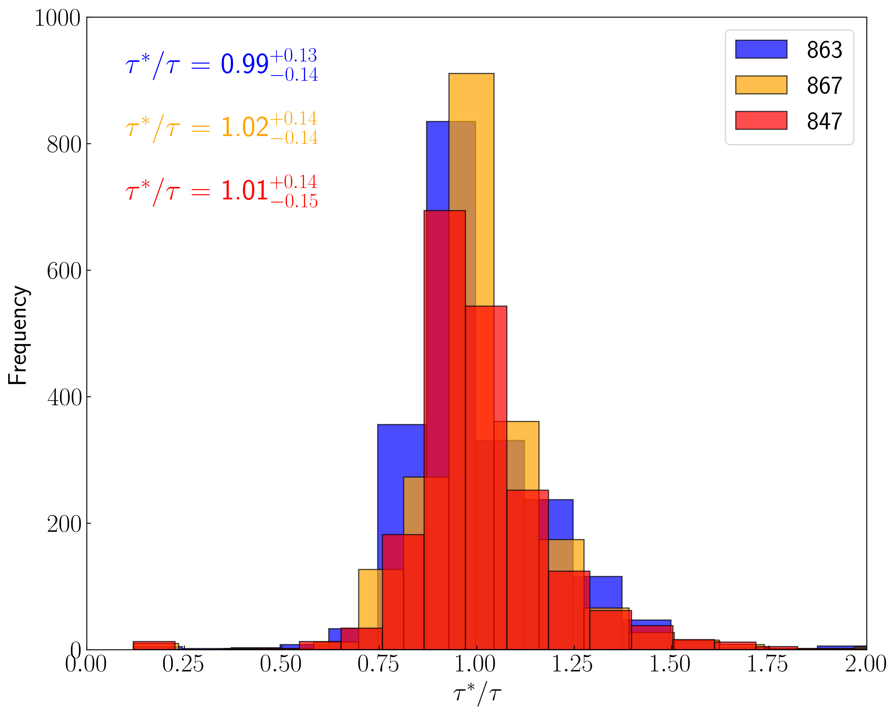
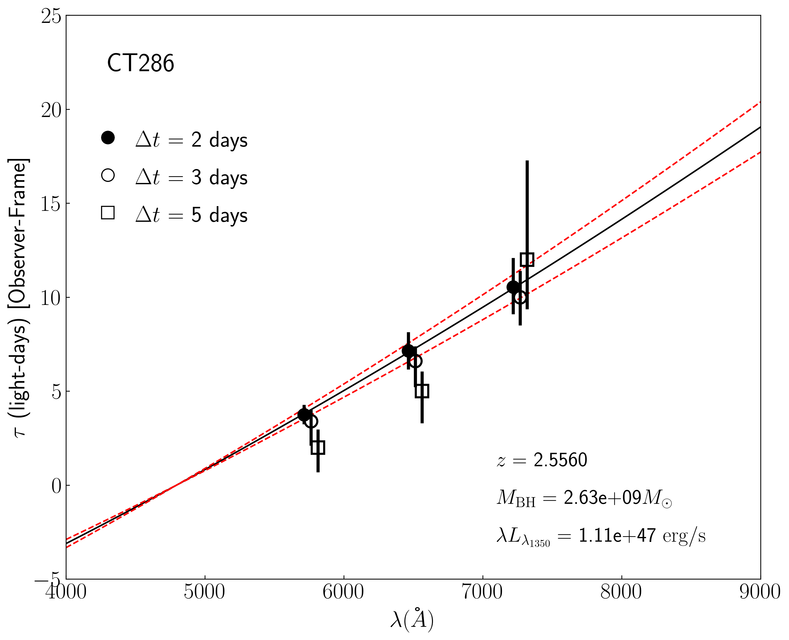
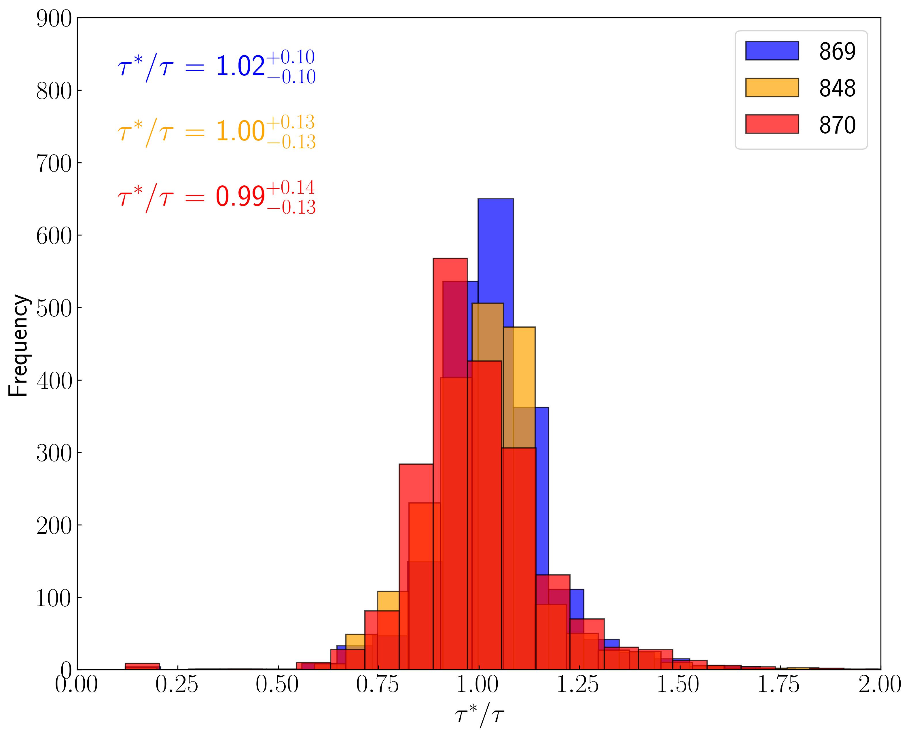
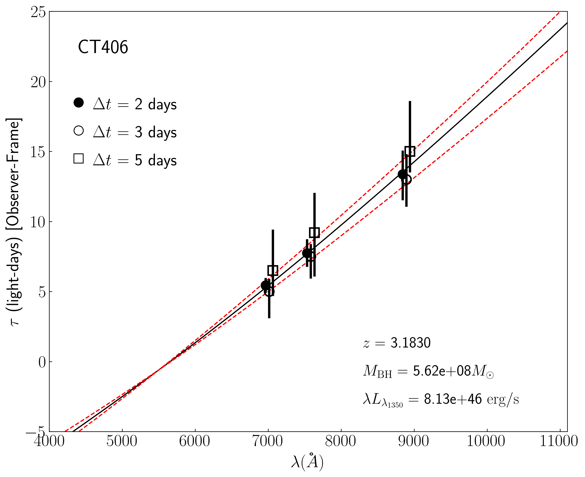
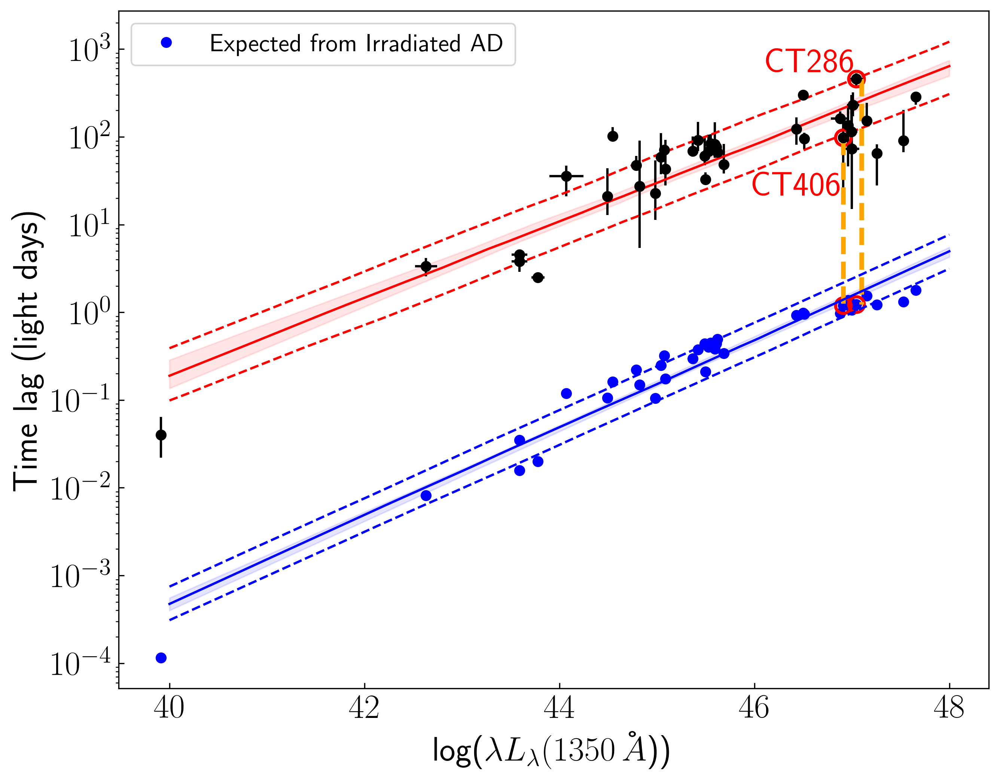
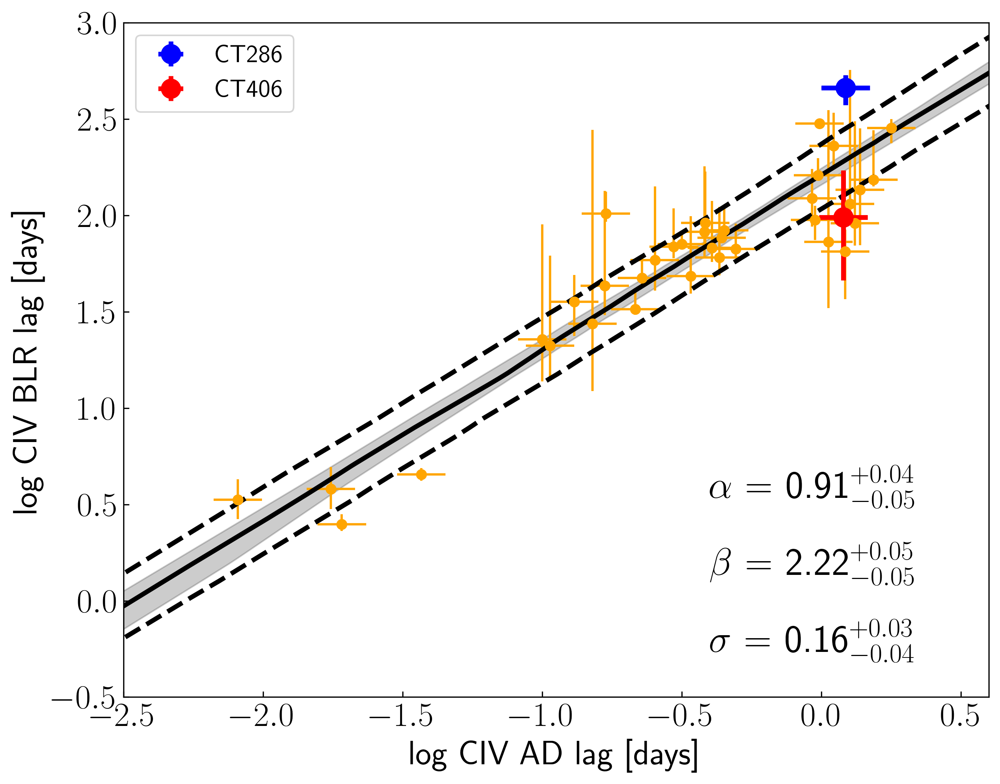

$\newcommand{\ensuremath}{}$
$\newcommand{\xspace}{}$
$\newcommand{\object}[1]{\texttt{#1}}$
$\newcommand{\farcs}{{.}''}$
$\newcommand{\farcm}{{.}'}$
$\newcommand{\arcsec}{''}$
$\newcommand{\arcmin}{'}$
$\newcommand{\ion}[2]{#1#2}$
$\newcommand{\textsc}[1]{\textrm{#1}}$
$\newcommand{\hl}[1]{\textrm{#1}}$
$\newcommand{\footnote}[1]{}$
$\newcommand{\vdag}{(v)^\dagger}$
$\newcommand$
$\newcommand$
$\newcommand{\swayam}[1]{{\color{red}[Swayam:] {#1}}}$
$\newcommand{\ha}{H\alpha}$
$\newcommand{\hb}{H\beta}$
$\newcommand{\Pab}{Pa\beta}$
$\newcommand{\mg}{Mg {\sc ii}}$
$\newcommand{\rfe}{R_{\rm FeII}}$
$\newcommand{\oiii}{[O{\sc iii}]}$
$\newcommand{\oiiia}{[O{\sc iii}]\lambda4959}$
$\newcommand{\oiiib}{[O{\sc iii}]\lambda5007}$
$\newcommand{\nii}{[N{\sc ii}]}$
$\newcommand{\niia}{[N{\sc ii}]\lambda6549}$
$\newcommand{\niib}{[N{\sc ii}]\lambda6585}$
$\newcommand{\sii}{[S{\sc ii}]}$
$\newcommand{\siia}{[S{\sc ii}]\lambda6716}$
$\newcommand{\siib}{[S{\sc ii}]\lambda6731}$
$\newcommand{\lagn}{L_{\rm 5100Å}}$
$\newcommand{\lagnuv}{L_{\rm 3000Å}}$
$\newcommand{\lagnir}{L_{\rm 6000Å}}$
$\newcommand{\feii}{Fe {\sc ii}}$
$\newcommand{\mbh}{M_{\rm BH}}$
$\newcommand{\lbol}{L_{\rm bol}}$
$\newcommand{\ledd}{\lambda_{\rm Edd}}$
$\newcommand{\msun}{M_{\odot}}$
$\newcommand{\kms}{km s^{-1}}$
$\newcommand{\cloudy}{{\sc cloudy}}$
$\newcommand{\zsun}{Z_{\odot}}$
$\newcommand{\1h07}{1H 0707-495}$
$\newcommand{\aap}{A\&A\/}$
$\newcommand{\apjs}{ApJS}$
$\newcommand{\apj}{ApJ}$
$\newcommand{\aj}{AJ}$
$\newcommand{\nat}{Nat}$
$\newcommand{\apjl}{ApJL}$
$\newcommand{\apss}{ApSS}$
$\newcommand{\mnras}{MNRAS}$
$\newcommand{\pasj}{PASJ}$
$\newcommand{\nar}{NAR}$
$\newcommand{\araa}{ARA\&Ap}$
$\newcommand{\rmxaa}{RevMexA\&Ap}$
$\newcommand{\frass}{FrASS}$
$\newcommand{\civ}{{C\sc{iv}}\/}$
$\newcommand{\ciii}{{C\sc{iii}]}\/}$
$\newcommand{\mgii}{{Mg\sc{ii}}\/}$
$\newcommand{\hb}{{H\beta\/}}$

# Probing the CIV continuum size luminosity relation in active galactic nuclei with photometric reverberation mapping

<mark>Appeared on: 2024-05-21</mark> -  _12 pages, 5 figures, accepted to the Astrophysical Journal Letters_

S. Panda, F. P. Nuñez, <mark>E. Bañados</mark>, J. Heidt

**Abstract:** Reverberation mapping accurately determines virial black hole masses only for redshifts $z <$ 0.2 by utilizing the relationship between the $\hb$ broad-line region (BLR) size and the 5100Å continuum luminosity established with $\sim 200$ active galactic nuclei (AGN). For quasars at $z \sim 2-3$ determining the BLR size is time-consuming and limited by seasonal gaps, requiring e.g., $\sim$ 20 years of monitoring of the $\civ$ emission lines. In this work, we demonstrate that an efficient alternative is to use a continuum size-luminosity relation, which can be obtained up to 150 times faster than BLR sizes using photometric reverberation mapping (PRM). We outline the method and its feasibility based on simulations and propose an observational strategy that can be carried out with meter-class telescopes. In particular, we focus on the ESO La Silla 2.2 meter telescope as it is suitable for an efficient PRM campaign.These observations will provide the scaling factor between the accretion disk and the BLR size (for $\civ$ -1350Å), which is crucial for estimating the masses of black holes at higher redshifts ( $z \gtrsim 2-3$ ).

**Figure 5. -** _Left:_ Recovered distributions of delays ($\tau^{*}$) for CT286 (top) and CT406 (bottom). _Right:_ time delay spectrum $\tau_{c}(\lambda)\propto \lambda^{4/3}$(black line) as predicted from the transfer functions. The black circles represent the median values of the recovered distributions. The associated error bars reflect the upper and lower uncertainties, corresponding to the distributions' 16$^{\rm th}$ and 84$^{\rm th}$ percentiles, respectively. For comparison, we show the results for different sampling intervals using different symbols: filled circles for $\Delta t = 2$ days, empty circles for $\Delta t = 3$ days, and empty squares for $\Delta t = 5$ days. A small offset in $\lambda$ was used for better visualization. The dashed red lines show the delay spectrum obtained for a black hole mass with $30$\% uncertainty. (*fig:distdelays*)

**Figure 1. -** The $R_{\rm BLR}-L_{1350\text{Å}}$ relation from \cite{2021ApJ...915..129K}(black) and the expected $R_{\rm AD}-L_{1350\text{Å}}$ relation (blue). The solid red and blue lines indicate the mean values of the posterior probability distributions for both relationships. The shaded areas around these lines reflect the 1$\sigma$ uncertainty. The dashed lines delineate the mean predictions for the upper and lower bounds when the intrinsic scatter in the sources is considered. The positions of CT286 ($z = 2.556$) and CT406 ($z = 3.178$) are marked with red circles. The time lag is given in the rest frame. (*fig:adblrsize*)

**Figure 2. -** Recovered \( R_{\rm BLR} - R_{\rm AD} \) relationship. The solid black line indicates the mean value of the posterior probability distributions. The shaded area reflects the 1$\sigma$ uncertainty. The best-fit slope ($\alpha$), intercept ($\beta$), and scatter ($\sigma$) are reported with 1$\sigma$ uncertainties. The dotted lines delineate the mean predictions for the upper and lower bounds when the intrinsic scatter in the data is considered.
     Blue and red circles denote the positions of CT286 and CT406, respectively. (*fig:adblrsize_pred*)

